# 1. Quick Start Guide

## 1.1 Introduction to K230 Peripherals

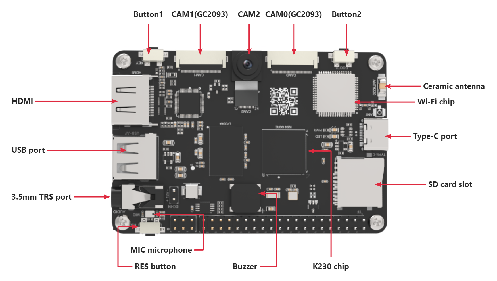

<p id="anchor_1_2"></p>

## 1.2 Firmware Burning

### 1.2.1 Preparation

Since burning the firmware will format the SD card, please back it up in advance if the SD card contains data. To burn the firmware, please prepare a card reader, a 32G SD card (8G or above recommended), and a computer with internet access. Then insert the SD card into the card reader and connect it to any USB port on the computer.


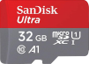

### 1.2.2 Installing SD Card Formatting Tool

1)  First, you need to install the SD Card Formatter tool. You can find it in the directory of [2.2 SD Card Formatting Tool](https://drive.google.com/drive/folders/1ZGo2I9-rnQWyHbbBsshO4VkfjEqNpTru?usp=sharing).


2) The installation process is as follows: After double-clicking to open the installation package, wait a moment and then click **Next**.

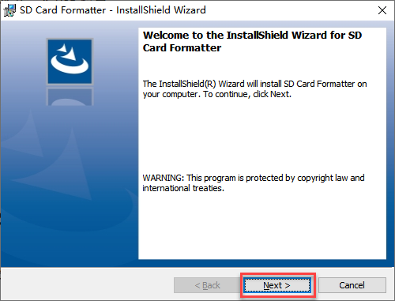

3) Check the agreement acceptance box, then click **Next**.

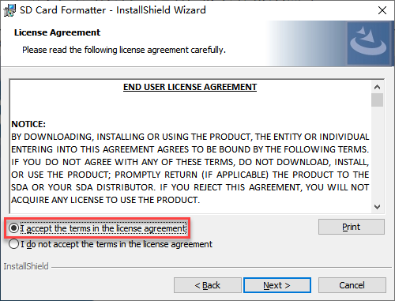

4) You can click **Change...** to select the installation directory, or directly click **Next** to proceed with the installation.

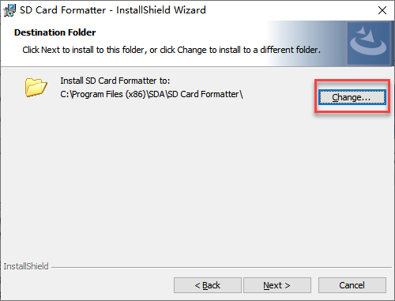

5) Take modifying the installation path as an example, click **Change...**.


6) Click the icon marked as 1 to expand the directory list, and select the desired installation path at position 2.

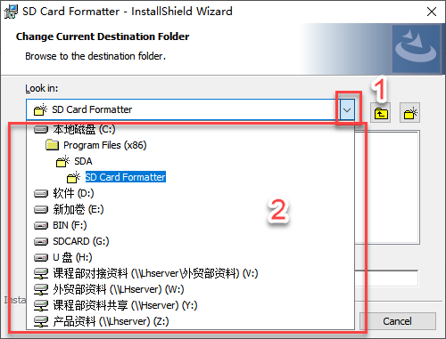

7) You can select the download path in position 1, or enter the path in position 2. After selection, click **OK** to confirm.

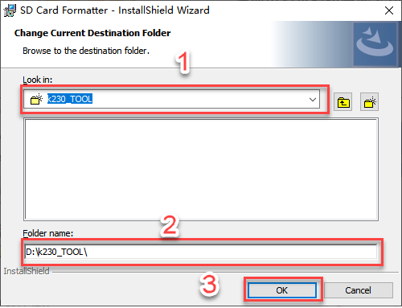

8) Click **Next** to continue the installation.

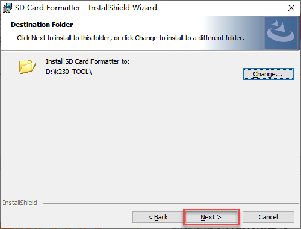

9) Confirm the installation directory address, then click **Install** to start the installation.

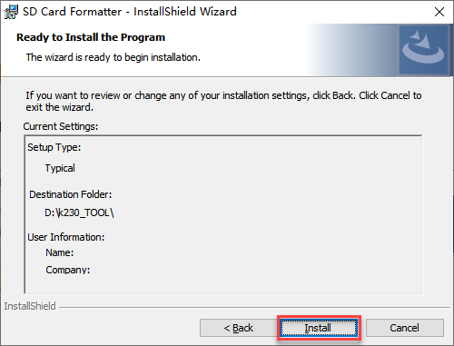

10) Click **Finish** to complete the installation.

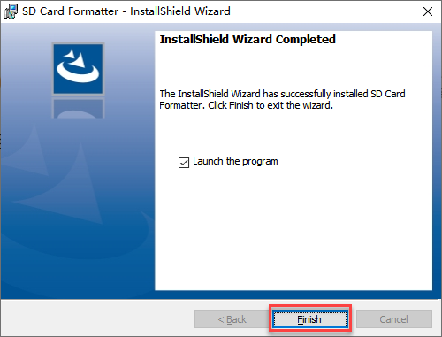

### 1.2.3 Formatting the SD Card

1) Insert the SD card into the card reader, then connect the card reader to any USB port on the computer. Open the formatting tool **SD Card Formatter**.

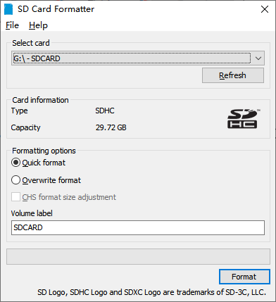

2) Select the corresponding drive letter. If you don't know which one is the SD card drive, you can first unplug it and open **My Computer**, then the newly detected drive after inserting the card reader is the SD card drive.

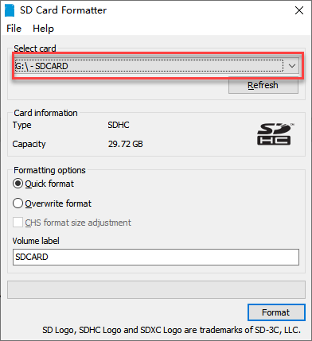

3) Click **Format** to start formatting.

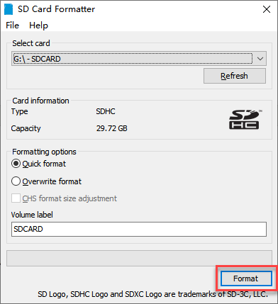

4) Click **Yes** to confirm and start formatting.

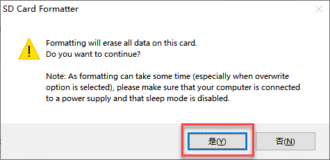

5) Click **OK** to complete the SD card formatting.

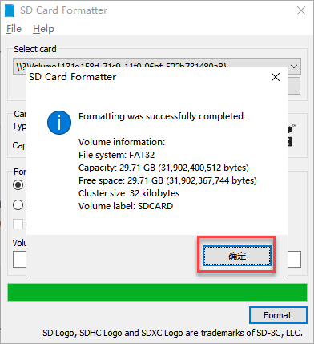

### 1.2.4 Firmware Burning

1)  Insert the formatted SD card into the card reader, then connect the card reader to any USB port on the computer. Open the **Rufus** firmware burning tool from the path "[**2. Software\2.4 Firmware Burning Tool**](https://drive.google.com/drive/folders/1yWyNEDVXyHeMUsxHVnAjACPEuM7FsamA?usp=sharing)".


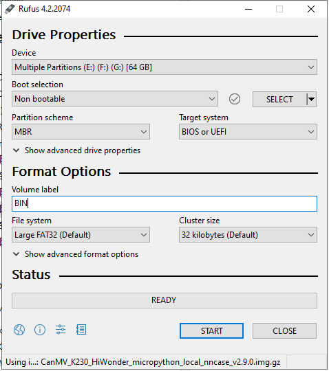

2) Select the corresponding SD card drive letter.

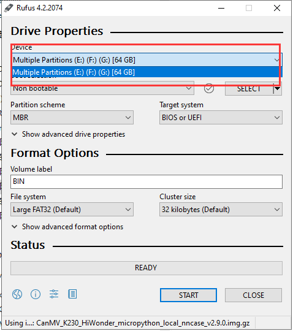

3)  Select the firmware image to burn.

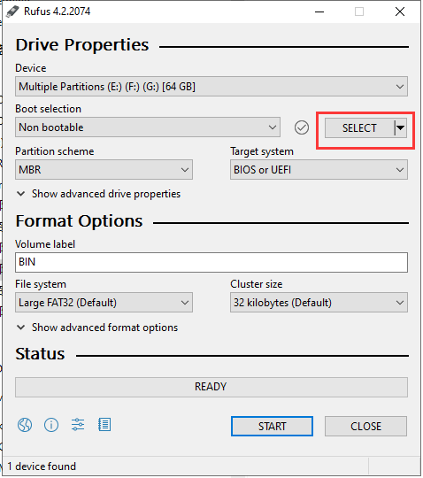

4) Select the **K230_HiWonder** firmware image from the path [3.1 System Image](https://drive.google.com/drive/folders/1akXK-jGUtCkmzSNiczRgM6a2NG5nXsf5?usp=sharing), then click **Open**.


5)  Click **Start** to begin firmware burning.

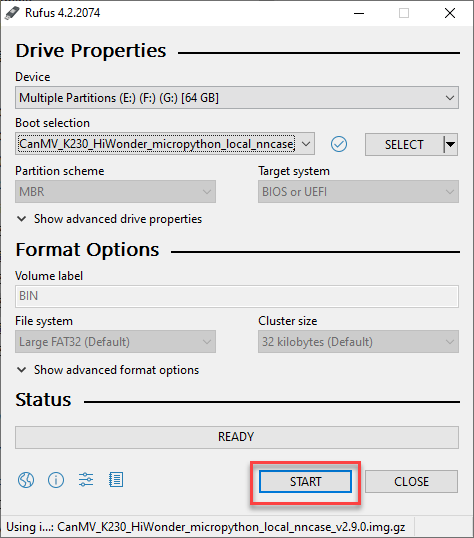

6) In the pop-up dialog box, select **OK**, and wait a moment to complete the burning process.

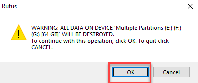

7) Click **Close** to complete the SD card burning process.

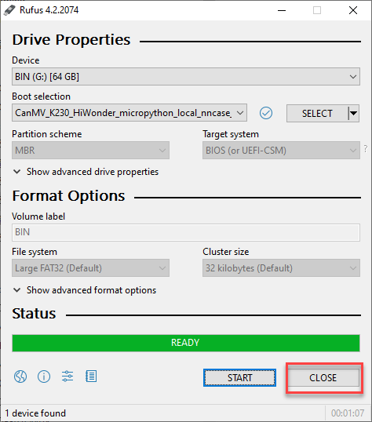

### 1.2.5 System Files

1. Insert the SD card into the K230 board and connect it to your computer. In **This PC**, a new drive named **CanMV** appears, representing the built-in file system of the K230.

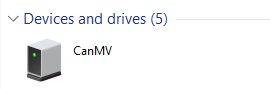

2. Open the **CanMV** drive to access two directories: `sdcard` and `data`.

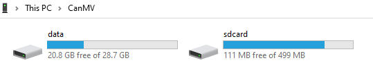

3. The `sdcard` directory stores MicroPython libraries and official example programs.

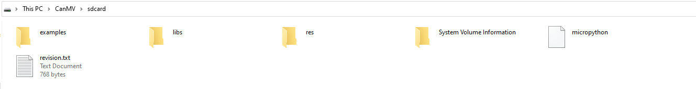

4. The `data` directory provides the remaining available space on the SD card.

<p id="anchor_1_3"></p>

## 1.3 Setting Up Development Environment

### 1.3.1 Serial Port Driver Installation

1)  Connect the K230 development board to the computer via Type-C cable. Before installing the software, check if your computer has the CH340 driver. If the computer can recognize the corresponding serial port, no driver installation is needed. You can check the port by connecting the board to the computer and opening **Device Manager** as shown below:


2) If there is no driver, you can find the **Serial Port Terminal Tool** at [2. Software\2.3 Serial Port Terminal Tool](https://drive.google.com/drive/folders/10GfJEkcpqPWlD5ZHxWxA7bdM-CR-6s0l?usp=sharing).


3) The installation method is as follows: After double-clicking to open the installation package, click **Install** and wait for the installation success prompt.


### 1.3.2 CanMV-IDE Installation

1)  The installation method is as follows: Double-click to open the installation package from the path [2. Software\2.1 CanMV IDE K230 Development Software](https://drive.google.com/drive/folders/11Tz2V1rx12ZTg4XK9D2FKdUe3DOhO0m8?usp=sharing), then click **Install**.

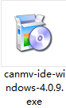

2)  Select the default checked options, click **Next** to proceed to the next step.

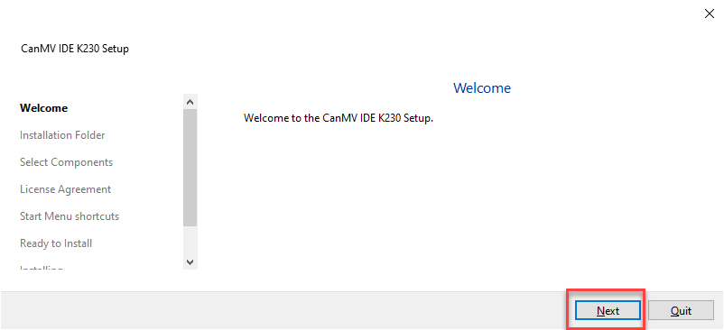

3)  Click **Browse** to select the installation path, then click **Install** to start the installation.

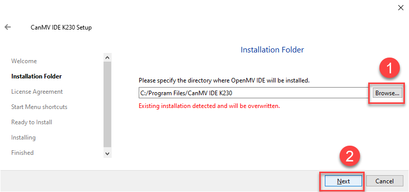

4)  Check **I accept the license**, then click **Next** to continue the installation.

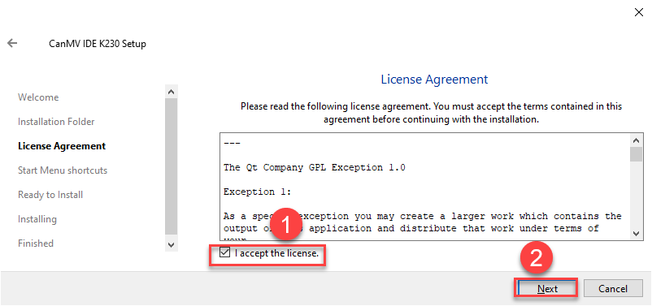

5)  Click **Next** again to continue the installation.

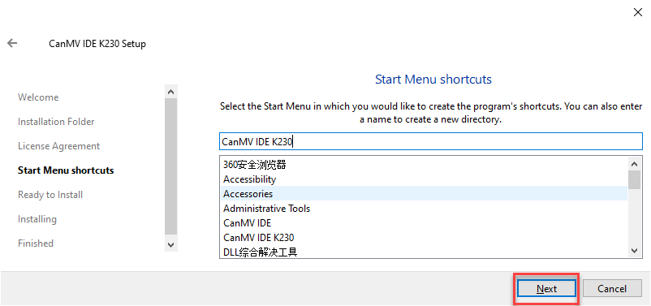

6)  Click **Install**.

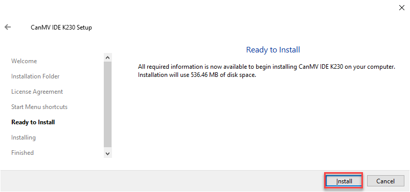

7) Wait for the installation to complete, then click **Finish**.

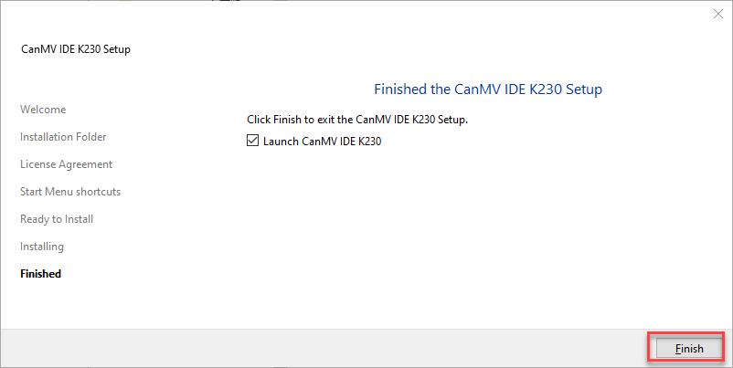

## 1.4 CanMV IDE Interface Introduction

This section provides a brief overview of the CanMV IDE interface. For CanMV IDE installation, please refer to the section **[1.3 Setting Up Development Environment](#anchor_1_3)**.

1)  The CanMV IDE interface when not connected to the K230 development board is shown below:

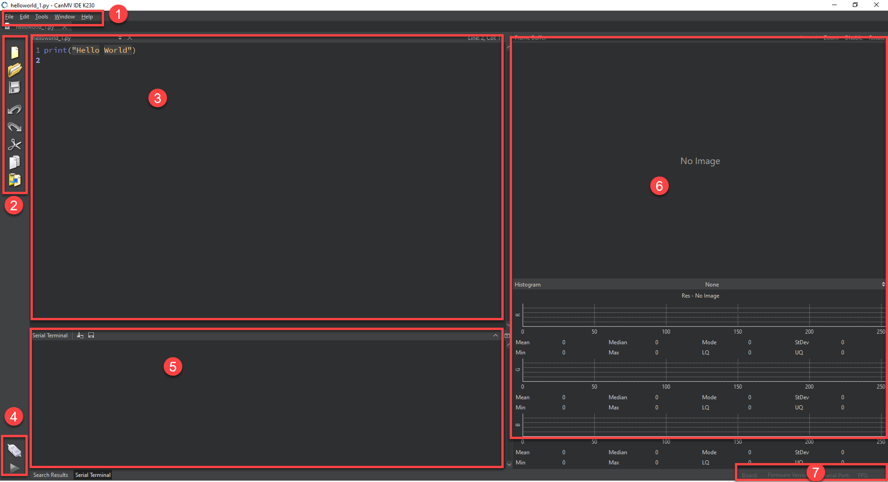

(1) Menu bar: Operations files, K230 burning tools, vision-related tools, etc.

(2) Quick access buttons: Convenient shortcuts for commonly used development functions.

(3) Code editing area: Area for developing MicroPython programs.

(4) Device connection: The upper button connects to the K230 development board, the lower buttons are for running and stopping programs.

(5) Debug information area: Displays serial port debug information and search functionality.

(6) Image parameter area: Upper section shows image preview, lower section shows color space parameters.

(7) Firmware information: Displays connected serial port number and other firmware details.

2. When connected to the K230 development board, the device connection area in the bottom left turns green, indicating a successful connection.

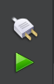

3. When running a program, the device connection area in the bottom left changes to the state shown above. Press  to stop online execution.

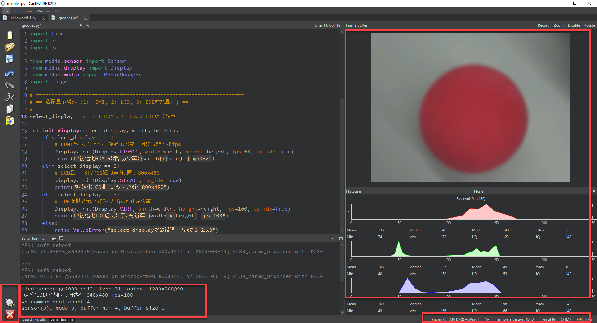

## 1.5 Running Example Instructions

### 1.5.1 Experiment Introduction

This section will use the CanMV K230 IDE for the first experiment - lighting up an LED to familiarize with the development environment. Insert the SD card with the firmware image and connect the CanMV K230 development board to the computer via Type-C cable.

### 1.5.2 Preparation

* **Module Connection**

1)  Connect the K230 development board to the PC using a Type-C data cable, as shown below:


2)  Double-click to open CanMV IDE K230.


3)  Click the connect button in the bottom left corner.


4)  Upon successful connection, the bottom left area of the CanMV IDE software will change to the icon shown below.


5)  If the connection takes more than 10 seconds, it means connection failed. Click the **Cancel** button, and the following dialog will appear. Click **OK** and check the connection again.


> [!NOTE]
>
> **Connection Failure Causes and Solutions:**
>
> * **The connection cable is not a data cable: Some Type-C cables are charging cables without data transmission capability. Please use a Type-C cable with data transmission function. The factory-equipped cable is a Type-C data cable.**
>
> * **Other K230 firmware has been burned: Re-burn the factory firmware, then connect again.**
>

### 1.5.3 Program Running and Downloading

The K230 program supports two operation modes: online execution and offline execution.

**Online Execution:**

For this method, after connecting, drag the program **led.py** into the CanMV IDE K230 code editing area, then click the run button  in the bottom left corner to run the program online, as shown below:

> [!NOTE]
>
> **Programs executed through this method will be lost when disconnected or powered off, and will not be saved on the development board.**

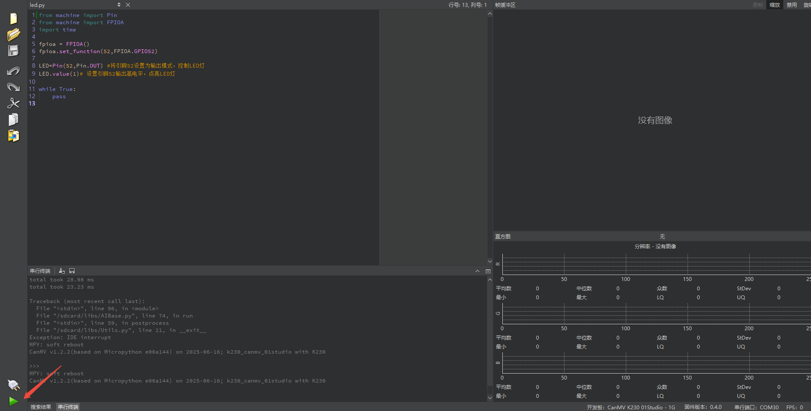

**Offline Execution:**

1) After connecting, drag the program **led.py** from the same directory as this section into the CanMV IDE K230 code editing area, click **Tools** on the toolbar, and select **Save open script to CanMV Board (as main.py)** as shown below:


2. Then click **Yes**.


3. Once the file is written, click **OK** to confirm and complete saving the MicroPython file to the K230 development board.


**After downloading in this way, simply power on the K230 development board with no connection needed, and the development board will run the MicroPython file, enabling offline execution.**

### 1.5.4 Program Outcome

The K230 development board’s blue LED lights up.

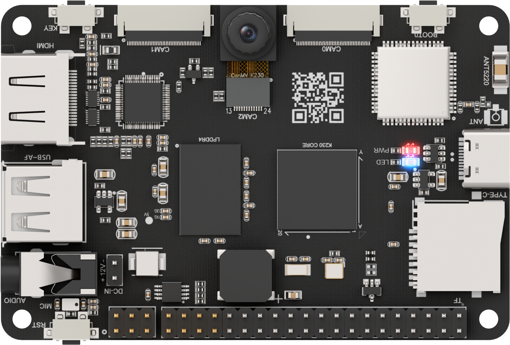

## 1.6 REPL Serial Interaction Debugging

> [!NOTE]
>
> **REPL is a feature unique to MicroPython. Since most IDEs already integrate a serial terminal, in most cases this feature is not necessary to use.**

### 1.6.1 Serial Driver Installation

1.  Connect the K230 board to your computer via a Type-C cable. Before installing the software, check if your computer already has the CH340 driver. If the computer can recognize the corresponding serial port, there is no need to install the driver. You can check the port by connecting the board and opening **Device Manager** as shown below.

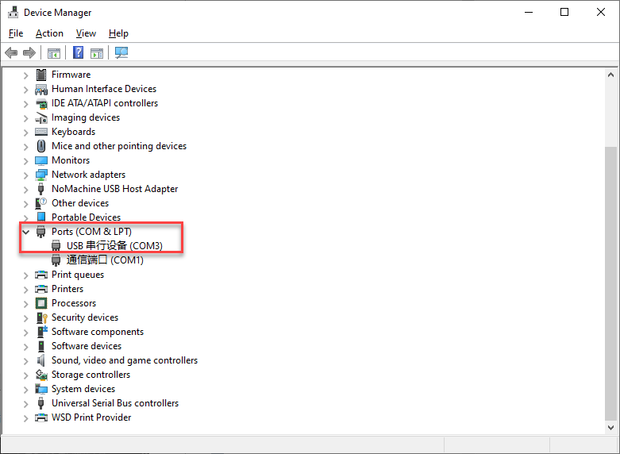

2.  If the driver is not installed, you can find it in the [2.3 Serial Port Terminal Tool](https://drive.google.com/drive/folders/10GfJEkcpqPWlD5ZHxWxA7bdM-CR-6s0l?usp=sharing) folder.


3.  To install, double-click the installation package, click **Install**, and wait for the confirmation that the installation is successful.

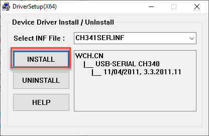

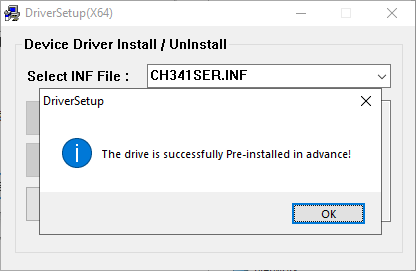

### 1.6.2 Terminal Operations

1.  The CanMV K230's MicroPython firmware integrates the interactive interpreter REPL [Read-Eval-Print-Loop], allowing developers to directly debug the CanMV K230 development board through a serial terminal. A free serial terminal software called PuTTY is used here.

2.  Connect the development board to the computer and find the current serial port number from My Computer → Properties → Device Manager. Here it shows COM30.


3.  Open the .exe file [putty.exe](https://drive.google.com/drive/folders/10GfJEkcpqPWlD5ZHxWxA7bdM-CR-6s0l?usp=sharing) under the Serial Port Terminal Tool folder.

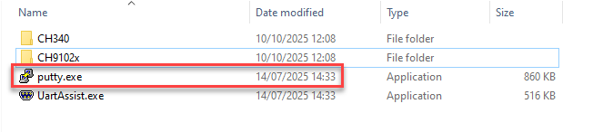

4.  In the Connection type option, select Serial to switch to serial port mode, fill in the Serial line with the port number queried in step 2, COM30 as an example. Then, change the baud rate in Speed to 115200.

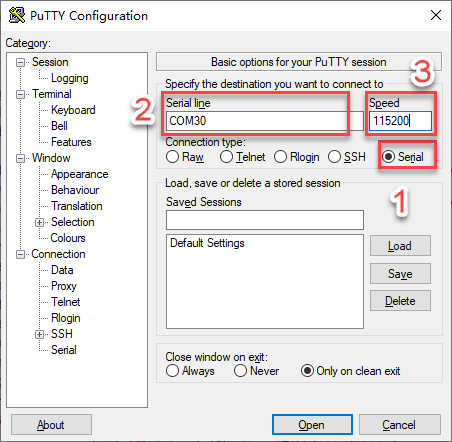

5) Enter `1` or any name you prefer in the **Saved Sessions** field, click **Save** on the right, and the name `1` will appear in the blank box. You can double-click it in the future to use it directly.

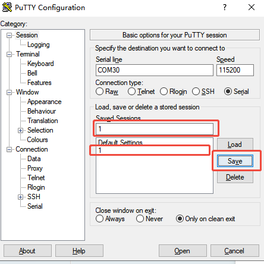

6. After completing the setup, click **Open** to connect. Press **Enter**, and if \>\>\> appears, it means the system is ready to receive commands. If \>\>\> does not appear after pressing **Enter**, the development board may be running code in an infinite loop, which is blocking the REPL.

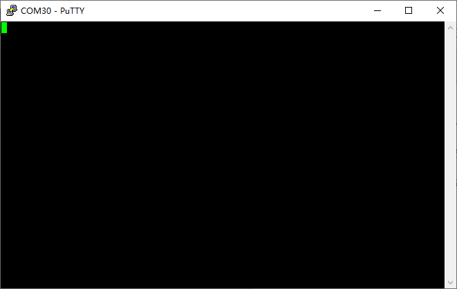

7. In this case, simply press **Ctrl + C** on the keyboard.

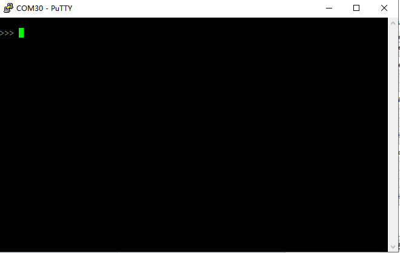

8. Now, the dialog is connected to the development board. The CanMV K230 integrates a MicroPython interpreter, allowing you to debug and program directly. Next, enter the following code and press **Enter** to see the results.

```
print("Hello Hiwonder!")
```

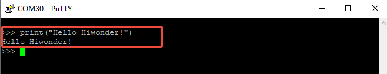

9.  Then, input `1+1` and press **Enter** to get the result `2`.

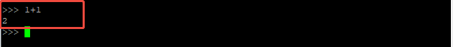


## 1.7 Switching Display Modes

> [!NOTE]
>
> The K230 board supports three display modes: **HDMI**, **LCD**, and **IDE virtual display**.  The display mode can be switched by changing the `select_display` parameter.
>
> ```python
> # ==================================================================
> # == Select the display mode here (1: HDMI, 2: LCD, 3: IDE buffer)
> # ==================================================================
> ```

### 1.7.1 HDMI Display Mode

1. Connect the monitor to the K230 board using an HDMI cable.

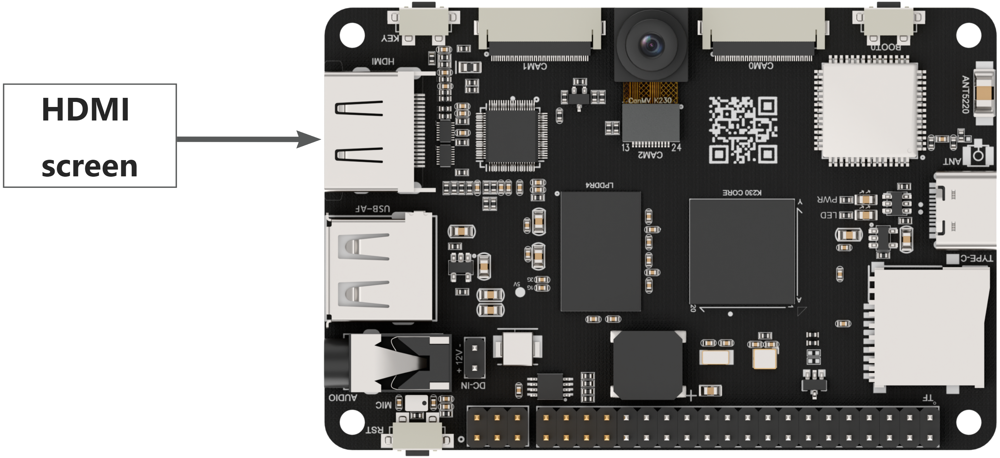

2. Change the `select_display` parameter in the program to **1**.

```python
# ==================================================================
# == Select the display mode here (1: HDMI, 2: LCD, 3: IDE buffer) ==
# ==================================================================
select_display = 1 # HDMI display
```

> [!NOTE]
>
> The default HDMI display resolution is **1920×1080**. Update it to match the resolution of the connected monitor. Otherwise, the K230 board may freeze due to incompatibility.
>
> ```python
> if display_mode == "hdmi":
>   display_size = [1920,1080] # The default resolution is 1920×1080. Update it to match the resolution of your display.
> elif display_mode == "lcd":
>   display_size = [800,480]
> else:
>   display_size = [1280,720]
> ```
>

### 1.7.2 LCD Display Mode

1. Check whether the K230 board is equipped with a 3.5-inch LCD screen. If not, skip this step.

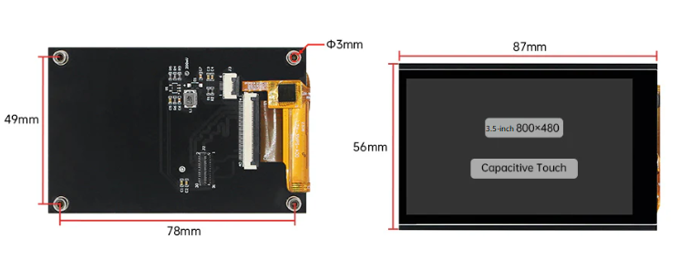

2. Change the value of `select_display` in the program to **2**.

```python
# ==================================================================
# == Select the display mode here (1: HDMI, 2: LCD, 3: IDE buffer) ==
# ==================================================================
select_display = 2 # LCD display
```

> [!NOTE]
>
> Use the default resolution, and no modification is required.
>
> ```python
> if display_mode == "hdmi":
>   display_size = [1920,1080] 
> elif display_mode == "lcd":
>   display_size = [800,480] # Default LCD resolution: 800×480
> else:
>   display_size = [1280,720]
> ```
>

### 1.7.3 IDE Virtual Display Mode

1. Connect the K230 board to the computer.

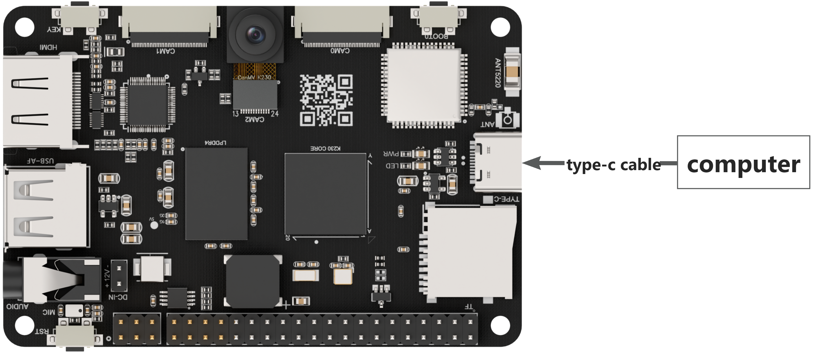

2. Set the `select_display` parameter in the program to **3**.

```python
# ==================================================================
# == Select the display mode here (1: HDMI, 2: LCD, 3: IDE buffer) ==
# ==================================================================
select_display = 3 # IDE virtual display
```

> [!NOTE]
>
> Use the default resolution, and no modification is required.
>
> ```python
> if display_mode == "hdmi":
> display_size = [1920,1080] 
> elif display_mode == "lcd":
> display_size = [800,480] 
> else:
> display_size = [1280,720] #Default resolution: 1280×720
> ```