# 2. Basic Course

## 2.1 FPIOA Experiment

### 2.1.1 Experiment Overview

This section demonstrates how to use programming to learn about FPIOA and configure physical pins. The FPIOA (Field Programmable IO Array) module is primarily responsible for assigning functions to physical pins (PADs). In a SoC, although many functions are available, the number of pins is limited, so multiple functions may share the same I/O pin. At any given time, each pin can only enable one function, so the appropriate function must be selected and activated through the IOMUX, that is, through the FPIOA.

### 2.1.2 Preparation

* **Module Connection**

1)  Connect the K230 development board to your PC using a Type-C data cable, as shown below:


2)  Double-click to open CanMV IDE K230.


3)  Click the connection button in the lower left corner.


4)  Upon successful connection, the lower left corner of the CanMV IDE will display the icon shown below.


5)  If connection takes more than 10 seconds, it has failed. Click the **Cancel** button, and a dialog box will appear. Click **OK** and recheck the connection.


> [!NOTE]
>
> **Connection Failure Causes and Solutions:**
> 
>* **Cable is not a data cable: Some Type-C cables are charging-only cables without data transfer capability. Please use a Type-C cable with data transfer functionality. The factory-supplied cable is a Type-C data cable.**
> * **Other K230 firmware was flashed: Re-flash the factory firmware, then reconnect.**

### 2.1.3 Program Execution and Download

The K230 program supports two operation modes: online execution and offline execution.

**Online Execution**: 

After connection, drag the program **FPIOA.py** into CanMV IDE K230. In the code editor, click the run button  in the lower left corner to run the program online, as shown below:

> [!NOTE]
>
> **Programs run using this method will be lost after disconnecting or powering off, and will not be saved on the development board.**

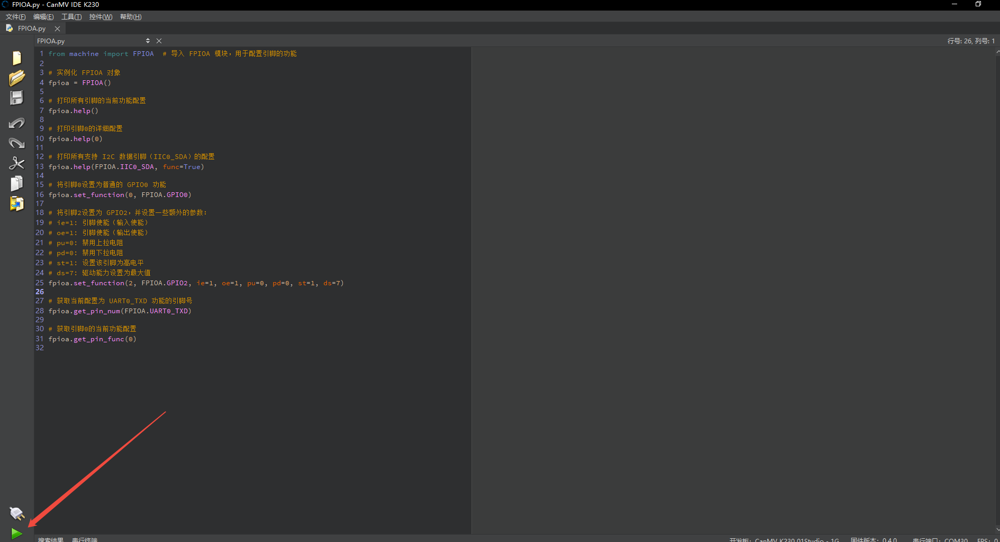

**Offline Execution:**

1. After connection, drag the program **FPIOA.py** into the CanMV IDE K230 code editor, click **Tools** in the toolbar, and select **Save open script to CanMV Board (as main.py)** as shown below:


2. Then click **Yes**.


3. Once the file is written, click **OK** to confirm and complete saving the MicroPython file to the K230 development board.


**With this method, the K230 development board will automatically run the MicroPython file upon power-up without connection, enabling offline execution.**

### 2.1.4 Program Outcome

First, the program prints the current function assignment of all pins, prints all functions that pin 0 supports, and prints all pins that support the IIC0_SDA function. Pin 0 is configured as a general-purpose GPIO function, and pin 2 is configured as a general-purpose GPIO function with an initial high-level output.

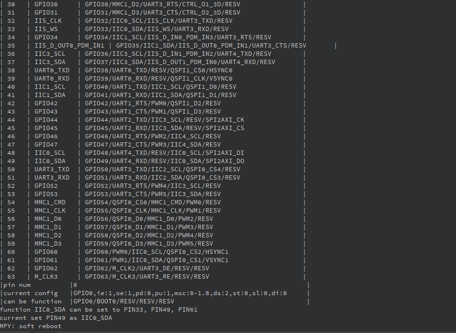

### 2.1.5 Program Analysis

* **View Pin Functions**

```python
# Print the current function configuration of all pins
fpioa.help()

# Print the detailed configuration of pin 0
fpioa.help(0)

# Print all configurations that support I2C data pin (IIC0_SDA)
fpioa.help(FPIOA.IIC0_SDA, func=True)
```

1)  `fpioa.help()`: View the current mapping of all pins.
2)  `fpioa.help(0)`: View the configuration of pin 0.
3)  `fpioa.help(FPIOA.IIC0_SDA, func=True)`: Query configurations that support I2C data pin (IIC0_SDA)

* **Set Pin Functions**

```python
# Set pin 0 to general-purpose GPIO0 function
fpioa.set_function(0, FPIOA.GPIO0)

# Set pin 2 to GPIO2 with some additional parameters:
# ie=1: Pin enable (input enable)
# oe=1: Pin enable (output enable)
# pu=0: Disable pull-up resistor
# pd=0: Disable pull-down resistor
# st=1: Set this pin to high level
# ds=7: Drive strength set to maximum value
fpioa.set_function(2, FPIOA.GPIO2, ie=1, oe=1, pu=0, pd=0, st=1, ds=7)
```

1)  `fpioa.set_function(0, FPIOA.GPIO0)`: Set pin 0 to GPIO0.
2)  `fpioa.set_function(2, FPIOA.GPIO2, ie=1, oe=1, pu=0, pd=0, st=1, ds=7)`: Set pin 2 to GPIO2, enable input/output, disable pull-up/down, initial high level, maximum drive strength.

* **Query Function Correspondence**

```python
# Get the pin number currently configured as UART0_TXD function
fpioa.get_pin_num(FPIOA.UART0_TXD)

# Get the current function configuration of pin 0
fpioa.get_pin_func(0)
```

1)  `fpioa.get_pin_num(FPIOA.UART0_TXD)`: Query which pin corresponds to the UART0_TXD function.
2)  `fpioa.get_pin_func(0)`: Query what function pin 0 is currently configured as.

## 2.2 GPIO Experiment

### 2.2.1 Experiment Overview

This section demonstrates how to use programming to explore the GPIO functionality of the K230 board. It covers configuring each pin as either input or output, as well as setting pull-up and pull-down resistors and adjusting drive strength.

### 2.2.2 Preparation

* **Module Connection**

1)  Connect the K230 development board to your PC using a Type-C data cable, as shown below:


2)  Double-click to open CanMV IDE K230.


3)  Click the connection button in the lower left corner.


4)  Upon successful connection, the lower left corner of the CanMV IDE will display the icon shown below.


5)  If connection takes more than 10 seconds, it has failed. Click the **Cancel** button, and a dialog box will appear. Click **OK** and recheck the connection.


> [!NOTE]
>
> **Connection Failure Causes and Solutions:**
> 
>* **Cable is not a data cable: Some Type-C cables are charging-only cables without data transfer capability. Please use a Type-C cable with data transfer functionality. The factory-supplied cable is a Type-C data cable.**
> * **Other K230 firmware was flashed: Re-flash the factory firmware, then reconnect.**

### 2.2.3 Program Execution and Download

The K230 program supports two operation modes: online execution and offline execution.

**Online Execution:**

After connection, drag the program **GPIO.py** into CanMV IDE K230.

In the code editor, click the run button  in the lower left corner to run the program online, as shown below:

> [!NOTE]
>
> **Programs run using this method will be lost after disconnecting or powering off, and will not be saved on the development board.**

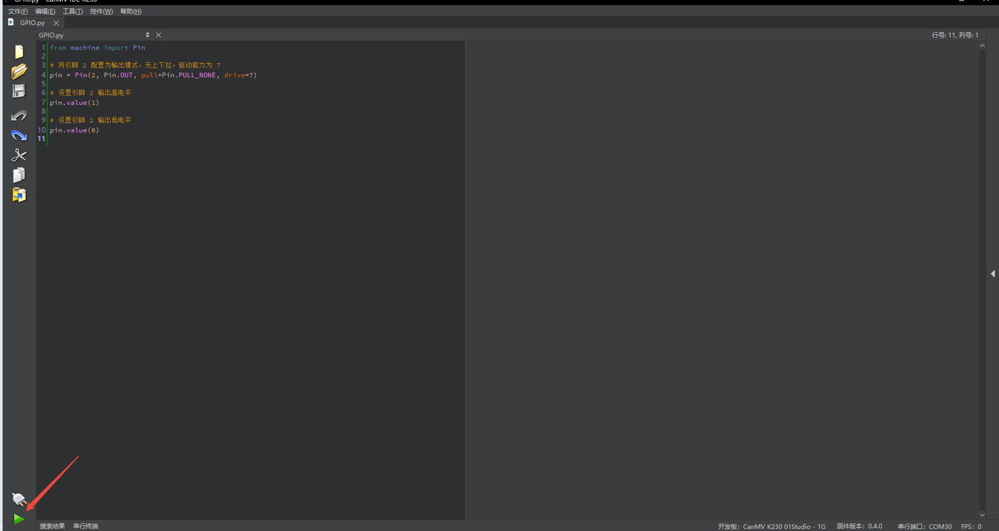

**Offline Execution:**

1. After connection, drag the program **GPIO.py** from this section's directory into the CanMV IDE K230 code editor, click **Tools** in the toolbar, and select **Save open script to CanMV Board (as main.py)** as shown below:


2. Then click **Yes**.


3. Once the file is written, click **OK** to confirm and complete saving the MicroPython file to the K230 development board.


**With this method, the K230 development board will automatically run the MicroPython file upon power-up without connection, enabling offline execution.**

### 2.2.4 Program Outcome

Pin 2 is configured to output mode with no pull-up/down, drive strength of 7, and outputs both high and low levels.


### 2.2.5 Program Analysis

```python
from machine import Pin

# Configure pin 2 to output mode with no pull-up/down, drive strength of 7
pin = Pin(2, Pin.OUT, pull=Pin.PULL_NONE, drive=7)

# Set pin 2 to output high level
pin.value(1)

# Set pin 2 to output low level
pin.value(0)

```

`pin = Pin(2, Pin.OUT, pull=Pin.PULL_NONE, drive=7)`

1)  `index`: Pin number, range is \[0, 63\].
2)  `mode`: Pin mode, supports input mode or output mode.
3)  `pull`: Optional pull-up or pull-down configuration, defaults to `Pin.PULL_NONE`.
4)  `drive`: Optional drive-strength configuration, defaults to 7.
5)  `value`: Set the default output value of the pin.

<table class="docutils-nobg" border="1">
  <thead>
   <tr>
     <th style="border: 1px solid #ddd; padding: 10px; text-align: center; font-weight: bold;">Mode</th>
     <th style="border: 1px solid #ddd; padding: 10px; text-align: center; font-weight: bold;">Parameter</th>
     <th style="border: 1px solid #ddd; padding: 10px; text-align: center; font-weight: bold;">Function Description</th>
   </tr>
  </thead>
  <tbody>
   <tr>
     <td rowspan="2" style="border: 1px solid #ddd; padding: 10px; text-align: center; font-weight: bold; vertical-align: middle;">Pin Mode</td>
     <td style="border: 1px solid #ddd; padding: 10px; text-align: center;">Pin.IN</td>
     <td style="border: 1px solid #ddd; padding: 10px; text-align: center;">Set to input mode</td>
   </tr>
   <tr>
     <td style="border: 1px solid #ddd; padding: 10px; text-align: center;">Pin.OUT</td>
     <td style="border: 1px solid #ddd; padding: 10px; text-align: center;">Set to output mode</td>
   </tr>
   <tr>
     <td rowspan="3" style="border: 1px solid #ddd; padding: 10px; text-align: center; font-weight: bold; vertical-align: middle;">Pull Up/Down</td>
     <td style="border: 1px solid #ddd; padding: 10px; text-align: center;">PULL_NONE</td>
     <td style="border: 1px solid #ddd; padding: 10px; text-align: center;">Disable pull-up/down resistors</td>
   </tr>
   <tr>
     <td style="border: 1px solid #ddd; padding: 10px; text-align: center;">PULL_UP</td>
     <td style="border: 1px solid #ddd; padding: 10px; text-align: center;">Enable pull-up resistor</td>
   </tr>
   <tr>
     <td style="border: 1px solid #ddd; padding: 10px; text-align: center;">PULL_DOWN</td>
     <td style="border: 1px solid #ddd; padding: 10px; text-align: center;">Enable pull-down resistor</td>
   </tr>
   <tr>
     <td rowspan="5" style="border: 1px solid #ddd; padding: 10px; text-align: center; font-weight: bold; vertical-align: middle;">Interrupt Trigger</td>
     <td style="border: 1px solid #ddd; padding: 10px; text-align: center;">IRQ_FALLING</td>
     <td style="border: 1px solid #ddd; padding: 10px; text-align: center;">Falling edge trigger interrupt</td>
   </tr>
   <tr>
     <td style="border: 1px solid #ddd; padding: 10px; text-align: center;">IRQ_RISING</td>
     <td style="border: 1px solid #ddd; padding: 10px; text-align: center;">Rising edge trigger interrupt</td>
   </tr>
   <tr>
     <td style="border: 1px solid #ddd; padding: 10px; text-align: center;">IRQ_LOW_LEVEL</td>
     <td style="border: 1px solid #ddd; padding: 10px; text-align: center;">Low level trigger interrupt</td>
   </tr>
   <tr>
     <td style="border: 1px solid #ddd; padding: 10px; text-align: center;">IRQ_HIGH_LEVEL</td>
     <td style="border: 1px solid #ddd; padding: 10px; text-align: center;">High level trigger interrupt</td>
   </tr>
   <tr>
     <td style="border: 1px solid #ddd; padding: 10px; text-align: center;">IRQ_BOTH</td>
     <td style="border: 1px solid #ddd; padding: 10px; text-align: center;">Both edges (rising/falling) trigger</td>
   </tr>
  </tbody>
</table>

## 2.3 UART Experiment

### 2.3.1 Experiment Overview

This section uses code to explore the UART features of the K230 development board.

> [!NOTE]
>
> **The K230 chip contains a total of five UART modules. UART0 and UART3 are occupied by the system, hence, only UART1, UART2, and UART4 are available. To use them, route their TX and RX pins to the pin headers through the IOMUX.**

### 2.3.2 Preparation

* **Module Connection**

1)  Connect the K230 development board to your PC using a Type-C data cable, as shown below:


2)  Use jumper wires to connect the GND, RX, TX of the USB-to-serial module to the K230's **UART3** interface, then connect the USB-to-serial module to the PC, as shown below.

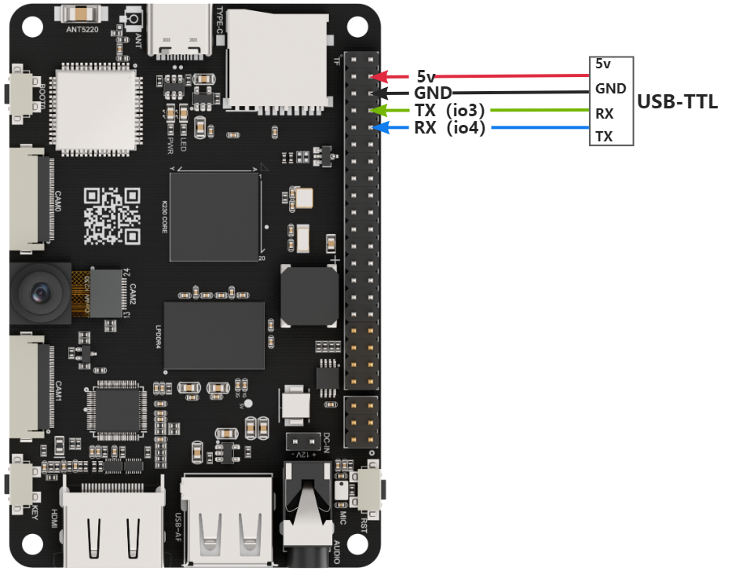

3)  Double-click to open CanMV IDE K230.


4)  Click the connection button in the lower left corner.


5)  Upon successful connection, the lower left corner of the CanMV IDE will display the icon shown below.


6)  If connection takes more than 10 seconds, it has failed. Click the **Cancel** button, and a dialog box will appear. Click **OK** and recheck the connection.


> [!NOTE]
>
> **Connection Failure Causes and Solutions:**
> 
>* **Cable is not a data cable: Some Type-C cables are charging-only cables without data transfer capability. Please use a Type-C cable with data transfer functionality. The factory-supplied cable is a Type-C data cable.**
> * **Other K230 firmware was flashed: Re-flash the factory firmware, then reconnect.**

### 2.3.3 Program Execution and Download

The K230 program supports two operation modes: online execution and offline execution.

**Online Execution:**

After connection, drag the program **UART.py** into CanMV IDE K230. In the code editor, click the run button  in the lower left corner to run the program online, as shown below:

> [!NOTE]
>
> **Programs run using this method will be lost after disconnecting or powering off, and will not be saved on the development board.**


**Offline Execution:**

1. After connection, drag the program **UART.py** from this section's directory into the CanMV IDE K230 code editor, click **Tools** in the toolbar, and select **Save open script to CanMV Board (as main.py)** as shown below:


2. Then click **Yes**.


3. Once the file is written, click **OK** to confirm and complete saving the MicroPython file to the K230 development board.


**With this method, the K230 development board will automatically run the MicroPython file upon power-up without connection, enabling offline execution.**

### 2.3.4 Program Outcome

Send messages to the K230 development board through the serial port tool assistant. Sending **1** turns the LED on, sending **0** turns the LED off.

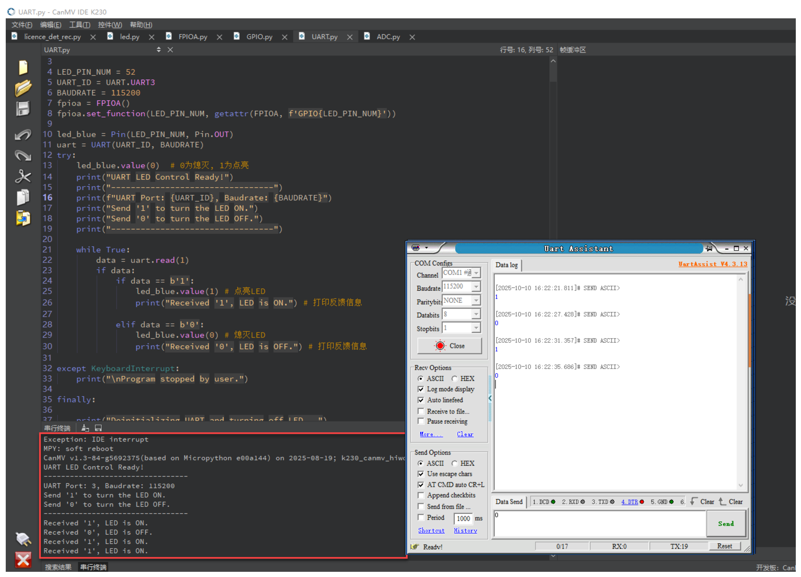

### 2.3.5 Program Analysis

```python
LED_PIN_NUM = 52
UART_ID = UART.UART1 # Can be adjusted according to actual hardware
BAUDRATE = 115200
UART1_TX_PIN = 3  # Can be adjusted according to actual hardware
UART1_RX_PIN = 4
fpioa = FPIOA()
fpioa.set_function(LED_PIN_NUM, getattr(FPIOA, f'GPIO{LED_PIN_NUM}'))
```

1)  `LED_PIN_NUM=52` indicates that blue LED is connected to IO52.
2)  `UART_ID=UART.UART1` specifies using UART1; BAUDRATE=115200.

Use FPIOA to remap pin 52 to GPIO52, preparing for subsequent LED control.

```python
led_blue = Pin(LED_PIN_NUM, Pin.OUT)
uart = UART(UART_ID, BAUDRATE)
```

1. `Pin.OUT` sets IO52 to push-pull output.
2. `UART` defaults to 8 data bits, no parity, 1 stop bit (8N1).

```python
    while True:
        data = uart.read(1)
        if data:
            if data == b'1':
                led_blue.value(1) # Turn on LED
                print("Received '1', LED is ON.") # Print feedback message

            elif data == b'0':
                led_blue.value(0) # Turn off LED
               print("Received '0', LED is OFF.") # Print feedback message
```

`uart.read(1)` returns a value of type **bytes**, so comparisons should use `b'1'` and `b'0'`.

When `b'1'` is received, `led_blue.value(1)` turns the LED on and prints a message.

When `b'0'` is received, `led_blue.value(0)` turns the LED off and prints a message.

All other bytes are ignored, and the LED remains in its current state.

## 2.4 I2C Experiment

### 2.4.1 Experiment Overview

This section demonstrates how to use programming to explore the I2C functionality of the K230 development board.

> [!NOTE]
>
> **The K230 chip integrates 5 I2C hardware modules, supporting standard mode (100 kb/s), fast mode (400 kb/s), and high-speed mode (3.4 Mb/s). The I2C channel output IO can be configured through the IOMUX module.**

### 2.4.2 Preparation

* **Module Connection**

1. Connect the K230 development board to your PC using a Type-C data cable, as shown below:


   
2. Double-click to open CanMV IDE K230.


3. Click the connection button in the lower left corner.


4)  Upon successful connection, the lower left corner of the CanMV IDE will display the icon shown below.


5)  If connection takes more than 10 seconds, it has failed. Click the **Cancel** button, and a dialog box will appear. Click **OK** and recheck the connection.


> [!NOTE]
>
> **Connection Failure Causes and Solutions:**
> 
>* **Cable is not a data cable: Some Type-C cables are charging-only cables without data transfer capability. Please use a Type-C cable with data transfer functionality. The factory-supplied cable is a Type-C data cable.**
> * **Other K230 firmware was flashed: Re-flash the factory firmware, then reconnect.**

### 2.4.3 Program Execution and Download

The K230 program supports two operation modes: online execution and offline execution.

**Online Execution:**

After connection, drag the program **IIC.py** into CanMV IDE K230. In the code editor, click the run button  in the lower left corner to run the program online, as shown below:

> [!NOTE]
>
> **Programs run using this method will be lost after disconnecting or powering off, and will not be saved on the development board.**

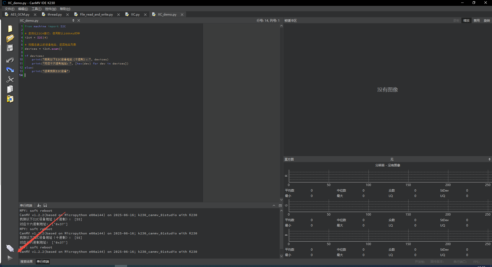

**Offline Execution:**

1. After connection, drag the program **IIC.py** from this section's directory into the CanMV IDE K230 code editor, click **Tools** in the toolbar, and select **Save open script to CanMV Board (as main.py)** as shown below:


2. Then click **Yes**.


3. Once the file is written, click **OK** to confirm and complete saving the MicroPython file to the K230 development board.


**With this method, the K230 development board will automatically run the MicroPython file upon power-up without connection, enabling offline execution.**

### 2.4.4 Program Outcome

When the program runs, it scans and detects all connected devices through the I2C bus and prints out the address of each device.


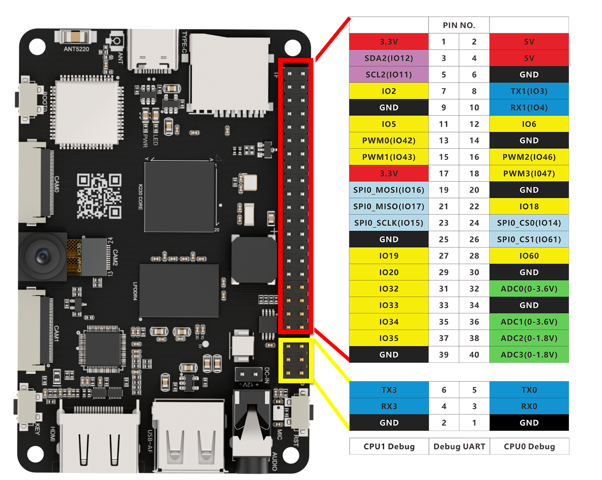

### 2.4.5 Program Analysis

```python
from machine import I2C
i2c = I2C(2, scl=11, sda=12, freq=40000)  # Defaults to 100kHz
print(i2c.scan())  # Returns the address of the first responding device, e.g., [59]
print("Hex addresses:", [hex(dev) for dev in i2c.scan()])
```

1)  Instantiate the I2C interface and use `i2c.scan()` method to scan slave devices on the current I2C bus.
2)  And print out the scanned addresses in both decimal and hexadecimal format.

## 2.5 SPI Experiment

### 2.5.1 Experiment Overview

This section demonstrates how to use programming to explore the SPI configuration functionality of the K230 development board through the IOMUX module.

> [!NOTE]
>
> **The K230 board integrates three SPI hardware modules, supporting chip select polarity configuration and adjustable clock rates.**

### 2.5.2 Preparation

* **Module Connection**

1. Connect the K230 development board to your PC using a Type-C data cable, as shown below:


2. Double-click to open CanMV IDE K230.


3. Click the connection button in the lower left corner.


4)  Upon successful connection, the lower left corner of the CanMV IDE will display the icon shown below.


5)  If connection takes more than 10 seconds, it has failed. Click the **Cancel** button, and a dialog box will appear. Click **OK** and recheck the connection.


> [!NOTE]
>
> **Connection Failure Causes and Solutions:**
> 
>* **Cable is not a data cable: Some Type-C cables are charging-only cables without data transfer capability. Please use a Type-C cable with data transfer functionality. The factory-supplied cable is a Type-C data cable.**
> * **Other K230 firmware was flashed: Re-flash the factory firmware, then reconnect.**

### 2.5.3 Program Execution and Download

The K230 program supports two operation modes: online execution and offline execution.

**Online Execution:**

After connection, drag the program **SPI.py** into CanMV IDE K230. In the code editor, click the run button  in the lower left corner to run the program online, as shown below:

> [!NOTE]
>
> **Programs run using this method will be lost after disconnecting or powering off, and will not be saved on the development board.**

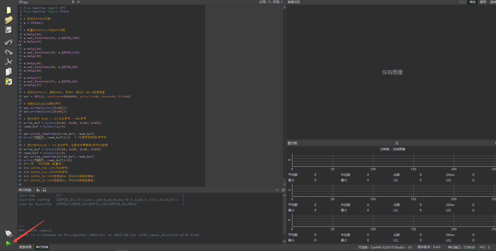

**Offline Execution:**

1. After connection, drag the program **SPI.py** from this section's directory into the CanMV IDE K230 code editor, click **Tools** in the toolbar, and select **Save open script to CanMV Board (as main.py)** as shown below:


2. Then click **Yes**.


3. Once the file is written, click **OK** to confirm and complete saving the MicroPython file to the K230 development board.


**With this method, the K230 development board will automatically run the MicroPython file upon power-up without connection, enabling offline execution.**

### 2.5.4 Program Outcome

Use the SPI interface to communicate with external devices. Specifically, the program operates an external SPI flash memory by configuring GPIO pins, such as GD25LQ128, communicates with it through the SPI protocol, and reads the device ID information.

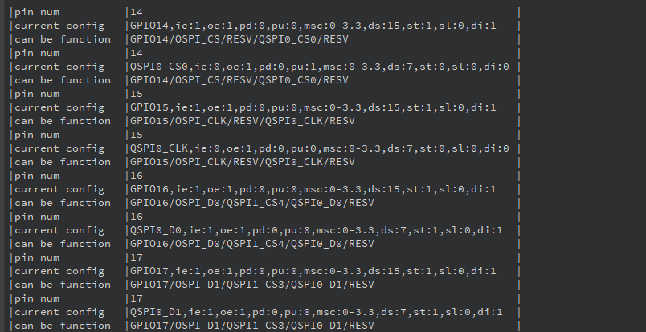


### 2.5.5 Program Analysis

```python
# Instantiate FPIOA object
a = FPIOA()
```

Instantiate FPIOA

* **Configure QSPI Function**

```python
# Instantiate FPIOA object
a = FPIOA()

# Configure GPIO14~17 as QSPI function
a.help(14)
a.set_function(14, a.QSPI0_CS0)
a.help(14)

a.help(15)
a.set_function(15, a.QSPI0_CLK)
a.help(15)

a.help(16)
a.set_function(16, a.QSPI0_D0)
a.help(16)

a.help(17)
a.set_function(17, a.QSPI0_D1)
a.help(17)
```

1)  Configure GPIO14 to GPIO17 as corresponding QSPI interface functions:
2)  GPIO14 is set to `QSPI0_CS0`, which is the SPI chip select signal `(CS)`.
3)  GPIO15 is set to `QSPI0_CLK`, which is the SPI clock signal `(CLK)`.
4)  GPIO16 is set to `QSPI0_D0`, which is the SPI data line `D0(MOSI)`.
5)  GPIO17 is set to `QSPI0_D1`, which is the SPI data line `D1(MISO)`.

* **Set SPI Parameters**

```python
# Instantiate SPI(1) with parameters: 5MHz, polarity 0, phase 0, 8-bit data width
spi = SPI(1, baudrate=5000000, polarity=0, phase=0, bits=8)
```

Instantiate an SPI interface through the SPI module with the following parameters:

Set the ID to 1 with a baud rate of 5 MHz, clock polarity 0, clock phase 0, and a data width of 8 bits.

* **Reset SPI Flash and Read Device ID**

```python
# Enable GD25LQ128 reset sequence
spi.write(bytes([0x66]))
spi.write(bytes([0x99]))

# Read ID command 0x9F + 3 placeholder bytes, total 4 bytes
write_buf = bytes([0x9F, 0x00, 0x00, 0x00])
read_buf = bytearray(4)

spi.write_readinto(write_buf, read_buf)
print("ID:", read_buf[1:])  # ID is usually in the last 3 bytes
```

1)  `write_buf`: Bytes to write, where `0x9F` is the command to read the ID, followed by three placeholder bytes `0x00`.
2)  `read_buf`: Used to store data returned from the SPI device (4 bytes).
3)  `spi.write_readinto(write_buf, read_buf)`: Send command and read response, storing the read data.

* **Read Device ID (Alternative Command Format)**

```python
write_buf = bytes([0x90, 0x00, 0x00, 0x00])
read_buf = bytearray(4)
spi.write_readinto(write_buf, read_buf)
print("ID:", read_buf[2:4])
```

1)  **0x90:** This is another command for reading the ID, but unlike `0x9F`, it returns two bytes of ID data.
2)  `write_buf`: Bytes to write, where `0x90` is the command to read the ID, followed by three placeholder bytes `0x00`.
3)  `read_buf`: Stores the returned 4 bytes of data.
4)  `spi.write_readinto(write_buf, read_buf)`: Send command and read response, storing the read data in `read_buf`.

## 2.6 PWM Experiment

### 2.6.1 Experiment Overview

This section demonstrates how to use programming to explore the PWM functionality of the K230 development board.

> [!NOTE]
>
> **The K230 contains two PWM hardware modules, each with three output channels. The output frequency of each module is adjustable, but all three channels share the same clock, while the duty cycle can be set independently. As a result, channels 0, 1, and 2 share the same output frequency, and channels 3, 4, and 5 share another output frequency.**

### 2.6.2 Preparation

* **Module Connection**

1. Connect the K230 development board to your PC using a Type-C data cable, as shown below:


2. Double-click to open CanMV IDE K230.


3. Click the connection button in the lower left corner.


4. Upon successful connection, the lower left corner of the CanMV IDE will display the icon shown below.


5)  If connection takes more than 10 seconds, it has failed. Click the **Cancel** button, and a dialog box will appear. Click **OK** and recheck the connection.


> [!NOTE]
>
> **Connection Failure Causes and Solutions:**
> 
>* **Cable is not a data cable: Some Type-C cables are charging-only cables without data transfer capability. Please use a Type-C cable with data transfer functionality. The factory-supplied cable is a Type-C data cable.**
> * **Other K230 firmware was flashed: Re-flash the factory firmware, then reconnect.**

### 2.6.3 Program Execution and Download

The K230 program supports two operation modes: online execution and offline execution.

**Online Execution:**

After connection, drag the program **PWM.py** into CanMV IDE K230. In the code editor, click the run button  in the lower left corner to run the program online, as shown below:

> [!NOTE]
>
> **Programs run using this method will be lost after disconnecting or powering off, and will not be saved on the development board.**

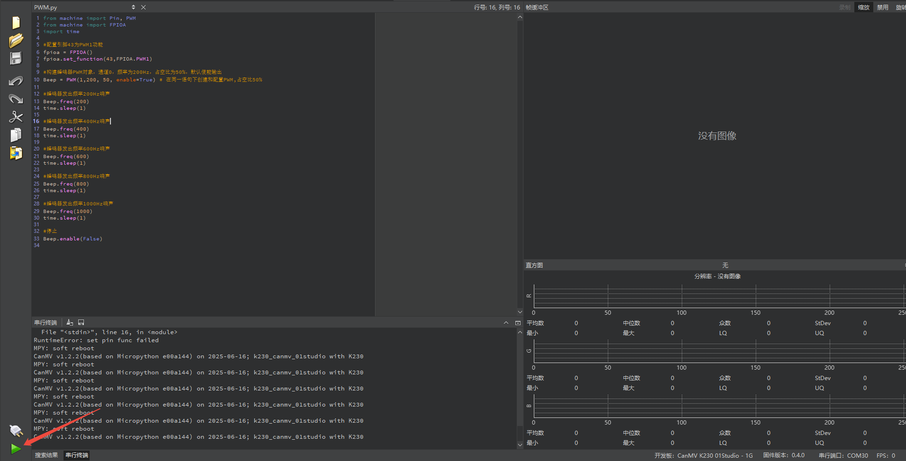

**Offline Execution:**

1. After connection, drag the program **PWM.py** from this section's directory into the CanMV IDE K230 code editor, click **Tools** in the toolbar, and select **Save open script to CanMV Board (as main.py)** as shown below:


2. Then click **Yes**.


3. Once the file is written, click **OK** to confirm and complete saving the MicroPython file to the K230 development board.


**With this method, the K230 development board will automatically run the MicroPython file upon power-up without connection, enabling offline execution.**

### 2.6.4 Program Outcome

The buzzer will emit sounds at different frequencies in sequence, starting with low frequency, then gradually increasing, from 200 Hz to 1000 Hz, producing progressively higher-pitched sounds.

### 2.6.5 Program Analysis

* **Configure PWM1 Function**

```python
from machine import Pin, PWM
from machine import FPIOA
import time

fpioa = FPIOA()
fpioa.set_function(43, FPIOA.PWM1)  
```

1)  `fpioa = FPIOA()` creates an FPIOA object for configuring pin functions.
2)  `fpioa.set_function(43, FPIOA.PWM1)` configures pin 43 as PWM1 function, outputting the PWM signal to this pin to control the buzzer.
3)  `Beep = PWM(1, 200, 50, enable=True)` controls PWM1 channel.

* **Buzzer PWM Object**

```python
Beep = PWM(1)      # Create PWM channel 1 object
Beep.freq(200)     # Set frequency to 200Hz
Beep.duty(50)      # 50% duty cycle, buzzer sounds
```

1)  `Beep = PWM(1)` specifies PWM output channel as channel 1.
2)  `Beep.freq(200)` sets the PWM output frequency to 200 Hz, meaning the buzzer vibrates 200 times per second.
3)  `Beep.duty(50)` sets the duty cycle to 50%, meaning the signal's high level time and low level time each account for 50%.

* **Change Buzzer Frequency**

```python
time.sleep(1)

Beep.freq(400)
time.sleep(1)

Beep.freq(600)
time.sleep(1)

Beep.freq(800)
time.sleep(1)

Beep.freq(1000)
time.sleep(1)

Beep.duty(0)
```

1)  `Beep.freq(400)` sets the buzzer frequency to 400 Hz. The buzzer emits a sound at 400 Hz frequency, and `time.sleep(1)` pauses for 1 second.
2)  Next, the frequency is set to 400 Hz, 600 Hz, 800 Hz, and 1000 Hz respectively, pausing 1 second after each setting so users can hear different frequency buzzes.
3)  Finally, `Beep.duty(0)` disables PWM output, which stops the buzzer from sounding.

## 2.7 ADC Experiment

### 2.7.1 Experiment Overview

This section demonstrates how to use programming to explore the ADC functionality of the K230 development board, including reading sample values and voltages through the ADC interface.

> [!NOTE]
>
> **The K230 integrates an ADC hardware module with six channels, a 12-bit sampling resolution ranging from 0 to 4095, and a maximum sampling rate of 1 MHz.**

### 2.7.2 Preparation

* **Module Connection**

1. Connect the K230 development board to your PC using a Type-C data cable, as shown below:


2. Double-click to open CanMV IDE K230.


3. Click the connection button in the lower left corner.


4)  Upon successful connection, the lower left corner of the CanMV IDE will display the icon shown below.


5)  If connection takes more than 10 seconds, it has failed. Click the **Cancel** button, and a dialog box will appear. Click **OK** and recheck the connection.


> [!NOTE]
>
> **Connection Failure Causes and Solutions:**
> 
>* **Cable is not a data cable: Some Type-C cables are charging-only cables without data transfer capability. Please use a Type-C cable with data transfer functionality. The factory-supplied cable is a Type-C data cable.**
> * **Other K230 firmware was flashed: Re-flash the factory firmware, then reconnect.**

### 2.7.3 Program Execution and Download

The K230 program supports two operation modes: online execution and offline execution.

**Online Execution:**

After connection, drag the program **ADC.py** into CanMV IDE K230.

In the code editor, click the run button  in the lower left corner to run the program online, as shown below:

> [!NOTE]
>
> **Programs run using this method will be lost after disconnecting or powering off, and will not be saved on the development board.**

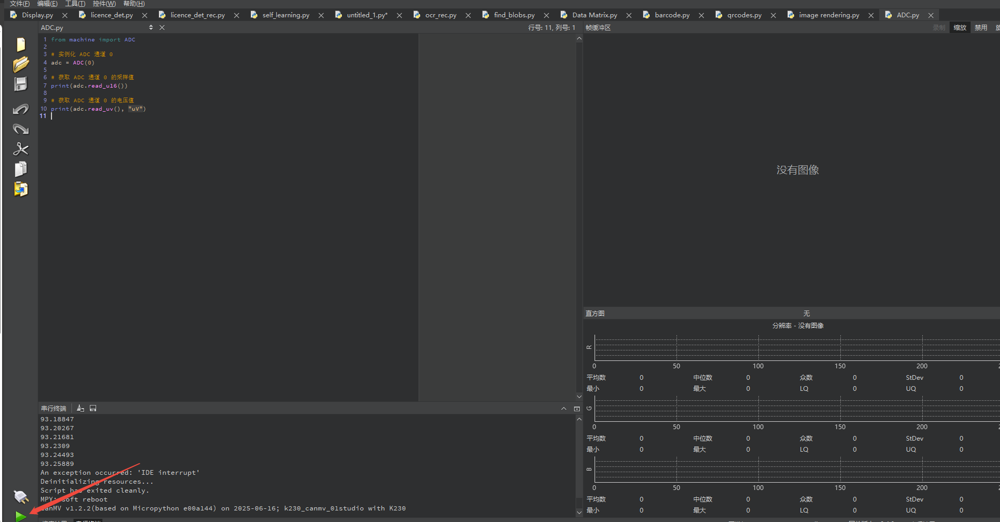

**Offline Execution:**

1. After connection, drag the program **ADC.py** from this section's directory into the CanMV IDE K230 code editor, click **Tools** in the toolbar, and select **Save open script to CanMV Board (as main.py)** as shown below:


2. Then click **Yes**.


3. Once the file is written, click **OK** to confirm and complete saving the MicroPython file to the K230 development board.


**With this method, the K230 development board will automatically run the MicroPython file upon power-up without connection, enabling offline execution.**

### 2.7.4 Program Outcome

The serial terminal displays the measured sampling values and voltage values from ADC channel 0.

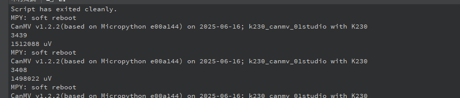


### 2.7.5 Program Analysis

```python
from machine import ADC

# Instantiate ADC channel 0
adc = ADC(0)

# Get the sampling value of ADC channel 0
print(adc.read_u16())

# Get the voltage value of ADC channel 0
print(adc.read_uv(), "uV")
```

1)  `from machine import` used to control the on-chip ADC analog-to-digital converter.
2)  The `adc.read_u16()` function reads the ADC value with 12-bit precision, returning a value from 0 to 4095. Channels 0 and 1 have a range of 0 to 3.6 V, while channels 2 and 3 have a range of 0 to 1.8 V.
3)  The `adc.read_uv()` function reads the ADC voltage, returning a value from 0 to 1.8 volts. Channels 0 and 1 actually have a range of 0 to 3.6 volts, while channels 2 and 3 have a range of 0 to 1.8 volts.

## 2.8 RTC Experiment

### 2.8.1 Experiment Overview

This section demonstrates how to use programming to explore the RTC (Real-Time Clock) module of the K230 development board, allowing you to set and retrieve the current system time.

> [!NOTE]
>
> **The K230 provides an RTC (Real-Time Clock) class module that you can use to set and get the current system time.**

### 2.8.2 Preparation

* **Module Connection**

1. Connect the K230 development board to your PC using a Type-C data cable, as shown below:


2. Double-click to open CanMV IDE K230.


3. Click the connection button in the lower left corner.


4)  Upon successful connection, the lower left corner of the CanMV IDE will display the icon shown below.


5)  If connection takes more than 10 seconds, it has failed. Click the **Cancel** button, and a dialog box will appear. Click **OK** and recheck the connection.


> [!NOTE]
>
> **Connection Failure Causes and Solutions:**
> 
>* **Cable is not a data cable: Some Type-C cables are charging-only cables without data transfer capability. Please use a Type-C cable with data transfer functionality. The factory-supplied cable is a Type-C data cable.**
> * **Other K230 firmware was flashed: Re-flash the factory firmware, then reconnect.**

### 2.8.3 Program Execution and Download

The K230 program supports two operation modes: online execution and offline execution.

**Online Execution:**

After connection, drag the program **RTC.py** into CanMV IDE K230.

In the code editor, click the run button  in the lower left corner to run the program online, as shown below:

> [!NOTE]
>
> **Programs run using this method will be lost after disconnecting or powering off, and will not be saved on the development board.**

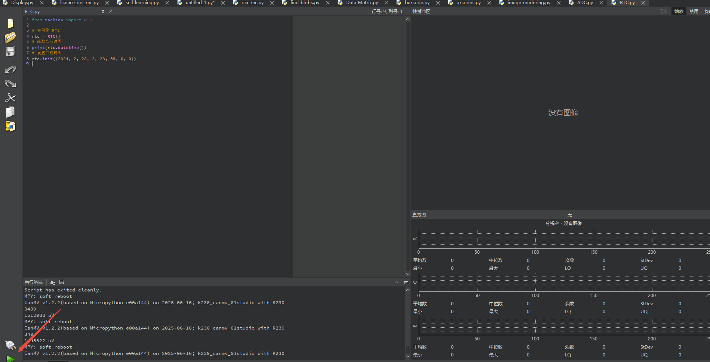

**Offline Execution:**

1. After connection, drag the program **RTC.py** from this section's directory into the CanMV IDE K230 code editor, click **Tools** in the toolbar, and select **Save open script to CanMV Board (as main.py)** as shown below:


2. Then click **Yes**.


3. Once the file is written, click **OK** to confirm and complete saving the MicroPython file to the K230 development board.


**With this method, the K230 development board will automatically run the MicroPython file upon power-up without connection, enabling offline execution.**

### 2.8.4 Program Outcome

Running the code, you can see the terminal prints the current RTC time information.

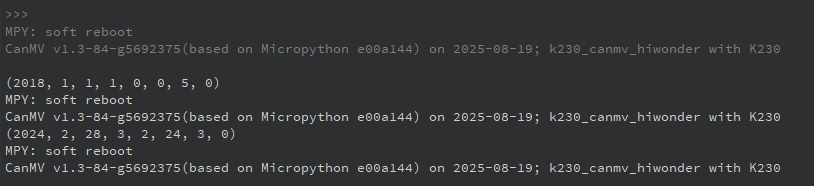

### 2.8.5 Program Analysis

```python
from machine import RTC

# Instantiate RTC
rtc = RTC()
# Get current time
print(rtc.datetime())
# Set current time
rtc.init((2024, 2, 28, 2, 23, 59, 0, 0))
```

1)  Instantiate `rtc = RTC()` for convenient access to RTC functions
2)  Call the `datetime()` method to get the current system time, returns format by year, month, day, weekday, hour, minute, second, microsecond.
3)  Call the `init()` method to update and set the current time. The tuple parameter passed in includes year, month, date, weekday, hour, minute, second, and microsecond.

## 2.9 WDT Experiment

### 2.9.1 Experiment Overview

This section demonstrates how to use programming to explore the WDT (Watchdog Timer) auto-reset functionality of the K230 development board.

> [!NOTE]
>
> **The K230 integrates two WDT (Watchdog Timer) hardware modules designed to ensure that the system can automatically restart if an application crashes and becomes unrecoverable. Once started, the WDT will automatically reset the system after a timeout if it is not periodically "fed" during operation. The K230 also provides an RTC (Real-Time Clock) module, allowing you to set and retrieve the current system time.**

### 2.9.2 Preparation

* **Module Connection**

1. Connect the K230 development board to your PC using a Type-C data cable, as shown below:


2. Double-click to open CanMV IDE K230.


3. Click the connection button in the lower left corner.


4)  Upon successful connection, the lower left corner of the CanMV IDE will display the icon shown below.


5)  If connection takes more than 10 seconds, it has failed. Click the **Cancel** button, and a dialog box will appear. Click **OK** and recheck the connection.


> [!NOTE]
>
> **Connection Failure Causes and Solutions:**
> 
>* **Cable is not a data cable: Some Type-C cables are charging-only cables without data transfer capability. Please use a Type-C cable with data transfer functionality. The factory-supplied cable is a Type-C data cable.**
> * **Other K230 firmware was flashed: Re-flash the factory firmware, then reconnect.**

### 2.9.3 Program Execution and Download

The K230 program supports two operation modes: online execution and offline execution.

**Online Execution:**

After connection, drag the program **WDT.py** into CanMV IDE K230.

In the code editor, click the run button  in the lower left corner to run the program online, as shown below:

> [!NOTE]
>
> **Programs run using this method will be lost after disconnecting or powering off, and will not be saved on the development board.**

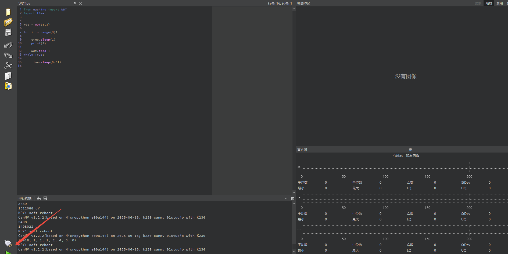

**Offline Execution:**

1. After connection, drag the program **WDT.py** from this section's directory into the CanMV IDE K230 code editor, click **Tools** in the toolbar, and select **Save open script to CanMV Board (as main.py)** as shown below:


2. Then click **Yes**.


3. Once the file is written, click **OK** to confirm and complete saving the MicroPython file to the K230 development board.

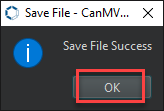

**With this method, the K230 development board will automatically run the MicroPython file upon power-up without connection, enabling offline execution.**

### 2.9.4 Program Outcome

When the code runs, the serial terminal prints three messages at three-second intervals before the system automatically restarts, and the IDE connection is disconnected.

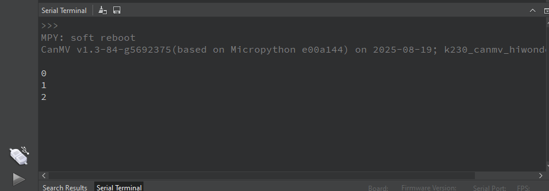

### 2.9.5 Program Analysis

```python
from machine import WDT
import time


wdt = WDT(1,3)

for i in range(3):

    time.sleep(1)
    print(i)

    wdt.feed()
while True:

    time.sleep(0.01)
```

1. The `wdt = WDT(id, timeout)` function takes two parameters: `id`, which specifies the watchdog number, and `timeout`, which sets the timeout in seconds. In this example, the watchdog ID is set to 1 and the timeout is set to 3 seconds.

**Create a watchdog object. The K230 has two watchdogs: Watchdog 0 for CPU0 (small core 800 MHz) and Watchdog 1 for CPU1 (big core 1.6 GHz). Since CanMV RTOS only uses CPU1, only Watchdog 1 is available.**

2)  Call the `wdt1.feed()` method to reset the WDT timer and prevent a timeout reset. If `wdt1.feed()` is no longer called, the timeout will trigger a system reset.

## 2.10 TIMER Experiment

### 2.10.1 Experiment Overview

This section demonstrates how to use programming to explore the timer functionality of the K230 development board.

> [!NOTE]
>
> **The K230 contains 6 Timer hardware modules, with a minimum timing period of 1us.**

### 2.10.2 Preparation

* **Module Connection**

1. Connect the K230 development board to your PC using a Type-C data cable, as shown below:


2. Double-click to open CanMV IDE K230.


3. Click the connection button in the lower left corner.


4)  Upon successful connection, the lower left corner of the CanMV IDE will display the icon shown below.


5)  If connection takes more than 10 seconds, it has failed. Click the **Cancel** button, and a dialog box will appear. Click **OK** and recheck the connection.


> [!NOTE]
>
> **Connection Failure Causes and Solutions:**
> 
>* **Cable is not a data cable: Some Type-C cables are charging-only cables without data transfer capability. Please use a Type-C cable with data transfer functionality. The factory-supplied cable is a Type-C data cable.**
> * **Other K230 firmware was flashed: Re-flash the factory firmware, then reconnect.**

### 2.10.3 Program Execution and Download

The K230 program supports two operation modes: online execution and offline execution.

**Online Execution:**

After connection, drag the program **TIMER.py** into CanMV IDE K230.

In the code editor, click the run button  in the lower left corner to run the program online, as shown below:

> [!NOTE]
>
> **Programs run using this method will be lost after disconnecting or powering off, and will not be saved on the development board.**


**Offline Execution:**

1. After connection, drag the program **TIMER.py** from this section's directory into the CanMV IDE K230 code editor, click **Tools** in the toolbar, and select **Save open script to CanMV Board (as main.py)** as shown below:


2. Then click **Yes**.


3. Once the file is written, click **OK** to confirm and complete saving the MicroPython file to the K230 development board.


**With this method, the K230 development board will automatically run the MicroPython file upon power-up without connection, enabling offline execution.**

### 2.10.4 Program Outcome

Use the timer to make the blue LED blink once per second periodically.

### 2.10.5 Program Analysis

* **Initialize LED Pin**

```python
# Initialize GPIO52 as general-purpose GPIO output
fpioa = FPIOA()
fpioa.set_function(52, FPIOA.GPIO52)
LED = Pin(52, Pin.OUT)
```

1)  The pin multiplexing configuration `FPIOA().set_function(52, FPIOA.GPIO52)` sets IO52 as a GPIO pin for LED use.
2)  `LED = Pin(52, Pin.OUT)` initializes the pin in push-pull output mode, and the voltage level can later be controlled using `LED.value()`.

* **Create Timer Callback Task**

```python
# Timer callback, toggle LED state
def led_toggle(timer):
    global led_state
    led_state = not led_state
    LED.value(1 if led_state else 0)
```

1)  Define toggle variable `global led_state`.
2)  Toggle variable state `led_state = not led_state`.
3)  Set LED level state.

* **Create Software Timer**

```python
# Create software timer, 1Hz period, repeatedly call led_toggle
tim = Timer(-1)
tim.init(freq=1, mode=Timer.PERIODIC, callback=led_toggle)
```

1)  Timer creation `tim = Timer(-1)`.
2)  Select "virtual" software timer (-1). `init(freq=1, mode=Timer.PERIODIC, callback=led_toggle)`.
3)  Set a 1 Hz period in periodic mode, so that `led_toggle` is automatically called every second.

## 2.11 FFT Experiment

### 2.11.1 Experiment Overview

This section demonstrates how to use programming to explore the FFT functionality of the K230 development board.

> [!NOTE]
>
> **The FFT (Fast Fourier Transform) module can perform a Fourier transform on input data and return the corresponding frequency amplitudes. By using FFT, a time-domain signal can be converted into the frequency domain, which helps analyze the signal's frequency components.**

### 2.11.2 Preparation

* **Module Connection**

1. Connect the K230 development board to your PC using a Type-C data cable, as shown below:

   
2. Double-click to open CanMV IDE K230.

   
3. Click the connection button in the lower left corner.

   
4)  Upon successful connection, the lower left corner of the CanMV IDE will display the icon shown below.


5)  If connection takes more than 10 seconds, it has failed. Click the **Cancel** button, and a dialog box will appear. Click **OK** and recheck the connection.


> [!NOTE]
>
> **Connection Failure Causes and Solutions:**
> 
>* **Cable is not a data cable: Some Type-C cables are charging-only cables without data transfer capability. Please use a Type-C cable with data transfer functionality. The factory-supplied cable is a Type-C data cable.**
> * **Other K230 firmware was flashed: Re-flash the factory firmware, then reconnect.**

### 2.11.3 Program Execution and Download

The K230 program supports two operation modes: online execution and offline execution.

**Online Execution:**

After connection, drag the program **FFT.py** into CanMV IDE K230.

In the code editor, click the run button  in the lower left corner to run the program online, as shown below:

> [!NOTE]
>
> **Programs run using this method will be lost after disconnecting or powering off, and will not be saved on the development board.**

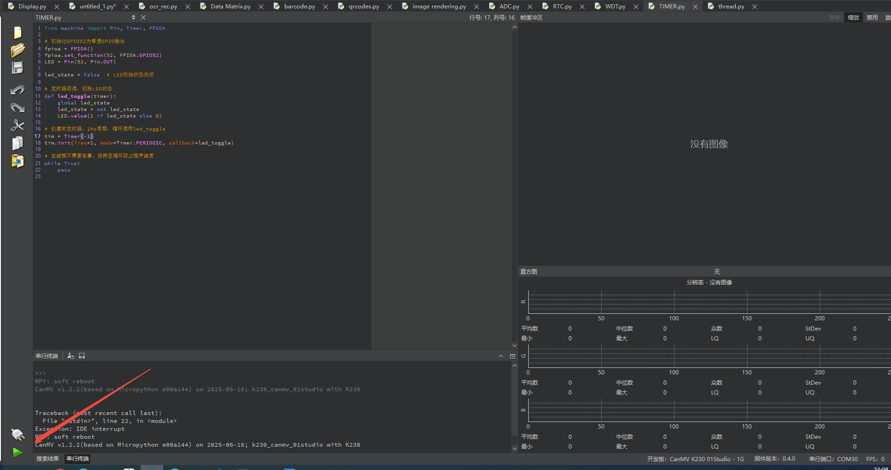

**Offline Execution:**

1. After connection, drag the program **FFT.py** from this section's directory into the CanMV IDE K230 code editor, click **Tools** in the toolbar, and select **Save open script to CanMV Board (as main.py)** as shown below:


2. Then click **Yes**.


3. Once the file is written, click **OK** to confirm and complete saving the MicroPython file to the K230 development board.


**With this method, the K230 development board will automatically run the MicroPython file upon power-up without connection, enabling offline execution.**

### 2.11.4 Program Outcome

From the last two printed outputs, the original signal can be accurately inferred in terms of which sine wave frequencies it consists of and their respective amplitudes, confirming the effectiveness of the FFT algorithm.

### 2.11.5 Program Analysis

```python
from machine import FFT
import array
import math
from ulab import numpy as np

PI = 3.14159265358979323846264338327950288419716939937510

rx = []

def input_data():
    for i in range(64):
        data0 = 10 * math.cos(2 * PI * i / 64)
        data1 = 20 * math.cos(2 * 2 * PI * i / 64)
        data2 = 30 * math.cos(3 * 2 * PI * i / 64)
        data3 = 0.2 * math.cos(4 * 2 * PI * i / 64)
        data4 = 1000 * math.cos(5 * 2 * PI * i / 64)
        rx.append(int(data0 + data1 + data2 + data3 + data4))

input_data()  # Initialize data for FFT, list type
print(rx)

data = np.array(rx, dtype=np.uint16)  # Convert list data to array
print(data)

fft1 = FFT(data, 64, 0x555)  # Create an FFT object, number of points is 64, offset is 0x555
res = fft1.run()  # Get the FFT transformed data
print(res)

res = fft1.amplitude(res)  # Get the amplitude of each frequency point
print(res)

res = fft1.freq(64, 38400)  # Get the frequency values of all frequency points
print(res)

```

* **Import Modules**

```python
from machine import FFT
import array
import math
from ulab import numpy as np
```

1)  `machine.FFT`: Import the core FFT processing module.
2)  `array, math`: Used for array operations and mathematical calculations.
3)  `ulab.numpy as np`: Import the ulab library.

* **Generate Test Signal**

```python
def input_data():
    for i in range(64):
        data0 = 10 * math.cos(2 * PI * i / 64)
        data1 = 20 * math.cos(2 * 2 * PI * i / 64)
        data2 = 30 * math.cos(3 * 2 * PI * i / 64)
        data3 = 0.2 * math.cos(4 * 2 * PI * i / 64)
        data4 = 1000 * math.cos(5 * 2 * PI * i / 64)
        rx.append(int(data0 + data1 + data2 + data3 + data4))
```

1)  This function generates 64 data points using a for loop to simulate a sampling process. At each iteration, it calculates the values of five cosine waves with different frequencies and amplitudes and sums them together.
2)  `rx.append()`: Stores the sum (rounded) of these five waveforms in the list rx. Ultimately, rx contains composite waveform data of 64 points.

* **Data Preparation**

```python
input_data()  # Initialize data for FFT, list type
print(rx)

data = np.array(rx, dtype=np.uint16)  # Convert list data to array
print(data)
```

The FFT module requires data in this format for efficient computation. `dtype=np.uint16` specifies that the data type of each element in the array is a 16-bit unsigned integer.

* **FFT Calculation and Result Retrieval**

```python
fft1 = FFT(data, 64, 0x555)  # Create an FFT object, number of points is 64, offset is 0x555
res = fft1.run()  # Get the FFT transformed data
print(res)

res = fft1.amplitude(res)  # Get the amplitude of each frequency point
print(res)

res = fft1.freq(64, 38400)  # Get the frequency values of all frequency points
print(res)

```

1)  `fft1 = FFT(data, 64, 0x555)`: Create an FFT object.
2)  `data`: Input signal data.
3)  64: Number of FFT points, must match the number of input data points.
4)  0x555: An offset. In signal processing, a DC bias may be added to the original signal to mitigate the impact of the 0Hz DC component on observation or subsequent processing, for this reason.
5)  `res = fft1.run()`: Execute the FFT transform. The resulting complex values are stored in `res`.
6)  `print(res)`: Print the raw output of the FFT transform.
     `res = fft1.amplitude(res)`: Calculate the amplitude. This function takes the complex results from the `run()` method and computes the magnitude for each frequency component.
7)  `res = fft1.freq(64, 38400)`: Calculate the frequencies. This function computes the actual physical frequency corresponding to each amplitude point based on the number of FFT points (64) and the sampling rate (38400 Hz).

## 2.12 SHA256 Encryption Experiment

### 2.12.1 Experiment Overview

This section demonstrates the SHA256 functionality of the K230 development board through programming.

> [!NOTE]
>
> **The K230 has a built-in SHA256 acceleration unit, supporting efficient SHA256 hash calculation through the uhashlib module.**

### 2.12.2 Preparation

* **Module Connection**

1. Connect the K230 development board to your PC using a Type-C data cable, as shown below:

   
2. Double-click to open CanMV IDE K230.

   
3. Click the connection button in the lower left corner.

   
4)  Upon successful connection, the lower left corner of the CanMV IDE will display the icon shown below.


5)  If connection takes more than 10 seconds, it has failed. Click the **Cancel** button, and a dialog box will appear. Click **OK** and recheck the connection.


> [!NOTE]
>
> **Connection Failure Causes and Solutions:**
> 
>* **Cable is not a data cable: Some Type-C cables are charging-only cables without data transfer capability. Please use a Type-C cable with data transfer functionality. The factory-supplied cable is a Type-C data cable.**
> * **Other K230 firmware was flashed: Re-flash the factory firmware, then reconnect.**

### 2.12.3 Program Execution and Download

The K230 program supports two operation modes: online execution and offline execution.

**Online Execution:**

After connection, drag the program **SHA256.py** into CanMV IDE K230.

In the code editor, click the run button  in the lower left corner to run the program online, as shown below:

> [!NOTE]
>
> **Programs run using this method will be lost after disconnecting or powering off, and will not be saved on the development board.**

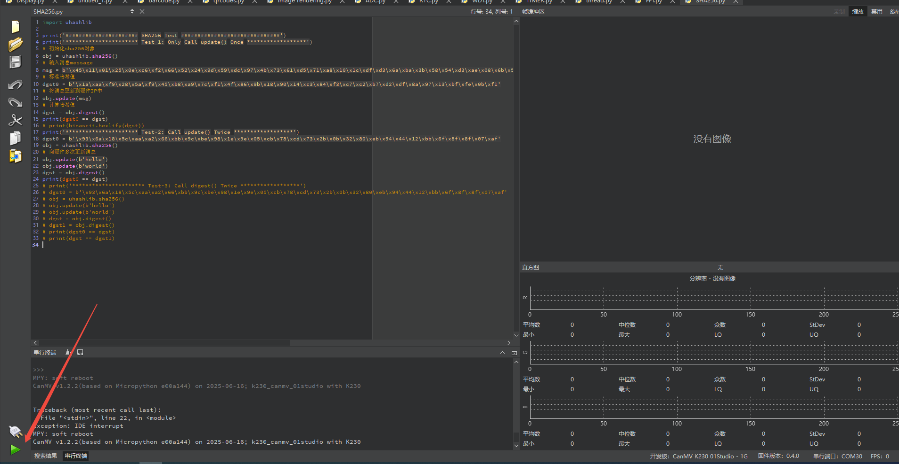

**Offline Execution:**

1. After connection, drag the program **SHA256.py** from this section's directory into the CanMV IDE K230 code editor, click **Tools** in the toolbar, and select **Save open script to CanMV Board (as main.py)** as shown below:


2. Then click **Yes**.


3. Once the file is written, click **OK** to confirm and complete saving the MicroPython file to the K230 development board.


**With this method, the K230 development board will automatically run the MicroPython file upon power-up without connection, enabling offline execution.**

### 2.12.4 Program Outcome

Calling `update()` twice produces the correct SHA256 hash value, matching the expected result. This code verifies that `uhashlib.sha256()` supports updating the message data multiple times before computing the hash in a single step.

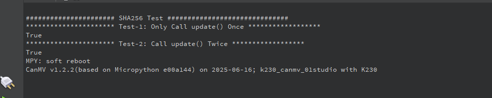

### 2.12.5 Program Analysis

```python
import uhashlib

print('###################### SHA256 Test ##############################')
print('********************** Test-1: Only Call update() Once ******************')
# Initialize sha256 object
obj = uhashlib.sha256()
# Input message
msg = b'\x45\x11\x01\x25\x0e\xc6\xf2\x66\x52\x24\x9d\x59\xdc\x97\x4b\x73\x61\xd5\x71\xa8\x10\x1c\xdf\xd3\x6a\xba\x3b\x58\x54\xd3\xae\x08\x6b\x5f\xdd\x45\x97\x72\x1b\x66\xe3\xc0\xdc\x5d\x8c\x60\x6d\x96\x57\xd0\xe3\x23\x28\x3a\x52\x17\xd1\xf5\x3f\x2f\x28\x4f\x57\xb8'
# Standard hash value
dgst0 = b'\x1a\xaa\xf9\x28\x5a\xf9\x45\xb8\xa9\x7c\xf1\x4f\x86\x9b\x18\x90\x14\xc3\x84\xf3\xc7\xc2\xb7\xd2\xdf\x8a\x97\x13\xbf\xfe\x0b\xf1'
# Update message to hardware IP
obj.update(msg)
# Calculate hash value
dgst = obj.digest()
print(dgst0 == dgst)
# print(binascii.hexlify(dgst))
print('********************** Test-2: Call update() Twice ******************')
dgst0 = b'\x93\x6a\x18\x5c\xaa\xa2\x66\xbb\x9c\xbe\x98\x1e\x9e\x05\xcb\x78\xcd\x73\x2b\x0b\x32\x80\xeb\x94\x44\x12\xbb\x6f\x8f\x8f\x07\xaf'
obj = uhashlib.sha256()
# Update message to hardware multiple times
obj.update(b'hello')
obj.update(b'world')
dgst = obj.digest()
```

* **First update() Call**

```python
print('********************** Test-1: Only Call update() Once ******************')
# Initialize sha256 object
obj = uhashlib.sha256()
# Input message
msg = b'\x45\x11\x01\x25\x0e\xc6\xf2\x66\x52\x24\x9d\x59\xdc\x97\x4b\x73\x61\xd5\x71\xa8\x10\x1c\xdf\xd3\x6a\xba\x3b\x58\x54\xd3\xae\x08\x6b\x5f\xdd\x45\x97\x72\x1b\x66\xe3\xc0\xdc\x5d\x8c\x60\x6d\x96\x57\xd0\xe3\x23\x28\x3a\x52\x17\xd1\xf5\x3f\x2f\x28\x4f\x57\xb8'
# Standard hash value
dgst0 = b'\x1a\xaa\xf9\x28\x5a\xf9\x45\xb8\xa9\x7c\xf1\x4f\x86\x9b\x18\x90\x14\xc3\x84\xf3\xc7\xc2\xb7\xd2\xdf\x8a\x97\x13\xbf\xfe\x0b\xf1'
# Update message to hardware IP
obj.update(msg)
# Calculate hash value
dgst = obj.digest()
print(dgst0 == dgst)
# print(binascii.hexlify(dgst))
```

1)  A SHA256 hash object `obj` is created.
2)  Calling `obj.digest()` computes the hash value of the message.
3)  It is then compared with the expected hash value `dgst0` to verify consistency.

* **Second update() Call**

```python
print('********************** Test-2: Call update() Twice ******************')
dgst0 = b'\x93\x6a\x18\x5c\xaa\xa2\x66\xbb\x9c\xbe\x98\x1e\x9e\x05\xcb\x78\xcd\x73\x2b\x0b\x32\x80\xeb\x94\x44\x12\xbb\x6f\x8f\x8f\x07\xaf'
obj = uhashlib.sha256()
# Update message to hardware multiple times
obj.update(b'hello')
obj.update(b'world')
dgst = obj.digest()
print(dgst0 == dgst)
```

1)  Recreate a SHA256 hash object.
2)  Call `digest()` to obtain the hash value.
3)  Compare it with the expected hash value `dgst0`.


## 2.13 AES Encryption Experiment

### 2.13.1 Experiment Overview

This section demonstrates the AES encryption and decryption operations on the K230 development board through programming.

> [!NOTE]
>
> **The K230 has a built-in encryption/decryption algorithm accelerator, supporting AES algorithm encryption and decryption operations.**

### 2.13.2 Preparation

* **Module Connection**

1. Connect the K230 development board to your PC using a Type-C data cable, as shown below:

   
2. Double-click to open CanMV IDE K230.

   
3. Click the connection button in the lower left corner.

   
4)  Upon successful connection, the lower left corner of the CanMV IDE will display the icon shown below.


5)  If connection takes more than 10 seconds, it has failed. Click the **Cancel** button, and a dialog box will appear. Click **OK** and recheck the connection.


> [!NOTE]
>
> **Connection Failure Causes and Solutions:**
> 
>* **Cable is not a data cable: Some Type-C cables are charging-only cables without data transfer capability. Please use a Type-C cable with data transfer functionality. The factory-supplied cable is a Type-C data cable.**
> * **Other K230 firmware was flashed: Re-flash the factory firmware, then reconnect.**

### 2.13.3 Program Execution and Download

The K230 program supports two operation modes: online execution and offline execution.

**Online Execution:**

After connection, drag the program **AES_GCM.py** into CanMV IDE K230.

In the code editor, click the run button  in the lower left corner to run the program online, as shown below:

> [!NOTE]
>
> **Programs run using this method will be lost after disconnecting or powering off, and will not be saved on the development board.**

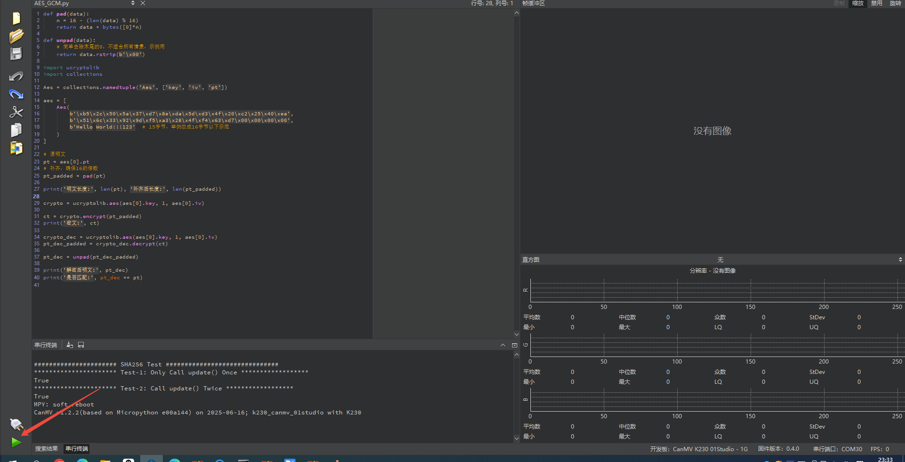

**Offline Execution:**

1. After connection, drag the program **AES_GCM.py** from this section's directory into the CanMV IDE K230 code editor, click **Tools** in the toolbar, and select **Save open script to CanMV Board (as main.py)** as shown below:


2. Then click **Yes**.


3. Once the file is written, click **OK** to confirm and complete saving the MicroPython file to the K230 development board.


**With this method, the K230 development board will automatically run the MicroPython file upon power-up without connection, enabling offline execution.**

### 2.13.4 Program Outcome

The program uses the AES algorithm to encrypt plaintext and handles AES’s data length requirements through padding and unpadding. The correctness of the AES encryption and decryption process is verified through the complete encryption and decryption operations.

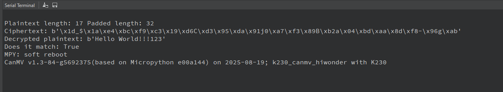

### 2.13.5 Program Analysis

* **Data Padding and Unpadding**

```python
def pad(data):
    n = 16 - (len(data) % 16)
    return data + bytes([0]*n)

def unpad(data):
    # Simply remove trailing 0s, not suitable for all scenarios, for example purposes
    return data.rstrip(b'\x00')
```

1)  The AES encryption algorithm requires that the length of input data must be a multiple of 16 bytes, so when the plaintext length is not a multiple of 16, padding is required.
2)  `n = 16 - (len(data) % 16)` calculates how many bytes need to be added to make the data length a multiple of 16.
3)  `data + bytes([0]*n)` adds n 0x00 bytes to the end of the plaintext data, making the length comply with AES algorithm requirements.
4)  During decryption, the decrypted data may contain padding bytes (0x00) at the end of the original data. The unpad function is used to remove these extra bytes and restore the original data. `rstrip(b'\x00')` removes all 0x00 bytes at the end of the data, which is the reverse operation of padding.

* **AES Encryption**

```python
crypto = ucryptolib.aes(aes[0].key, 1, aes[0].iv)

ct = crypto.encrypt(pt_padded)
print('密文:', ct)
```

Encryption is performed by initializing `ucryptolib.aes` with a key, using ECB mode as the encryption mode, and an initialization vector iv. The method `crypto.encrypt(pt_padded)` encrypts the padded plaintext and returns the ciphertext ct.

* **Decryption and Verification**

```python
crypto_dec = ucryptolib.aes(aes[0].key, 1, aes[0].iv)
pt_dec_padded = crypto_dec.decrypt(ct)

pt_dec = unpad(pt_dec_padded)

print('Decrypted plaintext:', pt_dec)
print('Does it match:', pt_dec == pt)
```

1. Decryption is performed using the `decrypt` method. The decrypted data includes padding bytes, which are removed using `unpad`. A decrypter object is created with `ucryptolib.aes(aes[0].key, 1, aes[0].iv)`, using the same key, ECB mode, and initialization vector as during encryption.
2. `crypto_dec.decrypt(ct)` decrypts the ciphertext `ct` and returns the decrypted data `pt_dec_padded`. At this point, the data length may be a multiple of 16 but still includes the padding bytes.
3. `unpad(pt_dec_padded)` removes the 0x00 padding bytes at the end of the decrypted data to obtain the original plaintext pt_dec.
4. `pt_dec == pt` is used to verify whether the decrypted data is the same as the original plaintext. If they are the same, it indicates that the encryption and decryption process was successful and outputs True; otherwise, outputs False.


## 2.14 Multi-threading Experiment

### 2.14.1 Experiment Overview

This section covers learning the multithreading functionality of the K230 development board through programming.

### 2.14.2 Preparation

* **Module Connection**

1. Connect the K230 development board to your PC using a Type-C data cable, as shown below:

   
2. Double-click to open CanMV IDE K230.

   
3. Click the connection button in the lower left corner.

   
4)  Upon successful connection, the lower left corner of the CanMV IDE will display the icon shown below.


5)  If connection takes more than 10 seconds, it has failed. Click the **Cancel** button, and a dialog box will appear. Click **OK** and recheck the connection.


> [!NOTE]
>
> 
> **Connection Failure Causes and Solutions:**
>
> * **Cable is not a data cable: Some Type-C cables are charging-only cables without data transfer capability. Please use a Type-C cable with data transfer functionality. The factory-supplied cable is a Type-C data cable.**
> * **Other K230 firmware was flashed: Re-flash the factory firmware, then reconnect.**

### 2.14.3 Program Execution and Download

The K230 program supports two operation modes: online execution and offline execution.

**Online Execution:**

After connection, drag the program **thread.py** into CanMV IDE K230.

In the code editor, click the run button  in the lower left corner to run the program online, as shown below:

> [!NOTE]
>
> **Programs run using this method will be lost after disconnecting or powering off, and will not be saved on the development board.**

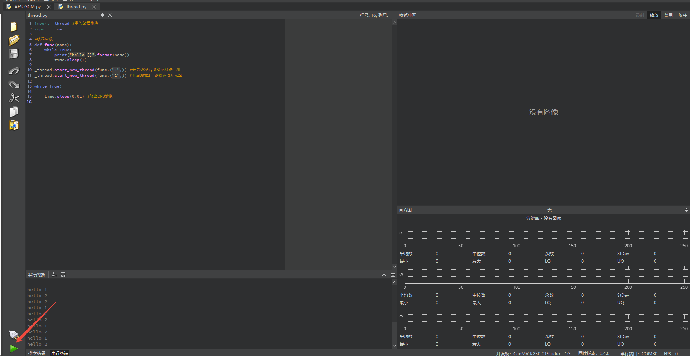

**Offline Execution:**

1. After connection, drag the program **thread.py** from this section's directory into the CanMV IDE K230 code editor, click **Tools** in the toolbar, and select **Save open script to CanMV Board (as main.py)** as shown below:


2. Then click **Yes**.


3. Once the file is written, click **OK** to confirm and complete saving the MicroPython file to the K230 development board.


**With this method, the K230 development board will automatically run the MicroPython file upon power-up without connection, enabling offline execution.**

### 2.14.4 Program Outcome

There are two threads running in parallel, each printing a message once every second in its own loop.

Thread 1 prints **hello 1** every second, and thread 2 prints **hello 2** every second.

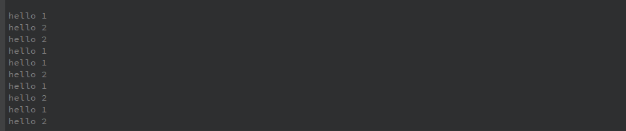

### 2.14.5 Program Analysis

* **Import Modules**

```python
import _thread # Import thread module
import time
```

Import thread module and time module

* **Create Thread Function**

```python
# Thread function
def func(name):
    while True:
        print("hello {}".format(name))
        time.sleep(1)

_thread.start_new_thread(func,("1",)) # Start thread 1, parameter must be a tuple
_thread.start_new_thread(func,("2",)) # Start thread 2, parameter must be a tuple
```

1)  `_thread.start_new_thread(func, ("1",))`: This line of code starts a new thread, calling the `func` function.
2)  `func()` receives a parameter name and enters an infinite loop.
3)  In each loop, `print("hello {}".format(name))` outputs a message displaying the value corresponding to `name`, e.g., **hello 1** or **hello 2**.

## 2.15 File Read/Write

### 2.15.1 Experiment Overview

This section demonstrates how to use the K230 development board to perform file read and write operations in MicroPython.

### 2.15.2 Preparation

* **Module Connection**

1. Connect the K230 development board to your PC using a Type-C data cable, as shown below:

   
2. Double-click to open CanMV IDE K230.

   
3. Click the connection button in the lower left corner.

   
4)  Upon successful connection, the lower left corner of the CanMV IDE will display the icon shown below.


5)  If connection takes more than 10 seconds, it has failed. Click the **Cancel** button, and a dialog box will appear. Click **OK** and recheck the connection.


> [!NOTE]
>
> **Connection Failure Causes and Solutions:**
> 
>* **Cable is not a data cable: Some Type-C cables are charging-only cables without data transfer capability. Please use a Type-C cable with data transfer functionality. The factory-supplied cable is a Type-C data cable.**
> * **Other K230 firmware was flashed: Re-flash the factory firmware, then reconnect.**

### 2.15.3 Program Execution and Download

The K230 program supports two operation modes: online execution and offline execution.

**Online Execution:**

After connection, drag the program **File_read_and_write.py** into CanMV IDE K230. In the code editor, click the run button  in the lower left corner to run the program online, as shown below:

> [!NOTE]
>
> **Programs run using this method will be lost after disconnecting or powering off, and will not be saved on the development board.**


**Offline Execution:**

1. After connection, drag the program **File_read_and_write.py** from this section's directory into the CanMV IDE K230 code editor, click **Tools** in the toolbar, and select **Save open script to CanMV Board (as main.py)** as shown below:


2. Then click **Yes**.


3. Once the file is written, click **OK** to confirm and complete saving the MicroPython file to the K230 development board.


**With this method, the K230 development board will automatically run the MicroPython file upon power-up without connection, enabling offline execution.**

### 2.15.4 Program Outcome

After running the code, the file content is printed on the serial terminal. Then, open the CanMV drive and navigate to the sdcard directory to find the newly created `data_log.txt` file, which contains the text that was written, `hello hiwonder`. Besides `.txt` files, any file extension can be used, such as `.json`, `.csv`, or even files without an extension.

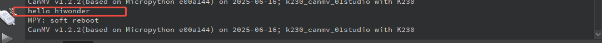

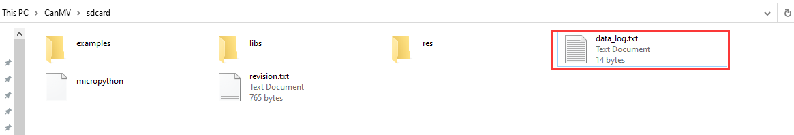

### 2.15.5 Program Analysis

* **Write File Operation**

```python
file_path = '/sdcard/data_log.txt'

# Write file, use with structure to automatically manage file closing
with open(file_path, 'w') as f:
    f.write('hello hiwonder')
```

Define the file path and use the `open` function to open the file at the specified path in write mode `w`. If the file does not exist, it will be created automatically. If the file already exists, write mode `w` will clear its contents and overwrite it.

* **Read File Operation**

```python
# Read file, use with structure to avoid forgetting to close
with open(file_path, 'r') as f:
    content = f.read()
    print(content)
```

This line of code opens the file again using the `open` function, this time in read mode `'r'`. The `f.read()` method reads all the text from the file as a single string and stores it in the variable `content`, which is then printed.
