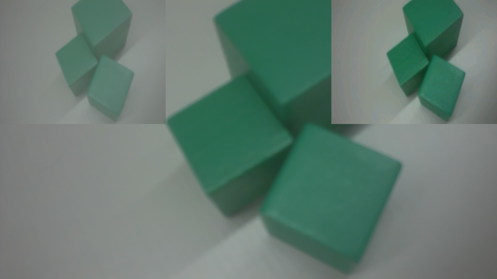
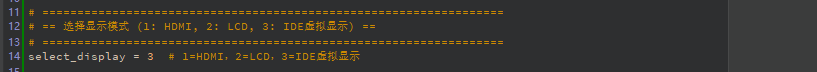
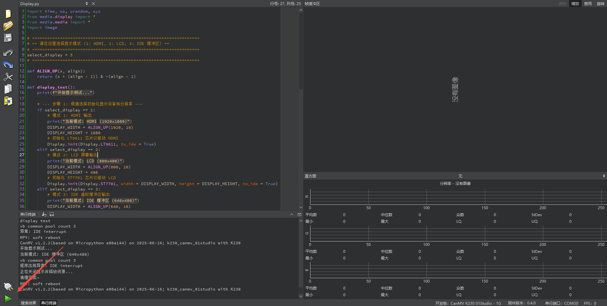
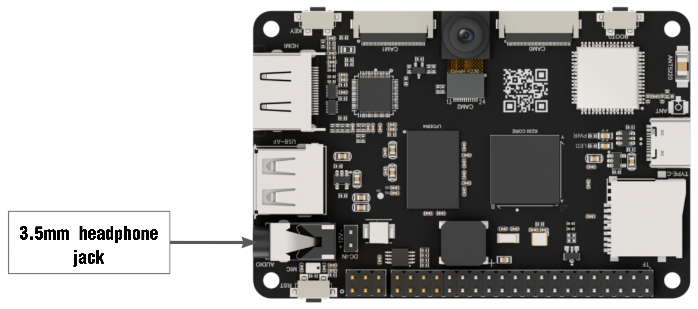
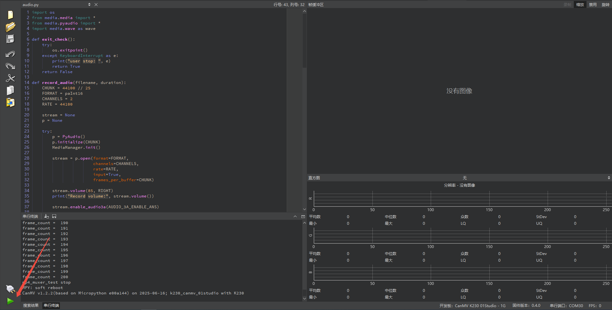
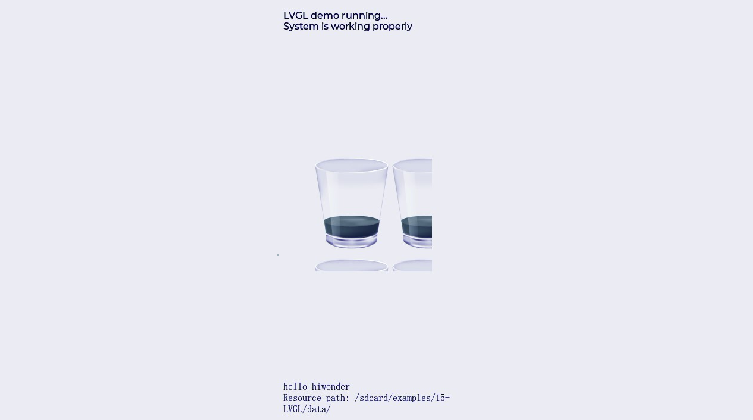

# 3. Multimedia Course

## 3.1 Sensor Experiment

### 3.1.1 Experiment Overview

This section uses a program to demonstrate how to leverage the K230’s three-channel output capability to send the same camera feed to three display areas simultaneously in different resolutions/formats for real-time comparison.

The K230 features three MIPI-CSI inputs (3×2 lanes or 1×4 + 1×2 lanes) and can connect up to three cameras. Each camera supports three output channels, allowing different resolutions and image formats.

### 3.1.2 Preparation

* **Module Connection**

1)  Connect the K230 board to your PC using a Type-C data cable, as shown below:

    

2)  Double-click to open CanMV IDE K230.

    

3)  Click the connection button in the lower left corner.

    

4)  When connection is successful, the lower left corner of CanMV IDE will display the icon shown below.

    

5)  If connection takes more than 10 seconds, it has failed. Click the **Cancel** button, and a dialog box will appear. Click **OK** and recheck the connection.

    

> [!NOTE]
>
> **Connection Failure Causes and Solutions:**
>
> * **Cable is not a data cable: Some Type-C cables are charging-only cables without data transfer capability. Please use a Type-C cable with data transfer functionality. The factory-supplied cable is a Type-C data cable.**
>
> * **Other K230 firmware was flashed: Re-flash the factory firmware, then reconnect.**
>

### 3.1.3 Program Execution and Download

**Display Mode Configuration:** 

The program can use the `select_display=""` parameter to choose the display mode: HDMI, LCD, or IDE virtual.


The K230 program supports two operation modes: online execution and offline execution.

[Click to download program. ](https://drive.google.com/drive/folders/172gvYWc6QoDCQ0F5YdH97yRfuSXhdn4q?usp=sharing)

**Online Execution:**

After connecting, drag the program **Sensor.py** into the CanMV IDE K230 code editor, then click the run button  in the lower left corner to execute the program online, as shown below:

> [!NOTE]
>
> **Programs run using this method will be lost after disconnecting or powering off, and will not be saved on the development board.**


**Offline Execution:**

1. After connecting, drag the program **Sensor.py** into the CanMV IDE K230 code editor, click **Tools** in the toolbar, and select **Save open script to CanMV Board (as main.py)**, as shown below:


2. Then click **Yes**.


3. Once the file is written, click **OK** to confirm and complete saving the MicroPython file to the K230 development board.


**With this method, the K230 development board will automatically run the MicroPython file upon power-up without connection, enabling offline execution.**

### 3.1.4 Program Outcome

The same camera feed is simultaneously sent to three display areas on the HDMI screen in three different resolutions/formats for real-time comparison.



### 3.1.5 Program Analysis

* **Import Required Libraries**

```
# Camera Example
import time
import os
import sys

from media.sensor import *
from media.display import *
from media.media import *

sensor = None
```

* **Main Loop**

```
    while True:
        os.exitpoint()

        img = sensor.snapshot(chn=CAM_CHN_ID_1)
        Display.show_image(img, alpha=128)

        img = sensor.snapshot(chn=CAM_CHN_ID_2)
        Display.show_image(img, x=1920 - 640, layer=Display.LAYER_OSD1)

except KeyboardInterrupt as e:
    print("User stopped: ", e)  # Stopped by user
except BaseException as e:
    print(f"Exception: {e}")  # Exception
finally:
    # Stop sensor
    if isinstance(sensor, Sensor):
        sensor.stop()
    # Deinitialize display
    Display.deinit()
    os.exitpoint(os.EXITPOINT_ENABLE_SLEEP)
    time.sleep_ms(100)
    # Release media buffer
    MediaManager.deinit()
```

1)  `img = sensor.snapshot(chn=CAM_CHN_ID_1)`: Captures the current frame from camera channel 1.

2)  `Display.show_image(img, alpha=128)`: Displays the image on the default display layer with transparency set to 128, resulting in semi-transparent.

3)  `img = sensor.snapshot(chn=CAM_CHN_ID_2)`: Captures the current frame from camera channel 2.

4)  `Display.show_image(img, x=1920 - 640, layer=Display.LAYER_OSD1)`: Displays the image in the lower right corner of the screen at position 1920-640 = 1280 on the OSD1 layer.


## 3.2 Display Experiment

### 3.2.1 Experiment Overview

This section demonstrates how to use the K230 to call the CanMV Display module to implement image display functionality.

### 3.2.2 Preparation

* **Module Connection**

1. Connect the K230 development board to your PC using a Type-C data cable, as shown below:

   

2. Double-click to open CanMV IDE K230.

   

3. Click the connection button in the lower left corner.

   

4. When connection is successful, the lower left corner of CanMV IDE will display the icon shown below.

   

5)  If connection takes more than 10 seconds, it has failed. Click the **Cancel** button, and a dialog box will appear. Click **OK** and recheck the connection.

    

> [!NOTE]
>
> **Connection Failure Causes and Solutions:**
>
> * **Cable is not a data cable: Some Type-C cables are charging-only cables without data transfer capability. Please use a Type-C cable with data transfer functionality. The factory-supplied cable is a Type-C data cable.**
>
> * **Other K230 firmware was flashed: Re-flash the factory firmware, then reconnect.**

### 3.2.3 Program Execution and Download

**Display Mode Configuration:** 

The program can use the `select_display=""` parameter to choose the display mode: HDMI, LCD, or IDE virtual.



The K230 program supports two operation modes: online execution and offline execution.

**Online Execution:**

After connecting, drag the program **Display.py** into the CanMV IDE K230 code editor, then click the run button  in the lower left corner to execute the program online, as shown below:

> [!NOTE]
>
> **Programs run using this method will be lost after disconnecting or powering off, and will not be saved on the development board.**



**Offline Execution:**

1. After connecting, drag the program **Display.py** from the same directory into the CanMV IDE K230 code editor, click **Tools** in the toolbar, and select **Save open script to CanMV Board (as main.py)**, as shown below:

   

2. Then click **Yes**.


3. Once the file is written, click **OK** to confirm and complete saving the MicroPython file to the K230 development board.


**With this method, the K230 development board will automatically run the MicroPython file upon power-up without connection, enabling offline execution.**

### 3.2.4 Program Outcome

On the screen, ten "**Hello Hiwonder**" strings appear every second, with their size, color, and position completely random. This creates a colorful, continuously flickering, dynamic text kaleidoscope effect.


### 3.2.5 Program Analysis

* **Import Required Libraries**

```
import time, os, urandom, sys
from media.display import *
from media.media import *
import image
```

* **Main Loop**

```
    try:
        # --- Step 3: Main loop for drawing and display ---
        while True:
            # Clear the canvas for redrawing
            img.clear()

            # Draw 10 colorful strings at random positions on the canvas
            for i in range(10):
                x = (urandom.getrandbits(11) % img.width())
                y = (urandom.getrandbits(11) % img.height())
                r = (urandom.getrandbits(8))
                g = (urandom.getrandbits(8))
                b = (urandom.getrandbits(8))
                size = (urandom.getrandbits(30) % 64) + 32

                # Call advanced drawing function to render strings
                img.draw_string_advanced(x, y, size, "Hello Hiwonder", color=(r, g, b))

            # Display the rendered image on the screen
            Display.show_image(img)
            time.sleep(1)
            os.exitpoint()
```

1)  `img.clear()`: Completely clears the memory canvas before each frame is drawn.

2)  `urandom.getrandbits()`: Generates high-quality random numbers to determine string position (x, y), color (r, g, b), and size, creating unpredictable dynamics.

3)  `img.draw_string_advanced()`: Performs the actual drawing operation on the memory canvas `img`.

4)  `Display.show_image(img)`: It pushes or refreshes the fully drawn image in the memory canvas `img` onto the physical screen in a single operation. This "draw in memory first, then display at once" mechanism is called double buffering and helps prevent screen tearing and flickering.

5)  `time.sleep(1)`: Pauses the program for one second. This controls the animation frame rate, which is 1 FPS here, allowing each frame to be clearly observed.


## 3.3 Audio Experiment

### 3.3.1 Experiment Overview

This section demonstrates using the K230 to access the microphone module for recording and playback.

### 3.3.2 Preparation

* **Hardware Introduction**

> [!NOTE]
>
> **Hiwonder does not provide a built-in audio output device, so please prepare your own. For external speakers, connect them to the 3.5-millimeter headphone jack as shown in the figure below.**



* **Module Connection**

1)  Connect the K230 development board to your PC using a Type-C data cable, as shown below:

    

2)  Double-click to open CanMV IDE K230.

    

3)  Click the connection button in the lower left corner.

    

4)  When connection is successful, the lower left corner of CanMV IDE will display the icon shown below.


5)  If connection takes more than 10 seconds, it has failed. Click the **Cancel** button, and a dialog box will appear. Click **OK** and recheck the connection.


> [!NOTE]
>
> **Connection Failure Causes and Solutions:**
>
> * **Cable is not a data cable: Some Type-C cables are charging-only cables without data transfer capability. Please use a Type-C cable with data transfer functionality. The factory-supplied cable is a Type-C data cable.**
>
> * **Other K230 firmware was flashed: Re-flash the factory firmware, then reconnect.**

### 3.3.3 Program Execution and Download

The K230 program supports two operation modes: online execution and offline execution.

[Click to download program.](https://drive.google.com/drive/folders/172gvYWc6QoDCQ0F5YdH97yRfuSXhdn4q?usp=sharing)

**Online Execution:**

After connecting, drag the program **audio.py** into the CanMV IDE K230 code editor, then click the run button  in the lower left corner to execute the program online, as shown below:

> [!NOTE]
>
> **Programs run using this method will be lost after disconnecting or powering off, and will not be saved on the development board.**



**Offline Execution:**

1. After connecting, drag the program **audio.py** from the same directory into the CanMV IDE K230 code editor, click **Tools** in the toolbar, and select **Save open script to CanMV Board (as main.py)**, as shown below:


2. Then click **Yes**.


3. Once the file is written, click **OK** to confirm and complete saving the MicroPython file to the K230 development board.


**With this method, the K230 development board will automatically run the MicroPython file upon power-up without connection, enabling offline execution.**

### 3.3.4 Program Outcome

The program starts, automatically records audio for 5 seconds, saves the recording file, plays back the recorded audio, and ends when playback is complete.

### 3.3.5 Program Analysis

* **Import Required Libraries** 

```
import os
from media.media import *   # Import media module for initializing vb buffer
from media.pyaudio import * # Import pyaudio module for audio recording and playback
import media.wave as wave   # Import wav module for saving and loading wav audio files
```

* **Recording Main Loop Analysis**

```
def record_audio(filename, duration):
    CHUNK = 44100//25  # Set audio chunk value
    FORMAT = paInt16       # Set sampling precision, supports 16bit(paInt16)/24bit(paInt24)/32bit(paInt32)
    CHANNELS = 2           # Set number of channels, supports mono(1)/stereo(2)
    RATE = 44100           # Set sampling rate

    try:
        p = PyAudio()
        p.initialize(CHUNK)    # Initialize PyAudio object
        MediaManager.init()    # Initialize vb buffer

        # Create audio input stream
        stream = p.open(format=FORMAT,
                        channels=CHANNELS,
                        rate=RATE,
                        input=True,
                        frames_per_buffer=CHUNK)

        stream.volume(vol=70, channel=LEFT)
        stream.volume(vol=85, channel=RIGHT)
        print("volume :",stream.volume())

        # Enable audio 3A feature: Automatic Noise Suppression (ANS)
        stream.enable_audio3a(AUDIO_3A_ENABLE_ANS)

        frames = []
        # Capture audio data and store in list
        for i in range(0, int(RATE / CHUNK * duration)):
            data = stream.read()
            frames.append(data)
            if exit_check():
                break
        # Save list data to wav file
        wf = wave.open(filename, 'wb') # Create wav file
        wf.set_channels(CHANNELS) # Set wav channel count
        wf.set_sampwidth(p.get_sample_size(FORMAT))  # Set wav sampling precision
        wf.set_framerate(RATE)  # Set wav sampling rate
        wf.write_frames(b''.join(frames)) # Save wav audio data
        wf.close() # Close wav file
    except BaseException as e:
            print(f"Exception {e}")
    finally:
        stream.stop_stream() # Stop audio data capture
        stream.close()# Close audio input stream
        p.terminate()# Release audio object
        MediaManager.deinit() # Release vb buffer
```

1)  `for i in range(0, int(RATE / CHUNK * duration))`: This is a precise counting loop for controlling the recording duration. It calculates the total number of iterations in advance based on the audio sample rate (RATE), chunk size (CHUNK), and the desired duration, ensuring that the recording lasts for the specified number of seconds.

2)  `data = stream.read()`: Performs the core recording operation. The audio device reads a block of raw audio data (CHUNK) from the input stream, which is the hardware buffer of the microphone.

3)  `frames.append(data)`: Adds the audio data block `data` just captured from the microphone to a Python list called `frames`. This operation temporarily stores all the audio data in memory in sequence, preparing it to be written to a file all at once after recording ends.

* **Playback Main Loop Analysis**

```
def play_audio(filename):
    try:
        wf = wave.open(filename, 'rb')# Open wav file
        CHUNK = int(wf.get_framerate()/25)# Set audio chunk value

        p = PyAudio()
        p.initialize(CHUNK) # Initialize PyAudio object
        MediaManager.init()    # Initialize vb buffer

        # Create audio output stream, all audio parameters are obtained from the wave file
        stream = p.open(format=p.get_format_from_width(wf.get_sampwidth()),
                    channels=wf.get_channels(),
                    rate=wf.get_framerate(),
                    output=True,frames_per_buffer=CHUNK)

        # Set audio output stream volume
        stream.volume(vol=85)

        data = wf.read_frames(CHUNK)# Read one frame of data from wav file

        while data:
            stream.write(data)  # Write frame data to audio output stream
            data = wf.read_frames(CHUNK) # Read one frame of data from wav file
            if exit_check():
                break
    except BaseException as e:
            print(f"Exception {e}")
    finally:
        stream.stop_stream() # Stop audio output stream
        stream.close()# Close audio output stream
        p.terminate()# Release audio object
        wf.close()# Close wav file

        MediaManager.deinit() # Release vb buffer
```

1)  `wf = wave.open(filename, 'rb')`: Opens the previously saved .wav audio file.

2)  `p = PyAudio() and MediaManager.init()`: As with recording, the audio core interface and underlying media hardware are re-initialized to prepare for playback.

3)  `stream = p.open(...)`: An audio output stream is opened, reading dynamically from the .wav file.

4)  `data = wf.read_frames(CHUNK)`: Preloads the first data block. Before entering the loop, read a small chunk of audio data from the file into the `data` variable to prepare for the playback loop.

5)  `while data`: Loop -> `stream.write(data)`: This command sends the audio data block stored in the `data` variable to the hardware playback buffer, producing sound from the speakers.


## 3.4 Video Experiment

### 3.4.1 Experiment Overview

This section demonstrates how to use the K230 to encode video streams in H264 or H265 formats for recording and playback.

### 3.4.2 Preparation

* **Hardware Introduction**

> [!NOTE]
>
> **Hiwonder does not provide a built-in audio output device, so please prepare your own. For external speakers, connect them to the 3.5-millimeter headphone jack as shown in the figure below.**


* **Module Connection**

1)  Connect the K230 development board to your PC using a Type-C data cable, as shown below:

    

2)  Double-click to open CanMV IDE K230.

    

3)  Click the connection button in the lower left corner.

    

4)  When connection is successful, the lower left corner of CanMV IDE will display the icon shown below.


5)  If connection takes more than 10 seconds, it has failed. Click the **Cancel** button, and a dialog box will appear. Click **OK** and recheck the connection.


> [!NOTE]
>
> **Connection Failure Causes and Solutions:**
>
> * **Cable is not a data cable: Some Type-C cables are charging-only cables without data transfer capability. Please use a Type-C cable with data transfer functionality. The factory-supplied cable is a Type-C data cable.**
>
> * **Other K230 firmware was flashed: Re-flash the factory firmware, then reconnect.**

### 3.4.3 Program Execution and Download

The K230 program supports two operation modes: online execution and offline execution.

[Click to download program.](https://drive.google.com/drive/folders/172gvYWc6QoDCQ0F5YdH97yRfuSXhdn4q?usp=sharing)

**Online Execution:**

After connecting, drag the program **Video_Recording.py** into the CanMV IDE K230 code editor, then click the run button  in the lower left corner to execute the program online, as shown below:

> [!NOTE]
>
> **Programs run using this method will be lost after disconnecting or powering off, and will not be saved on the development board.**


**Offline Execution:**

1. After connecting, drag the program **audio.py** from the same directory into the CanMV IDE K230 code editor, click **Tools** in the toolbar, and select **Save open script to CanMV Board (as main.py)**, as shown below:


2. Then click **Yes**.


3. Once the file is written, click **OK** to confirm and complete saving the MicroPython file to the K230 development board.


**With this method, the K230 development board will automatically run the MicroPython file upon power-up without connection, enabling offline execution.**

### 3.4.4 Program Outcome

> [!NOTE]
>
> **This lesson consists of two combined programs, where `Video_Recording.py` is the video recording program and `Video_play.py` is the video playback program.**

Download the `Video_Recording.py` program. The program will start automatically and record a 5-second MP4 file (200 frames), which is then saved automatically. Next, download the `Video_play.py` program. When started, it will automatically play back the recorded MP4 file, and the program ends after playback completes.

### 3.4.5 Program Analysis

* **Video_Recording.py Program Analysis**

1. Import MP4 and OS libraries.

```
from media.mp4format import *
import os
```

2. Configure MP4 Muxer.

```
def mp4_muxer_test():
    print("mp4_muxer_test start")
    width = 1280
    height = 720
    # Instantiate mp4 container
    mp4_muxer = Mp4Container()
    mp4_cfg = Mp4CfgStr(mp4_muxer.MP4_CONFIG_TYPE_MUXER)
    if mp4_cfg.type == mp4_muxer.MP4_CONFIG_TYPE_MUXER:
        file_name = "/sdcard/app/tests/test.mp4"
        mp4_cfg.SetMuxerCfg(file_name, mp4_muxer.MP4_CODEC_ID_H265, width, height, mp4_muxer.MP4_CODEC_ID_G711U)
    # Create mp4 muxer
    mp4_muxer.Create(mp4_cfg)
    # Start mp4 muxer
    mp4_muxer.Start()
```

(1) Define input resolution `width = 1280 height = 720`.

(2) Instantiate `mp4 container mp4_muxer = Mp4Container()`.

(3) Set output path `file_name = "/sdcard/app/tests/test.mp4"`.

3. Create and start MUXER.

```
    # Create mp4 muxer
    mp4_muxer.Create(mp4_cfg)
    # Start mp4 muxer
    mp4_muxer.Start()
```

Prepare the MP4 muxing environment and begin writing data.

4. Process data writing.

```
    frame_count = 0
    try:
        while True:
            os.exitpoint()
            # Process audio and video data, write to file in MP4 format
            mp4_muxer.Process()
            frame_count += 1
            print("frame_count = ", frame_count)
            if frame_count >= 200:
                break
    except BaseException as e:
        print(e)
```

(1) `os.exitpoint()` is used to detect exit requests, ensuring the program can be safely interrupted.

(2) Call `mp4_muxer.Process()` in a loop to process audio and video data and write it to the file.

(3) `if frame_count >= 200`: Stops after writing 200 frames, equivalent to recording a short video clip.

* **Video_play.py Program Analysis**

1. Import player module and OS library.

```
from media.player import * # Import player module for playing mp4 files
import os
```

2. Define playback completion callback.

```
start_play = False # Playback completion flag
def player_event(event,data):
    global start_play
    if(event == K_PLAYER_EVENT_EOF): # Playback completion flag
        start_play = False # Set playback completion flag
```

When the player reaches the end of file (EOF), it sets `start_play = False` to end the waiting loop.

3. Define playback function.

```
def play_mp4_test(filename):
    global start_play
    player=Player() # Create player object
    player.load(filename) # Load mp4 file
    player.set_event_callback(player_event) # Set player event callback
    player.start() # Start playback
    start_play = True
```

(1) Create player object `player=Player()`.

(2) Load mp4 file `player.load(filename)`.

(3) Set player event callback `player.set_event_callback(player_event)`.

(4) Start playback `player.start()`.

(5) Modify playback completion flag `start_play = True`.

4. Allow user interruption or exception capture to ensure safe program exit.

```
    try:
        while(start_play):
            time.sleep(0.1)
            os.exitpoint()
    except KeyboardInterrupt as e:
        print("user stop: ", e)
    except BaseException as e:
        sys.print_exception(e)

    player.stop() # Stop playback
    print("play over")
```

5. Playback completion handling.

```
    # Wait for playback to end
    try:
        while(start_play):
            time.sleep(0.1)
            os.exitpoint()
    except KeyboardInterrupt as e:
        print("user stop: ", e)
    except BaseException as e:
        sys.print_exception(e)

    player.stop() # Stop playback
    print("play over")
```

(1) After exiting the loop, call `player.stop()` to stop the player.

(2) Print **play over** to indicate playback is complete.

## 3.5 LVGL Experiment

### 3.5.1 Experiment Overview

This section demonstrates how to use the K230 to run programs with the LVGL graphical interface.

### 3.5.2 Preparation

* **Module Connection**

1)  Connect the K230 development board to your PC using a Type-C data cable, as shown below:


2)  Double-click to open CanMV IDE K230.


3)  Click the connection button in the lower left corner.


4)  When connection is successful, the lower left corner of CanMV IDE will display the icon shown below.


5)  If connection takes more than 10 seconds, it has failed. Click the **Cancel** button, and a dialog box will appear. Click **OK** and recheck the connection.


> [!NOTE]
>
> **Connection Failure Causes and Solutions:**
>
> * **Cable is not a data cable: Some Type-C cables are charging-only cables without data transfer capability. Please use a Type-C cable with data transfer functionality. The factory-supplied cable is a Type-C data cable.**
>
> * **Other K230 firmware was flashed: Re-flash the factory firmware, then reconnect.**

### 3.5.3 Program Execution and Download

**Display Mode Configuration:** 

The program can use the `select_display=""` parameter to choose the display mode: HDMI, LCD, or IDE virtual.


The K230 program supports two operation modes: online execution and offline execution.

[Click to download program.](https://drive.google.com/drive/folders/172gvYWc6QoDCQ0F5YdH97yRfuSXhdn4q?usp=sharing)

**Online Execution:**

After connecting, drag the program **Lvgl.py** into the CanMV IDE K230 code editor, then click the run button  in the lower left corner to execute the program online, as shown below:

> [!NOTE]
>
> **Programs run using this method will be lost after disconnecting or powering off, and will not be saved on the development board.**


**Offline Execution:**

1. After connecting, drag the program **Lvgl.py** from the same directory into the CanMV IDE K230 code editor, click **Tools** in the toolbar, and select **Save open script to CanMV Board (as main.py)**, as shown below:


2. Then click **Yes**.


3. Once the file is written, click **OK** to confirm and complete saving the MicroPython file to the K230 development board.


**With this method, the K230 development board will automatically run the MicroPython file upon power-up without connection, enabling offline execution.**

### 3.5.4 Program Outcome

Run the program on the K230 platform to display English text and dynamic animations in the LVGL graphical interface.




### 3.5.5 Program Analysis

* **Import Audio, Media, and OS Libraries**

```
from media.display import *
from media.media import *
import time, os, sys, gc
import lvgl as lv
import uos
```

* **Initialize LVGL**

```
def lvgl_init(display_width, display_height):
    """Initialize LVGL"""
    global disp_img1, disp_img2

    lv.init()
    disp_drv = lv.disp_create(display_width, display_height)
    disp_drv.set_flush_cb(disp_drv_flush_cb)
    disp_img1 = image.Image(display_width, display_height, image.ARGB8888)
    disp_img2 = image.Image(display_width, display_height, image.ARGB8888)
    disp_drv.set_draw_buffers(disp_img1.bytearray(), disp_img2.bytearray(),
                             disp_img1.size(), lv.DISP_RENDER_MODE.DIRECT)
```

Initialize LVGL and configure double buffering, create the display driver using `disp_create()`, and register the rendering callback with `set_flush_cb()`.

* **Resource Management Function**

```
def verify_resources():
    """Verify that all required resource files exist"""
    required_files = {
        "fonts": [
            "font/montserrat-16.fnt",
            "font/lv_font_simsun_16_cjk.fnt"
        ],
        "images": [
            "img/animimg001.png",
            "img/animimg002.png",
            "img/animimg003.png"
        ]
    }

    missing_files = []
```

Used to verify the integrity of fonts and image resources by iterating through the `required_files` list and attempting to open each file, counting the number of missing files.

* **Graphics Rendering Function**

```
def disp_drv_flush_cb(disp_drv, area, color):
    """LVGL display flush callback"""
    global disp_img1, disp_img2

    if disp_drv.flush_is_last():
        if disp_img1.virtaddr() == uctypes.addressof(color.__dereference__()):
            Display.show_image(disp_img1)
        else:
            Display.show_image(disp_img2)
    disp_drv.flush_ready()
```

LVGL render callback: when LVGL finishes updating the frame buffer, it determines the active buffer, calls the underlying `show_image()` to display it, and notifies LVGL that the refresh is complete.

* **User Interface Function**

```
def user_gui_init():
    """Initialize user interface"""
    print("\n=== Loading resources ===")
    if not verify_resources():
        print("Warning: Some resource files are missing, UI may be incomplete")

    # Load fonts
    font_montserrat = load_resource("font/montserrat-16.fnt", "font")
    font_simsun = load_resource("font/lv_font_simsun_16_cjk.fnt", "font")

    # Create text labels
    if font_montserrat:
        ltr_label = lv.label(lv.scr_act())
        ltr_label.set_text("LVGL demo running...\nSystem is working properly")
        ltr_label.set_style_text_font(font_montserrat, 0)
        ltr_label.set_width(300)
        ltr_label.align(lv.ALIGN.TOP_MID, 0, 20)

    if font_simsun:
        cz_label = lv.label(lv.scr_act())
        cz_label.set_style_text_font(font_simsun, 0)
        cz_label.set_text("hello hiwonder\nResource path: " + RESOURCE_PATH)
        cz_label.set_width(300)
        cz_label.align(lv.ALIGN.BOTTOM_MID, 0, -20)
```

Load font resources, create text labels, and initialize animation widgets.