# 4. OpenMV Course

## 4.1 Single Color Recognition

### 4.1.1 Experiment Overview

In this section, you will learn the K230 development board's color recognition capability through programming. The `find_blobs` function is an image processing method in OpenMV that searches for and identifies blobs in an image. Blobs refer to regions with similar color or brightness.

### 4.1.2 Preparation

* **Module Connection**

1)  Connect the K230 development board to your PC using a Type-C data cable, as shown in the figure below:
    


2)  Double-click to open CanMV IDE K230.


3)  Click the connection button in the lower left corner.


4)  When connected successfully, the lower left corner of the CanMV IDE software will display the icon shown below.


5)  If the connection takes more than 10 seconds, it indicates a connection failure. Click the **Cancel** button, and a pop-up window will appear. Click **OK** and recheck the connection.


> [!NOTE]
>
> **Connection Failure Causes and Solutions:**
>
> * **Cable is not a data cable: Some Type-C cables are charging-only cables without data transfer capability. Please use a Type-C cable with data transfer functionality. The factory-supplied cable is a Type-C data cable.**
>
> * **Other K230 firmware was flashed: Re-flash the factory firmware, then reconnect.**

<p id ="anther_4_1_2"></p>

* **Color Threshold Configuration**

(1) Connect to the K230 board for online execution.

**Online Execution:**

After connection, drag the program **Single_color_recognition.py** into CanMV IDE K230 code editing area, then click the run button  in the lower left corner to run the program online, as shown below:

> [!NOTE]
>
> **Programs run this way will be lost after disconnection or power-off and are not saved to the development board.**


(2) Disable frame buffer.

Place the target color block in front of the camera, then click the button **Disable** in the upper right corner to capture the image.

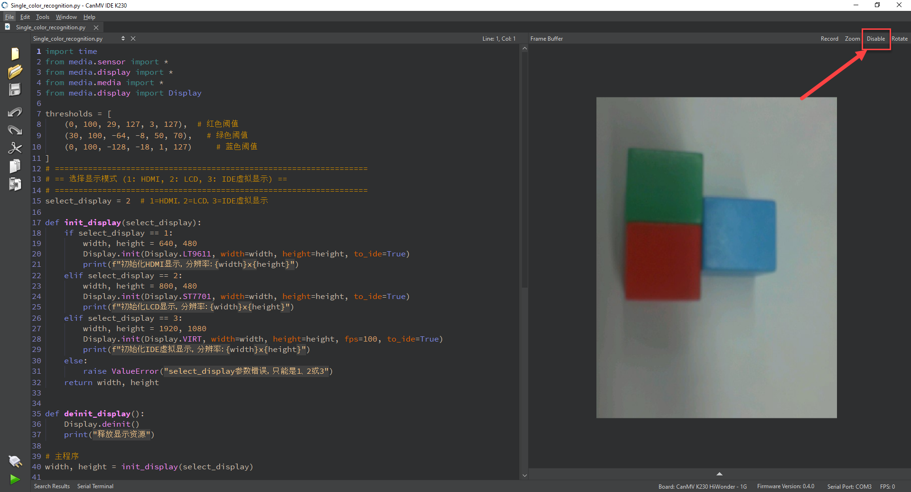

(3) Color threshold adjustment.

1)  Click Tools in the upper-left corner, then select **Machine Vision** and open the **Threshold Editor**.

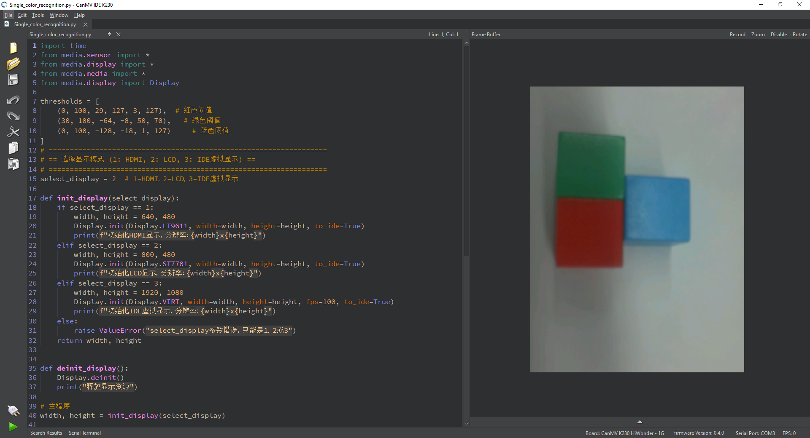

2. Select **Frame Buffer**.


3. Drag the sliders until only the target color is detected in the processed image. In the preview on the right, the areas containing the desired color should appear in white, and all other areas should appear in black.

> [!NOTE]
>
> **Black areas indicate colors that are not detected — the current LAB thresholds do not recognize those regions. White areas indicate colors that are detected — the current LAB thresholds can recognize those regions.**


(4) Modify color recognition threshold.

1)  Copy the adjusted LAB threshold values.
    


2)  Paste the adjusted LAB threshold values into the corresponding color threshold.


### 4.1.3 Program Execution and Download

**Display Mode Configuration:**

The program can use the `select_display=""` parameter to choose the display mode: HDMI, LCD, or IDE virtual.


The K230 program supports two operation modes: online execution and offline execution.

**Online Execution: [Color Threshold Configuration](#anther_4_1_2).**

**Offline Execution:**

1. After connection, drag the program **Color_recognition.py** from this section's directory to the CanMV IDE K230 code editing area. Click **Tools** on the toolbar, then select **Save open script to CanMV Board (as main.py)** as shown below:


2. Then click **Yes**.


3. Once the file is written, click **OK** to confirm and complete saving the MicroPython file to the K230 development board.


**With this method, the K230 development board will automatically run the MicroPython file upon power-up without connection, enabling offline execution.**

### 4.1.4 Program Outcome

You can see a real-time video feed on the display. Whenever a red object enters the camera's field of view, it is immediately detected and locked onto with a white crosshair.

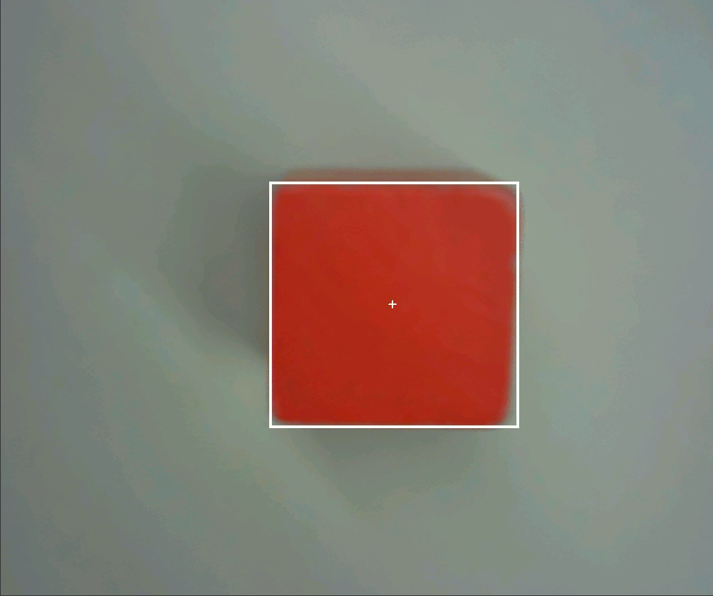

### 4.1.5 Program Analysis

* **Import Required Libraries**

```
import time
from media.sensor import *
from media.display import *
from media.media import *
from media.display import Display
```

* **Thresholds (thresholds)**

```
thresholds = [
    (0, 100, 29, 127, 3, 127),  # Red threshold
    (30, 100, -64, -8, 50, 70),   # Green threshold
    (0, 100, -128, -18, 1, 127)     # Blue threshold
]
# ==================================================================
# == Select display mode (1: HDMI, 2: LCD, 3: IDE Virtual Display) ==
# ==================================================================
select_display = 1  # 1=HDMI, 2=LCD, 3=IDE Virtual Display
```

1)  `thresholds`: This is a list containing threshold definitions for two colors in the format `(L Min, L Max, A Min, A Max, B Min, B Max)`, defined in the LAB color space.
    
2)  `thresholds[0]:(30, 100, 15, 127, -128, 127)` is the threshold for red.
    
3)  `thresholds[1]: (30, 100, -64, -8, 50, 70)` is the threshold for green.
    
4)  `thresholds[2]: (0, 100, -128, -18, 1, 127)` is the threshold for blue.

* **Main Loop**

```
try:
    while True:
        clock.tick()
        img = sensor.snapshot()

        blobs = img.find_blobs([thresholds[0]])

        if blobs:
            for b in blobs:
                img.draw_rectangle(b[0:4], thickness=4)
                img.draw_cross(b[5], b[6], thickness=2)

        img.draw_string_advanced(0, 0, 30, 'FPS: {:.3f}'.format(clock.fps()), color=(255, 255, 255))
        Display.show_image(img)

        print(clock.fps())
```

1)  `img = sensor.snapshot()` captures one frame.
    
2)  `find_blobs()` returns a collection of detected red regions, with each element containing rectangle position, center point, area, and other information.

* **Draw Detection Results**

```
    if blobs:
        for b in blobs:
            img.draw_rectangle(b[0:4], thickness=4)
            img.draw_cross(b[5], b[6], thickness=2)

    img.draw_string_advanced(0, 0, 30, 'FPS: {:.3f}'.format(clock.fps()), color=(255, 255, 255))
    Display.show_image(img)

    print(clock.fps())
```

1)  Display FPS in real-time at the top left corner of the screen.

2)  `Display.show_image(img)` displays the image to the screen or virtual window.

3)  `print(clock.fps())` outputs FPS to the terminal.

## 4.2 Multiple Color Recognition

### 4.2.1 Experiment Overview

This section demonstrates how to use the K230 board to recognize multiple colors.

### 4.2.2 Preparation

* **Module Connection**

1)  Connect the K230 development board to your PC using a Type-C data cable, as shown in the figure below:
    


2)  Double-click to open CanMV IDE K230.


3)  Click the connection button in the lower left corner.


4)  When connected successfully, the lower left corner of the CanMV IDE software will display the icon shown below.


5)  If the connection takes more than 10 seconds, it indicates a connection failure. Click the **Cancel** button, and a pop-up window will appear. Click **OK** and recheck the connection.


> [!NOTE]
>
> **Connection Failure Causes and Solutions:**
>
> * **Cable is not a data cable: Some Type-C cables are charging-only cables without data transfer capability. Please use a Type-C cable with data transfer functionality. The factory-supplied cable is a Type-C data cable.**
>
> * **Other K230 firmware was flashed: Re-flash the factory firmware, then reconnect.**

<p id ="anther_4_2_2"></p>

* **Color Threshold Configuration**

(1) Connect to the K230 board for online execution.

**Online Execution:**

After connection, drag the program **Multiple color recognition.py** into CanMV IDE K230 code editing area, then click the run button  in the lower left corner to run the program online, as shown below:

> [!NOTE]
>
> **Programs run this way will be lost after disconnection or power-off and are not saved to the development board.**


(2) Disable frame buffer.

Place the target color block in front of the camera, then click the button **Disable** in the upper right corner to capture the image.


(3) Color threshold adjustment.

1)  Click Tools in the upper-left corner, then select **Machine Vision** and open the **Threshold Editor**.
    
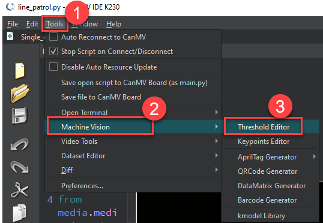

2)  Select **Frame Buffer**.

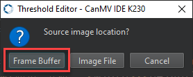

3)  Drag the sliders until only the target color is detected in the processed image. In the preview on the right, the areas containing the desired color should appear in white, and all other areas should appear in black.

> [!NOTE]
>
> **Black areas indicate colors that are not detected — the current LAB thresholds do not recognize those regions. White areas indicate colors that are detected — the current LAB thresholds can recognize those regions.**

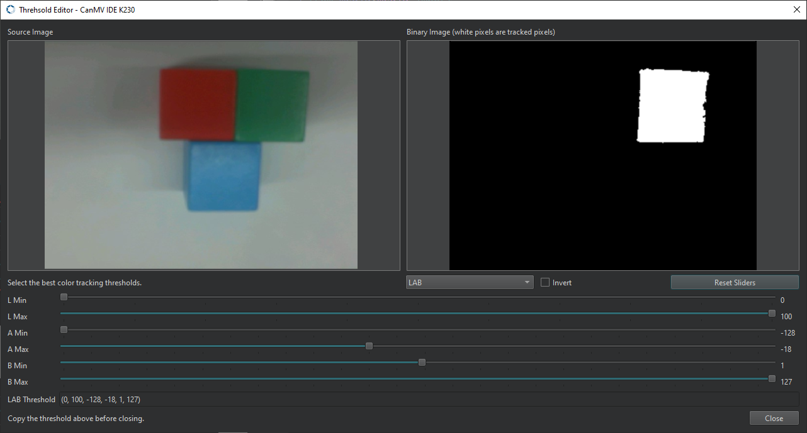

(4) Modify color recognition threshold.

1)  Copy the adjusted LAB threshold values.
    
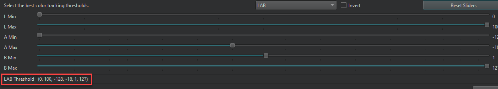

2)  Paste the adjusted LAB threshold values into the corresponding color threshold.

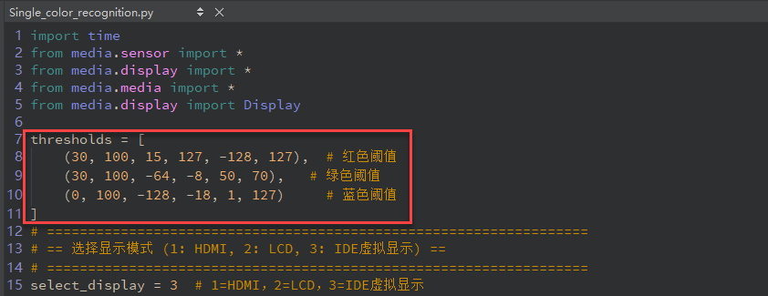

### 4.2.3 Program Execution and Download

The program can use the `select_display=""` parameter to choose the display mode: HDMI, LCD, or IDE virtual.


The K230 program supports two operation modes: online execution and offline execution.

**Online Execution: Refer to [Color Threshold Configuration](#anther_4_2_2).**

**Offline Execution:**

1. After connection, drag the program **Color_recognition.py** to the CanMV IDE K230 code editing area. Click **Tools** on the toolbar, then select **Save open script to CanMV Board (as main.py)** as shown below:
   


2. Then click **Yes**.


3. Once the file is written, click **OK** to confirm and complete saving the MicroPython file to the K230 development board.
   


**With this method, the K230 development board will automatically run the MicroPython file upon power-up without connection, enabling offline execution.**

### 4.2.4 Program Outcome

A real-time video feed is displayed, and any object in red, green, or blue entering the field of view will be detected.

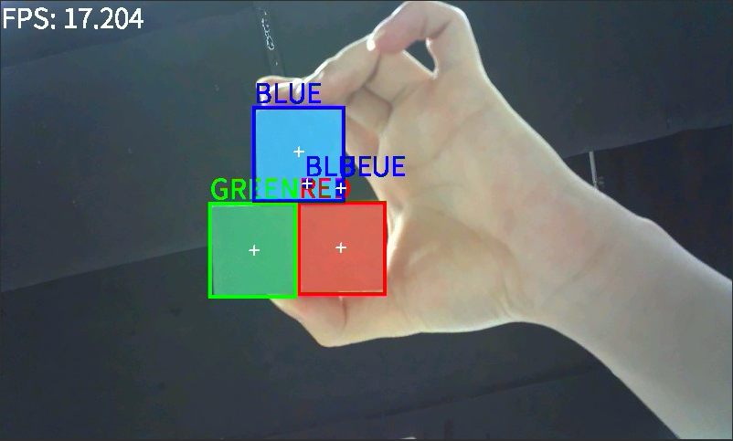

### 4.2.5 Program Analysis

* **Import Required Libraries**

```
import time
from media.sensor import *
from media.display import *
from media.media import *
```

* **Color Thresholds**

```
# Color recognition thresholds (LAB model)
thresholds = [
    (55, 62, 42, 55, 28, 42),   # Red threshold
    (65, 72, -51, -38, 31, 14),    # Green threshold
    (65, 74, -8, -34, -46, -20)      # Blue threshold
]

colors1 = [(255, 0, 0), (0, 255, 0), (0, 0, 255)]
colors2 = ['RED', 'GREEN', 'BLUE']
```

1)  `thresholds`: This is a list containing threshold definitions for three colors in the format (L Min, L Max, A Min, A Max, B Min, B Max), defined in the LAB color space.
    
2)  `thresholds[0]: (17, 25, 10, 127, 7, 17)` is the threshold for red.
    
3)  `thresholds[1]: (0, 100, -128, -15, -128, 127)` is the threshold for green.
    
4)  `thresholds[2]: (0, 100, -128, -2, -128, -7)` is the threshold for blue.
    
5)  `colors1` and `colors2` define the color values for screen display.

* **Main Loop for Image Acquisition and Color Detection**

```
    try:
        while True:
            clock.tick()
            img = sensor.snapshot()

            for i in range(3):
                blobs = img.find_blobs([thresholds[i]])
                if blobs:
                    for b in blobs:
                        img.draw_rectangle(b[0:4], thickness=4, color=colors1[i])
                        img.draw_cross(b[5], b[6], thickness=2)
                        img.draw_string_advanced(b[0], b[1]-35, 30, colors2[i], color=colors1[i])

            img.draw_string_advanced(0, 0, 30, 'FPS: {:.3f}'.format(clock.fps()), color=(255, 255, 255))
            Display.show_image(img)
            print(clock.fps())

    except KeyboardInterrupt:
        print("User interrupted program")  # User interrupted program
```

1)  `img = sensor.snapshot()` captures one frame of data.
    
2)  `blobs = img.find_blobs([thresholds[i]])` iterates through the three colors: red, green, and blue.
    
3)  `img.draw_rectangle()`, `img.draw_cross()`, and `img.draw_string_advanced()` draw the corresponding annotations.
    
4)  `img.draw_string_advanced(0, 0, 30, 'FPS: {:.3f}'.format(clock.fps()), color=(255, 255, 255))` displays the frame rate.

* **Exit and Release**

```
    except KeyboardInterrupt:
        print("User interrupted program")  # User interrupted program

    finally:
        deinit_display()
```

To prevent resource leaks and ensure the display device can be opened properly next time.


## 4.3 Object Counting

### 4.3.1 Experiment Overview

This section demonstrates how to use a program on the K230 to count yellow jumper caps by threshold.

### 4.3.2 Preparation

* **Module Connection**

1)  Connect the K230 development board to your PC using a Type-C data cable, as shown in the figure below:
    


2)  Double-click to open CanMV IDE K230.


3)  Click the connection button in the lower left corner.


4)  When connected successfully, the lower left corner of the CanMV IDE software will display the icon shown below.


5)  If the connection takes more than 10 seconds, it indicates a connection failure. Click the **Cancel** button, and a pop-up window will appear. Click **OK** and recheck the connection.


> [!NOTE]
>
> **Connection Failure Causes and Solutions:**
>
> * **Cable is not a data cable: Some Type-C cables are charging-only cables without data transfer capability. Please use a Type-C cable with data transfer functionality. The factory-supplied cable is a Type-C data cable.**
>
> * **Other K230 firmware was flashed: Re-flash the factory firmware, then reconnect.**
>

### 4.3.3 Program Execution and Download

**Display Mode Configuration:**

The program can use the `select_display=""` parameter to choose the display mode: HDMI, LCD, or IDE virtual.


The K230 program supports two operation modes: online execution and offline execution.

**Online Execution:**

After connection, drag the program **Lvgl.py** into CanMV IDE K230 code editing area, then click the run button  in the lower left corner to run the program online, as shown below:

> [!NOTE]
>
> **Programs run this way will be lost after disconnection or power-off and are not saved to the development board.**


**Offline Execution:**

1. After connection, drag the program **Lvgl.py** from this section's directory to the CanMV IDE K230 code editing area. Click **Tools** on the toolbar, then select **Save open script to CanMV Board (as main.py)** as shown below:


2. Then click **Yes**.


3. Once the file is written, click **OK** to confirm and complete saving the MicroPython file to the K230 development board.


**With this method, the K230 development board will automatically run the MicroPython file upon power-up without connection, enabling offline execution.**

### 4.3.4 Program Outcome

Run the program to enable threshold-based counting of yellow jumper caps on the K230 board.

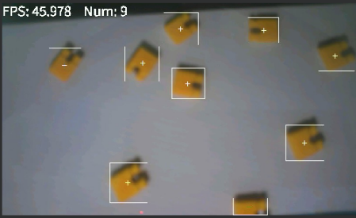

### 4.3.5 Program Analysis

* **Import Required Libraries**

```
import time
from media.sensor import *
from media.display import *
from media.media import *
```

* **Define Color Threshold for Object Detection**

```
# Color threshold for yellow jumper caps
thresholds = [(18, 72, -13, 31, 18, 83)]
```

* **Display Initialization**

```
select_display = 2  # 1=HDMI, 2=LCD, 3=IDE Virtual Display
```

Where 1 is HDMI display output, 2 is LCD screen display output, and 3 is IDE virtual display output.

* **Camera Initialization**

```
    # Initialize display and get width and height
    width, height = init_display(select_display)

    sensor = Sensor()
    sensor.reset()
    sensor.set_framesize(width=width, height=height)
    sensor.set_pixformat(Sensor.RGB565)
```

1)  Set the camera resolution to match the display resolution.
    
2)  Use RGB565 format.
    

* **Main Loop: Image Capture and Detection**

```
    try:
        while True:
            clock.tick()

            img = sensor.snapshot()
            blobs = img.find_blobs([thresholds[0]])

            if blobs:
                for b in blobs:
                    img.draw_rectangle(b[0:4])
                    img.draw_cross(b[5], b[6])

            # Display FPS and count
            img.draw_string_advanced(0, 0, 30, f'FPS: {clock.fps():.3f}    Num: {len(blobs)}', color=(255, 255, 255))

            Display.show_image(img)

            print(clock.fps())
```

1)  `img = sensor.snapshot()` captures one frame of image.
    
2)  `blobs = img.find_blobs([thresholds[0]])` searches the image for color blocks that match the yellow threshold and returns them as a list.

* **Draw Detection Results**

```
            # Display FPS and count
            img.draw_string_advanced(0, 0, 30, f'FPS: {clock.fps():.3f}    Num: {len(blobs)}', color=(255, 255, 255))

            Display.show_image(img)

            print(clock.fps())
```

1)  FPS: Real-time processing frame rate.
    
2)  Num: Number of detected yellow objects, which is the result of `len(blobs)`.
    
3)  Send the annotated image to the LCD display.

## 4.4 Visual Line Following

### 4.4.1 Experiment Overview

This section uses a program to demonstrate how to implement visual line following with the K230.

### 4.4.2 Preparation

* **Module Connection**

1)  Connect the K230 development board to your PC using a Type-C data cable, as shown in the figure below:
    


2)  Double-click to open CanMV IDE K230.


3)  Click the connection button in the lower left corner.


4)  When connected successfully, the lower left corner of the CanMV IDE software will display the icon shown below.
    


5)  If the connection takes more than 10 seconds, it indicates a connection failure. Click the **Cancel** button, and a pop-up window will appear. Click **OK** and recheck the connection.

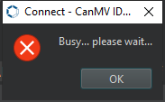

> [!NOTE]
>
> **Connection Failure Causes and Solutions:**
>
> * **Cable is not a data cable: Some Type-C cables are charging-only cables without data transfer capability. Please use a Type-C cable with data transfer functionality. The factory-supplied cable is a Type-C data cable.**
>
> * **Other K230 firmware was flashed: Re-flash the factory firmware, then reconnect.**

### 4.4.3 Color Threshold Configuration

* **Connect to the K230 board for online execution.**

**Online Execution:**

After connection, drag the program **line_patrol.py** from this section's directory to CanMV IDE K230 code editing area, then click the run button  in the lower left corner to run the program online, as shown below:

> [!NOTE]
>
> **Programs run this way will be lost after disconnection or power-off and are not saved to the development board.**

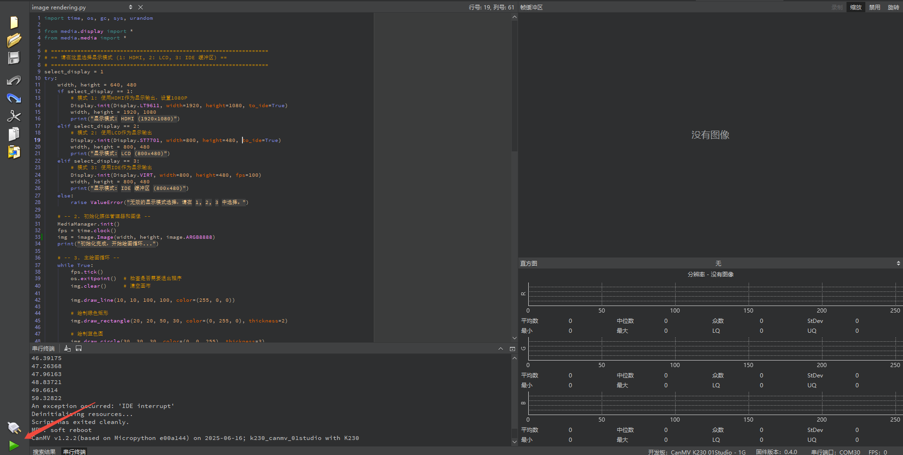

* **Disable Frame Buffer**

Place the target color block in front of the camera, then click the button **Disable** in the upper right corner to capture the image.

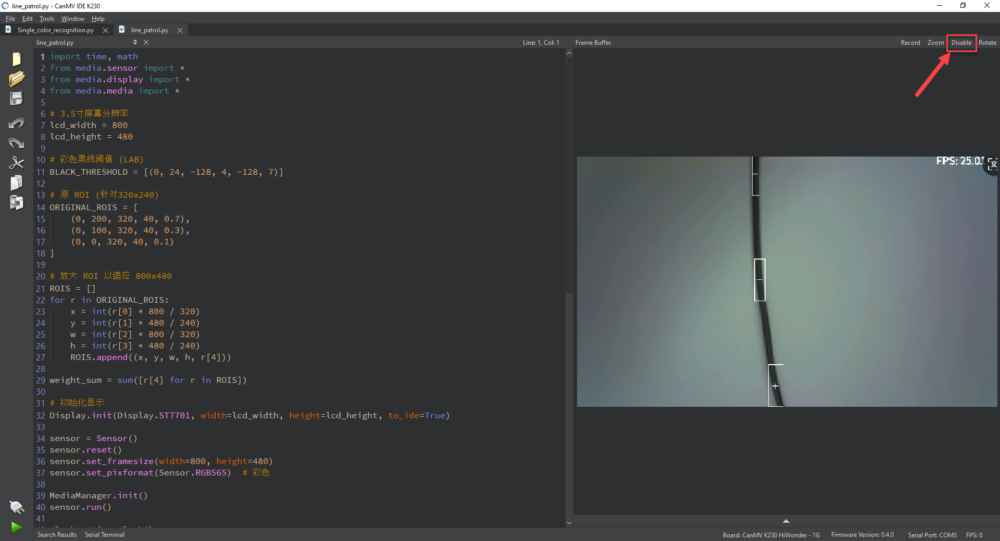

* **Color Threshold Adjustment**

1)  Click Tools in the upper-left corner, then select **Machine Vision** and open the **Threshold Editor**.


2)  Select **Frame Buffer**.


3)  Drag the sliders until only the target color is detected in the processed image. In the preview on the right, the areas containing the desired color should appear in white, and all other areas should appear in black.
    

> [!NOTE]
>
> **Black areas indicate colors that are not detected — the current LAB thresholds do not recognize those regions. White areas indicate colors that are detected — the current LAB thresholds can recognize those regions.**

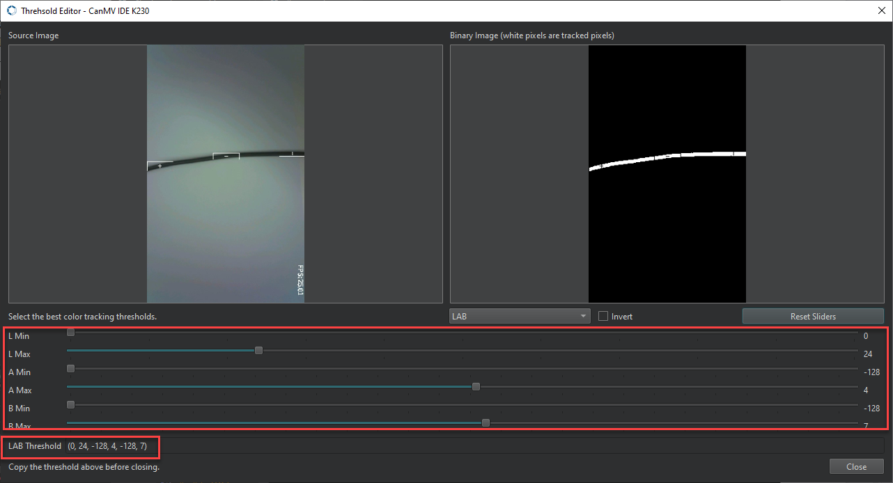

* **Modify Color Recognition Threshold**

1)  Copy the adjusted LAB threshold values.


2)  Paste the adjusted LAB threshold values into the corresponding color threshold.

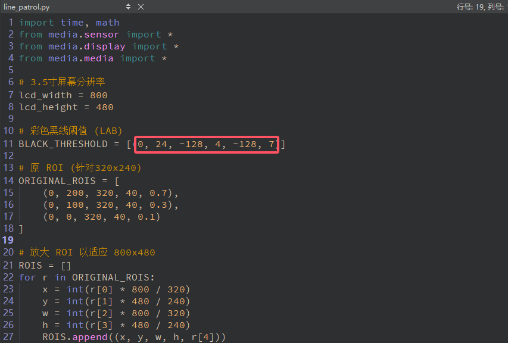

### 4.4.4 Program Execution and Download

The K230 program supports two operation modes: online execution and offline execution.

**Online Execution:**

After connection, drag the program **line_patrol.py** from this section's directory to CanMV IDE K230 code editing area, then click the run button  in the lower left corner to run the program online, as shown below:

> [!NOTE]
>
> **Programs run this way will be lost after disconnection or power-off and are not saved to the development board.**


**Offline Execution:**

1. After connection, drag the program **line_patrol.py** from this section's directory to the CanMV IDE K230 code editing area. Click **Tools** on the toolbar, then select **Save open script to CanMV Board (as main.py)** as shown below:


2. Then click **Yes**.


3. Once the file is written, click **OK** to confirm and complete saving the MicroPython file to the K230 development board.


**With this method, the K230 development board will automatically run the MicroPython file upon power-up without connection, enabling offline execution.**

### 4.4.5 Program Outcome

Run the program to implement visual line following with the K230.

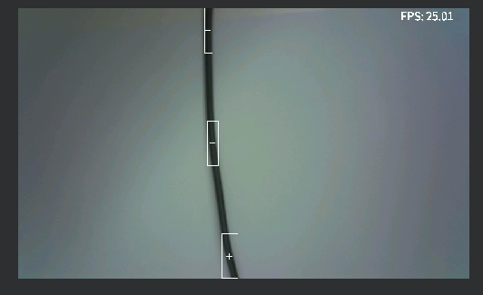

### 4.4.6 Program Analysis

* **Import Required Libraries**

```
import time, math
from media.sensor import *
from media.display import *
from media.media import *
```

* **Initialize Parameters**

```
# 3.5-inch screen resolution
lcd_width = 800
lcd_height = 480

# Color black line threshold (LAB)
BLACK_THRESHOLD = [(0, 24, -128, 4, -128, 7)]
```

1)  `lcd_width = 800, lcd_height = 480` initializes the screen resolution.
    
2)  `BLACK_THRESHOLD = [(0, 24, -128, 4, -128, 7)]` sets the line following threshold.

```
# Original ROI for 320x240
ORIGINAL_ROIS = [
    (0, 200, 320, 40, 0.7),
    (0, 100, 320, 40, 0.3),
    (0, 0, 320, 40, 0.1)
]

# Scale ROI to fit 800x480
ROIS = []
for r in ORIGINAL_ROIS:
    x = int(r[0] * 800 / 320)
    y = int(r[1] * 480 / 240)
    w = int(r[2] * 800 / 320)
    h = int(r[3] * 480 / 240)
    ROIS.append((x, y, w, h, r[4]))

weight_sum = sum([r[4] for r in ROIS])
```

3)  `ORIGINAL_ROIS = []` initializes ROI and sets line following weights.

* **Camera and Display Initialization**

```
# Initialize display
Display.init(Display.ST7701, width=lcd_width, height=lcd_height, to_ide=True)

sensor = Sensor()
sensor.reset()
sensor.set_framesize(width=800, height=480)
sensor.set_pixformat(Sensor.RGB565)  # Color mode

MediaManager.init()
sensor.run()

clock = time.clock()
fps_list = []  # For smoothing FPS
```

1)  `Display.init()` initializes the LCD display screen.
    
2)  `sensor = Sensor()` creates a sensor object.
    
3)  `sensor.reset()` resets the sensor.
    
4)  `sensor.set_framesize(width=800, height=480)` sets the resolution to 800x480.
    
5)  `sensor.set_pixformat(Sensor.RGB565)` sets to color mode.
    
6)  `MediaManager.init()` initializes the multimedia manager.
    
7)  `sensor.run()` starts camera capture.
    
8)  `clock = time.clock()` creates a clock object for FPS calculation.

* **Main Loop Process**

```
while True:
    clock.tick()
    img = sensor.snapshot()

    centroid_sum = 0
    for r in ROIS:
        blobs = img.find_blobs(BLACK_THRESHOLD, roi=r[0:4], merge=True)
        if blobs:
            # Get the blob with maximum area
            largest_blob = max(blobs, key=lambda b: b.pixels())
            # Draw rectangle and center point
            img.draw_rectangle(largest_blob[0:4])
            img.draw_cross(largest_blob[5], largest_blob[6])
            centroid_sum += largest_blob.cx() * r[4]

    # Calculate smoothed FPS
    fps = max(clock.fps(), 0)
    fps_list.append(fps)
    if len(fps_list) > 10:
        fps_list.pop(0)
    avg_fps = sum(fps_list) / len(fps_list)

    # Display FPS in upper right corner
    fps_text = 'FPS: %.2f' % avg_fps
    text_width = len(fps_text) * 12  # Estimate text width, 12 is approximate font size
    img.draw_string_advanced(lcd_width - text_width - 2, 2, 20, fps_text, color=(255, 255, 255))

    # Center the display image
    x_offset = round((lcd_width - sensor.width()) / 2)
    y_offset = round((lcd_height - sensor.height()) / 2)
    Display.show_image(img, x=x_offset, y=y_offset)

    print("FPS: %.2f" % avg_fps)
```

1)  `clock.tick()` records the frame start time.
    
2)  `img = sensor.snapshot()` captures an image.
    
3)  `for r in ROIS`: Iterates through each ROI region.
    
4)  `blobs = img.find_blobs(BLACK_THRESHOLD, roi=r[0:4], merge=True)` searches for regions matching the threshold of black lines within each ROI.
    
5)  `if blobs`: If black regions are found.
    
6)  `largest_blob = max()` gets the blob with maximum area.
    
7)  `img.draw_rectangle()` draws the corresponding three rectangles.
    
8)  `img.draw_cross()` draws the center point of the rectangles.

## 4.5 QR Code Recognition

### 4.5.1 Experiment Overview

This section uses a program to demonstrate the QR code recognition feature of the K230 board.

A 2D barcode is a graphic that records data and symbolic information, consisting of specific geometric shapes arranged in a certain pattern on a plane with alternating black and white colors. It cleverly uses the concept of binary "0" and "1" bit streams, which form the logical foundation of computer systems, and employs several geometric shapes corresponding to binary values to represent textual or numeric information. This information is automatically processed by optical scanning devices or image input devices that read the barcode.

### 4.5.2 Preparation

* **Module Connection**

1)  Connect the K230 development board to your PC using a Type-C data cable, as shown in the figure below:
    


2)  Double-click to open CanMV IDE K230.


3)  Click the connection button in the lower left corner.


4)  When connected successfully, the lower left corner of the CanMV IDE software will display the icon shown below.


5)  If the connection takes more than 10 seconds, it indicates a connection failure. Click the **Cancel** button, and a pop-up window will appear. Click **OK** and recheck the connection.


> [!NOTE]
>
> **Connection Failure Causes and Solutions:**
>
> * **Cable is not a data cable: Some Type-C cables are charging-only cables without data transfer capability. Please use a Type-C cable with data transfer functionality. The factory-supplied cable is a Type-C data cable.**
>
> * **Other K230 firmware was flashed: Re-flash the factory firmware, then reconnect.**


### 4.5.3 Program Execution and Download

**Display Mode Configuration:**

The program can use the `select_display=""` parameter to choose the display mode: HDMI, LCD, or IDE virtual.


The K230 program supports two operation modes: online execution and offline execution.

**Online Execution:**

After connection, drag the program **qrcodes.py** to CanMV IDE K230 code editing area, then click the run button  in the lower left corner to run the program online, as shown below:

> [!NOTE]
>
> **Programs run this way will be lost after disconnection or power-off and are not saved to the development board.**

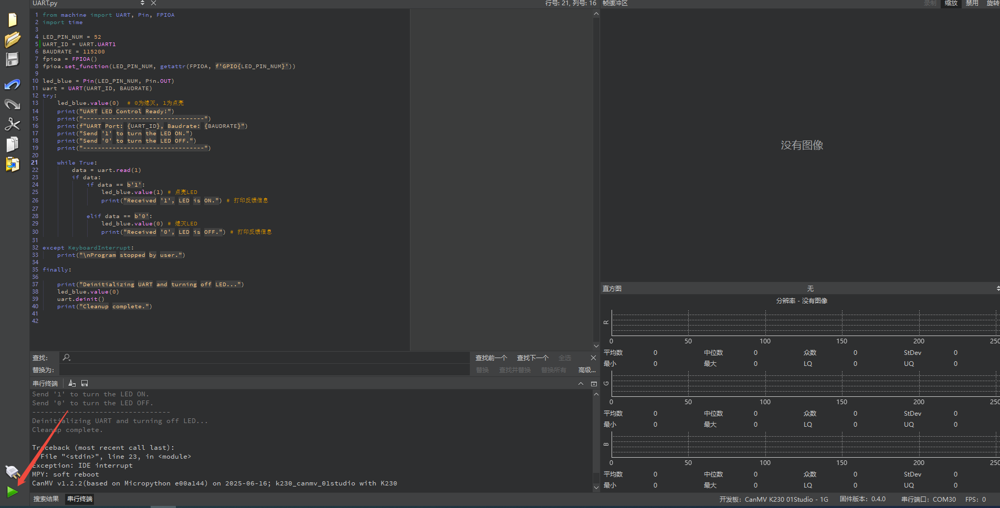

**Offline Execution:**

1. After connection, drag the program **qrcodes.py** from this section's directory to the CanMV IDE K230 code editing area. Click **Tools** on the toolbar, then select **Save open script to CanMV Board (as main.py)** as shown below:


2. Then click **Yes**.


3. Once the file is written, click **OK** to confirm and complete saving the MicroPython file to the K230 development board.


**With this method, the K230 development board will automatically run the MicroPython file upon power-up without connection, enabling offline execution.**

### 4.5.4 Program Outcome

Original image:

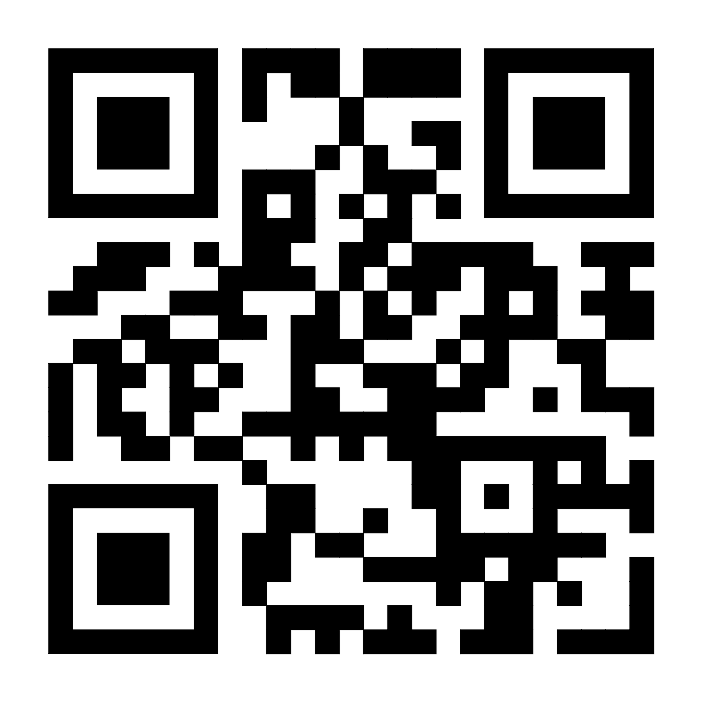

When the camera faces the QR code, upon successful recognition, a red box will appear around the image. The decoded text information will be displayed next to the QR code, and the QR code data will be printed in the serial terminal.

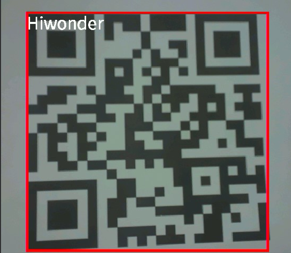

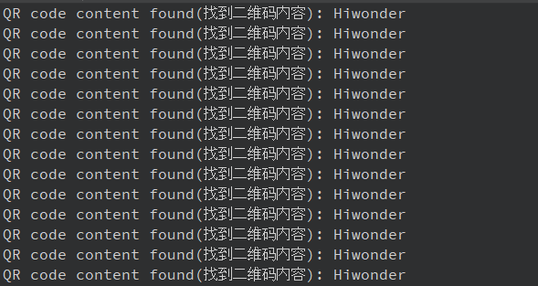

### 4.5.5 Program Analysis

* **Import Required Libraries**

```
import time
import os
import gc

from media.sensor import Sensor
from media.display import Display
from media.media import MediaManager
import image
```

* **Main Loop**

```
    while True:
        fps.tick()
        img = sensor.snapshot()

        # QR code detection
        for code in img.find_qrcodes():
            rect = code.rect()
            img.draw_rectangle(rect, color=(255, 0, 0), thickness=5)
            img.draw_string_advanced(rect[0], rect[1], 32, code.payload())
            print(f"Found QR code content: {code.payload()}")  # Found QR code content

        Display.show_image(img)

        gc.collect()

except KeyboardInterrupt:
    print("User stopped")  # User stopped
except Exception as e:
    print(f"Exception: {e}")  # Exception
finally:
    if isinstance(sensor, Sensor):
        sensor.stop()
    deinit_display()
    os.exitpoint(os.EXITPOINT_ENABLE_SLEEP)
    time.sleep_ms(100)
    MediaManager.deinit()
```

1)  `img = sensor.snapshot()` captures the current frame from the camera.
    
2)  `for code in img.find_qrcodes():` Calls the `find_qrcodes()` function from the image library to analyze the img image. This function returns a list containing all QR code objects found in the image.
    
3)  `rect = code.rect()` gets the position and size of this QR code in the image.
    
4)  `img.draw_rectangle()` draws a red thick box on the image at the rect position to mark the QR code.
    
5)  `img.draw_string_advanced()` decodes the QR code content (`code.payload()`) and draws this text on the image at the top-left corner of the recognized QR code box.
    
6)  `Display.show_image()` sends the processed image with box and text drawn to the previously initialized display window.

## 4.6 Barcode Recognition

### 4.6.1 Experiment Overview

This section uses a program to demonstrate the barcode recognition feature of the K230 board. A barcode is a visual pattern used to represent data, encoding information through stripes or patterns with varying widths and gaps.

### 4.6.2 Preparation

* **Module Connection**

1)  Connect the K230 development board to your PC using a Type-C data cable, as shown in the figure below:
    


2)  Double-click to open CanMV IDE K230.


3)  Click the connection button in the lower left corner.


4)  When connected successfully, the lower left corner of the CanMV IDE software will display the icon shown below.


5)  If the connection takes more than 10 seconds, it indicates a connection failure. Click the **Cancel** button, and a pop-up window will appear. Click **OK** and recheck the connection.


> [!NOTE]
>
> **Connection Failure Causes and Solutions:**
>
> * **Cable is not a data cable: Some Type-C cables are charging-only cables without data transfer capability. Please use a Type-C cable with data transfer functionality. The factory-supplied cable is a Type-C data cable.**
>
> * **Other K230 firmware was flashed: Re-flash the factory firmware, then reconnect.**

### 4.6.3 Program Execution and Download

**Display Effect Modification**

The program can use the `select_display=""` parameter to choose the display mode: HDMI, LCD, or IDE virtual.

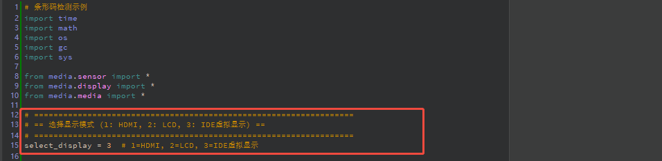

The K230 program supports two operation modes: online execution and offline execution.

**Online Execution:**

After connection, drag the program **barcode.py** to CanMV IDE K230 code editing area, then click the run button  in the lower left corner to run the program online, as shown below:

> [!NOTE]
>
> **Programs run this way will be lost after disconnection or power-off and are not saved to the development board.**

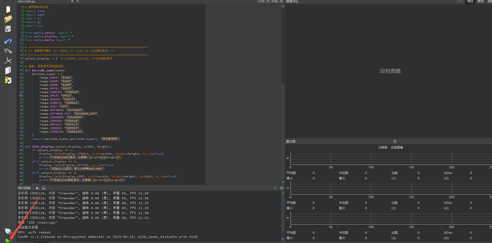

**Offline Execution:**

1. After connection, drag the program **barcode.py** from this section's directory to the CanMV IDE K230 code editing area. Click **Tools** on the toolbar, then select **Save open script to CanMV Board (as main.py)** as shown below:


2. Then click **Yes**.


3. Once the file is written, click **OK** to confirm and complete saving the MicroPython file to the K230 development board.


**With this method, the K230 development board will automatically run the MicroPython file upon power-up without connection, enabling offline execution.**

### 4.6.4 Program Outcome

Original image:

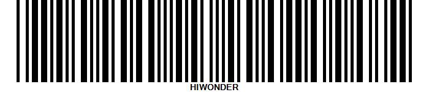

When the camera faces the barcode, upon successful recognition, a box will appear around the image, and the barcode information will be printed in the serial terminal.

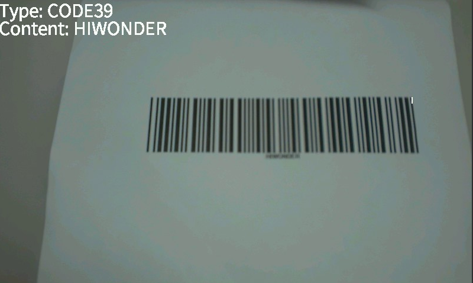


### 4.6.5 Program Analysis

* **Import Required Libraries**

```
import time, math, os, gc

from media.sensor import *
from media.display import *
from media.media import *
```

* **Define Recognizable Barcode Formats**

```
def barcode_name(code):
    if(code.type() == image.EAN2):
        return "EAN2"
    if(code.type() == image.EAN5):
        return "EAN5"
    if(code.type() == image.EAN8):
        return "EAN8"
    if(code.type() == image.UPCE):
        return "UPCE"
    if(code.type() == image.ISBN10):
        return "ISBN10"
    if(code.type() == image.UPCA):
        return "UPCA"
    if(code.type() == image.EAN13):
        return "EAN13"
    if(code.type() == image.ISBN13):
        return "ISBN13"
    if(code.type() == image.I25):
        return "I25"
    if(code.type() == image.DATABAR):
        return "DATABAR"
    if(code.type() == image.DATABAR_EXP):
        return "DATABAR_EXP"
    if(code.type() == image.CODABAR):
        return "CODABAR"
    if(code.type() == image.CODE39):
        return "CODE39"
    if(code.type() == image.PDF417):
        return "PDF417"
    if(code.type() == image.CODE93):
        return "CODE93"
    if(code.type() == image.CODE128):
        return "CODE128"
```

* **Image Acquisition**

```
# Create camera object
sensor = Sensor()
sensor.reset() # Reset and initialize camera

# Define camera resolution
CAM_WIDTH = 800
CAM_HEIGHT = 480

# Set frame size to camera resolution, default channel 0
sensor.set_framesize(width=CAM_WIDTH, height=CAM_HEIGHT)
# Set output image format to RGB565, default channel 0
sensor.set_pixformat(Sensor.RGB565)

init_display(select_display, CAM_WIDTH, CAM_HEIGHT)

MediaManager.init()

# Start camera
sensor.run()

# Create clock object for frame rate calculation
clock = time.clock()
```

1)  `sensor.reset()` resets the camera.
    
2)  `fps_clock = time.clock()` creates a clock object for frame rate calculation.

* **Main Loop**

```
try:
    # Main loop
    while True:
        clock.tick() # Update clock for frame rate calculation

        img = sensor.snapshot() # Capture an image

        codes = img.find_barcodes() # Find all barcodes in the image

        # Iterate through all found barcodes
        for code in codes:
            # Draw rectangle to mark barcode, default color white, line width 2 pixels
            img.draw_rectangle(code.rect(), thickness=2)

            # Print barcode information to console, using Chinese description and f-string formatting
            # rotation() returns radians, convert to degrees
            # Print barcode-related information to the console using text descriptions and f-string formatting
            print(f"Barcode type: {barcode_name(code)}, Content: \"{code.payload()}\", Rotation angle: {(180 * code.rotation()) / math.pi:.2f} degrees, Quality: {code.quality()}")  
            # Barcode type, Content, Rotation angle, degrees, Quality

            img.draw_string_advanced(0, 0, 30, f"Type: {barcode_name(code)}", color = (255, 255, 255))  # Type
            img.draw_string_advanced(0, 30, 30, f"Content: {code.payload()}", color = (255, 255, 255))  # Content

        Display.show_image(img) # Display processed image on screen

        print(f"Frame rate: {clock.fps():.2f} FPS") # Print current frame rate to console
```

1)  Call `fps_clock.tick()` to update the clock for FPS calculation.
    
2)  `img = sensor.snapshot()` captures one frame of image.
    
3)  `Display.show_image(img)` displays the image to the screen.

* **Exception Handling and Program Exit**

```
except KeyboardInterrupt:
    print("Program interrupted, releasing resources...")  # Program interrupted, releasing resources
finally:
    deinit_display()
    sensor.stop() # Stop camera
    print("Resources released, program exited.")  # Resources released, program exited
```

## 4.7 Data Matrix Code Recognition

### 4.7.1 Experiment Overview

This section uses a program to demonstrate the DM code recognition feature of the K230 board. A Data Matrix code is a 2D barcode widely used for labeling and tracking small products. It consists of small black and white squares arranged in a rectangular or square grid.

### 4.7.2 Preparation

* **Module Connection**

1)  Connect the K230 development board to your PC using a Type-C data cable, as shown in the figure below:
    


2)  Double-click to open CanMV IDE K230.


3)  Click the connection button in the lower left corner.


4)  When connected successfully, the lower left corner of the CanMV IDE software will display the icon shown below.


5)  If the connection takes more than 10 seconds, it indicates a connection failure. Click the **Cancel** button, and a pop-up window will appear. Click **OK** and recheck the connection.


> [!NOTE]
>
> **Connection Failure Causes and Solutions:**
>
> * **Cable is not a data cable: Some Type-C cables are charging-only cables without data transfer capability. Please use a Type-C cable with data transfer functionality. The factory-supplied cable is a Type-C data cable.**
>
> * **Other K230 firmware was flashed: Re-flash the factory firmware, then reconnect.**

### 4.7.3 Program Execution and Download

**Display Mode Configuration:**

The program can use the `select_display=""` parameter to choose the display mode: HDMI, LCD, or IDE virtual.


The K230 program supports two operation modes: online execution and offline execution.

**Online Execution:**

After connection, drag the program **Data Matrix.py** to CanMV IDE K230 code editing area, then click the run button  in the lower left corner to run the program online, as shown below:

> [!NOTE]
>
> **Programs run this way will be lost after disconnection or power-off and are not saved to the development board.**


**Offline Execution:**

1. After connection, drag the program **Data Matrix.py** from this section's directory to the CanMV IDE K230 code editing area. Click **Tools** on the toolbar, then select **Save open script to CanMV Board (as main.py)** as shown below:


2. Then click **Yes**.


3. Once the file is written, click **OK** to confirm and complete saving the MicroPython file to the K230 development board.


**With this method, the K230 development board will automatically run the MicroPython file upon power-up without connection, enabling offline execution.**

### 4.7.4 Program Outcome

Original image:


A red box will be used to highlight the Data Matrix code on the video feed. The decoded data within the code will be displayed, including the following details: dimensions (rows x columns), decoded content, rotation angle, and the current program's frame rate (FPS).


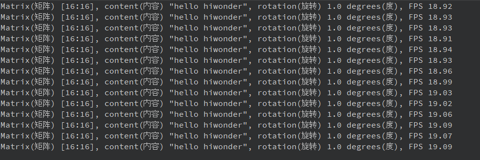

### 4.7.5 Program Analysis

* **Import Required Libraries**

```
import time
import math
import os
import gc
import sys

from media.sensor import *
from media.display import *
from media.media import *
```

* **Main Loop**

```
        # 4. Main loop: capture images and detect
        while True:
            fps_clock.tick()
            os.exitpoint() # Check if should exit

            # Capture a frame from the camera
            img = sensor.snapshot()

            # Find Data Matrix codes in the image
            for matrix in img.find_datamatrices():
                # Draw red rectangle to mark the recognized code
                img.draw_rectangle([v for v in matrix.rect()], color=(255, 0, 0))
                # Prepare and print recognition results
                print_args = (matrix.rows(), matrix.columns(), matrix.payload(), (180 * matrix.rotation()) / math.pi, fps_clock.fps())
                print("Matrix [%d:%d], Content \"%s\", Rotation %.1f (degrees), FPS %.2f" % print_args)  
                # Matrix, Content, Rotation, degrees

            # Display the image with detection results
            Display.show_image(img)
            gc.collect()

```

1)  `fps.tick()`: Timer for calculating frame rate.
    
2)  `img = sensor.snapshot()`: Core step, captures one frame from the camera.
    
3)  `img.find_datamatrices()` calls the `find_datamatrices()` function from the image library to specifically search for and decode Data Matrix codes in the image.
    
4)  `img.draw_rectangle()` draws a red box on the image to mark the recognized code.
    
5)  `Display.show_image()`: Displays the processed marked image.

## 4.8 AprilTags Recognition

### 4.8.1 Experiment Overview

This section uses a program to demonstrate the AprilTags code recognition feature of the K230 board. AprilTags are efficient binary recognition tags. The AprilTag detection software can calculate the precise 3D position, orientation, and identification of the tag relative to the camera.

### 4.8.2 Preparation

* **Module Connection**

1)  Connect the K230 development board to your PC using a Type-C data cable, as shown in the figure below:
    


2)  Double-click to open CanMV IDE K230.


3)  Click the connection button in the lower left corner.


4)  When connected successfully, the lower left corner of the CanMV IDE software will display the icon shown below.


5)  If the connection takes more than 10 seconds, it indicates a connection failure. Click the **Cancel** button, and a pop-up window will appear. Click **OK** and recheck the connection.


> [!NOTE]
>
> **Connection Failure Causes and Solutions:**
>
> * **Cable is not a data cable: Some Type-C cables are charging-only cables without data transfer capability. Please use a Type-C cable with data transfer functionality. The factory-supplied cable is a Type-C data cable.**
>
> * **Other K230 firmware was flashed: Re-flash the factory firmware, then reconnect.**

### 4.8.3 AprilTag Generation

In the CanMV IDE, generate an AprilTag by selecting **Tools** > **Machine Vision** > **AprilTag Generator** > **TAG36H11 Family**.

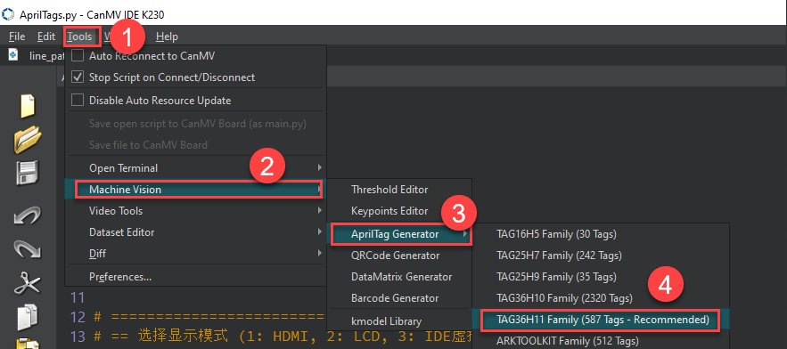

The minimum input is 0, and the maximum input is 9, creating 10 tags with IDs ranging from 0 to 9.

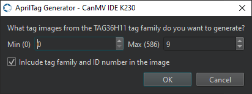

Click **OK**, then select the folder where the generated files are stored.


### 4.8.4 Program Execution and Download

**Display Mode Configuration:**

The program can use the `select_display=""` parameter to choose the display mode: HDMI, LCD, or IDE virtual.

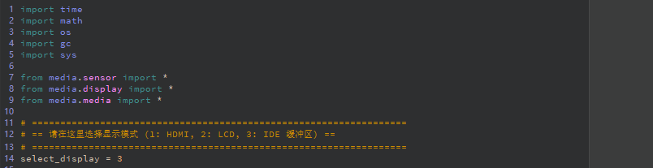

The K230 program supports two operation modes: online execution and offline execution.

**Online Execution:**

After connection, drag the program **AprilTags.py** from this section's directory to CanMV IDE K230 code editing area, then click the run button  in the lower left corner to run the program online, as shown below:

> [!NOTE]
>
> **Programs run this way will be lost after disconnection or power-off and are not saved to the development board.**


**Offline Execution:**

1. After connection, drag the program **AprilTags.py** from this section's directory to the CanMV IDE K230 code editing area. Click **Tools** on the toolbar, then select **Save open script to CanMV Board (as main.py)** as shown below:


2. Then click **Yes**.
   


3. Once the file is written, click **OK** to confirm and complete saving the MicroPython file to the K230 development board.
   


**With this method, the K230 development board will automatically run the MicroPython file upon power-up without connection, enabling offline execution.**

### 4.8.5 Program Outcome

Original image:


A red box will be used to highlight the four corners of the tag in the video feed. A green cross will be drawn at the center of the tag. The detailed information of the tag, including its tag family, ID number, and rotation angle, will be printed.

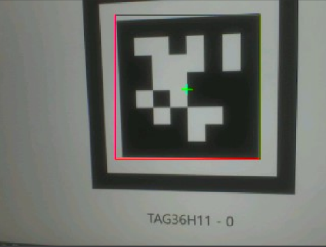

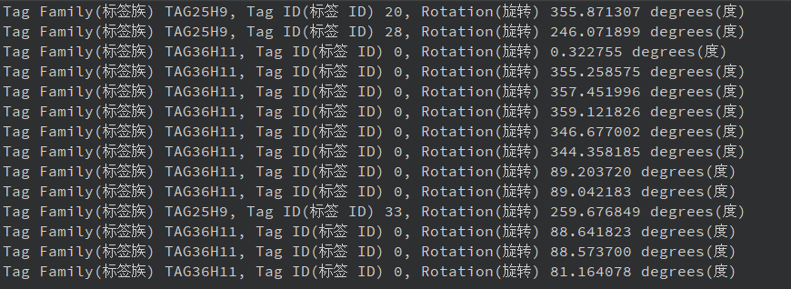

### 4.8.6 Program Analysis

* **Import Required Libraries**

```
import time
import math
import os
import gc
import sys

from media.sensor import *
from media.display import *
from media.media import *
import image
```

* **family_name Function**

```
# Function: Get tag family name
def family_name(tag):
    family_dict = {
        image.TAG16H5: "TAG16H5",
        image.TAG25H7: "TAG25H7",
        image.TAG25H9: "TAG25H9",
        image.TAG36H10: "TAG36H10",
        image.TAG36H11: "TAG36H11",
        image.ARTOOLKIT: "ARTOOLKIT",
    }
    return family_dict.get(tag.family(), "Unknown tag family")  # Unknown tag family

def main():
    sensor = None # Initialize sensor variable
```

The `find_apriltags()` function returns a tag object that has a `family()` method. This method converts the numeric constant into a human-readable string, for example, converting image.TAG36H11 to "TAG36H11".

* **Main Loop**

```
        while True:
            fps_clock.tick()
            os.exitpoint() # Check if should exit

            img = sensor.snapshot()
            for tag in img.find_apriltags(families=tag_families):
                img.draw_rectangle([v for v in tag.rect()], color=(255,0,0))
                img.draw_cross(tag.cx(), tag.cy(), color=(0,255,0))
                print_args = (family_name(tag), tag.id(), (180 * tag.rotation()) / math.pi)
                print("Tag family %s, Tag ID %d, Rotation %f (degrees)" % print_args)  # Tag family, Tag ID, Rotation, degrees

            Display.show_image(img)
            gc.collect()
```

1)  `img = sensor.snapshot()` captures one frame from the camera.
    
2)  `for tag in img.find_apriltags(families=tag_families)` calls the image library function with the previously defined tag_families to analyze the image and find all supported AprilTags.
    
3)  `img.draw_rectangle()` draws a red box on the image to mark the tag position.
    
4)  `img.draw_cross()` draws a green cross on the image to mark the tag center.
    
5)  `Display.show_image()` displays the processed (marked) image.

## 4.9 Line Segment Detection

### 4.9.1 Experiment Overview

This section uses a program to demonstrate the line segment detection feature of the K230 development board.

### 4.9.2 Preparation

* **Module Connection**

1)  Connect the K230 development board to your PC using a Type-C data cable, as shown in the figure below:
    


2)  Double-click to open CanMV IDE K230.


3)  Click the connection button in the lower left corner.


4)  When connected successfully, the lower left corner of the CanMV IDE software will display the icon shown below.


5)  If the connection takes more than 10 seconds, it indicates a connection failure. Click the **Cancel** button, and a pop-up window will appear. Click **OK** and recheck the connection.


> [!NOTE]
>
> **Connection Failure Causes and Solutions:**
>
> * **Cable is not a data cable: Some Type-C cables are charging-only cables without data transfer capability. Please use a Type-C cable with data transfer functionality. The factory-supplied cable is a Type-C data cable.**
>
> * **Other K230 firmware was flashed: Re-flash the factory firmware, then reconnect.**

### 4.9.3 Program Execution and Download

**Display Mode Configuration:**

The program can use the `select_display=""` parameter to choose the display mode: HDMI, LCD, or IDE virtual.


The K230 program supports two operation modes: online execution and offline execution.

**Online Execution:**

After connection, drag the program **Line_segment_detection.py** from this section's directory to CanMV IDE K230 code editing area, then click the run button  in the lower left corner to run the program online, as shown below:

> [!NOTE]
>
> **Programs run this way will be lost after disconnection or power-off and are not saved to the development board.**


**Offline Execution:**

1. After connection, drag the program **Line_segment_detection.py** from this section's directory to the CanMV IDE K230 code editing area. Click **Tools** on the toolbar, then select **Save open script to CanMV Board (as main.py)** as shown below:


2. Then click **Yes**.


3. Once the file is written, click **OK** to confirm and complete saving the MicroPython file to the K230 development board.


**With this method, the K230 development board will automatically run the MicroPython file upon power-up without connection, enabling offline execution.**

### 4.9.4 Program Outcome

A red line will be used to mark the outer boundaries of the detected object in the video feed. The data contained within the line segment will be printed, including the line segment's coordinates, length, and the current program's frame rate (FPS).

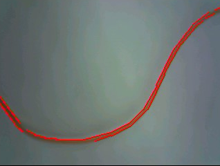

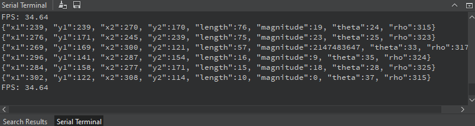

### 4.9.5 Program Analysis

* **Import Required Libraries**

```
import time
from media.sensor import *  # Import sensor module for camera-related interfaces
from media.display import *  # Import display module for display-related interfaces
from media.media import *  # Import media module for media-related interfaces
```

* **Main Loop**

```
        while True:
            clock.tick()
            img = sensor.snapshot()

            if enable_lens_corr:
                img.lens_corr(1.8)  # for 2.8mm lens...

            for l in img.find_line_segments(merge_distance=0, max_theta_diff=5):
                img.draw_line(l.line(), color=(255, 0, 0), thickness=2)
                print(l)

            x_offset = round((width - sensor.width()) / 2)
            y_offset = round((height - sensor.height()) / 2)
            Display.show_image(img, x=x_offset, y=y_offset)

            print(f"FPS: {clock.fps():.2f}")
```

1)  `clock.tick()`: Timer for calculating frame rate.
    
2)  `img = sensor.snapshot()`: Core step, captures one frame from the camera.
    
3)  Use `for l in img.find_line_segments()` and `img.draw_line()` to draw red line segments on the object surface.
    
4)  `print(l)` prints line information (including start point, end point, angle, etc.).
    
5)  `x_offset = round((width - sensor.width()) / 2)`; `y_offset = round((height - sensor.height()) / 2)` calculates the offset for centered display.
    
6)  `Display.show_image(img, x=x_offset, y=y_offset)` displays the image to the center of the screen.
    
7)  `print(f"FPS: {clock.fps():.2f}")` prints the current frame rate to two decimal places.

## 4.10 Rectangle Detection

### 4.10.1 Experiment Overview

This section uses a program to demonstrate the rectangle detection feature of the K230 development board.

### 4.10.2 Preparation

* **Module Connection**

1)  Connect the K230 development board to your PC using a Type-C data cable, as shown in the figure below:
    


2)  Double-click to open CanMV IDE K230.


3)  Click the connection button in the lower left corner.


4)  When connected successfully, the lower left corner of the CanMV IDE software will display the icon shown below.


5)  If the connection takes more than 10 seconds, it indicates a connection failure. Click the **Cancel** button, and a pop-up window will appear. Click **OK** and recheck the connection.


> [!NOTE]
>
> **Connection Failure Causes and Solutions:**
>
> * **Cable is not a data cable: Some Type-C cables are charging-only cables without data transfer capability. Please use a Type-C cable with data transfer functionality. The factory-supplied cable is a Type-C data cable.**
>
> * **Other K230 firmware was flashed: Re-flash the factory firmware, then reconnect.**

### 4.10.3 Program Execution and Download

**Display Mode Configuration:**

The program can use the `select_display=""` parameter to choose the display mode: HDMI, LCD, or IDE virtual.


The K230 program supports two operation modes: online execution and offline execution.

**Online Execution:**

After connection, drag the program **rectangular_detection.py** from this section's directory to CanMV IDE K230 code editing area, then click the run button  in the lower left corner to run the program online, as shown below:

> [!NOTE]
>
> **Programs run this way will be lost after disconnection or power-off and are not saved to the development board.**


**Offline Execution:**

1. After connection, drag the program **rectangular_detection.py** from this section's directory to the CanMV IDE K230 code editing area. Click **Tools** on the toolbar, then select **Save open script to CanMV Board (as main.py)** as shown below:


2. Then click **Yes**.
   


3. Once the file is written, click **OK** to confirm and complete saving the MicroPython file to the K230 development board.


**With this method, the K230 development board will automatically run the MicroPython file upon power-up without connection, enabling offline execution.**

### 4.10.4 Program Outcome

A red rectangle will be used to highlight the outer boundaries of the detected rectangular object in the video feed, and green circles will be drawn at the four corners of the rectangle. The data contained within the rectangle will be printed, including the rectangle's coordinates, dimensions, and the current program's frame rate (FPS).

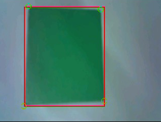

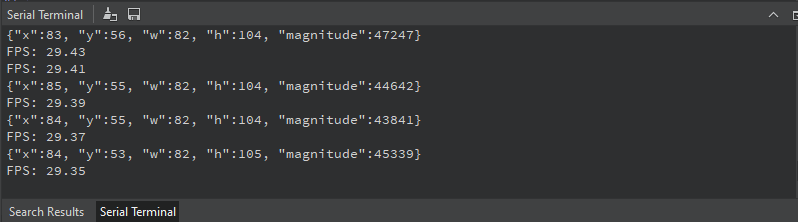

### 4.10.5 Program Analysis

* **Import Required Libraries**

```
import time
from media.sensor import *   # Import camera-related modules
from media.display import *  # Import display-related modules
from media.media import *    # Import media resource management modules
```

* **Main Loop**

```
    try:
        while True:
            clock.tick()
            img = sensor.snapshot()  # Capture one frame

            # Set threshold to filter noise, only detect rectangles with strong brightness
            for r in img.find_rects(threshold=10000):
                # Draw detected rectangle border, red color, line width 2
                img.draw_rectangle(r.rect(), color=(255, 0, 0), thickness=2)

                # Draw green circles at the four corners of the rectangle
                for p in r.corners():
                    img.draw_circle(p[0], p[1], 5, color=(0, 255, 0))

                print(r)  # Print rectangle information

            # Center the display image
            x_offset = round((lcd_width - sensor.width()) / 2)
            y_offset = round((lcd_height - sensor.height()) / 2)
            Display.show_image(img, x=x_offset, y=y_offset)

            print(f"FPS: {clock.fps():.2f}")  # Print frame rate
```

1)  `clock.tick()`: Timer for calculating frame rate.
    
2)  `img = sensor.snapshot()`: Core step, captures one frame from the camera.
    
3)  Use `for r in img.find_rects()` and `img.draw_rectangle()` to draw the detected rectangle borders.
    
4)  `img.draw_circle(p[0], p[1], 5, color=(0, 255, 0))` draws green circles at the four corners of the rectangle.
    
5)  `print(r)` prints rectangle information (including coordinates).
    
6)  `x_offset = round((width - sensor.width()) / 2)`; `y_offset = round((height - sensor.height()) / 2)` calculates the offset for centered display.
    
7)  `Display.show_image(img, x=x_offset, y=y_offset)` displays the image to the screen (centered).
    
8)  `print(f"FPS: {clock.fps():.2f}")` prints the current frame rate to two decimal places.

## 4.11 Circle Detection

### 4.11.1 Experiment Overview

This section uses a program to demonstrate the circle detection feature of the K230 development board.

### 4.11.2 Preparation

* **Module Connection**

1)  Connect the K230 development board to your PC using a Type-C data cable, as shown in the figure below:
    


2)  Double-click to open CanMV IDE K230.


3)  Click the connection button in the lower left corner.


4)  When connected successfully, the lower left corner of the CanMV IDE software will display the icon shown below.


5)  If the connection takes more than 10 seconds, it indicates a connection failure. Click the **Cancel** button, and a pop-up window will appear. Click **OK** and recheck the connection.


> [!NOTE]
>
> **Connection Failure Causes and Solutions:**
>
> * **Cable is not a data cable: Some Type-C cables are charging-only cables without data transfer capability. Please use a Type-C cable with data transfer functionality. The factory-supplied cable is a Type-C data cable.**
>
> * **Other K230 firmware was flashed: Re-flash the factory firmware, then reconnect.**

### 4.11.3 Program Execution and Download

**Display Mode Configuration:**

The program can use the `select_display=""` parameter to choose the display mode: HDMI, LCD, or IDE virtual.


The K230 program supports two operation modes: online execution and offline execution.

**Online Execution:**

After connection, drag the program **circular_detection.py** from this section's directory to CanMV IDE K230 code editing area, then click the run button  in the lower left corner to run the program online, as shown below:

> [!NOTE]
>
> **Programs run this way will be lost after disconnection or power-off and are not saved to the development board.**

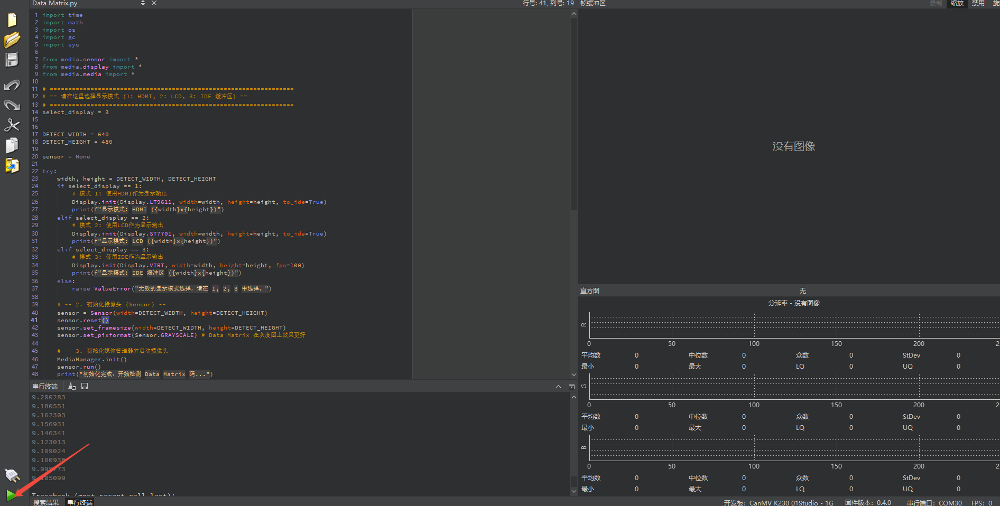

**Offline Execution:**

1. After connection, drag the program **circular_detection.py** from this section's directory to the CanMV IDE K230 code editing area. Click **Tools** on the toolbar, then select **Save open script to CanMV Board (as main.py)** as shown below:


2. Then click **Yes**.


3. Once the file is written, click **OK** to confirm and complete saving the MicroPython file to the K230 development board.
   


**With this method, the K230 development board will automatically run the MicroPython file upon power-up without connection, enabling offline execution.**

### 4.11.4 Program Outcome

A red circle will be used to highlight the outer boundaries of the detected circular object in the video feed, and green circles will be drawn at the four corners of the rectangle. The data contained within the circle will be printed, including the circle's coordinates, radius, and the current program's frame rate (FPS).

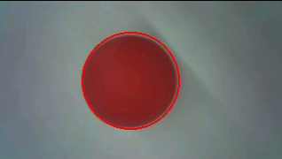


### 4.11.5 Program Analysis

* **Import Required Libraries**

```
import time
from media.sensor import *    # Import camera module
from media.display import *   # Import display module
from media.media import *     # Import media resource management module

select_display = 3  # 1=HDMI, 2=LCD, 3=IDE Virtual Display
```

* **Main Loop**

```
    try:
        while True:
            clock.tick()
            img = sensor.snapshot()  # Capture one frame

            # Circle parameter explanation:
            # c.x(), c.y(): Circle center coordinates
            # c.r(): Radius
            # magnitude: The larger the number, the more reliable the detection
            # threshold controls detection quantity, larger value means stricter detection
            # x_margin, y_margin, r_margin control parameters for merging detected circles

            for c in img.find_circles(threshold=2000, x_margin=10, y_margin=10,
                                      r_margin=10, r_min=2, r_max=100, r_step=2):
                img.draw_circle(c.x(), c.y(), c.r(), color=(255, 0, 0), thickness=2)  # Draw red circle indicator
                print(c)  # Print detected circle information

            # Center the display image
            x_offset = round((lcd_width - sensor.width()) / 2)
            y_offset = round((lcd_height - sensor.height()) / 2)
            Display.show_image(img, x=x_offset, y=y_offset)

            print(f"FPS: {clock.fps():.2f}")
```

1)  `clock.tick()`: Timer for calculating frame rate.
    
2)  `img = sensor.snapshot()`: Core step, captures one frame from the camera.
    
3)  `threshold=2000` circle detection threshold. The larger the value, the stricter the detection.
    
4)  `x_margin, y_margin, r_margin` controls the range for merging similar circles.
    
5)  `print(c)` prints circle information, including coordinates.
    
6)  `x_offset = round((width - sensor.width()) / 2)`; `y_offset = round((height - sensor.height()) / 2)` calculates the offset for centered display.
    
7)  `Display.show_image(img, x=x_offset, y=y_offset)` displays the image to the center of the screen.
    
8)  `print(f"FPS: {clock.fps():.2f}")` prints the current frame rate to two decimal places.

## 4.12 Feature Detection

### 4.12.1 Experiment Overview

This section uses a program to demonstrate the image processing and feature detection capabilities of the K230 development board.

### 4.12.2 Preparation

* **Module Connection**

1)  Connect the K230 development board to your PC using a Type-C data cable, as shown in the figure below:
    


2)  Double-click to open CanMV IDE K230.


3)  Click the connection button in the lower left corner.


4)  When connected successfully, the lower left corner of the CanMV IDE software will display the icon shown below.


5)  If the connection takes more than 10 seconds, it indicates a connection failure. Click the **Cancel** button, and a pop-up window will appear. Click **OK** and recheck the connection.


> [!NOTE]
>
> **Connection Failure Causes and Solutions:**
>
> * **Cable is not a data cable: Some Type-C cables are charging-only cables without data transfer capability. Please use a Type-C cable with data transfer functionality. The factory-supplied cable is a Type-C data cable.**
>
> * **Other K230 firmware was flashed: Re-flash the factory firmware, then reconnect.**

### 4.12.3 Program Execution and Download

**Display Mode Configuration:**

The program can use the `select_display=""` parameter to choose the display mode: HDMI, LCD, or IDE virtual.


The K230 program supports two operation modes: online execution and offline execution.

**Online Execution:**

After connection, drag the program **Eigenvalue_detection.py** from this section's directory to CanMV IDE K230 code editing area, then click the run button  in the lower left corner to run the program online, as shown below:

> [!NOTE]
>
> **Programs run this way will be lost after disconnection or power-off and are not saved to the development board.**


**Offline Execution:**

1)  After connection, drag the program **Eigenvalue_detection.py** from this section's directory to the CanMV IDE K230 code editing area. Click **Tools** on the toolbar, then select **Save open script to CanMV Board (as main.py)** as shown below:
    


2)  Then click **Yes**.


3)  Once the file is written, click **OK** to confirm and complete saving the MicroPython file to the K230 development board.


**With this method, the K230 development board will automatically run the MicroPython file upon power-up without connection, enabling offline execution.**

### 4.12.4 Program Outcome

When a clear straight line appears in the camera's field of view, such as the edge of a table, window frame, paper boundary, ruler, etc., the program will immediately overlay a bright red line on that straight line.

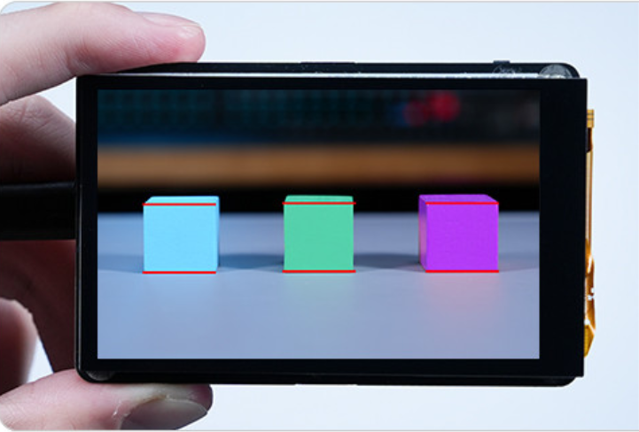

### 4.12.5 Program Analysis

* **Import Required Libraries**

```
import time, os, gc
from media.sensor import *
from media.display import *
from media.media import *
```

* **camera_init Function**

```
def camera_init():
    global sensor
    sensor = Sensor(width=DETECT_WIDTH, height=DETECT_HEIGHT)
    sensor.reset()
    # sensor.set_hmirror(False)
    # sensor.set_vflip(False)
    sensor.set_framesize(width=DETECT_WIDTH, height=DETECT_HEIGHT)
    sensor.set_pixformat(Sensor.RGB565)

    init_display(select_display)
    MediaManager.init()
    sensor.run()
```

1)  Camera setup: `sensor = Sensor()` creates a camera object and sets the working resolution to 640x480 and image format to RGB565.
    
2)  `ALIGN_UP(640, 16)`: Aligning data width can improve processor processing efficiency.
    
3)  Display setup `(init_display)`: Initializes the corresponding display device based on the value of the `select_display` variable at the beginning of the script.
    
4)  Startup: Calls `MediaManager.init()` and `sensor.run()` to initialize the underlying services and begins image capture with the camera.
    

* **capture_picture Loop**

```
def capture_picture():
    global sensor
    fps = time.clock()
    while True:
        fps.tick()
        try:
            os.exitpoint()
            img = sensor.snapshot()

            lines = img.find_lines(threshold=1000, theta_margin=25, rho_margin=25)
            for l in lines:
                if min_degree <= l.theta() <= max_degree:
                    img.draw_line(l.line(), color=(255, 0, 0),thickness=5)
                    print(l)

            Display.show_image(img)
            del img  # Explicitly release reference

            gc.collect()
            print("FPS:", fps.fps())

        except KeyboardInterrupt:
            print("User interrupted, exiting.")  # User interrupted, exiting
            break
        except Exception as e:
            print(f"Exception exit: {e}")  # Exception exit
            break
```

1)  `img = sensor.snapshot()`: Captures a real-time frame from the camera.
    
2)  `lines = img.find_lines(...)`: Executes **Hough Transform** on the captured `img` image, an algorithm used to detect straight lines in images.
    
3)  `threshold=1000`: Threshold parameter. For a set of pixels to be considered a **straight line**, its accumulated value in Hough space must exceed this threshold. Higher values result in more reliable detected lines.
    
4)  `theta_margin=25, rho_margin=25`: These two parameters are used to merge line segments with similar distance and angle, preventing the algorithm from outputting multiple very similar detection results for the same physical line.
    
5)  `img.draw_line(l.line(), color=(255, 0, 0))`: For each detected line, calls the `draw_line` function to draw it in red on the original image. `l.line()` returns the coordinates of the two endpoints of the line.
    
6)  `Display.show_image(img)`: Sends this frame with red marker lines drawn to the display device.

## 4.13 Edge Detection

### 4.13.1 Experiment Overview

This section uses a program to demonstrate the object edge detection feature of the K230 development board.

### 4.13.2 Preparation

* **Module Connection**

1. Connect the K230 development board to your PC using a Type-C data cable, as shown in the figure below:


2. Double-click to open CanMV IDE K230.


3. Click the connection button in the lower left corner.


4. When connected successfully, the lower left corner of the CanMV IDE software will display the icon shown below.


5)  If the connection takes more than 10 seconds, it indicates a connection failure. Click the **Cancel** button, and a pop-up window will appear. Click **OK** and recheck the connection.


> [!NOTE]
>
> **Connection Failure Causes and Solutions:**
>
> * **Cable is not a data cable: Some Type-C cables are charging-only cables without data transfer capability. Please use a Type-C cable with data transfer functionality. The factory-supplied cable is a Type-C data cable.**
>
> * **Other K230 firmware was flashed: Re-flash the factory firmware, then reconnect.**

### 4.13.3 Program Execution and Download

The program can use the `select_display=""` parameter to choose the display mode: HDMI, LCD, or IDE virtual.


The K230 program supports two operation modes: online execution and offline execution.

**Online Execution:**

After connection, drag the program **edge_detection.py** from this section's directory to CanMV IDE K230 code editing area, then click the run button  in the lower left corner to run the program online, as shown below:

> [!NOTE]
>
> **Programs run this way will be lost after disconnection or power-off and are not saved to the development board.**


**Offline Execution:**

1. After connection, drag the program **edge_detection.py** from this section's directory to the CanMV IDE K230 code editing area. Click **Tools** on the toolbar, then select **Save open script to CanMV Board (as main.py)** as shown below:


2. Then click **Yes**.


3. Once the file is written, click **OK** to confirm and complete saving the MicroPython file to the K230 development board.


**With this method, the K230 development board will automatically run the MicroPython file upon power-up without connection, enabling offline execution.**

### 4.13.4 Program Outcome

When a clear object appears in the camera's field of view, the program will immediately draw a white line around the object's edges to outline it.

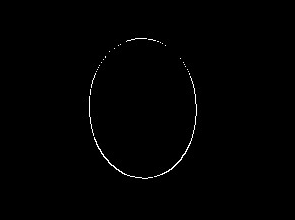

### 4.13.5 Program Analysis

* **Import Required Libraries**

```
import time, gc
from media.sensor import *
from media.display import *
from media.media import *
```

* **Release Resources**

```
def deinit_display():
    Display.deinit()
    print("Release display resources")  # Release display resources
```

At the end of the program, close the display module and release the video memory/hardware resources.

* **Image Capture**

```
    sensor = Sensor()
    sensor.reset()
    # Note: Camera capture resolution should not exceed display resolution, otherwise it will affect performance
    sensor.set_framesize(width=320, height=240)
    sensor.set_pixformat(Sensor.GRAYSCALE)

    MediaManager.init()
    sensor.run()

    clock = time.clock()
```

1)  Camera setup: `sensor = Sensor()` creates a camera object.
    
2)  `sensor.reset()` resets and initializes the camera.
    
3)  `sensor.set_framesize(width=320, height=240)` sets the capture resolution.
    
4)  `MediaManager.init()` initializes the media manager.
    
5)  `sensor.run()` starts camera capture.
    
6)  `clock = time.clock()` creates a clock object for calculating FPS.

* **Main Loop**

```
    try:
        while True:
            clock.tick()
            img = sensor.snapshot()

            # Use Canny edge detection
            img.find_edges(image.EDGE_CANNY, threshold=(50, 80))

            # Center the display
            x_offset = round((width - sensor.width()) / 2)
            y_offset = round((height - sensor.height()) / 2)

            Display.show_image(img, x=x_offset, y=y_offset)

            print(f"FPS: {clock.fps():.2f}")
```

1)  `clock.tick()` updates the clock.
    
2)  `img = sensor.snapshot()` captures one frame of image.
    
3)  `Display.show_image(img, x=x_offset, y=y_offset)` draws the image edges on the screen.
    
4)  `print(f"FPS: {clock.fps():.2f}")` displays the frame rate.