# 5. AI Vision Course

## 5.1 Face Detection

### 5.1.1 Experiment Overview

This section uses a program to demonstrate the face detection feature of the K230 board.

### 5.1.2 Preparation

* **Module Connection**

1. Connect the K230 development board to your PC using a Type-C data cable, as shown below:


2. Double-click to open CanMV IDE K230.


3. Click the connection button in the bottom-left corner.


4. Upon successful connection, the icon in the bottom-left corner of CanMV IDE will change to the one shown below.


5) If the connection takes more than 10 seconds, it indicates a connection failure. Click the **Cancel** button, and a pop-up window will appear. Click **OK** and recheck the connection.


> [!NOTE]
>
> **Connection Failure Causes and Solutions:**
>
> * **Cable is not a data cable: Some Type-C cables are charging-only cables without data transfer capability. Please use a Type-C cable with data transfer functionality. The factory-supplied cable is a Type-C data cable.**
>
> * **Other K230 firmware was flashed: Re-flash the factory firmware, then reconnect.**

### 5.1.3 Program Execution and Download

**Display Mode Configuration:** 

The program can use the `select_display=""` parameter to choose the display mode: HDMI, LCD, or IDE virtual.


The K230 program supports two operation modes: online execution and offline execution.

**Online Execution:**

In this mode, after connecting, drag the program **face_detection.py** into CanMV IDE K230's code editing area. Then, click the run button in the bottom-left corner , and the program will run online, as shown below:

> [!NOTE]
>
> **Programs run using this method will be lost upon disconnection or power-off and will not be saved on the development board.**


**Offline Execution:**

1. After connecting, drag the program **face_detection.py** into CanMV IDE K230's code editing area. Click **Tools** on the toolbar and select **Save open script to CanMV Board (as main.py)** as shown below:


2. Then click **Yes**.


3. Once the file is written, click **OK** to confirm and complete saving the MicroPython file to the K230 development board.


**With this method, the K230 development board will automatically run the MicroPython file upon power-up without connection, enabling offline execution.**

### 5.1.4 Program Outcome

In the transmitted video feed, perform real-time face detection and highlight the detected faces with a purple box.

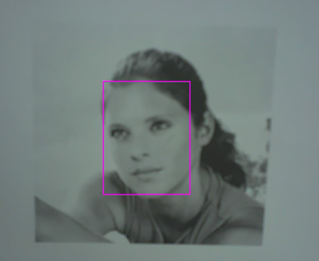

### 5.1.5 Program Analysis

* **Import Required Libraries**

```
from libs.PipeLine import PipeLine
from libs.AIBase import AIBase
from libs.AI2D import Ai2d
from libs.Utils import *
from media.display import Display
import os, sys, ujson, gc, math
from media.media import *
import nncase_runtime as nn
import ulab.numpy as np
import image
import aidemo
```

* **FaceDetectionApp Class**

```
class FaceDetectionApp(AIBase):
    def __init__(self, kmodel_path, model_input_size, anchors,
                 confidence_threshold=0.5, nms_threshold=0.2,
                 rgb888p_size=[224, 224], display_size=[1920, 1080], debug_mode=0):
        super().__init__(kmodel_path, model_input_size, rgb888p_size, debug_mode)
        self.kmodel_path = kmodel_path
        self.model_input_size = model_input_size
        self.confidence_threshold = confidence_threshold
        self.nms_threshold = nms_threshold
        self.anchors = anchors
        self.rgb888p_size = [ALIGN_UP(rgb888p_size[0],16), rgb888p_size[1]]
        self.display_size = [ALIGN_UP(display_size[0],16), display_size[1]]
        self.debug_mode = debug_mode
        self.ai2d = Ai2d(debug_mode)
        self.ai2d.set_ai2d_dtype(
            nn.ai2d_format.NCHW_FMT,
            nn.ai2d_format.NCHW_FMT,
            np.uint8, np.uint8)
```

1) Initializes model path, input size, anchors, thresholds, display resolution, etc.

2) `model_input_size`: The input dimensions required by the model.

3) `anchors`: Stores bounding box information.

4) `confidence_threshold`, `nms_threshold`: Parameters used for post-processing.

5) `rgb888p_size`, `display_size`: Input image dimensions and display resolution.

6) `debug_mode`: Whether to enable debug mode.

* **Image Preprocessing**

```
    def config_preprocess(self, input_image_size=None):
        with ScopedTiming("set preprocess config", self.debug_mode > 0):
            ai2d_input_size = input_image_size if input_image_size else self.rgb888p_size
            top, bottom, left, right,_ = letterbox_pad_param(self.rgb888p_size, self.model_input_size)
            self.ai2d.pad([0,0,0,0, top, bottom, left, right], 0, [104,117,123])
            self.ai2d.resize(nn.interp_method.tf_bilinear, nn.interp_mode.half_pixel)
            self.ai2d.build(
                [1,3,ai2d_input_size[1], ai2d_input_size[0]],
                [1,3,self.model_input_size[1], self.model_input_size[0]])
```

1) Padding: Fills the image to the target size while maintaining the aspect ratio.

2) Resizing: Uses bilinear interpolation to adjust the image size to match the model's input requirements.

* **Image Post-Processing**

```
    def postprocess(self, results):
        with ScopedTiming("postprocess", self.debug_mode > 0):
            post_ret = aidemo.face_det_post_process(
                self.confidence_threshold,
                self.nms_threshold,
                self.model_input_size[1],
                self.anchors,
                self.rgb888p_size,
                results)
            if len(post_ret) == 0:
                return post_ret
            else:
                return post_ret[0]
```

1) Confidence Filtering: Retains only face boxes with confidence above the threshold.

2) Non-Maximum Suppression (NMS): Removes detection boxes with high overlap.

### 5.1.6 Draw Detection Results

```
    def draw_result(self, pl, dets):
        with ScopedTiming("display_draw", self.debug_mode > 0):
            if dets:
                pl.osd_img.clear()
                for det in dets:
                    x,y,w,h = map(lambda x:int(round(x,0)), det[:4])
                    x = x * self.display_size[0] // self.rgb888p_size[0]
                    y = y * self.display_size[1] // self.rgb888p_size[1]
                    w = w * self.display_size[0] // self.rgb888p_size[0]
                    h = h * self.display_size[1] // self.rgb888p_size[1]
                    pl.osd_img.draw_rectangle(x, y, w, h, color=(255,255,0,255), thickness=2)
            else:
                pl.osd_img.clear()
```

Draws the detected face boxes on the image, using rectangles to outline faces and clearing old boxes.


## 5.2 Facial Landmark Detection

### 5.2.1 Experiment Overview

This section covers the facial landmark detection feature of the K230 development board through a programming example.

### 5.2.2 Preparation

* **Module Connection**

1. Connect the K230 development board to your PC using a Type-C data cable, as shown below:


2. Double-click to open CanMV IDE K230.


3. Click the connection button in the bottom-left corner.


4. Upon successful connection, the icon in the bottom-left corner of CanMV IDE will change to the one shown below.


5) If the connection takes more than 10 seconds, it indicates a connection failure. Click the **Cancel** button, and a pop-up window will appear. Click **OK** and recheck the connection.


> [!NOTE]
>
> **Connection Failure Causes and Solutions:**
>
> * **Cable is not a data cable: Some Type-C cables are charging-only cables without data transfer capability. Please use a Type-C cable with data transfer functionality. The factory-supplied cable is a Type-C data cable.**
>
> * **Other K230 firmware was flashed: Re-flash the factory firmware, then reconnect.**

### 5.2.3 Program Execution and Download

**Display Mode Configuration:** 

The program can use the `select_display=""` parameter to choose the display mode: HDMI, LCD, or IDE virtual.


The K230 program supports two operation modes: online execution and offline execution.

**Online Execution:**

In this mode, after connecting, drag the program **face_landmark.py** into CanMV IDE K230's code editing area. Then, click the run button in the bottom-left corner , and the program will run online, as shown below:

> [!NOTE]
>
> **Programs run using this method will be lost upon disconnection or power-off and will not be saved on the development board.**


**Offline Execution:**

1. After connecting, drag the program **face_landmark.py** into CanMV IDE K230's code editing area. Click **Tools** on the toolbar and select **Save open script to CanMV Board (as main.py)** as shown below:


2. Then click **Yes**.


3. Once the file is written, click **OK** to confirm and complete saving the MicroPython file to the K230 development board.


**With this method, the K230 development board will automatically run the MicroPython file upon power-up without connection, enabling offline execution.**

### 5.2.4 Program Outcome

In the transmitted video feed, first detect the face positions in the image, then identify the key points of each face, such as eyes, eyebrows, mouth, etc., and finally draw the detection boxes and key points on the screen.

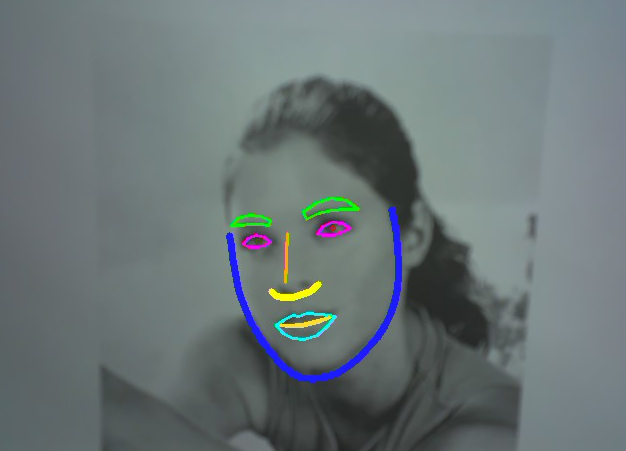

### 5.2.5 Program Analysis

* **Import Required Libraries**

```
from libs.PipeLine import PipeLine
from libs.AIBase import AIBase
from libs.AI2D import Ai2d
from libs.Utils import *
import os, sys, ujson, gc, math
from media.media import *
from media.display import Display
import nncase_runtime as nn
import ulab.numpy as np
import image
import aidemo
```

* **Face Detection**

```
class FaceDetApp(AIBase):
    def __init__(self, kmodel_path, model_input_size, anchors,
                 confidence_threshold=0.25, nms_threshold=0.3,
                 rgb888p_size=[1280,720], display_size=[1920,1080], debug_mode=0):
        super().__init__(kmodel_path, model_input_size, rgb888p_size, debug_mode)
        self.kmodel_path = kmodel_path
        self.model_input_size = model_input_size
        self.confidence_threshold = confidence_threshold
        self.nms_threshold = nms_threshold
        self.anchors = anchors
        self.rgb888p_size = [ALIGN_UP(rgb888p_size[0], 16), rgb888p_size[1]]
        self.display_size = [ALIGN_UP(display_size[0], 16), display_size[1]]
        self.debug_mode = debug_mode
        self.ai2d = Ai2d(debug_mode)
        self.ai2d.set_ai2d_dtype(nn.ai2d_format.NCHW_FMT,
                                nn.ai2d_format.NCHW_FMT,
                                np.uint8,
                                np.uint8)
```

1) `FaceDetApp`: Loads the face detection model and performs face detection.

2) `kmodel_path`: Path to the face detection model.

3) `model_input_size`: The required input image dimensions for this model.

4) `anchors`: Anchor boxes. Object detection models typically use anchor boxes of different scales to match real-world objects.

5) `confidence_threshold`: Confidence threshold. A face will only be considered a valid face if the model's predicted face box confidence exceeds this threshold.

6) `nms_threshold`: Non-maximum suppression threshold, which is used to eliminate overlapping detection boxes. It removes duplicate boxes that have an overlap greater than the set threshold.

* **Image Preprocessing**

```
    def config_preprocess(self, input_image_size=None):
        with ScopedTiming("set preprocess config", self.debug_mode > 0):
            ai2d_input_size = input_image_size if input_image_size else self.rgb888p_size
            top, bottom, left, right, _ = letterbox_pad_param(self.rgb888p_size, self.model_input_size)
            self.ai2d.pad([0, 0, 0, 0, top, bottom, left, right], 0, [104, 117, 123])
            self.ai2d.resize(nn.interp_method.tf_bilinear, nn.interp_mode.half_pixel)
            self.ai2d.build([1,3,ai2d_input_size[1],ai2d_input_size[0]],
                            [1,3,self.model_input_size[1],self.model_input_size[0]])
```

1) The purpose of image preprocessing is to convert the raw input image into a format suitable for the model. Operations include resizing, color conversion, normalization, and data augmentation.

2) `letterbox_pad_param`: Calculates the necessary padding based on the input image dimensions and the model's input dimensions, ensuring the image is scaled proportionally and padded to the target size.

3) `self.ai2d.pad`: Pads the image with the color [104, 117, 123]. It adjusts the input size during image preprocessing to prevent errors in the model caused by inconsistent image dimensions.

4) `self.ai2d.resize`: Resizes the image to fit the model's input dimensions.

* **Returning Valid Boxes**

```
    def postprocess(self, results):
        with ScopedTiming("postprocess", self.debug_mode > 0):
            res = aidemo.face_det_post_process(
                self.confidence_threshold,
                self.nms_threshold,
                self.model_input_size[0],
                self.anchors,
                self.rgb888p_size,
                results)
            if len(res) == 0:
                return res
            else:
                return res[0]
```

`postprocess`: Post-process the model's output. Use the confidence threshold and NMS algorithm to filter the detection boxes and return the valid ones.

* **Facial Landmark Recognition**

```
class FaceLandMarkApp(AIBase):
    def __init__(self, kmodel_path, model_input_size,
                 rgb888p_size=[1920,1080], display_size=[1920,1080], debug_mode=0):
        super().__init__(kmodel_path, model_input_size, rgb888p_size, debug_mode)
        self.kmodel_path = kmodel_path
        self.model_input_size = model_input_size
        self.rgb888p_size = [ALIGN_UP(rgb888p_size[0], 16), rgb888p_size[1]]
        self.display_size = [ALIGN_UP(display_size[0], 16), display_size[1]]
        self.debug_mode = debug_mode
        self.matrix_dst = None
        self.ai2d = Ai2d(debug_mode)
        self.ai2d.set_ai2d_dtype(nn.ai2d_format.NCHW_FMT,
                                nn.ai2d_format.NCHW_FMT,
                                np.uint8,
                                np.uint8)
```

Responsible for loading and configuring the facial keypoint detection model, and setting the affine transformation matrix.

1) `kmodel_path`: Path to the facial landmark recognition model.

2) `model_input_size`: Input dimensions for the landmark recognition model.

3) `rgb888p_size`: Resolution of the input image.

4) `display_size`: Dimensions of the display image.

* **Image Drawing**

```
    def draw_result(self, pl, dets, landmark_res):
        pl.osd_img.clear()
        if dets:
            draw_img_np = np.zeros((self.display_size[1], self.display_size[0], 4), dtype=np.uint8)
            draw_img = image.Image(self.display_size[0], self.display_size[1], image.ARGB8888,
                                   alloc=image.ALLOC_REF, data=draw_img_np)
            for pred in landmark_res:
                for sub_part_index in range(len(self.dict_kp_seq)):
                    sub_part = self.dict_kp_seq[sub_part_index]
                    face_sub_part_point_set = []
                    for kp_index in range(len(sub_part)):
                        real_kp_index = sub_part[kp_index]
                        x, y = pred[real_kp_index*2], pred[real_kp_index*2+1]
                        x = int(x * self.display_size[0] // self.rgb888p_size[0])
                        y = int(y * self.display_size[1] // self.rgb888p_size[1])
                        face_sub_part_point_set.append((x, y))
                    if sub_part_index in (9, 6):
                        color = np.array(self.color_list_for_osd_kp[sub_part_index], dtype=np.uint8)
                        face_sub_part_point_set = np.array(face_sub_part_point_set)
                        aidemo.polylines(draw_img_np, face_sub_part_point_set, False, color, 5, 8, 0)
                    elif sub_part_index == 4:
                        color = self.color_list_for_osd_kp[sub_part_index]
                        for kp in face_sub_part_point_set:
                            draw_img.draw_circle(kp[0], kp[1], 2, color, 1)
                    else:
                        color = np.array(self.color_list_for_osd_kp[sub_part_index], dtype=np.uint8)
                        face_sub_part_point_set = np.array(face_sub_part_point_set)
                        aidemo.contours(draw_img_np, face_sub_part_point_set, -1, color, 2, 8)
            pl.osd_img.copy_from(draw_img)
```

Draw the face box and facial keypoints on the image.

1) `pl`: Image display pipeline.

2) `dets`: Array of face boxes.

3) `landmark_res`: Array of landmark results.

## 5.3 3D Face Mesh

### 5.3.1 Experiment Overview

This section explores the 3D face mesh rendering technology on the K230 development board through programming practice. When a face is detected, dense feature points outline the entire facial contour, presenting the face contour as a precise mesh structure. It supports simultaneous processing of single and multiple faces.

### 5.3.2 Preparation

* **Module Connection**

1. Connect the K230 development board to your PC using a Type-C data cable, as shown below:


2. Double-click to open CanMV IDE K230.


3. Click the connection button in the bottom-left corner.


4. Upon successful connection, the icon in the bottom-left corner of CanMV IDE will change to the one shown below.


5. If the connection takes more than 10 seconds, it indicates a connection failure. Click the **Cancel** button, and a pop-up window will appear. Click **OK** and recheck the connection.


> [!NOTE]
>
> **Connection Failure Causes and Solutions:**
>
> * **Cable is not a data cable: Some Type-C cables are charging-only cables without data transfer capability. Please use a Type-C cable with data transfer functionality. The factory-supplied cable is a Type-C data cable.**
>
> * **Other K230 firmware was flashed: Re-flash the factory firmware, then reconnect.**

### 5.3.3 Program Execution and Download

**Display Mode Configuration:** 

The program can use the `select_display=""` parameter to choose the display mode: HDMI, LCD, or IDE virtual.


The K230 program supports two operation modes: online execution and offline execution.

**Online Execution:**

In this mode, after connecting, drag the program **face_mesh.py** into CanMV IDE K230's code editing area. Then, click the run button in the bottom-left corner , and the program will run online, as shown below:

> [!NOTE]
>
> **Programs run using this method will be lost upon disconnection or power-off and will not be saved on the development board.**

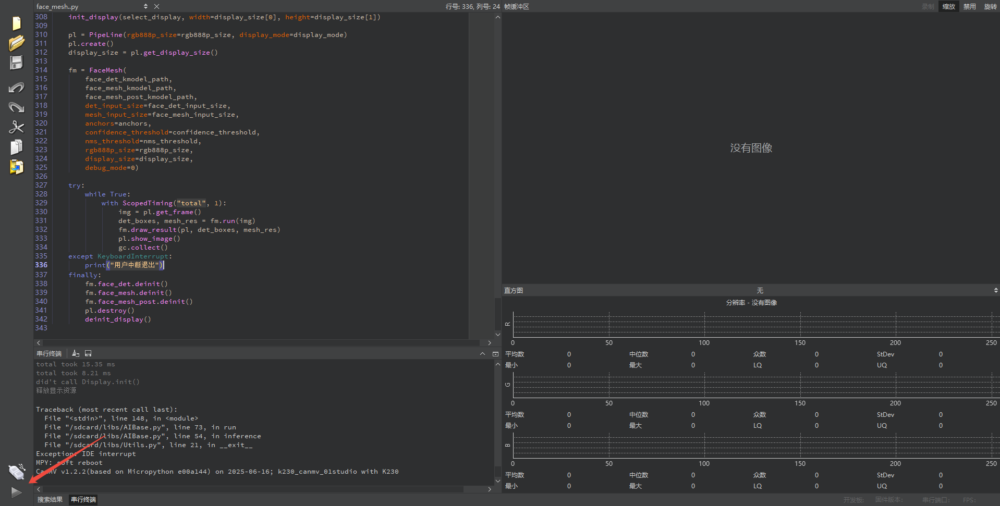

**Offline Execution:**

1. After connecting, drag the program **face_mesh.py** into CanMV IDE K230's code editing area. Click **Tools** on the toolbar and select **Save open script to CanMV Board (as main.py)** as shown below:


2. Then click **Yes**.


3. Once the file is written, click **OK** to confirm and complete saving the MicroPython file to the K230 development board.


**With this method, the K230 development board will automatically run the MicroPython file upon power-up without connection, enabling offline execution.**

### 5.3.4 Program Outcome

In the return feed, the program overlays a 3D mesh effect on any faces detected by the camera, supporting both single and multiple faces.

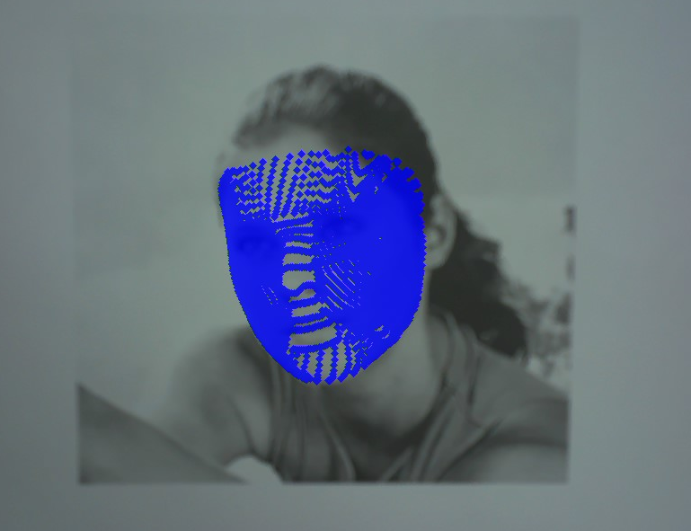

### 5.3.5 Program Analysis

* **Import Required Libraries**

```
from libs.PipeLine import PipeLine
from libs.AIBase import AIBase
from libs.AI2D import Ai2d
from libs.Utils import *
import os
import sys
import ujson
import gc
import math
from media.media import *
from media.display import Display
import nncase_runtime as nn
import ulab.numpy as np
import image
import aidemo
```

* **Face Detection**

```
class FaceDetApp(AIBase):
    def __init__(self, kmodel_path, model_input_size, anchors,
                 confidence_threshold=0.25, nms_threshold=0.3,
                 rgb888p_size=[1280,720], display_size=[1920,1080],
                 debug_mode=0):
        super().__init__(kmodel_path, model_input_size, rgb888p_size, debug_mode)
        self.kmodel_path = kmodel_path
        self.model_input_size = model_input_size
        self.confidence_threshold = confidence_threshold
        self.nms_threshold = nms_threshold
        self.anchors = anchors
        self.rgb888p_size = [ALIGN_UP(rgb888p_size[0],16), rgb888p_size[1]]
        self.display_size = [ALIGN_UP(display_size[0],16), display_size[1]]
        self.debug_mode = debug_mode
        self.ai2d = Ai2d(debug_mode)
        self.ai2d.set_ai2d_dtype(
            nn.ai2d_format.NCHW_FMT,
            nn.ai2d_format.NCHW_FMT,
            np.uint8,
            np.uint8)
```

`FaceDetApp` loads and runs the face detection model. After receiving an input image, it outputs the positions of the detected bounding boxes.

1)  `kmodel_path`: Path to the face detection model.

2)  `model_input_size`: Input size of the face detection model.

3)  `anchors`: Anchor boxes used for bounding box prediction.

4)  `confidence_threshold`: Confidence threshold for filtering low-confidence detection boxes.

5)  `nms_threshold`: Non-Maximum Suppression threshold for removing redundant overlapping boxes.

6)  `rgb888p_size`: Size of the input image.

7)  `display_size`: Display size of the output image.

* **Image Preprocessing**

```python
    def config_preprocess(self, input_image_size=None):
        with ScopedTiming("set preprocess config", self.debug_mode > 0):
            ai2d_input_size = input_image_size if input_image_size else self.rgb888p_size
            top, bottom, left, right, _ = letterbox_pad_param(self.rgb888p_size, self.model_input_size)
            self.ai2d.pad([0,0,0,0, top, bottom, left, right], 0, [104,117,123])
            self.ai2d.resize(nn.interp_method.tf_bilinear, nn.interp_mode.half_pixel)
            self.ai2d.build(
                [1,3,ai2d_input_size[1], ai2d_input_size[0]],
                [1,3,self.model_input_size[1], self.model_input_size[0]])
```

1)  Image preprocessing steps including padding and scaling to ensure the input image meets model requirements.

2)  `input_image_size`: Size of the input image.

* **Face Mesh Landmark Recognition**

```python
class FaceMeshApp(AIBase):
    def __init__(self, kmodel_path, model_input_size,
                 rgb888p_size=[1920,1080], display_size=[1920,1080],
                 debug_mode=0):
        super().__init__(kmodel_path, model_input_size, rgb888p_size, debug_mode)
        self.kmodel_path = kmodel_path
        self.model_input_size = model_input_size
        self.rgb888p_size = [ALIGN_UP(rgb888p_size[0],16), rgb888p_size[1]]
        self.display_size = [ALIGN_UP(display_size[0],16), display_size[1]]
        self.debug_mode = debug_mode
        self.param_mean = np.array([
```

The `FaceMeshApp` class extracts facial landmarks from face detection boxes and generates facial mesh through the network model.

1)  `kmodel_path`: Path to the face mesh recognition model.

2)  `model_input_size`: Input size of the mesh model.

3)  `rgb888p_size`: Resolution of the input image.

4)  `display_size`: Resolution of the display image.

5)  `debug_mode`: Debug mode, 0 for off, 1 for on.

* **Image Post-processing and Affine Transformation**

```python
class FaceMeshPostApp(AIBase):
    def __init__(self, kmodel_path, model_input_size,
                 rgb888p_size=[1920,1080], display_size=[1920,1080],
                 debug_mode=0):
        super().__init__(kmodel_path, model_input_size, rgb888p_size, debug_mode)
        self.kmodel_path = kmodel_path
        self.model_input_size = model_input_size
        self.rgb888p_size = [ALIGN_UP(rgb888p_size[0],16), rgb888p_size[1]]
        self.display_size = [ALIGN_UP(display_size[0],16), display_size[1]]
        self.debug_mode = debug_mode
        self.ai2d = Ai2d(debug_mode)
        self.ai2d.set_ai2d_dtype(
            nn.ai2d_format.NCHW_FMT,
            nn.ai2d_format.NCHW_FMT,
            np.uint8,
            np.uint8)
```

`FaceMeshPostApp` receives mesh landmarks from `FaceMeshApp` and performs coordinate transformation and display.

1)  `kmodel_path`: Path to the post-processing model.

2)  `model_input_size`: Input size of the post-processing model.

3)  `rgb888p_size`: Input image resolution.

4)  `display_size`: Display device resolution.

5)  `debug_mode`: Debug mode.

* **Detect Faces and Output Landmark Mesh**

```
class FaceMesh:
    def __init__(self, face_det_kmodel, face_mesh_kmodel, mesh_post_kmodel,
                 det_input_size, mesh_input_size, anchors,
                 confidence_threshold=0.25, nms_threshold=0.3,
                 rgb888p_size=[1920,1080], display_size=[1920,1080],
                 debug_mode=0):
        self.face_det_kmodel = face_det_kmodel
        self.face_mesh_kmodel = face_mesh_kmodel
        self.mesh_post_kmodel = mesh_post_kmodel
        self.det_input_size = det_input_size
        self.mesh_input_size = mesh_input_size
        self.anchors = anchors
        self.confidence_threshold = confidence_threshold
        self.nms_threshold = nms_threshold
        self.rgb888p_size = [ALIGN_UP(rgb888p_size[0],16), rgb888p_size[1]]
        self.display_size = [ALIGN_UP(display_size[0],16), display_size[1]]
        self.debug_mode = debug_mode
```

`FaceMesh` is responsible for linking multiple models, including face detection, facial mesh recognition, and mesh post-processing, to execute the complete face recognition and mesh rendering process. The `run()` method detects faces from the input image and outputs the corresponding keypoint mesh.

1)  `face_det_kmodel`: Path to face detection model.

2)  `face_mesh_kmodel`: Path to facial mesh recognition model.

3)  `mesh_post_kmodel`: Path to facial mesh post-processing model.

4)  `det_input_size`: Face detection model input size.

5)  `mesh_input_size`: Facial mesh recognition model input size.

6)  `anchors`: Anchor boxes for detection box prediction.

7)  `confidence_threshold`: Confidence threshold.

8)  `nms_threshold`: Non-Maximum Suppression threshold.

## 5.4 Face Pose Detection

### 5.4.1 Experiment Overview

This section demonstrates face pose estimation on the K230 development board, depicting facial orientation with 3D rectangular boxes after face detection.

### 5.4.2 Preparation

* **Module Connection**

1)  Connect the K230 development board to your PC using a Type-C data cable, as shown below:


2)  Double-click to open CanMV IDE K230.


3)  Click the connection button in the lower left corner.


4)  Upon successful connection, the icon in the lower left corner of CanMV IDE will change to the following:


5)  If the connection takes more than 10 seconds, it indicates a connection failure. Click the **Cancel** button, and a pop-up window will appear. Click **OK** and recheck the connection.


> [!NOTE]
>
> **Connection Failure Causes and Solutions:**
>
> * **Cable is not a data cable: Some Type-C cables are charging-only cables without data transfer capability. Please use a Type-C cable with data transfer functionality. The factory-supplied cable is a Type-C data cable.**
>
> * **Other K230 firmware was flashed: Re-flash the factory firmware, then reconnect.**

### 5.4.3 Program Execution and Download

**Display Mode Configuration:**

The program can use the `select_display=""` parameter to choose the display mode: HDMI, LCD, or IDE virtual.


The K230 program supports two operation modes: online execution and offline execution.

**Online Execution:**

In this mode, after connecting, drag the program **face_pose.py** into CanMV IDE K230's code editing area. Then, click the run button in the bottom-left corner , and the program will run online, as shown below:

> [!NOTE]
>
> **Programs run using this method will be lost upon disconnection or power-off and will not be saved on the development board.**

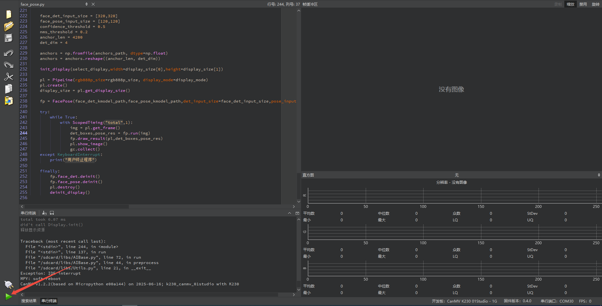

**Offline Execution:**

1. After connecting, drag the program **face_pose.py** into CanMV IDE K230's code editing area. Click **Tools** on the toolbar and select **Save open script to CanMV Board (as main.py)** as shown below:


2. Then click **Yes**.


3. Once the file is written, click **OK** to confirm and complete saving the MicroPython file to the K230 development board.


**With this method, the K230 development board will automatically run the MicroPython file upon power-up without connection, enabling offline execution.**

### 5.4.4 Program Outcome

In the returned video feed, the faces captured by the camera are rendered with 3D rectangular boxes to indicate their orientation.

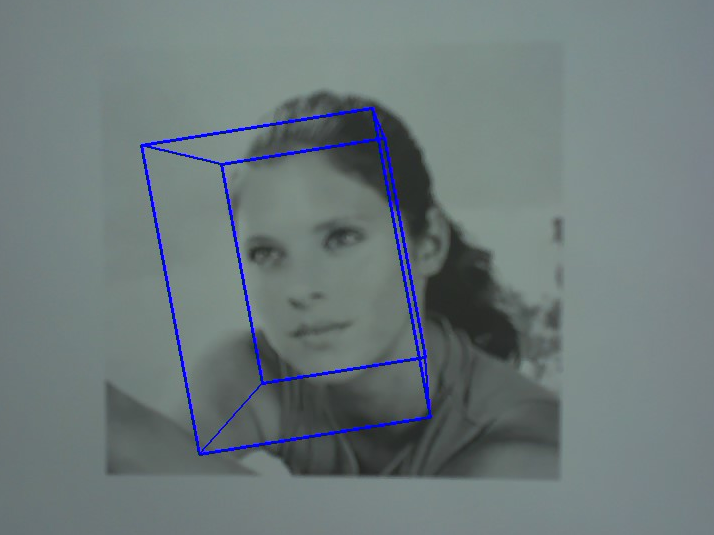

### 5.4.5 Program Analysis

* **Import Required Libraries**

```
from libs.PipeLine import PipeLine
from libs.AIBase import AIBase
from libs.AI2D import Ai2d
from libs.Utils import *
import os, sys, ujson, gc, math
from media.media import *
from media.display import Display
import nncase_runtime as nn
import ulab.numpy as np
import image
import aidemo
```

* **Face Detection**

```
class FaceDetApp(AIBase):
    def __init__(self,kmodel_path,model_input_size,anchors,confidence_threshold=0.25,nms_threshold=0.3,rgb888p_size=[1280,720],display_size=[1920,1080],debug_mode=0):
        super().__init__(kmodel_path,model_input_size,rgb888p_size,debug_mode)
        self.kmodel_path=kmodel_path
        self.model_input_size=model_input_size
        self.confidence_threshold=confidence_threshold
        self.nms_threshold=nms_threshold
        self.anchors=anchors
        self.rgb888p_size=[ALIGN_UP(rgb888p_size[0],16),rgb888p_size[1]]
        self.display_size=[ALIGN_UP(display_size[0],16),display_size[1]]
        self.debug_mode=debug_mode
        self.ai2d=Ai2d(debug_mode)
        self.ai2d.set_ai2d_dtype(nn.ai2d_format.NCHW_FMT,nn.ai2d_format.NCHW_FMT,np.uint8,np.uint8)
```

`FaceDetApp` loads the face detection model, performs preprocessing and inference on input images, and outputs detection boxes.

1)  `kmodel_path`: Path to the face detection model.

2)  `model_input_size`: Input size of the face detection model.

3)  `anchors`: Anchor boxes for bounding box prediction.

4)  `confidence_threshold`: Confidence threshold for filtering out low-confidence detection boxes.

5)  `nms_threshold`: Non-Maximum Suppression (NMS) threshold for removing overlapping boxes.

6)  `rgb888p_size`: Resolution of the input image.

7)  `display_size`: Size of the output display image.

* **Image Preprocessing**

```python
    def config_preprocess(self,input_image_size=None):
        with ScopedTiming("set preprocess config",self.debug_mode > 0):
            ai2d_input_size=input_image_size if input_image_size else self.rgb888p_size
            top,bottom,left,right,_=letterbox_pad_param(self.rgb888p_size,self.model_input_size)
            self.ai2d.pad([0,0,0,0,top,bottom,left,right],0,[104,117,123])
            self.ai2d.resize(nn.interp_method.tf_bilinear,nn.interp_mode.half_pixel)
            self.ai2d.build([1,3,ai2d_input_size[1],ai2d_input_size[0]],[1,3,self.model_input_size[1],self.model_input_size[0]])

```

Configure image preprocessing, including padding, scaling, and resizing to match the model’s input dimensions. Post-process the detection results to filter and retain valid bounding boxes.

1)  `input_image_size`: Size of the input image.

2)  `results`: Model output results containing detection boxes.

* **Face Pose Estimation and Affine Transformation**

```python
class FacePoseApp(AIBase):
    def __init__(self,kmodel_path,model_input_size,rgb888p_size=[1920,1080],display_size=[1920,1080],debug_mode=0):
        super().__init__(kmodel_path,model_input_size,rgb888p_size,debug_mode)
        self.kmodel_path=kmodel_path
        self.model_input_size=model_input_size
        self.rgb888p_size=[ALIGN_UP(rgb888p_size[0],16),rgb888p_size[1]]
        self.display_size=[ALIGN_UP(display_size[0],16),display_size[1]]
        self.debug_mode=debug_mode
        self.ai2d=Ai2d(debug_mode)
        self.ai2d.set_ai2d_dtype(nn.ai2d_format.NCHW_FMT,nn.ai2d_format.NCHW_FMT,np.uint8,np.uint8)

    def config_preprocess(self,det,input_image_size=None):
        with ScopedTiming("set preprocess config",self.debug_mode > 0):
            ai2d_input_size=input_image_size if input_image_size else self.rgb888p_size
            matrix_dst = self.get_affine_matrix(det)
            self.ai2d.affine(nn.interp_method.cv2_bilinear,0,0,127,1,matrix_dst)
            self.ai2d.build([1,3,ai2d_input_size[1],ai2d_input_size[0]],[1,3,self.model_input_size[1],self.model_input_size[0]])

    def postprocess(self,results):
        with ScopedTiming("postprocess",self.debug_mode > 0):
            R,eular = self.get_euler(results[0][0])
            return R,eular
```

`FacePoseApp` estimates the face pose based on detected face bounding boxes, producing rotation matrices and Euler angles. It then calculates an affine transformation matrix using the detected bounding boxes to crop and resize the image. Finally, the rotation matrices from the pose estimation are converted into Euler angles for pitch, yaw, and roll.

* **Get Face Boxes and Perform Pose Estimation**

```
class FacePose:
    def __init__(self,face_det_kmodel,face_pose_kmodel,det_input_size,pose_input_size,anchors,confidence_threshold=0.25,nms_threshold=0.3,rgb888p_size=[1280,720],display_size=[1920,1080],debug_mode=0):
        self.face_det_kmodel=face_det_kmodel
        self.face_pose_kmodel=face_pose_kmodel
        self.det_input_size=det_input_size
        self.pose_input_size=pose_input_size
        self.anchors=anchors
        self.confidence_threshold=confidence_threshold
        self.nms_threshold=nms_threshold
        self.rgb888p_size=[ALIGN_UP(rgb888p_size[0],16),rgb888p_size[1]]
        self.display_size=[ALIGN_UP(display_size[0],16),display_size[1]]
        self.debug_mode=debug_mode
        self.face_det=FaceDetApp(self.face_det_kmodel,model_input_size=self.det_input_size,anchors=self.anchors,confidence_threshold=self.confidence_threshold,nms_threshold=self.nms_threshold,rgb888p_size=self.rgb888p_size,display_size=self.display_size,debug_mode=debug_mode)
        self.face_pose=FacePoseApp(self.face_pose_kmodel,model_input_size=self.pose_input_size,rgb888p_size=self.rgb888p_size,display_size=self.display_size)
        self.face_det.config_preprocess()
```

`FacePose` combines face detection and pose functionality to obtain face boxes from images and then perform pose estimation.

1)  `face_det_kmodel`: Path to face detection model.

2)  `face_pose_kmodel`: Path to face pose estimation model.

3)  `det_input_size`: Face detection model input size.

4)  `pose_input_size`: Pose estimation model input size.

5)  `anchors`: Anchor boxes.

6)  `confidence_threshold`: Confidence threshold.

7)  `nms_threshold`: Non-Maximum Suppression threshold.

8)  `rgb888p_size`: Input image size.

9)  `display_size`: Display image size.

## 5.5 Face Registration

### 5.5.1 Experiment Overview

This section demonstrates face registration on the K230 development board, performing feature extraction and registration on specific images to enable differentiation of different faces.

### 5.5.2 Preparation

* **Module Connection**

1)  Connect the K230 development board to your PC using a Type-C data cable, as shown below:


2)  Double-click to open CanMV IDE K230.


3)  Click the connection button in the lower left corner.


4)  Upon successful connection, the icon in the lower left corner of CanMV IDE will change to the following:


5)  If the connection takes more than 10 seconds, it indicates a connection failure. Click the **Cancel** button, and a pop-up window will appear. Click **OK** and recheck the connection.


> [!NOTE]
>
> **Connection Failure Causes and Solutions:**
>
> * **Cable is not a data cable: Some Type-C cables are charging-only cables without data transfer capability. Please use a Type-C cable with data transfer functionality. The factory-supplied cable is a Type-C data cable.**
>
> * **Other K230 firmware was flashed: Re-flash the factory firmware, then reconnect.**

### 5.5.3 Program Execution and Download

**Display Mode Configuration:**

The program can use the `select_display=""` parameter to choose the display mode: HDMI, LCD, or IDE virtual.


The K230 program supports two operation modes: online execution and offline execution.

**Online Execution:**

After connecting, drag the program **face_registration.py** into the CanMV IDE K230 code editor area, then click the run button  in the lower left corner to run the program online, as shown below:

> [!NOTE]
>
> **Programs run using this method will be lost upon disconnection or power-off and will not be saved on the development board.**

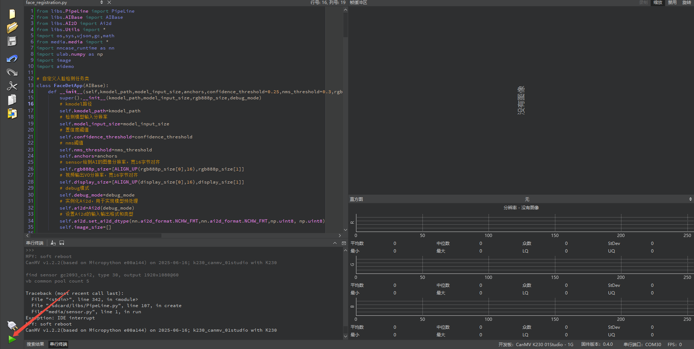

**Offline Execution:**

1. After connecting, drag the program **face_registration.py** into the CanMV IDE K230 code editor area, click **Tools** in the toolbar, and select **Save open script to CanMV Board (as main.py)**, as shown below:


2. Click **Yes**.


3. Once the file is written, click **OK** to confirm and complete saving the MicroPython file to the K230 development board.


**With this method, the K230 development board will automatically run the MicroPython file upon power-up without connection, enabling offline execution.**

### 5.5.4 Program Outcome

1)  After running, the face registration code will recognize the face images in the directory of CanMV/sdcard/examples/utils/db_img/. Two face images are included by default, and you can also add your own face images for recognition.

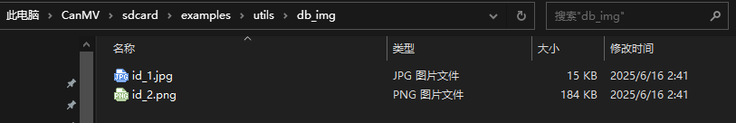

2. After running, two face databases will appear in the /sdcard/examples/utils/db/ directory.


3. The face registration process is complete.

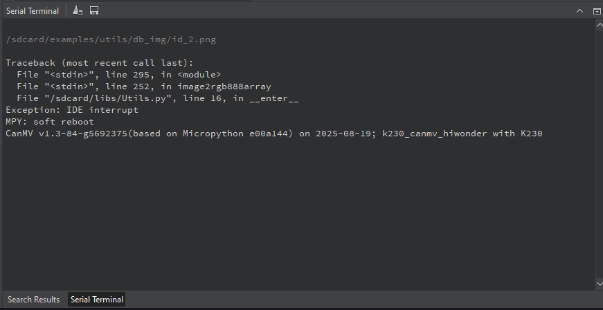

### 5.5.5 Program Analysis

* **Import Required Libraries**

```
from libs.PipeLine import PipeLine
from libs.AIBase import AIBase
from libs.AI2D import Ai2d
from libs.Utils import *
import os,sys,ujson,gc,math
from media.media import *
import nncase_runtime as nn
import ulab.numpy as np
import image
import aidemo
```

* **Face Detection**

```
# Custom face detection task class
class FaceDetApp(AIBase):
    def __init__(self,kmodel_path,model_input_size,anchors,confidence_threshold=0.25,nms_threshold=0.3,rgb888p_size=[1280,720],display_size=[1920,1080],debug_mode=0):
        super().__init__(kmodel_path,model_input_size,rgb888p_size,debug_mode)
        # kmodel path | kmodel路径
        self.kmodel_path=kmodel_path
        # Detection model input resolution
        self.model_input_size=model_input_size
        # Confidence threshold
        self.confidence_threshold=confidence_threshold
```

`FaceDetApp` loads the face detection model and performs face detection on input images.

1)  `kmodel_path`: Path to face detection model.
2)  `model_input_size`: Input image resolution.
3)  `anchors`: Anchor boxes for prediction.
4)  `confidence_threshold`: Confidence threshold, detection boxes below this value will be discarded.
5)  `nms_threshold`: Non-Maximum Suppression (NMS) threshold for removing overlapping detection boxes.

* **Image Preprocessing and Post-processing**

```
    # Configure preprocessing operations. Here pad and resize are used. Ai2d supports crop/shift/pad/resize/affine. For details, see /sdcard/app/libs/AI2D.py
    def config_preprocess(self,input_image_size=None):
        with ScopedTiming("set preprocess config",self.debug_mode > 0):
            # Initialize ai2d preprocessing config. Default is sensor-to-AI resolution. You can modify input size by setting input_image_size
            ai2d_input_size=input_image_size if input_image_size else self.rgb888p_size
            self.image_size=[input_image_size[1],input_image_size[0]]
            # Calculate padding parameters and set padding preprocessing
            self.ai2d.pad(self.get_pad_param(ai2d_input_size), 0, [104,117,123])
            # Set resize preprocessing
            self.ai2d.resize(nn.interp_method.tf_bilinear, nn.interp_mode.half_pixel)
            # Build preprocessing pipeline. Parameters are input tensor shape and output tensor shape
            self.ai2d.build([1,3,ai2d_input_size[1],ai2d_input_size[0]],[1,3,self.model_input_size[1],self.model_input_size[0]])

    # Custom post-processing. Results is the array list output by the model. Here the face_det_post_process interface from aidemo library is used
    def postprocess(self,results):
        with ScopedTiming("postprocess",self.debug_mode > 0):
            res = aidemo.face_det_post_process(self.confidence_threshold,self.nms_threshold,self.model_input_size[0],self.anchors,self.image_size,results)
            if len(res)==0:
                return res
            else:
                return res[0],res[1]
```

Use `Ai2d` to perform image padding, scaling, and other preprocessing to ensure the input meets the model requirements, then use `aidemo.face_det_post_process` to post-process the detection results and return valid face boxes and key points.

* **Face Registration**

```python
# Custom face registration task class
class FaceRegistrationApp(AIBase):
    def __init__(self,kmodel_path,model_input_size,rgb888p_size=[1920,1080],display_size=[1920,1080],debug_mode=0):
        super().__init__(kmodel_path,model_input_size,rgb888p_size,debug_mode)
        # kmodel path
        self.kmodel_path=kmodel_path
        # Face registration model input resolution
        self.model_input_size=model_input_size
        # Image resolution from sensor to AI, width 16-byte aligned
        self.rgb888p_size=[ALIGN_UP(rgb888p_size[0],16),rgb888p_size[1]]
        # Video output VO resolution, width 16-byte aligned
        self.display_size=[ALIGN_UP(display_size[0],16),display_size[1]]
        # Debug mode
        self.debug_mode=debug_mode
        # Standard 5 facial landmarks
```

`FaceRegistrationApp` loads and runs the face registration model. It computes and extracts facial features from the input image, producing a 28-dimensional feature vector.

1)  `kmodel_path`:  Path to face registration model.

2)  `model_input_size`: Face registration model input size.

3)  Affine transformation: Calculates the affine transformation matrix based on input keypoints to ensure facial region alignment.

4)  Post-processing: extract the registration results, which are the facial feature vectors.

## 5.6 Face Recognition

### 5.6.1 Experiment Overview

This section demonstrates using the K230 development board for face recognition training. Features are collected from specific images from the previous section for registration, enabling recognition of different faces.

### 5.6.2 Preparation

* **Module Connection**

1)  Connect the K230 development board to your PC using a Type-C data cable, as shown below:


2)  Double-click to open CanMV IDE K230.


3)  Click the connection button in the lower left corner.


4)  Upon successful connection, the icon in the lower left corner of CanMV IDE will change to the following:


5)  If the connection takes more than 10 seconds, it indicates a connection failure. Click the **Cancel** button, and a pop-up window will appear. Click **OK** and recheck the connection.


> [!NOTE]
>
> **Connection Failure Causes and Solutions:**
>
> * **Cable is not a data cable: Some Type-C cables are charging-only cables without data transfer capability. Please use a Type-C cable with data transfer functionality. The factory-supplied cable is a Type-C data cable.**
>
> * **Other K230 firmware was flashed: Re-flash the factory firmware, then reconnect.**

### 5.6.3 Program Execution and Download

**Display Mode Configuration:**

The program can use the `select_display=""` parameter to choose the display mode: HDMI, LCD, or IDE virtual.


The K230 program supports two operation modes: online execution and offline execution.

**Online Execution:**

After connecting, drag the program **face_recognition.py** into the CanMV IDE K230 code editor area, then click the run button  in the lower left corner to run the program online, as shown below:

> [!NOTE]
>
> **Programs run using this method will be lost upon disconnection or power-off and will not be saved on the development board.**

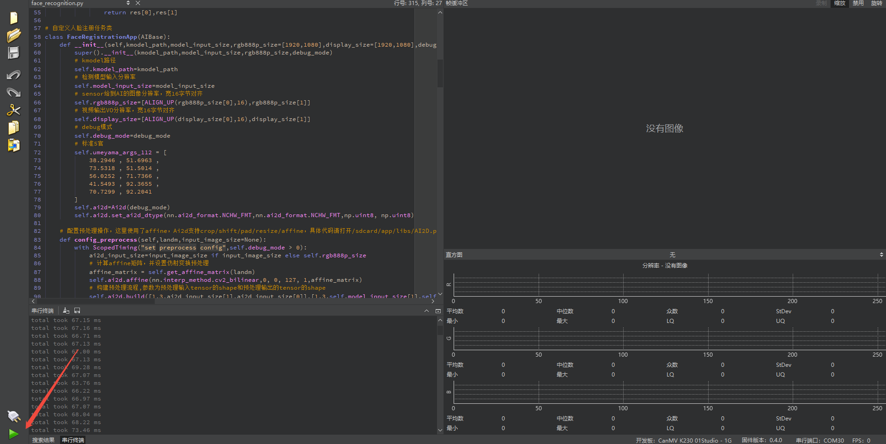

**Offline Execution:**

1. After connecting, drag the program **face_recognition.py** from this section's directory into the CanMV IDE K230 code editor area, click **Tools** in the toolbar, and select **Save open script to CanMV Board (as main.py)**, as shown below:


2. Click **Yes**.


3. Once the file is written, click **OK** to confirm and complete saving the MicroPython file to the K230 development board.


**With this method, the K230 development board will automatically run the MicroPython file upon power-up without connection, enabling offline execution.**

### 5.6.4 Program Outcome

After running, the face recognition code compares the camera input with the two face databases located in /sdcard/examples/utils/db/, enabling the distinction between different faces.


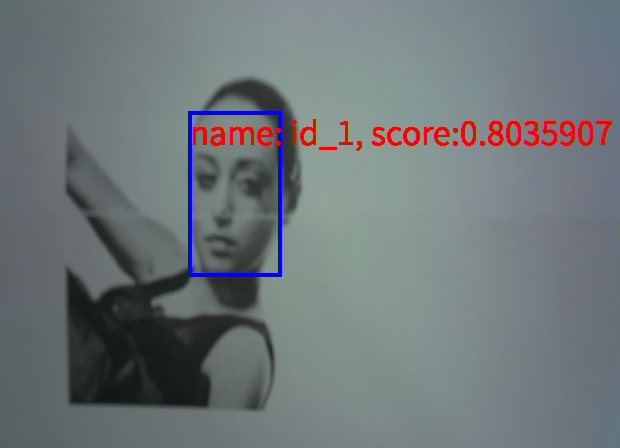

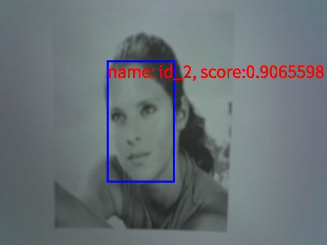

### 5.6.5 Program Analysis

* **Import Required Libraries**

```
import os,sys,ujson,gc,math
import ulab.numpy as np
import image
import aidemo
from media.display import *
from media.media import *
from media.display import Display
import nncase_runtime as nn

from libs.PipeLine import PipeLine
from libs.AIBase import AIBase
from libs.AI2D import Ai2d
from libs.Utils import * # Contains ALIGN_UP, ScopedTiming
from media.media import * # Contains Display class
```

* **Face Detection**

```python
# Custom face detection task class
class FaceDetApp(AIBase):
    def __init__(self,kmodel_path,model_input_size,anchors,confidence_threshold=0.25,nms_threshold=0.3,rgb888p_size=[1920,1080],display_size=[1920,1080],debug_mode=0):
        super().__init__(kmodel_path,model_input_size,rgb888p_size,debug_mode)
        # kmodel path
        self.kmodel_path=kmodel_path
        # Detection model input resolution
        self.model_input_size=model_input_size
        # Confidence threshold
        self.confidence_threshold=confidence_threshold
        # NMS threshold
        self.nms_threshold=nms_threshold
        self.anchors=anchors
        # Image resolution from sensor to AI, width 16-byte aligned
        self.rgb888p_size=[ALIGN_UP(rgb888p_size[0],16),rgb888p_size[1]]
        # Video output VO resolution, width 16-byte aligned, this resolution is used for OSD drawing
        self.display_size=[ALIGN_UP(display_size[0],16),display_size[1]]
        # Debug mode
        self.debug_mode=debug_mode
        # Instantiate Ai2d for model preprocessing
        self.ai2d=Ai2d(debug_mode)
        # Set Ai2d input/output format and type
        self.ai2d.set_ai2d_dtype(nn.ai2d_format.NCHW_FMT,nn.ai2d_format.NCHW_FMT,np.uint8, np.uint8)

```

1)  First, load the face detection model with the given model path, input size, and anchor configuration.

2)  Next, the input image is preprocessed with operations such as padding and scaling, then passed through the detection model to output face bounding boxes and key points.

3)  Post-processing results are processed through `aidemo.face_det_post_process` to determine the final valid face boxes.

* **Image Preprocessing and Post-processing**

```python
    def config_preprocess(self,input_image_size=None):
        with ScopedTiming("set preprocess config",self.debug_mode > 0):
            # Initialize ai2d preprocessing config, default is sensor-to-AI size, can modify input size by setting input_image_size
            ai2d_input_size=input_image_size if input_image_size else self.rgb888p_size
            top, bottom, left, right,_ =letterbox_pad_param(self.rgb888p_size,self.model_input_size)
            self.ai2d.pad([0, 0, 0, 0, top, bottom, left, right], 0, [104, 117, 123])  # Pad edges
            # Set resize preprocessing
            self.ai2d.resize(nn.interp_method.tf_bilinear, nn.interp_mode.half_pixel)
            # Build preprocessing pipeline, parameters are input tensor shape and output tensor shape
            self.ai2d.build([1,3,ai2d_input_size[1],ai2d_input_size[0]],[1,3,self.model_input_size[1],self.model_input_size[0]])

```

1)  Use `Ai2d` for image padding, scaling and other preprocessing to ensure input meets model requirements, then use `aidemo.face_det_post_process` to post-process detection results.

2)  Return valid face boxes and keypoints. `config_preprocess`: Configure image preprocessing steps, including padding and scaling.

3)  `postprocess`: Post-processing function that uses given confidence and NMS thresholds to process detection results and filter out invalid face boxes.

* **Face Registration Comparison**

```
# Custom face registration task class
class FaceRegistrationApp(AIBase):
    def __init__(self,kmodel_path,model_input_size,rgb888p_size=[1920,1080],display_size=[1920,1080],debug_mode=0):
        super().__init__(kmodel_path,model_input_size,rgb888p_size,debug_mode)
        # kmodel path
        self.kmodel_path=kmodel_path
        # Detection model input resolution
        self.model_input_size=model_input_size
        # Image resolution from sensor to AI, width 16-byte aligned
        self.rgb888p_size=[ALIGN_UP(rgb888p_size[0],16),rgb888p_size[1]]
        # Video output VO resolution, width 16-byte aligned
        self.display_size=[ALIGN_UP(display_size[0],16),display_size[1]]
        # Debug mode
        self.debug_mode=debug_mode
        # Standard 5 facial landmarks
        self.umeyama_args_112 = [
            38.2946 , 51.6963 ,
            73.5318 , 51.5014 ,
            56.0252 , 71.7366 ,
            41.5493 , 92.3655 ,
            70.7299 , 92.2041
        ]
        self.ai2d=Ai2d(debug_mode)
        self.ai2d.set_ai2d_dtype(nn.ai2d_format.NCHW_FMT,nn.ai2d_format.NCHW_FMT,np.uint8, np.uint8)

    # Configure preprocessing operations. Here affine is used. Ai2d supports crop/shift/pad/resize/affine. For details, see /sdcard/app/libs/AI2D.py
    def config_preprocess(self,landm,input_image_size=None):
        with ScopedTiming("set preprocess config",self.debug_mode > 0):
            ai2d_input_size=input_image_size if input_image_size else self.rgb888p_size
            # Calculate affine matrix and set affine transformation preprocessing
            affine_matrix = self.get_affine_matrix(landm)
            self.ai2d.affine(nn.interp_method.cv2_bilinear,0, 0, 127, 1,affine_matrix)
            # Build preprocessing pipeline. Parameters are input tensor shape and output tensor shape
            self.ai2d.build([1,3,ai2d_input_size[1],ai2d_input_size[0]],[1,3,self.model_input_size[1],self.model_input_size[0]])

    # Custom post-processing
    def postprocess(self,results):
        with ScopedTiming("postprocess",self.debug_mode > 0):
            return results[0][0]
```

`FaceRegistrationApp` is used for face registration, comparing facial images with existing faces in the database.

1)  Affine transformation: Geometrically transforms the input image through affine transformation to align with standard facial feature point positions.

2)  `SVD`: Uses Singular Value Decomposition (SVD) to align facial feature points, ensuring accurate image transformation.

3)  `__init__`: Initializes the face registration application, loading model path and input size.

4)  `config_preprocess`: Preprocesses the input image through affine transformation.

5)  `postprocess`: Processes registration results.

6)  `get_affine_matrix`: Calculates the affine transformation matrix.

* **Face Recognition and Image Rendering**

```python
# Face recognition task class
class FaceRecognition:
    def __init__(self,face_det_kmodel,face_reg_kmodel,det_input_size,reg_input_size,database_dir,anchors,confidence_threshold=0.25,nms_threshold=0.3,face_recognition_threshold=0.75,rgb888p_size=[1280,720],display_size=[1920,1080],debug_mode=0):
        # Path to face detection model
        self.face_det_kmodel=face_det_kmodel
        # Face recognition model path
        self.face_reg_kmodel=face_reg_kmodel
        # Face detection model input resolution
        self.det_input_size=det_input_size
        # Face recognition model input resolution
        self.reg_input_size=reg_input_size
        self.database_dir=database_dir
        # anchors
        self.anchors=anchors
        # Confidence threshold
        self.confidence_threshold=confidence_threshold
        # NMS threshold
        self.nms_threshold=nms_threshold
        self.face_recognition_threshold=face_recognition_threshold
        # Image resolution from sensor to AI, width 16-byte aligned
        self.rgb888p_size=[ALIGN_UP(rgb888p_size[0],16),rgb888p_size[1]]
        # Video output VO resolution, width 16-byte aligned, this resolution is used for OSD drawing
        self.display_size=[ALIGN_UP(display_size[0],16),display_size[1]]
        # Debug mode
        self.debug_mode=debug_mode
        self.max_register_face = 100                  # Maximum number of faces in database
        self.feature_num = 128                        # Face recognition feature dimension
        self.valid_register_face = 0                  # Number of registered faces
        self.db_name= []
        self.db_data= []
        # Pass display_size to FaceDetApp and FaceRegistrationApp
        self.face_det=FaceDetApp(self.face_det_kmodel,model_input_size=self.det_input_size,anchors=self.anchors,confidence_threshold=self.confidence_threshold,nms_threshold=self.nms_threshold,rgb888p_size=self.rgb888p_size,display_size=self.display_size,debug_mode=0)
        self.face_reg=FaceRegistrationApp(self.face_reg_kmodel,model_input_size=self.reg_input_size,rgb888p_size=self.rgb888p_size,display_size=self.display_size)
        self.face_det.config_preprocess()
        # Initialize face database
        self.database_init()

    # run function
    def run(self,input_np):
        # Execute face detection
        det_boxes,landms=self.face_det.run(input_np)
        recg_res = []
        for landm in landms:
            # For each facial landmark, infer to get facial features and calculate similarity in database
            self.face_reg.config_preprocess(landm)
            feature=self.face_reg.run(input_np)
            res = self.database_search(feature)
            recg_res.append(res)
        return det_boxes,recg_res
```

`FaceRecognition` implements a complete facial recognition system. It performs face detection on input images, then extracts facial features and compares them with registered features in the database, finally outputting recognition results.

1)  `run`: Executes face detection and recognition.

2)  `database_init`: Initializes the database and reads registered facial feature files.

3)  `database_search`: Matches currently extracted features with features in the database, returning the best match.

4)  `draw_result`: Draws detection results on the image,  such as boxed faces and recognition results.

## 5.7 Human Detection

### 5.7.1 Experiment Overview

This section demonstrates the human detection functionality of the K230 development board through programming.

### 5.7.2 Preparation

* **Module Connection**

1)  Connect the K230 development board to your PC using a Type-C data cable, as shown below:

    

2)  Double-click to open CanMV IDE K230.

    

3)  Click the connection button in the lower left corner.

    

4)  Upon successful connection, the icon in the lower left corner of CanMV IDE will change to the following:


5)  If the connection takes more than 10 seconds, it indicates a connection failure. Click the **Cancel** button, and a pop-up window will appear. Click **OK** and recheck the connection.


> [!NOTE]
>
> **Connection Failure Causes and Solutions:**
>
> * **Cable is not a data cable: Some Type-C cables are charging-only cables without data transfer capability. Please use a Type-C cable with data transfer functionality. The factory-supplied cable is a Type-C data cable.**
>
> * **Other K230 firmware was flashed: Re-flash the factory firmware, then reconnect.**

### 5.7.3 Program Execution and Download

**Display Mode Configuration:**

The program can use the `select_display=""` parameter to choose the display mode: HDMI, LCD, or IDE virtual.

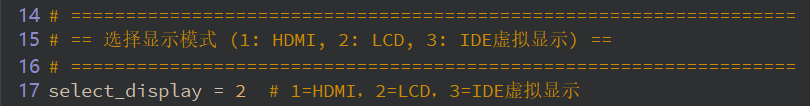

The K230 program supports two operation modes: online execution and offline execution.

**Online Execution:**

After connecting, drag the program **person_detection.py** into the CanMV IDE K230 code editor area, then click the run button  in the lower left corner to run the program online, as shown below:

> [!NOTE]
>
> **Programs run using this method will be lost upon disconnection or power-off and will not be saved on the development board.**


**Offline Execution:**

1)  After connecting, drag the program **person_detection.py** from this section's directory into the CanMV IDE K230 code editor area, click **Tools** in the toolbar, and select **Save open script to CanMV Board (as main.py)**, as shown below:

    

2)  Click **Yes**.

    

3)  Once the file is written, click **OK** to confirm and complete saving the MicroPython file to the K230 development board.

    

    **With this download method, when you subsequently power on the K230 development board without connecting it, the board will run the MicroPython file, enabling offline operation.** | **With this method, the K230 development board will automatically run the MicroPython file upon power-up without connection, enabling offline execution.**

### 5.7.4 Program Outcome

In the returned video feed, detect the human body in the camera view and draw a green rectangle around it.

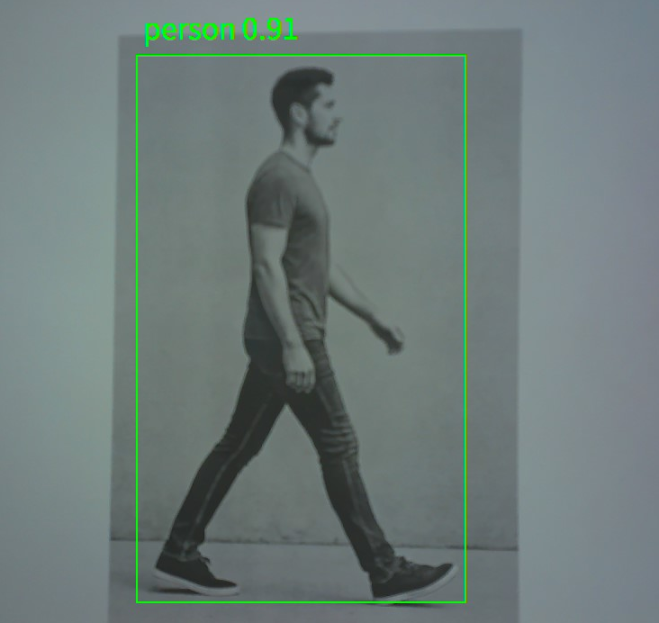

### 5.7.5 Program Analysis

* **Import Required Libraries**

```
from libs.PipeLine import PipeLine
from libs.AIBase import AIBase
from libs.AI2D import Ai2d
from libs.Utils import *
import os, sys, ujson, gc, math
from media.media import *
from media.display import Display   # Ensure SDK support
import nncase_runtime as nn
import ulab.numpy as np
import image
import `aicube`
```

* **Import Required Libraries**

```
def init_display(select_display, width, height):
    if select_display == 1:
        Display.init(Display.LT9611, width=width, height=height, to_ide=True)
        print(f"Initialize HDMI display, resolution: {width}x{height}")  # Initialize HDMI display, resolution: {width}x{height}
    elif select_display == 2:
        Display.init(Display.ST7701, to_ide=True)
        print("Initialize LCD display, default resolution 800x480")  # Initialize LCD display, default resolution 800x480
    elif select_display == 3:
        Display.init(Display.VIRT, width=width, height=height, fps=100, to_ide=True)
        print(f"Initialize IDE virtual display, resolution: {width}x{height}")  # Initialize IDE virtual display, resolution: {width}x{height}
    else:
        raise ValueError("select_display parameter error, must be 1, 2, or 3")  # select_display parameter error, must be 1, 2, or 3
```

Define a function to initialize the display, which takes three parameters: `select_display` to choose the display type by numeric code, `width` for the display width in pixels, and `height` for the display height in pixels.

* **Import Required Libraries**

```
class PersonDetectionApp(AIBase):
    def __init__(self, kmodel_path, model_input_size, labels, anchors,
                 confidence_threshold=0.2, nms_threshold=0.5, nms_option=False,
                 strides=[8, 16, 32], rgb888p_size=[224, 224], display_size=[1920, 1080], debug_mode=0):
        super().__init__(kmodel_path, model_input_size, rgb888p_size, debug_mode)
        self.kmodel_path = kmodel_path
        self.model_input_size = model_input_size
        self.labels = labels
        self.anchors = anchors
        self.strides = strides
        self.confidence_threshold = confidence_threshold
        self.nms_threshold = nms_threshold
        self.nms_option = nms_option
        self.rgb888p_size = [ALIGN_UP(rgb888p_size[0], 16), rgb888p_size[1]]
        self.display_size = [ALIGN_UP(display_size[0], 16), display_size[1]]
        self.debug_mode = debug_mode
        self.ai2d = Ai2d(debug_mode)
        self.ai2d.set_ai2d_dtype(nn.ai2d_format.NCHW_FMT,
                                 nn.ai2d_format.NCHW_FMT, np.uint8, np.uint8)

    def config_preprocess(self, input_image_size=None):
        with ScopedTiming("set preprocess config", self.debug_mode > 0):
            ai2d_input_size = input_image_size if input_image_size else self.rgb888p_size
            top, bottom, left, right, _ = center_pad_param(self.rgb888p_size, self.model_input_size)
            self.ai2d.pad([0, 0, 0, 0, top, bottom, left, right], 0, [0, 0, 0])
            self.ai2d.resize(nn.interp_method.tf_bilinear,
                             nn.interp_mode.half_pixel)
            self.ai2d.build([1, 3, ai2d_input_size[1], ai2d_input_size[0]],
                            [1, 3, self.model_input_size[1], self.model_input_size[0]])

    def postprocess(self, results):
        with ScopedTiming("postprocess", self.debug_mode > 0):
            dets = `aicube`.anchorbasedet_post_process(results[0], results[1], results[2], self.model_input_size,
                                                     self.rgb888p_size, self.strides, len(self.labels),
                                                     self.confidence_threshold, self.nms_threshold, self.anchors, self.nms_option)
            return dets
```

A class `PersonDetectionApp` is defined for human detection tasks, inheriting from `AIBase`. Its core functions include model and parameter initialization, image preprocessing configuration, post-processing after model inference, and result rendering.

* **Import Required Libraries**

```
if __name__ == "__main__":
    display_mode_map = {1: "hdmi", 2: "lcd", 3: "ide"}
    display_mode = display_mode_map.get(select_display, "hdmi")

    if display_mode == "hdmi":
        display_size = [1920, 1080]
    elif display_mode == "lcd":
        display_size = [800, 480]
    else:
        display_size = [1280, 720]

    rgb888p_size = [1280, 720]
    kmodel_path = "/sdcard/examples/kmodel/person_detect_yolov5n.kmodel"
    confidence_threshold = 0.2
    nms_threshold = 0.6
    labels = ["person"]
    anchors = [10, 13, 16, 30, 33, 23, 30, 61, 62, 45, 59, 119, 116, 90, 156, 198, 373, 326]

    # Initialize display
    init_display(select_display, width=display_size[0], height=display_size[1])

    pl = PipeLine(rgb888p_size=rgb888p_size, display_mode=display_mode)
    pl.create()
    display_size = pl.get_display_size()

    person_det = PersonDetectionApp(kmodel_path, model_input_size=[640, 640], labels=labels, anchors=anchors,
                                   confidence_threshold=confidence_threshold, nms_threshold=nms_threshold, nms_option=False,
                                   strides=[8, 16, 32], rgb888p_size=rgb888p_size, display_size=display_size, debug_mode=0)
    person_det.config_preprocess()
```

1. Select the display type based on the input number `select_display`, which can be HDMI, LCD, or IDE virtual display, and set the corresponding resolution. The default mode is HDMI.

```
    rgb888p_size = [1280, 720]
    kmodel_path = "/sdcard/examples/kmodel/person_detect_yolov5n.kmodel"
    confidence_threshold = 0.2
    nms_threshold = 0.6
    labels = ["person"]
    anchors = [10, 13, 16, 30, 33, 23, 30, 61, 62, 45, 59, 119, 116, 90, 156, 198, 373, 326]

```

2. Set the input image size for capture and processing, and specify the path to the lightweight YOLOv5 model. Configure the detection confidence and non-maximum suppression thresholds to ensure accurate results. Define the target classes—human in this example—and their corresponding anchor box parameters to simplify decoding of detection boxes during post-processing.

```
    # Initialize display
    init_display(select_display, width=display_size[0], height=display_size[1])

    pl = PipeLine(rgb888p_size=rgb888p_size, display_mode=display_mode)
    pl.create()
    display_size = pl.get_display_size()
```

3)  Call the display initialization function to start the display module based on the selected device, matching resolution settings.

4. Instantiate the pipeline to integrate image capture, processing, and display. Call `create()` to initialize the underlying hardware and software of the pipeline. Retrieve the current display resolution for the pipeline to dynamically synchronize subsequent drawing and display parameters.

```
    person_det = PersonDetectionApp(kmodel_path, model_input_size=[640, 640], labels=labels, anchors=anchors,
                                   confidence_threshold=confidence_threshold, nms_threshold=nms_threshold, nms_option=False,
                                   strides=[8, 16, 32], rgb888p_size=rgb888p_size, display_size=display_size, debug_mode=0)
    person_det.config_preprocess()
```

5. Load the YOLOv5 model and set the input resolution. Provide the labels, anchor boxes, thresholds, and multi-scale output strides. Call the preprocessing configuration function to set up the image preprocessing pipeline.

```
    try:
        while True:
            with ScopedTiming("total", 1):
                img = pl.get_frame()
                res = person_det.run(img)
                person_det.draw_result(pl, res)
                pl.show_image()
                gc.collect()
    except KeyboardInterrupt:
        print("Program stopped by user")
    finally:
        person_det.deinit()
        pl.destroy()
        deinit_display()
```

6)  Enter an infinite loop to capture images in real time and perform inference. Use a timer manager to track the total processing time. Call the model inference interface to obtain object detection results and visualize them on the display. Perform manual garbage collection to prevent memory leaks. Support user exit via Ctrl+C to ensure proper resource release.


## 5.8 Human Keypoint Detection

### 5.8.1 Experiment Overview

This section demonstrates the human keypoint detection functionality of the K230 development board through programming.

### 5.8.2 Preparation

* **Module Connection**

1)  Connect the K230 development board to your PC using a Type-C data cable, as shown below:

    

2)  Double-click to open CanMV IDE K230.

    

3)  Click the connection button in the lower left corner.

    

4)  Upon successful connection, the icon in the lower left corner of CanMV IDE will change to the following:


5)  If the connection takes more than 10 seconds, it indicates a connection failure. Click the **Cancel** button, and a pop-up window will appear. Click **OK** and recheck the connection.


> [!NOTE]
>
> **Connection Failure Causes and Solutions:**
>
> * **Cable is not a data cable: Some Type-C cables are charging-only cables without data transfer capability. Please use a Type-C cable with data transfer functionality. The factory-supplied cable is a Type-C data cable.**
>
> * **Other K230 firmware was flashed: Re-flash the factory firmware, then reconnect.**

### 5.8.3 Program Execution and Download

**Display Mode Configuration:**

The program can use the `select_display=""` parameter to choose the display mode: HDMI, LCD, or IDE virtual.


The K230 program supports two operation modes: online execution and offline execution.

**Online Execution:**

After connecting, drag the program **person_kp_detect.py** into the CanMV IDE K230 code editor area, then click the run button  in the lower left corner to run the program online, as shown below:

> [!NOTE]
>
> **Programs run using this method will be lost upon disconnection or power-off and will not be saved on the development board.**


**Offline Execution:**

1)  After connecting, drag the program **person_kp_detect.py** from this section's directory into the CanMV IDE K230 code editor area, click **Tools** in the toolbar, and select **Save open script to CanMV Board (as main.py)**, as shown below:

    

    2. Click **Yes**.

    

    3. Once the file is written, click **OK** to confirm and complete saving the MicroPython file to the K230 development board.

    

    **With this download method, when you subsequently power on the K230 development board without connecting it, the board will run the MicroPython file, enabling offline operation.** | **With this method, the K230 development board will automatically run the MicroPython file upon power-up without connection, enabling offline execution.**

### 5.8.4 Program Outcome

In the live feed, detect the human body in the camera view and mark the corresponding limb joints.


### 5.8.5 Program Analysis

* **Import Required Libraries**

```
from libs.PipeLine import PipeLine
from libs.AIBase import AIBase
from libs.AI2D import Ai2d
from libs.Utils import *
import os, sys, ujson, gc, math
from media.media import *
from media.display import Display  # Ensure SDK support
import nncase_runtime as nn
import ulab.numpy as np
import image
import aidemo
```

* **Display Initialization Function**

```
# ==================================================================
# == Select Display Mode (1: HDMI, 2: LCD, 3: IDE Virtual Display) ==
# ==================================================================
select_display = 3  # 1=HDMI, 2=LCD, 3=IDE Virtual Display


def init_display(select_display, width, height):
    if select_display == 1:
        Display.init(Display.LT9611, width=width, height=height, to_ide=True)
        print(f"Initialize HDMI display, resolution: {width}x{height}")
    elif select_display == 2:
        Display.init(Display.ST7701, to_ide=True)
        print("Initialize LCD display, default resolution 800x480")
    elif select_display == 3:
        Display.init(Display.VIRT, width=width, height=height, fps=100, to_ide=True)
        print(f"Initialize IDE virtual display, resolution: {width}x{height}")
    else:
        raise ValueError("select_display parameter error, must be 1, 2, or 3")
```

Define a function to initialize the display, which takes three parameters: `select_display` for choosing the display type using a numeric code, `width` for the display width in pixels, and `height` for the display height in pixels.

* **Human Keypoint Detection Class**

```
# Custom human keypoint detection class
class PersonKeyPointApp(AIBase):
    def __init__(self, kmodel_path, model_input_size,
                 confidence_threshold=0.2, nms_threshold=0.5,
                 rgb888p_size=[1280, 720], display_size=[1920, 1080], debug_mode=0):
        super().__init__(kmodel_path, model_input_size, rgb888p_size, debug_mode)
        self.kmodel_path = kmodel_path
        self.model_input_size = model_input_size
        self.confidence_threshold = confidence_threshold
        self.nms_threshold = nms_threshold
        self.rgb888p_size = [ALIGN_UP(rgb888p_size[0], 16), rgb888p_size[1]]
        self.display_size = [ALIGN_UP(display_size[0], 16), display_size[1]]
        self.debug_mode = debug_mode

        # Skeleton connection definitions
        self.SKELETON = [
            (16, 14), (14, 12), (17, 15), (15, 13), (12, 13), (6, 12), (7, 13),
            (6, 7), (6, 8), (7, 9), (8, 10), (9, 11), (2, 3), (1, 2),
            (1, 3), (2, 4), (3, 5), (4, 6), (5, 7)
        ]
        # Limb colors
        self.LIMB_COLORS = [
            (255, 51, 153, 255), (255, 51, 153, 255), (255, 51, 153, 255),
            (255, 51, 153, 255), (255, 255, 51, 255), (255, 255, 51, 255),
            (255, 255, 51, 255), (255, 255, 128, 0), (255, 255, 128, 0),
            (255, 255, 128, 0), (255, 255, 128, 0), (255, 255, 128, 0),
            (255, 0, 255, 0), (255, 0, 255, 0), (255, 0, 255, 0),
            (255, 0, 255, 0), (255, 0, 255, 0), (255, 0, 255, 0),
            (255, 0, 255, 0)
        ]
```

Defines a human keypoint detection task class `PersonKeyPointApp` based on YOLOv5 and subsequent pose estimation models. It implements model initialization, image preprocessing, model output post-processing, and detection result rendering.

* **Main Program**

```
    display_mode_map = {1: "hdmi", 2: "lcd", 3: "ide"}
    display_mode = display_mode_map.get(select_display, "hdmi")

    if display_mode == "hdmi":
        display_size = [1920, 1080]
    elif display_mode == "lcd":
        display_size = [800, 480]
    else:
        display_size = [1280, 720]
```

1. Map the numeric value of `select_display` to the corresponding display name using a dictionary. Set the resolution according to the display type: 1080p for HDMI, 800×480 for LCD which is common for small to medium screens, and 1280×720 for the IDE virtual display.

```
    rgb888p_size = [320, 320]
    kmodel_path = "/sdcard/examples/kmodel/yolov8n-pose.kmodel"
    confidence_threshold = 0.2
    nms_threshold = 0.5
```

2. Set the AI model input resolution to 320×320 for faster real-time inference. Load the YOLOv8 lightweight pose estimation model yolov8n-pose.kmodel. Apply a confidence threshold of 0.2 to filter out low-confidence detections and a non-maximum suppression threshold of 0.5 to remove duplicate detections.

```
    pl = PipeLine(rgb888p_size=rgb888p_size, display_mode=display_mode)
    pl.create()
    display_size = pl.get_display_size()
```

3. Create a `Pipeline` instance and set capture and display parameters. Call the `create` method to initialize capture, AI preprocessing, and display device drivers. Obtain the actual resolution of the current display device.

```
    person_kp = PersonKeyPointApp(
        kmodel_path,
        model_input_size=[320, 320],
        confidence_threshold=confidence_threshold,
        nms_threshold=nms_threshold,
        rgb888p_size=rgb888p_size,
        display_size=display_size,
        debug_mode=0
    )
    person_kp.config_preprocess()
```

4. Initialize the `PersonKeyPointApp` task, binding model parameters, thresholds, and image size. Call the preprocessing configuration method to establish the image preprocessing pipeline, such as pad and resize.

```
    try:
        while True:
            with ScopedTiming("total", 1):
                img = pl.get_frame()
                res = person_kp.run(img)
                person_kp.draw_result(pl, res)
                pl.show_image()
                gc.collect()
    except KeyboardInterrupt:
        print("User interrupted program")  # Program stopped by user
    finally:
        person_kp.deinit()
        pl.destroy()
        deinit_display()
```

5)  Continuously capture images and perform inference in a loop. Use `ScopedTiming` to measure the total frame processing time, including image capture, inference, and drawing. Draw human keypoints and connect them with skeleton lines, displaying the results in real time on the selected screen. Call `gc.collect()` to trigger garbage collection and ensure stable operation. The program supports safe exit via keyboard interrupt such as **Ctrl+C**.


## 5.9 Fall Detection

### 5.9.1 Experiment Overview

This section demonstrates the fall detection functionality of the K230 development board through programming.

### 5.9.2 Preparation

* **Module Connection**

1)  Connect the K230 development board to your PC using a Type-C data cable, as shown below:

    

2)  Double-click to open CanMV IDE K230.

    

3)  Click the connection button in the lower left corner.

    

4)  Upon successful connection, the icon in the lower left corner of CanMV IDE will change to the following:


5)  If the connection takes more than 10 seconds, it indicates a connection failure. Click the **Cancel** button, and a pop-up window will appear. Click **OK** and recheck the connection.


> [!NOTE]
>
> **Connection Failure Causes and Solutions:**
>
> * **Cable is not a data cable: Some Type-C cables are charging-only cables without data transfer capability. Please use a Type-C cable with data transfer functionality. The factory-supplied cable is a Type-C data cable.**
>
> * **Other K230 firmware was flashed: Re-flash the factory firmware, then reconnect.**

### 5.9.3 Program Execution and Download

**Display Mode Configuration:**

The program can use the `select_display=""` parameter to choose the display mode: HDMI, LCD, or IDE virtual.

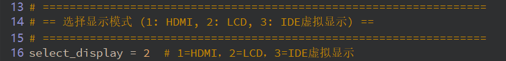

The K230 program supports two operation modes: online execution and offline execution.

**Online Execution:**

After connecting, drag the program **falldown_detection.py** into the CanMV IDE K230 code editor area, then click the run button  in the lower left corner to run the program online, as shown below:

> [!NOTE]
>
> **Programs run using this method will be lost upon disconnection or power-off and will not be saved on the development board.**


**Offline Execution:**

1)  After connecting, drag the program **falldown_detection.py** from this section's directory into the CanMV IDE K230 code editor area, click **Tools** in the toolbar, and select **Save open script to CanMV Board (as main.py)**, as shown below:

    

    2. Click **Yes**.

    

    3. Once the file is written, click **OK** to confirm and complete saving the MicroPython file to the K230 development board.

    

    **With this method, the K230 development board will automatically run the MicroPython file upon power-up without connection, enabling offline execution.**

### 5.9.4 Program Outcome

In the transmitted video feed, the system detects humans in the camera’s view and determines whether each person has fallen or not.

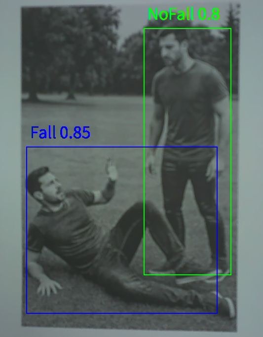

### 5.9.5 Program Analysis

* **Import Required Libraries**

```
from libs.PipeLine import PipeLine
from libs.AIBase import AIBase
from libs.AI2D import Ai2d
from libs.Utils import *
import os, sys, ujson, gc, math
from media.media import *
from media.display import Display   # Ensure SDK support
import nncase_runtime as nn
import ulab.numpy as np
import image
import `aicube`
```

* **Display Initialization Function**

```
def init_display(select_display, width, height):
    if select_display == 1:
        Display.init(Display.LT9611, width=width, height=height, to_ide=True)
        print(f"Initialize HDMI display, resolution: {width}x{height}")
    elif select_display == 2:
        Display.init(Display.ST7701, to_ide=True)
        print("Initialize LCD display, default resolution 800x480")
    elif select_display == 3:
        Display.init(Display.VIRT, width=width, height=height, fps=100, to_ide=True)
        print(f"Initialize IDE virtual display, resolution: {width}x{height}")
    else:
        raise ValueError("select_display parameter error, must be 1, 2, or 3")

def deinit_display():
    Display.deinit()
    print("Release display resources")
```

Define a function to initialize the display, which takes three parameters: `select_display` for choosing the display type using a numeric code, `width` for the display width in pixels, and `height` for the display height in pixels.

* **Human Detection Class**

```
# Custom fall detection class
class FallDetectionApp(AIBase):
    def __init__(self, kmodel_path, model_input_size, labels, anchors,
                 confidence_threshold=0.2, nms_threshold=0.5, nms_option=False,
                 strides=[8,16,32], rgb888p_size=[224,224], display_size=[1920,1080],
                 debug_mode=0):
        super().__init__(kmodel_path, model_input_size, rgb888p_size, debug_mode)
        self.kmodel_path = kmodel_path
        self.model_input_size = model_input_size
        self.labels = labels
        self.anchors = anchors
        self.strides = strides
        self.confidence_threshold = confidence_threshold
        self.nms_threshold = nms_threshold
        self.nms_option = nms_option
        self.rgb888p_size = [ALIGN_UP(rgb888p_size[0], 16), rgb888p_size[1]]
        self.display_size = [ALIGN_UP(display_size[0], 16), display_size[1]]
        self.debug_mode = debug_mode
        self.color = [(255,0, 0, 255), (255,0, 255, 0), (255,255,0, 0), (255,255,0, 255)]
        self.ai2d = Ai2d(debug_mode)
        self.ai2d.set_ai2d_dtype(nn.ai2d_format.NCHW_FMT,
                                 nn.ai2d_format.NCHW_FMT, np.uint8, np.uint8)

    def config_preprocess(self, input_image_size=None):
        with ScopedTiming("set preprocess config", self.debug_mode > 0):
            ai2d_input_size = input_image_size if input_image_size else self.rgb888p_size
            top, bottom, left, right, _ = center_pad_param(self.rgb888p_size, self.model_input_size)
            self.ai2d.pad([0, 0, 0, 0, top, bottom, left, right], 0, [0,0,0])
            self.ai2d.resize(nn.interp_method.tf_bilinear, nn.interp_mode.half_pixel)
            self.ai2d.build([1,3, ai2d_input_size[1], ai2d_input_size[0]],
                            [1,3,self.model_input_size[1], self.model_input_size[0]])
```

A class `FallDetectionApp` is defined for human detection tasks, inheriting from AIBase. Its core functions include initializing the model and parameters, configuring image preprocessing, performing post-processing after model inference, and rendering the results.

* **Main Program**

```
if __name__ == "__main__":
    display_mode_map = {1:"hdmi", 2:"lcd", 3:"ide"}
    display_mode = display_mode_map.get(select_display, "hdmi")

    if display_mode == "hdmi":
        display_size = [1920,1080]
    elif display_mode == "lcd":
        display_size = [800,480]
    else:
        display_size = [1280,720]
```

1. Select the display type based on the input number `select_display`, choosing from HDMI, LCD, or IDE virtual display, and set the corresponding resolution. The default mode is HDMI.

```
    rgb888p_size = [1280,720]
    kmodel_path = "/sdcard/examples/kmodel/yolov5n-falldown.kmodel"
    confidence_threshold = 0.3
    nms_threshold = 0.45
    labels = ["Fall", "NoFall"]
    anchors = [10, 13, 16, 30, 33, 23, 30, 61, 62, 45, 59, 119, 116, 90, 156, 198, 373, 326]
```

2. Set the input image size for image capture and processing. Specify the path to the YOLOv5 lightweight model. Set the detection confidence threshold and non-maximum suppression threshold to ensure accurate filtering of results. Define the detection classes, in this case only humans, and provide the corresponding anchor box parameters to facilitate decoding of the detection boxes during post-processing.

```
    init_display(select_display, width=display_size[0], height=display_size[1])

    pl = PipeLine(rgb888p_size=rgb888p_size, display_mode=display_mode)
    pl.create()
    display_size = pl.get_display_size()
```

3)  Call the display initialization function to start the display module based on the selected device, matching resolution settings.

4. Instantiate the pipeline to integrate capture, processing, and display. Call `create()` to initialize the pipeline's underlying hardware and software. Get the display size corresponding to the current pipeline, dynamically syncing subsequent drawing and display parameters.

```
    fall_det = FallDetectionApp(
        kmodel_path,
        model_input_size=[640,640],
        labels=labels,
        anchors=anchors,
        confidence_threshold=confidence_threshold,
        nms_threshold=nms_threshold,
        nms_option=False,
        strides=[8,16,32],
        rgb888p_size=rgb888p_size,
        display_size=display_size,
        debug_mode=0
    )
    fall_det.config_preprocess()
```

5. Load the YOLOv5 model and set the input resolution. Provide labels, anchor boxes, thresholds, and multi-scale output strides. Call the configuration preprocessing function to establish the image preprocessing pipeline.

```
    try:
        while True:
            with ScopedTiming("total",1):
                img = pl.get_frame()
                res = fall_det.run(img)
                fall_det.draw_result(pl, res)
                pl.show_image()
                gc.collect()
    except KeyboardInterrupt:
        print("User interrupted program")  # Ensure SDK support
    finally:
        fall_det.deinit()
        pl.destroy()
        deinit_display()
```

6)  Enter an infinite loop to continuously capture images and perform inference. Track the total processing time using a timing manager. Obtain detection results through the model inference interface. Visualize the results on the display. Perform garbage collection to prevent memory leaks. Support safe exit with **Ctrl+C** to ensure proper resource release.


## 5.10 Hand Recognition

### 5.10.1 Experiment Overview

This section demonstrates the hand recognition functionality of the K230 development board through programming.

### 5.10.2 Preparation

* **Module Connection**

1)  Connect the K230 development board to your PC using a Type-C data cable, as shown below:

    

2)  Double-click to open CanMV IDE K230.

    

3)  Click the connection button in the lower left corner.

    

4)  Upon successful connection, the icon in the lower left corner of CanMV IDE will change to the following:


5)  If the connection takes more than 10 seconds, it indicates a connection failure. Click the **Cancel** button, and a pop-up window will appear. Click **OK** and recheck the connection.


> [!NOTE]
>
> **Connection Failure Causes and Solutions:**
>
> * **Cable is not a data cable: Some Type-C cables are charging-only cables without data transfer capability. Please use a Type-C cable with data transfer functionality. The factory-supplied cable is a Type-C data cable.**
>
> * **Other K230 firmware was flashed: Re-flash the factory firmware, then reconnect.**

### 5.10.3 Program Execution and Download

**Display Mode Configuration:**

The program can use the `select_display=""` parameter to choose the display mode: HDMI, LCD, or IDE virtual.


The K230 program supports two operation modes: online execution and offline execution.

**Online Execution:**

After connecting, drag the program **hand_detection.py** into the CanMV IDE K230 code editor area, then click the run button  in the lower left corner to run the program online, as shown below:

> [!NOTE]
>
> **Programs run using this method will be lost upon disconnection or power-off and will not be saved on the development board.**

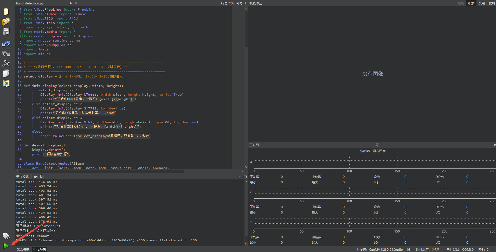

**Offline Execution:**

1)  After connecting, drag the program **hand_detection.py** into the CanMV IDE K230 code editor area, click **Tools** in the toolbar, and select **Save open script to CanMV Board (as main.py)**, as shown below:

    

2)  Click **Yes**.

    

3)  Once the file is written, click **OK** to confirm and complete saving the MicroPython file to the K230 development board.

    

    **With this download method, when you subsequently power on the K230 development board without connecting it, the board will run the MicroPython file, enabling offline operation.** | **With this method, the K230 development board will automatically run the MicroPython file upon power-up without connection, enabling offline execution.**

### 5.10.4 Program Outcome

In the returned video feed, detect the hand in the camera image and draw a green rectangular box around it.

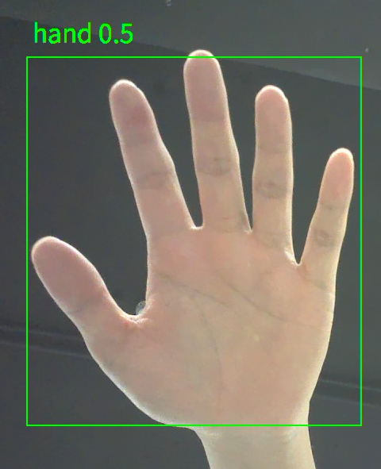

### 5.10.5 Program Analysis

* **Import Required Libraries**

```
from libs.PipeLine import PipeLine
from libs.AIBase import AIBase
from libs.AI2D import Ai2d
from libs.Utils import *
import os, sys, ujson, gc, math
from media.media import *
from media.display import Display
import nncase_runtime as nn
import ulab.numpy as np
import image
import `aicube`
```

* **Display Initialization Function**

```python
# ==================================================================
# == Select Display Mode (1: HDMI, 2: LCD, 3: IDE Virtual Display)==
# ==================================================================
select_display = 3  # 1=HDMI, 2=LCD, 3=IDE Virtual Display

def init_display(select_display, width, height):
    if select_display == 1:
        Display.init(Display.LT9611, width=width, height=height, to_ide=True)
        print(f"Initialize HDMI display, resolution: {width}x{height}")
    elif select_display == 2:
        Display.init(Display.ST7701, to_ide=True)
        print("Initialize LCD display, default resolution 800x480")
    elif select_display == 3:
        Display.init(Display.VIRT, width=width, height=height, fps=100, to_ide=True)
        print(f"Initialize IDE virtual display, resolution: {width}x{height}")
    else:
        raise ValueError("select_display parameter error, must be 1, 2, or 3")
```

Define a function to initialize the display, which takes three parameters: `select_display` for choosing the display type using a numeric code, `width` for the display width in pixels, and `height` for the display height in pixels.

* **Hand Detection**

```
class HandDetectionApp(AIBase):
    def __init__(self, kmodel_path, model_input_size, labels, anchors,
                 confidence_threshold=0.2, nms_threshold=0.5, nms_option=False,
                 strides=[8,16,32], rgb888p_size=[224,224], display_size=[1920,1080],
                 debug_mode=0):
        super().__init__(kmodel_path, model_input_size, rgb888p_size, debug_mode)
        self.kmodel_path = kmodel_path
        self.model_input_size = model_input_size
        self.labels = labels
        self.anchors = anchors
        self.strides = strides
        self.confidence_threshold = confidence_threshold
        self.nms_threshold = nms_threshold
        self.nms_option = nms_option
        self.rgb888p_size = [ALIGN_UP(rgb888p_size[0], 16), rgb888p_size[1]]
        self.display_size = [ALIGN_UP(display_size[0], 16), display_size[1]]
        self.debug_mode = debug_mode
        self.ai2d = Ai2d(debug_mode)
        self.ai2d.set_ai2d_dtype(nn.ai2d_format.NCHW_FMT,
                                 nn.ai2d_format.NCHW_FMT, np.uint8, np.uint8)

    def config_preprocess(self, input_image_size=None):
        with ScopedTiming("set preprocess config", self.debug_mode > 0):
            ai2d_input_size = input_image_size if input_image_size else self.rgb888p_size
            top, bottom, left, right, _ = center_pad_param(self.rgb888p_size, self.model_input_size)
            self.ai2d.pad([0, 0, 0, 0, top, bottom, left, right], 0, [0, 0, 0])
            self.ai2d.resize(nn.interp_method.tf_bilinear, nn.interp_mode.half_pixel)
            self.ai2d.build([1,3,ai2d_input_size[1],ai2d_input_size[0]],
                            [1,3,self.model_input_size[1],self.model_input_size[0]])
```

Define a `HandDetectionApp` class for hand detection and keypoint estimation based on the YOLO framework. Its main functions include model initialization, image preprocessing, post-processing of inference results, and visualization of detection outputs.

* **Main Program**

```
    display_mode_map = {1:"hdmi", 2:"lcd", 3:"ide"}
    display_mode = display_mode_map.get(select_display, "hdmi")

    if display_mode == "hdmi":
        display_size = [1920,1080]
    elif display_mode == "lcd":
        display_size = [800,480]
    else:
        display_size = [1280,720]
```

1. Map the numeric value of `select_display` to the corresponding display name using a dictionary. Set the resolution according to the display type: 1080p for HDMI, 800×480 for LCD which is common for small to medium screens, and 1280×720 for the IDE virtual display.

```
    rgb888p_size = [1280,720]
    kmodel_path = "/sdcard/examples/kmodel/hand_det.kmodel"
    confidence_threshold = 0.2
    nms_threshold = 0.5
    labels = ["hand"]
    anchors = [26,27, 53,52, 75,71, 80,99, 106,82, 99,134, 140,113, 161,172, 245,276]
```

2. Set the input image size to 1280×720, load the YOLO model for hand detection, configure the detection confidence threshold and non-maximum suppression (NMS) threshold, and specify the target class label (hand) along with the model’s anchor box parameters.

```
    pl = PipeLine(rgb888p_size=rgb888p_size, display_mode=display_mode)
    pl.create()
    display_size = pl.get_display_size()
```

3. Build a pipeline for image capture, AI inference, and display. Start the pipeline and obtain the actual display size.

```
    hand_det = HandDetectionApp(
        kmodel_path,
        model_input_size=[512,512],
        labels=labels,
        anchors=anchors,
        confidence_threshold=confidence_threshold,
        nms_threshold=nms_threshold,
        nms_option=False,
        strides=[8,16,32],
        rgb888p_size=rgb888p_size,
        display_size=display_size,
        debug_mode=0
    )
    hand_det.config_preprocess()
```

4. Initialize the task class using the model path and input resolution. Load the model and post-processing configuration, then call the method to set up image preprocessing such as padding and scaling.

```
    try:
        while True:
            with ScopedTiming("total", 1):
                img = pl.get_frame()
                res = hand_det.run(img)
                hand_det.draw_result(pl, res)
                pl.show_image()
                gc.collect()
    except KeyboardInterrupt:
        print("User interrupted program")  # Program stopped by user
    finally:
        hand_det.deinit()
        pl.destroy()
        deinit_display()
```

5)  Continuously capture data from the camera, run the hand detection model for inference, draw detection boxes and results, and display the rendered image. Manually trigger garbage collection to prevent memory leaks. Support safe exit by pressing **Ctrl+C**, and release task and device resources when finished.


## 5.11 Hand Keypoint Detection

### 5.11.1 Experiment Overview

This section demonstrates the hand keypoint detection functionality of the K230 development board through programming.

### 5.11.2 Preparation

* **Module Connection**

1)  Connect the K230 development board to your PC using a Type-C data cable, as shown below:

    

2)  Double-click to open CanMV IDE K230.

    

3)  Click the connection button in the lower left corner.

    

4)  Upon successful connection, the icon in the lower left corner of CanMV IDE will change to the following:


5)  If the connection takes more than 10 seconds, it indicates a connection failure. Click the **Cancel** button, and a pop-up window will appear. Click **OK** and recheck the connection.


> [!NOTE]
>
> **Connection Failure Causes and Solutions:**
>
> * **Cable is not a data cable: Some Type-C cables are charging-only cables without data transfer capability. Please use a Type-C cable with data transfer functionality. The factory-supplied cable is a Type-C data cable.**
>
> * **Other K230 firmware was flashed: Re-flash the factory firmware, then reconnect.**

### 5.11.3 Program Execution and Download

**Display Mode Configuration:**

The program can use the `select_display=""` parameter to choose the display mode: HDMI, LCD, or IDE virtual.

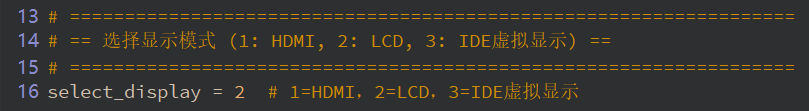

The K230 program supports two operation modes: online execution and offline execution.

**Online Execution:**

After connecting, drag the program **hand_keypoint_detection.py** into the CanMV IDE K230 code editor area, then click the run button  in the lower left corner to run the program online, as shown below:

> [!NOTE]
>
> **Programs run using this method will be lost upon disconnection or power-off and will not be saved on the development board.**


**Offline Execution:**

1)  After connecting, drag the program **hand_keypoint_detection.py** from this section's directory into the CanMV IDE K230 code editor area, click **Tools** in the toolbar, and select **Save open script to CanMV Board (as main.py)**, as shown below:


2. Click **Yes**.


3. Once the file is written, click **OK** to confirm and complete saving the MicroPython file to the K230 development board.


**With this method, the K230 development board will automatically run the MicroPython file upon power-up without connection, enabling offline execution.**

### 5.11.4 Program Outcome

In the returned video feed, detect the hand in the camera image and draw a green rectangle around it. Use different colors to mark the detected finger joints.

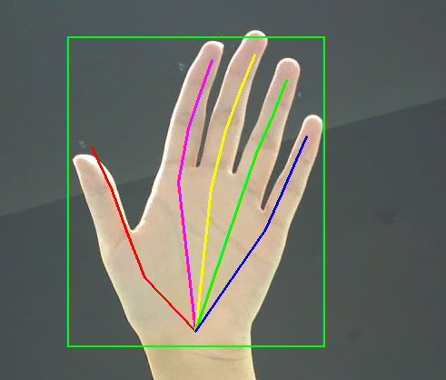

### 5.11.5 Program Analysis

* **Import Required Libraries**

```
from libs.PipeLine import PipeLine
from libs.AIBase import AIBase
from libs.AI2D import Ai2d
from libs.Utils import *
import os, sys, ujson, gc, math
from media.media import *
from media.display import Display  # Ensure SDK support
import nncase_runtime as nn
import ulab.numpy as np
import image
import `aicube`
```

* **Display Initialization Function**

```
# ==================================================================
# == Select Display Mode (1: HDMI, 2: LCD, 3: IDE Virtual Display) ==
# ==================================================================
select_display = 3  # 1=HDMI, 2=LCD, 3=IDE Virtual Display

def init_display(select_display, width, height):
    if select_display == 1:
        Display.init(Display.LT9611, width=width, height=height, to_ide=True)
        print(f"Initialize HDMI display, resolution: {width}x{height}")
    elif select_display == 2:
        Display.init(Display.ST7701, to_ide=True)
        print("Initialize LCD display, default resolution 800x480")
    elif select_display == 3:
        Display.init(Display.VIRT, width=width, height=height, fps=100, to_ide=True)
        print(f"Initialize IDE virtual display, resolution: {width}x{height}")
    else:
        raise ValueError("select_display parameter error, must be 1, 2, or 3")
```

Define a function to initialize the display, which takes three parameters: `select_display` for choosing the display type using a numeric code, `width` for the display width in pixels, and `height` for the display height in pixels.

* **Hand Detection**

```
# Custom hand detection task class
class HandDetApp(AIBase):
    def __init__(self,kmodel_path,labels,model_input_size,anchors,
                 confidence_threshold=0.2,nms_threshold=0.5,nms_option=False,
                 strides=[8,16,32],rgb888p_size=[1920,1080],display_size=[1920,1080],debug_mode=0):
        super().__init__(kmodel_path,model_input_size,rgb888p_size,debug_mode)
        self.kmodel_path = kmodel_path
        self.labels = labels
        self.model_input_size = model_input_size
        self.confidence_threshold = confidence_threshold
        self.nms_threshold = nms_threshold
        self.anchors = anchors
        self.strides = strides
        self.nms_option = nms_option
        self.rgb888p_size = [ALIGN_UP(rgb888p_size[0],16), rgb888p_size[1]]
        self.display_size = [ALIGN_UP(display_size[0],16), display_size[1]]
        self.debug_mode = debug_mode
        self.ai2d = Ai2d(debug_mode)
        self.ai2d.set_ai2d_dtype(nn.ai2d_format.NCHW_FMT,
                                 nn.ai2d_format.NCHW_FMT, np.uint8, np.uint8)

    def config_preprocess(self,input_image_size=None):
        with ScopedTiming("set preprocess config", self.debug_mode > 0):
            ai2d_input_size = input_image_size if input_image_size else self.rgb888p_size
            top, bottom, left, right, _ = center_pad_param(self.rgb888p_size, self.model_input_size)
            self.ai2d.pad([0, 0, 0, 0, top, bottom, left, right], 0, [114, 114, 114])
            self.ai2d.resize(nn.interp_method.tf_bilinear, nn.interp_mode.half_pixel)
            self.ai2d.build([1,3, ai2d_input_size[1], ai2d_input_size[0]],
                            [1,3, self.model_input_size[1], self.model_input_size[0]])

```

Define a custom hand detection task class named `HandDetApp`, which implements the complete workflow from model loading to preprocessing and post-processing.

* **Gesture Keypoint Detection**

```
# Custom hand gesture keypoint detection task class
class HandKPDetApp(AIBase):
    def __init__(self,kmodel_path,model_input_size,rgb888p_size=[1920,1080],display_size=[1920,1080],debug_mode=0):
        super().__init__(kmodel_path,model_input_size,rgb888p_size,debug_mode)
        self.kmodel_path = kmodel_path
        self.model_input_size = model_input_size
        self.rgb888p_size = [ALIGN_UP(rgb888p_size[0],16), rgb888p_size[1]]
        self.display_size = [ALIGN_UP(display_size[0],16), display_size[1]]
        self.crop_params = []
        self.debug_mode = debug_mode
        self.ai2d = Ai2d(debug_mode)
        self.ai2d.set_ai2d_dtype(nn.ai2d_format.NCHW_FMT,
                                 nn.ai2d_format.NCHW_FMT, np.uint8, np.uint8)

    def config_preprocess(self,det,input_image_size=None):
        with ScopedTiming("set preprocess config", self.debug_mode > 0):
            ai2d_input_size = input_image_size if input_image_size else self.rgb888p_size
            self.crop_params = self.get_crop_param(det)
            self.ai2d.crop(self.crop_params[0], self.crop_params[1], self.crop_params[2], self.crop_params[3])
            self.ai2d.resize(nn.interp_method.tf_bilinear, nn.interp_mode.half_pixel)
            self.ai2d.build([1,3, ai2d_input_size[1], ai2d_input_size[0]],
                            [1,3, self.model_input_size[1], self.model_input_size[0]])

    def postprocess(self,results):
        with ScopedTiming("postprocess", self.debug_mode > 0):
            results=results[0].reshape(results[0].shape[0]*results[0].shape[1])
            results_show = np.zeros(results.shape, dtype=np.int16)
            results_show[0::2] = results[0::2]*self.crop_params[3] + self.crop_params[0]
            results_show[1::2] = results[1::2]*self.crop_params[2] + self.crop_params[1]
            results_show[0::2] = results_show[0::2]*(self.display_size[0]/self.rgb888p_size[0])
            results_show[1::2] = results_show[1::2]*(self.display_size[1]/self.rgb888p_size[1])
            return results_show

```

The `HandKPDetApp` class is a custom hand keypoint detection task. It uses a YOLOv8-based keypoint model and integrates input preprocessing, post-processing of model inference, and coordinate restoration to produce hand keypoint outputs.

* **Hand Keypoint Detection**

```
# Hand keypoint detection task synthesis class
class HandKeyPointDet:
    def __init__(self, hand_det_kmodel, hand_kp_kmodel,
                 det_input_size, kp_input_size, labels, anchors,
                 confidence_threshold=0.25, nms_threshold=0.3, nms_option=False,
                 strides=[8,16,32], rgb888p_size=[1280,720], display_size=[1920,1080],
                 debug_mode=0):
        self.hand_det_kmodel = hand_det_kmodel
        self.hand_kp_kmodel = hand_kp_kmodel
        self.det_input_size = det_input_size
        self.kp_input_size = kp_input_size
        self.labels = labels
        self.anchors = anchors
        self.confidence_threshold = confidence_threshold
        self.nms_threshold = nms_threshold
        self.nms_option = nms_option
        self.strides = strides
        self.rgb888p_size = [ALIGN_UP(rgb888p_size[0],16), rgb888p_size[1]]
        self.display_size = [ALIGN_UP(display_size[0],16), display_size[1]]
        self.debug_mode = debug_mode
        self.hand_det = HandDetApp(self.hand_det_kmodel, self.labels,
                                  model_input_size=self.det_input_size, anchors=self.anchors,
                                  confidence_threshold=self.confidence_threshold, nms_threshold=self.nms_threshold,
                                  nms_option=self.nms_option, strides=self.strides,
                                  rgb888p_size=self.rgb888p_size, display_size=self.display_size, debug_mode=0)
        self.hand_kp = HandKPDetApp(self.hand_kp_kmodel,
                                    model_input_size=self.kp_input_size,
                                    rgb888p_size=self.rgb888p_size,
                                    display_size=self.display_size)
        self.hand_det.config_preprocess()
```

Define a class named `HandKeyPointDet` to implement a hand keypoint detection task using two models in sequence.

* **Main Program**

```
if __name__=="__main__":
    display_mode_map = {1:"hdmi", 2:"lcd", 3:"ide"}
    display_mode = display_mode_map.get(select_display, "hdmi")

    if display_mode == "hdmi":
        display_size = [1920,1080]
    elif display_mode == "lcd":
        display_size = [800,480]
    else:
        display_size = [1280,720]
```

1. Map the numeric value of `select_display` to the corresponding display name using a dictionary. Set the resolution according to the display type: 1080p for HDMI, 800×480 for LCD which is common for small to medium screens, and 1280×720 for the IDE virtual display.

```
    rgb888p_size = [1280,720]
    hand_det_kmodel_path = "/sdcard/examples/kmodel/hand_det.kmodel"
    hand_kp_kmodel_path = "/sdcard/examples/kmodel/handkp_det.kmodel"
    anchors = [26,27, 53,52, 75,71, 80,99, 106,82, 99,134, 140,113, 161,172, 245,276]
    hand_det_input_size = [512,512]
    hand_kp_input_size = [256,256]
    confidence_threshold = 0.2
    nms_threshold = 0.5
    labels = ["hand"]
```

2. Specify the file paths and input sizes for the hand detection and keypoint models. Configure the anchor box parameters for decoding detection boxes during post-processing. Set the confidence and NMS thresholds to adjust the sensitivity of detection filtering. The label is set to `"hand"`, indicating that only hands are detected.

```
    pl = PipeLine(rgb888p_size=rgb888p_size, display_mode=display_mode)
    pl.create()
    display_size = pl.get_display_size()
```

3. Instantiate the video capture pipeline, combining RGB data and the type of display device. Call `create()` to start the device and drivers, and retrieve the display device’s resolution synchronously.

```
    hkd = HandKeyPointDet(hand_det_kmodel_path, hand_kp_kmodel_path,
                         det_input_size=hand_det_input_size, kp_input_size=hand_kp_input_size,
                         labels=labels, anchors=anchors,
                         confidence_threshold=confidence_threshold, nms_threshold=nms_threshold,
                         nms_option=False, strides=[8,16,32],
                         rgb888p_size=rgb888p_size, display_size=display_size)
```

4. Create a detection object that links two models in sequence to perform bounding box detection and keypoint inference within the boxes. Provide the input sizes for both the detection and keypoint models, along with the relevant thresholds and anchor parameters.

```python
    try:
        while True:
            with ScopedTiming("total", 1):
                img = pl.get_frame()                          # Capture current frame
                det_boxes, hand_res = hkd.run(img)            # Run detection and keypoint inference
                hkd.draw_result(pl, det_boxes, hand_res)      # Draw results on display
                pl.show_image()                               # Display the image
                gc.collect()                                  # Trigger garbage collection
    except KeyboardInterrupt:
        print("User interrupted program")  # Program stopped by user
    finally:
        hkd.hand_det.deinit()                                # Release hand detection resources
        hkd.hand_kp.deinit()                                 # Release keypoint detection resources
        pl.destroy()                                          # Destroy pipeline
        deinit_display()                                      # Release display resources
```

5)  Enter an infinite loop to continuously capture camera frames and perform full inference using `hkd.run()`, which first detects the hand and then predicts keypoints within the detected region. Draw the detection boxes and keypoints on the display buffer, display the resulting frame, and manually trigger garbage collection to maintain system stability. Press **Ctrl+C** to safely stop the process and release all device and model resources.


## 5.12 Hand Keypoint Classification

### 5.12.1 Experiment Overview

This section demonstrates the hand keypoint classification functionality of the K230 development board through programming.

### 5.12.2 Preparation

* **Module Connection**

1)  Connect the K230 development board to your PC using a Type-C data cable, as shown below:

    

2)  Double-click to open CanMV IDE K230.

    

3)  Click the connection button in the lower left corner.

    

4)  Upon successful connection, the icon in the lower left corner of CanMV IDE will change to the following:


5)  If the connection takes more than 10 seconds, it indicates a connection failure. Click the **Cancel** button, and a pop-up window will appear. Click **OK** and recheck the connection.


> [!NOTE]
>
> **Connection Failure Causes and Solutions:**
>
> * **Cable is not a data cable: Some Type-C cables are charging-only cables without data transfer capability. Please use a Type-C cable with data transfer functionality. The factory-supplied cable is a Type-C data cable.**
>
> * **Other K230 firmware was flashed: Re-flash the factory firmware, then reconnect.**

### 5.12.3 Program Execution and Download

**Display Mode Configuration:**

The program can use the `select_display=""` parameter to choose the display mode: HDMI, LCD, or IDE virtual.


The K230 program supports two operation modes: online execution and offline execution.

**Online Execution:**

After connecting, drag the program **hand_keypoint_class.py** into the CanMV IDE K230 code editor area, then click the run button  in the lower left corner to run the program online, as shown below:

> [!NOTE]
>
> **Programs run using this method will be lost upon disconnection or power-off and will not be saved on the development board.**


**Offline Execution:**

1)  After connecting, drag the program **hand_keypoint_class.py** into the CanMV IDE K230 code editor area, click **Tools** in the toolbar, and select **Save open script to CanMV Board (as main.py)**, as shown below:


2. Click **Yes**.


3. Once the file is written, click **OK** to confirm and complete saving the MicroPython file to the K230 development board.


**With this method, the K230 development board will automatically run the MicroPython file upon power-up without connection, enabling offline execution.**

### 5.12.4 Program Outcome

In the returned video feed, detect the hand and its joints from the camera image, and infer the corresponding hand gesture.

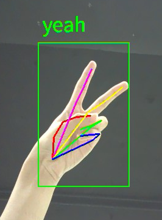

### 5.12.5 Program Analysis

* **Import Required Libraries**

```
from libs.PipeLine import PipeLine
from libs.AIBase import AIBase
from libs.AI2D import Ai2d
from libs.Utils import *
import os, sys, ujson, gc, math
from media.media import *
from media.display import Display  # Ensure SDK support
import nncase_runtime as nn
import ulab.numpy as np
import image
import `aicube`
```

* **Display Initialization Function**

```python
# ==================================================================
# == Select Display Mode (1: HDMI, 2: LCD, 3: IDE Virtual Display) ==
# ==================================================================
select_display = 3  # 1=HDMI, 2=LCD, 3=IDE Virtual Display

def init_display(select_display, width, height):
    if select_display == 1:
        Display.init(Display.LT9611, width=width, height=height, to_ide=True)
        print(f"Initialize HDMI display, resolution: {width}x{height}")
    elif select_display == 2:
        Display.init(Display.ST7701, to_ide=True)
        print("Initialize LCD display, default resolution 800x480")
    elif select_display == 3:
        Display.init(Display.VIRT, width=width, height=height, fps=100, to_ide=True)
        print(f"Initialize IDE virtual display, resolution: {width}x{height}")
    else:
        raise ValueError("select_display parameter error, must be 1, 2, or 3")
```

Define a function to initialize the display, which takes three parameters: `select_display` for choosing the display type using a numeric code, `width` for the display width in pixels, and `height` for the display height in pixels.

* **Hand Detection**

```python
# Custom hand detection task class
class HandDetApp(AIBase):
    def __init__(self,kmodel_path,labels,model_input_size,anchors,
                 confidence_threshold=0.2,nms_threshold=0.5,nms_option=False,
                 strides=[8,16,32],rgb888p_size=[1920,1080],display_size=[1920,1080],
                 debug_mode=0):
        super().__init__(kmodel_path,model_input_size,rgb888p_size,debug_mode)
        self.kmodel_path = kmodel_path
        self.labels = labels
        self.model_input_size = model_input_size
        self.confidence_threshold = confidence_threshold
        self.nms_threshold = nms_threshold
        self.anchors = anchors
        self.strides = strides
        self.nms_option = nms_option
        self.rgb888p_size = [ALIGN_UP(rgb888p_size[0],16), rgb888p_size[1]]
        self.display_size = [ALIGN_UP(display_size[0],16), display_size[1]]
        self.debug_mode = debug_mode
        self.ai2d = Ai2d(debug_mode)
        self.ai2d.set_ai2d_dtype(nn.ai2d_format.NCHW_FMT,
                                 nn.ai2d_format.NCHW_FMT, np.uint8, np.uint8)

    def config_preprocess(self,input_image_size=None):
        with ScopedTiming("set preprocess config", self.debug_mode > 0):
            ai2d_input_size = input_image_size if input_image_size else self.rgb888p_size
            top, bottom, left, right, _ = center_pad_param(self.rgb888p_size, self.model_input_size)
            self.ai2d.pad([0,0,0,0,top,bottom,left,right], 0, [114,114,114])
            self.ai2d.resize(nn.interp_method.tf_bilinear, nn.interp_mode.half_pixel)
            self.ai2d.build([1,3, ai2d_input_size[1], ai2d_input_size[0]],
                            [1,3, self.model_input_size[1], self.model_input_size[0]])
```

Define a hand detection task class `HandDetApp` based on anchor boxes, which handles the complete workflow including model initialization, image preprocessing configuration, and post-processing of inference results.

* **Custom Hand Gesture Keypoint Classification**

```
# Custom hand gesture keypoint classification task class
class HandKPClassApp(AIBase):
    def __init__(self,kmodel_path,model_input_size,
                 rgb888p_size=[1920,1080], display_size=[1920,1080], debug_mode=0):
        super().__init__(kmodel_path,model_input_size,rgb888p_size,debug_mode)
        self.kmodel_path = kmodel_path                        # Model path
        self.model_input_size = model_input_size              # Model input size
        self.rgb888p_size = [ALIGN_UP(rgb888p_size[0],16), rgb888p_size[1]]  # RGB image size
        self.display_size = [ALIGN_UP(display_size[0],16), display_size[1]]  # Display size
        self.crop_params = []                                 # Crop parameters
        self.debug_mode = debug_mode                          # Debug mode flag
        self.ai2d = Ai2d(debug_mode)                          # AI2D preprocessor
        self.ai2d.set_ai2d_dtype(nn.ai2d_format.NCHW_FMT,
                                 nn.ai2d_format.NCHW_FMT, np.uint8, np.uint8)

    def config_preprocess(self,det,input_image_size=None):
        with ScopedTiming("set preprocess config", self.debug_mode > 0):
            ai2d_input_size = input_image_size if input_image_size else self.rgb888p_size
            self.crop_params = self.get_crop_param(det)
            self.ai2d.crop(self.crop_params[0], self.crop_params[1], self.crop_params[2], self.crop_params[3])
            self.ai2d.resize(nn.interp_method.tf_bilinear, nn.interp_mode.half_pixel)
            self.ai2d.build([1,3, ai2d_input_size[1], ai2d_input_size[0]],
                            [1,3, self.model_input_size[1], self.model_input_size[0]])

    def postprocess(self,results):
        with ScopedTiming("postprocess", self.debug_mode > 0):
            results = results[0].reshape(results[0].shape[0]*results[0].shape[1])
            results_show = np.zeros(results.shape, dtype=np.int16)
            results_show[0::2] = results[0::2] * self.crop_params[3] + self.crop_params[0]
            results_show[1::2] = results[1::2] * self.crop_params[2] + self.crop_params[1]
            gesture = self.hk_gesture(results_show)
            results_show[0::2] = results_show[0::2] * (self.display_size[0]/self.rgb888p_size[0])
            results_show[1::2] = results_show[1::2] * (self.display_size[1]/self.rgb888p_size[1])
            return results_show, gesture
```

Define a custom hand keypoint classification task class `HandKPClassApp`, which inherits from the base AI class and performs keypoint detection and gesture classification based on hand detection results.

* **Main Program**

```python
    display_mode_map = {1:"hdmi", 2:"lcd", 3:"ide"}
    display_mode = display_mode_map.get(select_display, "hdmi")

    if display_mode == "hdmi":
        display_size = [1920,1080]
    elif display_mode == "lcd":
        display_size = [800,480]
    else:
        display_size = [1280,720]
```

1. Map the `select_display` value to the corresponding display device using a dictionary. Set the resolution based on the display type: HDMI is 1080p full HD, LCD is 800×480 for common small to medium screens, and the IDE virtual display is 1280×720.

```python
    rgb888p_size = [1280,720]                      # Input image resolution
    hand_det_kmodel_path = "/sdcard/examples/kmodel/hand_det.kmodel"      # Hand detection model path
    hand_kp_kmodel_path = "/sdcard/examples/kmodel/handkp_det.kmodel"     # Hand keypoint model path
    anchors = [26,27,53,52,75,71,80,99,106,82,99,134,140,113,161,172,245,276]  # Anchor boxes
    hand_det_input_size = [512,512]                # Detection model input size
    hand_kp_input_size = [256,256]                 # Keypoint model input size
    confidence_threshold = 0.2                      # Confidence threshold
    nms_threshold = 0.5                             # NMS threshold
    labels = ["hand"]                               # Detection labels
```

2. Define the RGB input image size and display resolution. Specify the paths for the gesture detection model and the hand keypoint model. Use the anchor box array in conjunction with the detection model’s post-processing. Set the confidence and NMS thresholds to control detection and filtering sensitivity. The label list contains only `"hand"`, indicating that only hands are detected.

```python
    pl = PipeLine(rgb888p_size=rgb888p_size, display_mode=display_mode)  # Create pipeline
    pl.create()                                                            # Initialize pipeline
    display_size = pl.get_display_size()                                   # Get display size
```

3. Build the pipeline for image capture, AI inference, and display, start the pipeline, and obtain the actual display size.

```python
    hkc = HandKeyPointClass(                       # Create hand keypoint detection object
        hand_det_kmodel_path,
        hand_kp_kmodel_path,
        det_input_size=hand_det_input_size,
        kp_input_size=hand_kp_input_size,
        labels=labels,
        anchors=anchors,
        confidence_threshold=confidence_threshold,
        nms_threshold=nms_threshold,
        nms_option=False,
        strides=[8,16,32],
        rgb888p_size=rgb888p_size,
        display_size=display_size,
        debug_mode=0
    )
```

4. Create a two-stage detection task object using the paths of the detection model and the keypoint model. Configure the input size, model anchors, thresholds, stride, and display parameters. The class first detects the hand bounding box and then predicts keypoints within that box.

```
    try:
        while True:
            with ScopedTiming("total",1):
                img = pl.get_frame()                          # Capture current frame
                det_boxes, gesture_res = hkc.run(img)        # Run inference on current frame
                hkc.draw_result(pl, det_boxes, gesture_res)  # Draw inference results for current frame
                pl.show_image()                              # Display inference results
                gc.collect()                                 # Trigger garbage collection
    except KeyboardInterrupt:
        print("User interrupted program")  # Program stopped by user
    finally:
        hkc.hand_det.deinit()
        hkc.hand_kp.deinit()
        pl.destroy()
        deinit_display()
```

5)  In the main loop, continuously retrieve real-time image frames from the camera pipeline and use `HandKeyPointClass` to run the detection and keypoint inference process. Draw the inference results onto the screen buffer and display the rendered image to provide real-time feedback. Manually trigger garbage collection in the loop to prevent memory leaks, and allow the user to safely exit with **Ctrl+C**, releasing all model and hardware resources in the destructor.


## 5.13 Dynamic Gesture Recognition

### 5.13.1 Experiment Overview

This section demonstrates the dynamic gesture recognition functionality of the K230 development board through programming.

### 5.13.2 Preparation

* **Module Connection**

1)  Connect the K230 development board to your PC using a Type-C data cable, as shown below:

    

2)  Double-click to open CanMV IDE K230.

    

3)  Click the connection button in the lower left corner.

    

4)  Upon successful connection, the icon in the lower left corner of CanMV IDE will change to the following:


5)  If the connection takes more than 10 seconds, it indicates a connection failure. Click the **Cancel** button, and a pop-up window will appear. Click **OK** and recheck the connection.


> [!NOTE]
>
> **Connection Failure Causes and Solutions:**
>
> * **Cable is not a data cable: Some Type-C cables are charging-only cables without data transfer capability. Please use a Type-C cable with data transfer functionality. The factory-supplied cable is a Type-C data cable.**
>
> * **Other K230 firmware was flashed: Re-flash the factory firmware, then reconnect.**

### 5.13.3 Program Execution and Download

**Display Mode Configuration:**

The program can use the `select_display=""` parameter to choose the display mode: HDMI, LCD, or IDE virtual.


The K230 program supports two operation modes: online execution and offline execution.

**Online Execution:**

After connecting, drag the program **hand_keypoint_class.py** into the CanMV IDE K230 code editor area, then click the run button  in the lower left corner to run the program online, as shown below:

> [!NOTE]
>
> **Programs run using this method will be lost upon disconnection or power-off and will not be saved on the development board.**


**Offline Execution:**

1)  After connecting, drag the program **hand_keypoint_class.py** into the CanMV IDE K230 code editor area, click **Tools** in the toolbar, and select **Save open script to CanMV Board (as main.py)**, as shown below:

    

    2. Click **Yes**.

    

    3. Once the file is written, click **OK** to confirm and complete saving the MicroPython file to the K230 development board.

    

    **With this method, the K230 development board will automatically run the MicroPython file upon power-up without connection, enabling offline execution.**

### 5.13.3 Program Outcome

In the returned video feed, infer the corresponding hand gesture from the hand captured by the camera.

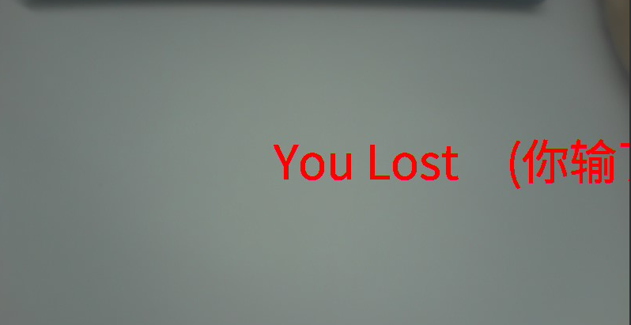

### 5.13.4 Program Analysis

* **Import Required Libraries**

```
from libs.PipeLine import PipeLine
from libs.AIBase import AIBase
from libs.AI2D import Ai2d
from libs.Utils import *
import os, sys, ujson, gc, math, time
from media.media import *
import nncase_runtime as nn
import ulab.numpy as np
import image
import `aicube`
from media.media import *
from media.display import *
select_display = 3
```

* **Display Initialization Function**

```
def init_display(select_display):
    if select_display == 1:
        width, height = 640, 480
        Display.init(Display.LT9611, width=width, height=height, to_ide=True)
        print(f"Initialize HDMI display, resolution: {width}x{height}")
    elif select_display == 2:
        width, height = 800, 480
        Display.init(Display.ST7701, width=width, height=height, to_ide=True)
        print(f"Initialize LCD display, resolution: {width}x{height}")
    elif select_display == 3:
        width, height = 800, 480
        Display.init(Display.VIRT, width=width, height=height, fps=100, to_ide=True)
        print(f"Initialize IDE virtual display, resolution: {width}x{height}")
    else:
        raise ValueError("select_display parameter error, must be 1, 2, or 3")
    return width, height
```

Define a function to initialize the display. It takes one parameter, `select_display`, which specifies the display type using a numeric code, and returns the display width and height in pixels.

* **Hand Detection Class HandDetApp**

```
class HandDetApp(AIBase):
    def __init__(self,kmodel_path,labels,model_input_size,anchors,confidence_threshold=0.2,nms_threshold=0.5,nms_option=False,strides=[8,16,32],rgb888p_size=[1920,1080],display_size=[1920,1080],debug_mode=0):
        super().__init__(kmodel_path,model_input_size,rgb888p_size,debug_mode)
        self.kmodel_path=kmodel_path
        self.labels=labels
        self.model_input_size=model_input_size
        self.confidence_threshold=confidence_threshold
        self.nms_threshold=nms_threshold
        self.anchors=anchors
        self.strides = strides
        self.nms_option = nms_option
        self.rgb888p_size=[ALIGN_UP(rgb888p_size[0],16),rgb888p_size[1]]
        self.display_size=[ALIGN_UP(display_size[0],16),display_size[1]]
        self.debug_mode=debug_mode
        self.ai2d=Ai2d(debug_mode)
        self.ai2d.set_ai2d_dtype(nn.ai2d_format.NCHW_FMT,nn.ai2d_format.NCHW_FMT,np.uint8, np.uint8)

    def config_preprocess(self,input_image_size=None):
        with ScopedTiming("set preprocess config",self.debug_mode > 0):
            ai2d_input_size = input_image_size if input_image_size else self.rgb888p_size
            top, bottom, left, right,_ = center_pad_param(self.rgb888p_size,self.model_input_size)
            self.ai2d.pad([0, 0, 0, 0, top, bottom, left, right], 0, [114, 114, 114])
            self.ai2d.resize(nn.interp_method.tf_bilinear, nn.interp_mode.half_pixel)
            self.ai2d.build([1,3,ai2d_input_size[1],ai2d_input_size[0]],[1,3,self.model_input_size[1],self.model_input_size[0]])

    def postprocess(self,results):
        with ScopedTiming("postprocess",self.debug_mode > 0):
            dets = `aicube`.anchorbasedet_post_process(results[0], results[1], results[2], self.model_input_size, self.rgb888p_size, self.strides, len(self.labels), self.confidence_threshold, self.nms_threshold, self.anchors, self.nms_option)
            return dets
```

Perform hand detection on the images captured by the camera and return the hand bounding box in the format (x1, y1, x2, y2).

* **Dynamic Gesture Recognition Class DynamicGestureApp**

```
class HandKPClassApp(AIBase):
    def __init__(self,kmodel_path,model_input_size,rgb888p_size=[1920,1080],display_size=[1920,1080],debug_mode=0):
        super().__init__(kmodel_path,model_input_size,rgb888p_size,debug_mode)
        self.kmodel_path=kmodel_path
        self.model_input_size=model_input_size
        self.rgb888p_size=[ALIGN_UP(rgb888p_size[0],16),rgb888p_size[1]]
        self.display_size=[ALIGN_UP(display_size[0],16),display_size[1]]
        self.crop_params=[]
        self.debug_mode=debug_mode
        self.ai2d=Ai2d(debug_mode)
        self.ai2d.set_ai2d_dtype(nn.ai2d_format.NCHW_FMT,nn.ai2d_format.NCHW_FMT,np.uint8, np.uint8)

    def config_preprocess(self,det,input_image_size=None):
        with ScopedTiming("set preprocess config",self.debug_mode > 0):
            ai2d_input_size=input_image_size if input_image_size else self.rgb888p_size
            self.crop_params = self.get_crop_param(det)
            self.ai2d.crop(self.crop_params[0],self.crop_params[1],self.crop_params[2],self.crop_params[3])
            self.ai2d.resize(nn.interp_method.tf_bilinear, nn.interp_mode.half_pixel)
            self.ai2d.build([1,3,ai2d_input_size[1],ai2d_input_size[0]],[1,3,self.model_input_size[1],self.model_input_size[0]])

```

Use the hand bounding box returned by the `HandDetApp` class as input to perform dynamic gesture recognition and return the gesture category, such as up, down, left, or right.

* **Main Program**

```
if __name__=="__main__":
    width, height = init_display(select_display)
    display_mode_map = {1:"hdmi", 2:"lcd", 3:"ide"}
    display_mode = display_mode_map.get(select_display, "lcd")
    rgb888p_size = [1920,1080]

    pl=PipeLine(rgb888p_size=rgb888p_size, display_mode=display_mode)
    pl.create()
    display_size=pl.get_display_size()

    hand_det_kmodel_path="/sdcard/examples/kmodel/hand_det.kmodel"
    hand_kp_kmodel_path="/sdcard/examples/kmodel/handkp_det.kmodel"
    gesture_kmodel_path="/sdcard/examples/kmodel/gesture.kmodel"
    hand_det_input_size=[512,512]
    hand_kp_input_size=[256,256]
    gesture_input_size=[224,224]
    confidence_threshold=0.2
    nms_threshold=0.5
    labels=["hand"]
    anchors=[26,27,53,52,75,71,80,99,106,82,99,134,140,113,161,172,245,276]

    dg=DynamicGesture(
        hand_det_kmodel_path, hand_kp_kmodel_path, gesture_kmodel_path,
        det_input_size=hand_det_input_size, kp_input_size=hand_kp_input_size, gesture_input_size=gesture_input_size,
        labels=labels, anchors=anchors, confidence_threshold=confidence_threshold,
        nms_threshold=nms_threshold, nms_option=False, strides=[8,16,32],
        rgb888p_size=rgb888p_size, display_size=display_size
    )

```

1)  `rgb888p_size = [1920,1080]` defines the resolution used for initializing camera sampling.

2)  `hand_det_kmodel_path = "/sdcard/examples/kmodel/hand_det.kmodel"` defines the model path.

3)  `hand_det_input_size = [512,512]` defines the model input size.

4. `dg=DynamicGesture()` creates the business-layer object that manages all three sub-models in a unified workflow, such as detection, keypoints, and dynamic gestures.

```
    try:
        while True:
            with ScopedTiming("total",1):
                img=pl.get_frame()
                output1,output2=dg.run(img)
                dg.draw_result(pl,output1,output2)
                pl.show_image()
                gc.collect()
    except KeyboardInterrupt:
        pass
    finally:
        dg.hand_det.deinit()
        dg.hand_kp.deinit()
        dg.dg.deinit()
        pl.destroy()
        deinit_display()
```

5)  `img=pl.get_frame()` captures one RGB image frame.

6)  `dg.draw_result(pl, output1, output2)` overlays arrows, prompt images, or text to the OSD layer based on current state and inference results.

7)  `pl.show_image()` displays a frame on the screen by compositing the OSD onto the display layer.

8)  Build a pipeline for image capture, AI inference, and display, then start the pipeline and retrieve the actual display size.

9)  Create a two-stage detection task object using the paths of the detection and keypoint models. Configure the input size, model anchors, thresholds, stride, and display parameters. The class first detects the hand bounding box and then predicts keypoints within that box.

10) `finally`: Manually perform garbage collection in the loop to prevent memory leaks. Press Ctrl+C to safely exit, which triggers the destructor to release all model and hardware resources.


## 5.14 Rock-Paper-Scissors

### 5.14.1 Experiment Overview

This section demonstrates the rock-paper-scissors game functionality using gesture recognition on the K230 development board through programming.

### 5.14.2 Preparation

* **Module Connection** | **Module Connection**

1)  Connect the K230 development board to your PC using a Type-C data cable, as shown below:

    

2)  Double-click to open CanMV IDE K230.

    

3)  Click the connection button in the lower left corner.

    

4)  Upon successful connection, the icon in the lower left corner of CanMV IDE will change to the following:


5)  If the connection takes more than 10 seconds, it indicates a connection failure. Click the **Cancel** button, and a pop-up window will appear. Click **OK** and recheck the connection.


> [!NOTE]
>
> **Connection Failure Causes and Solutions:**
>
> * **Cable is not a data cable: Some Type-C cables are charging-only cables without data transfer capability. Please use a Type-C cable with data transfer functionality. The factory-supplied cable is a Type-C data cable.**
>
> * **Other K230 firmware was flashed: Re-flash the factory firmware, then reconnect.**

### 5.14.3 Program Execution and Download

**Display Mode Configuration:**

The program can use the `select_display=""` parameter to choose the display mode: HDMI, LCD, or IDE virtual.


The K230 program supports two operation modes: online execution and offline execution.

**Online Execution:**

After connecting, drag the program **hand_keypoint_class.py** into the CanMV IDE K230 code editor area, then click the run button  in the lower left corner to run the program online, as shown below:

> [!NOTE]
>
> **Programs run using this method will be lost upon disconnection or power-off and will not be saved on the development board.**


**Offline Execution:**

1)  After connecting, drag the program **hand_keypoint_class.py** into the CanMV IDE K230 code editor area, click **Tools** in the toolbar, and select **Save open script to CanMV Board (as main.py)**, as shown below:

    

2)  Click **Yes**.

    

3)  Once the file is written, click **OK** to confirm and complete saving the MicroPython file to the K230 development board.

    

    **With this download method, when you subsequently power on the K230 development board without connecting it, the board will run the MicroPython file, enabling offline operation.** | **With this method, the K230 development board will automatically run the MicroPython file upon power-up without connection, enabling offline execution.**

### 5.14.4 Program Outcome

In the returned video feed, detect the hand from the camera image, recognize the corresponding gesture, and draw the robot’s randomly chosen ‘rock-paper-scissors’ move. Record both the player’s and the robot’s moves, then analyze and output the result.


### 5.14.5 Program Analysis

* **Import Required Libraries**

```
from libs.PipeLine import PipeLine
from libs.AIBase import AIBase
from libs.AI2D import Ai2d
from libs.Utils import *
import os,sys,ujson,gc,math
from random import randint
from media.media import *
import nncase_runtime as nn
import ulab.numpy as np
import image
import `aicube`
import aidemo
from media.media import *
from media.display import *
```

* **Display Initialization Function**

```
def init_display(select_display):
    if select_display == 1:
        width, height = 640, 480
        Display.init(Display.LT9611, width=width, height=height, to_ide=True)
        print(f"Initialize HDMI display, resolution: {width}x{height}")
    elif select_display == 2:
        width, height = 800, 480
        Display.init(Display.ST7701, width=width, height=height, to_ide=True)
        print(f"Initialize LCD display, resolution: {width}x{height}")
    elif select_display == 3:
        width, height = 1920, 1080
        Display.init(Display.VIRT, width=width, height=height, fps=100, to_ide=True)
        print(f"Initialize IDE virtual display, resolution: {width}x{height}")
    else:
        raise ValueError("select_display parameter error, must be 1, 2, or 3")
    return width, height
```

Define a function to initialize the display. It takes one parameter, `select_display`, which specifies the display type using a numeric code, and returns the display width and height in pixels.

* **Hand Detection Class HandDetApp**

```
# Custom hand detection task class
class HandDetApp(AIBase):
    def __init__(self,kmodel_path,labels,model_input_size,anchors,confidence_threshold=0.2,nms_threshold=0.5,nms_option=False, strides=[8,16,32],rgb888p_size=[1920,1080],display_size=[1920,1080],debug_mode=0):
        super().__init__(kmodel_path,model_input_size,rgb888p_size,debug_mode)
        self.kmodel_path=kmodel_path
        self.labels=labels
        self.model_input_size=model_input_size
        self.confidence_threshold=confidence_threshold
        self.nms_threshold=nms_threshold
        self.anchors=anchors
        self.strides = strides
        self.nms_option = nms_option
        self.rgb888p_size=[ALIGN_UP(rgb888p_size[0],16),rgb888p_size[1]]
        self.display_size=[ALIGN_UP(display_size[0],16),display_size[1]]
        self.debug_mode=debug_mode
        self.ai2d=Ai2d(debug_mode)
        self.ai2d.set_ai2d_dtype(nn.ai2d_format.NCHW_FMT,nn.ai2d_format.NCHW_FMT,np.uint8, np.uint8)

    def config_preprocess(self,input_image_size=None):
        with ScopedTiming("set preprocess config",self.debug_mode > 0):
            ai2d_input_size = input_image_size if input_image_size else self.rgb888p_size
            top, bottom, left, right,_ = center_pad_param(self.rgb888p_size,self.model_input_size)
            self.ai2d.pad([0, 0, 0, 0, top, bottom, left, right], 0, [114, 114, 114])
            self.ai2d.resize(nn.interp_method.tf_bilinear, nn.interp_mode.half_pixel)
            self.ai2d.build([1,3,ai2d_input_size[1],ai2d_input_size[0]],[1,3,self.model_input_size[1],self.model_input_size[0]])

    def postprocess(self,results):
        with ScopedTiming("postprocess",self.debug_mode > 0):
            dets = `aicube`.anchorbasedet_post_process(results[0], results[1], results[2], self.model_input_size, self.rgb888p_size, self.strides, len(self.labels), self.confidence_threshold, self.nms_threshold, self.anchors, self.nms_option)
            return dets
```

Perform hand detection on the images captured by the camera and return the hand bounding box in the format (x1, y1, x2, y2).

* **HandKPClassApp Hand Gesture Keypoint Classification Task Class**

```
# Custom hand gesture keypoint classification task class
class HandKPClassApp(AIBase):
    def __init__(self,kmodel_path,model_input_size,rgb888p_size=[1920,1080],display_size=[1920,1080],debug_mode=0):
        super().__init__(kmodel_path,model_input_size,rgb888p_size,debug_mode)
        self.kmodel_path=kmodel_path
        self.model_input_size=model_input_size
        self.rgb888p_size=[ALIGN_UP(rgb888p_size[0],16),rgb888p_size[1]]
        self.display_size=[ALIGN_UP(display_size[0],16),display_size[1]]
        self.crop_params=[]
        self.debug_mode=debug_mode
        self.ai2d=Ai2d(debug_mode)
        self.ai2d.set_ai2d_dtype(nn.ai2d_format.NCHW_FMT,nn.ai2d_format.NCHW_FMT,np.uint8, np.uint8)

    def config_preprocess(self,det,input_image_size=None):
        with ScopedTiming("set preprocess config",self.debug_mode > 0):
            ai2d_input_size=input_image_size if input_image_size else self.rgb888p_size
            self.crop_params = self.get_crop_param(det)
            self.ai2d.crop(self.crop_params[0],self.crop_params[1],self.crop_params[2],self.crop_params[3])
            self.ai2d.resize(nn.interp_method.tf_bilinear, nn.interp_mode.half_pixel)
            self.ai2d.build([1,3,ai2d_input_size[1],ai2d_input_size[0]],[1,3,self.model_input_size[1],self.model_input_size[0]])
```

Use the hand bounding box returned by the `HandDetApp` class to perform hand keypoint detection. Calculate joint angles based on the keypoints and determine the specific hand gesture.

* **FingerGuess Rock-Paper-Scissors Task Class**

```
if __name__=="__main__":
    width, height = init_display(select_display)
    display_mode_map = {"hdmi":"hdmi", "lcd":"lcd", "lt9611":"hdmi", "st7701":"lcd","hx8399":"lcd"}
    display_mode = display_mode_map.get("lcd")  # Default by HDMI, can be changed to LCD based on requirements
    rgb888p_size = [1280, 720]
    hand_det_kmodel_path="/sdcard/examples/kmodel/hand_det.kmodel"
    hand_kp_kmodel_path="/sdcard/examples/kmodel/handkp_det.kmodel"
    anchors = [26,27, 53,52, 75,71, 80,99, 106,82, 99,134, 140,113, 161,172, 245,276]
    hand_det_input_size=[512,512]
    hand_kp_input_size=[256,256]
    confidence_threshold=0.2
    nms_threshold=0.5
    labels=["hand"]
    guess_mode = 3

    pl=PipeLine(rgb888p_size=rgb888p_size,display_mode=display_mode)
    pl.create()
    display_size=pl.get_display_size()

    hkc=FingerGuess(hand_det_kmodel_path,hand_kp_kmodel_path,det_input_size=hand_det_input_size,kp_input_size=hand_kp_input_size,
                    labels=labels,anchors=anchors,confidence_threshold=confidence_threshold,nms_threshold=nms_threshold,nms_option=False,
                    strides=[8,16,32],guess_mode=guess_mode,rgb888p_size=rgb888p_size,display_size=display_size)

```

Perform hand detection and keypoint recognition to play a rock-paper-scissors game, and display text and prompts on the screen.

* **Main Program**

```
if __name__=="__main__":
    width, height = init_display(select_display)
    display_mode_map = {"hdmi":"hdmi", "lcd":"lcd", "lt9611":"hdmi", "st7701":"lcd","hx8399":"lcd"}
    display_mode = display_mode_map.get("lcd")  # Default by HDMI, can be changed to LCD based on requirements
    rgb888p_size = [1280, 720]
    hand_det_kmodel_path="/sdcard/examples/kmodel/hand_det.kmodel"
    hand_kp_kmodel_path="/sdcard/examples/kmodel/handkp_det.kmodel"
    anchors = [26,27, 53,52, 75,71, 80,99, 106,82, 99,134, 140,113, 161,172, 245,276]
    hand_det_input_size=[512,512]
    hand_kp_input_size=[256,256]
    confidence_threshold=0.2
    nms_threshold=0.5
    labels=["hand"]
    guess_mode = 3

    pl=PipeLine(rgb888p_size=rgb888p_size,display_mode=display_mode)
    pl.create()
    display_size=pl.get_display_size()

    hkc=FingerGuess(hand_det_kmodel_path,hand_kp_kmodel_path,det_input_size=hand_det_input_size,kp_input_size=hand_kp_input_size,
                    labels=labels,anchors=anchors,confidence_threshold=confidence_threshold,nms_threshold=nms_threshold,nms_option=False,
                    strides=[8,16,32],guess_mode=guess_mode,rgb888p_size=rgb888p_size,display_size=display_size)

```

1. `rgb888p_size = [128,720]` defines the resolution used for initializing camera sampling.

2. `hand_kp_kmodel_path="/sdcard/examples/kmodel/handkp_det.kmodel"` defines the model path

3. `hand_det_input_size = [512,512]` defines the model input size.

4. `pl=PipeLine(rgb888p_size=rgb888p_size,display_mode=display_mode` creates a video object.

5. `pl.create()` initializes the video object.

6. `display_size=pl.get_display_size()` gets the actual display size.

```
       try:
           while True:
               with ScopedTiming("total",1):
                   img=pl.get_frame()
                   det_boxes,gesture_res=hkc.run(img)
                   hkc.draw_result(pl,det_boxes,gesture_res)
                   pl.show_image()
                   gc.collect()
       except KeyboardInterrupt:
           pass
       finally:
           hkc.hand_det.deinit()
           hkc.hand_kp.deinit()
           pl.destroy()
           deinit_display()
```

7. `img=pl.get_frame()` captures one RGB image frame.

8. Use `det_boxes, gesture_res = hkc.run(img)` to run `FingerGuess`, which performs hand detection, then keypoint recognition, and finally outputs the gesture result.

9. `dg.draw_result(pl, output1, output2)` overlays arrows, prompt images, or text to the OSD layer based on current state and inference results.

10. Use `hkc.draw_result(pl, det_boxes, gesture_res)` to render the results on the OSD layer, showing prompts, images, and scores according to the detected gesture or mode.

11. Use `pl.show_image()` to render a frame to the screen with the OSD overlaid on the display layer.

12. `finally`: Manually perform garbage collection in the loop to prevent memory leaks. Press Ctrl+C to safely exit, which triggers the destructor to release all model and hardware resources.


## 5.15 License Plate Detection

### 5.15.1 Experiment Overview

This section demonstrates license plate detection functionality on the K230 development board through programming, using rectangular boxes to indicate detected plates.

### 5.15.2 Preparation

* **Module Connection** | **Module Connection**

1)  Connect the K230 development board to your PC using a Type-C data cable, as shown below:

    

2)  Double-click to open CanMV IDE K230.

    

3)  Click the connection button in the lower left corner.

    

4)  Upon successful connection, the icon in the lower left corner of CanMV IDE will change to the following:


5)  If the connection takes more than 10 seconds, it indicates a connection failure. Click the **Cancel** button, and a pop-up window will appear. Click **OK** and recheck the connection.


> [!NOTE]
>
> **Connection Failure Causes and Solutions:**
>
> * **Cable is not a data cable: Some Type-C cables are charging-only cables without data transfer capability. Please use a Type-C cable with data transfer functionality. The factory-supplied cable is a Type-C data cable.**
>
> * **Other K230 firmware was flashed: Re-flash the factory firmware, then reconnect.**

### 5.15.3 Program Execution and Download

**Display Mode Configuration:**

The program can use the `select_display=""` parameter to choose the display mode: HDMI, LCD, or IDE virtual.

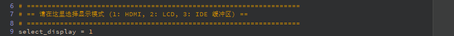

The K230 program supports two operation modes: online execution and offline execution.

**Online Running:** After connecting, drag the program **licence_det.py** into the CanMV IDE K230 code editor area, then click the run button  in the lower left corner to run the program online, as shown below:

> [!NOTE]
>
> **Programs run using this method will be lost upon disconnection or power-off and will not be saved on the development board.**

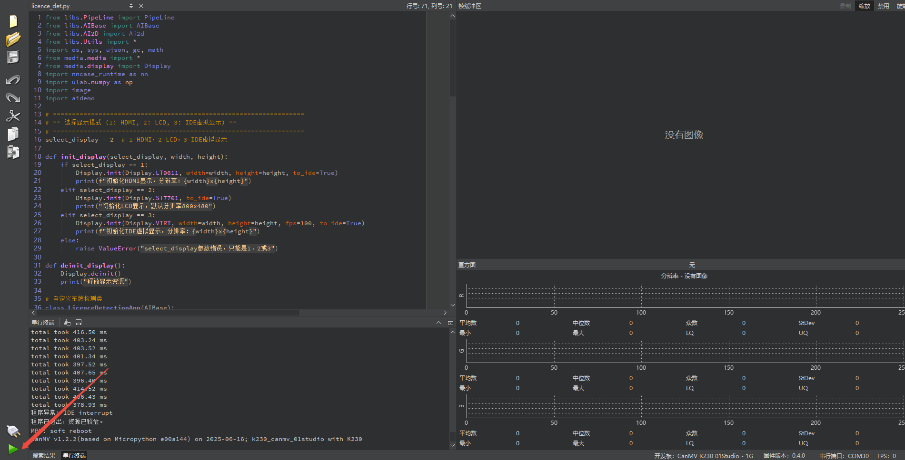

**Offline Execution:**

1. After connecting, drag the program **licence_det.py** into the CanMV IDE K230 code editor area, click **Tools** in the toolbar, and select **Save open script to CanMV Board (as main.py)**, as shown below:

   

2. Click **Yes**.

   

3)  Once the file is written, click **OK** to confirm and complete saving the MicroPython file to the K230 development board.

    

    **With this method, the K230 development board will automatically run the MicroPython file upon power-up without connection, enabling offline execution.**

### 5.15.4 Program Outcome

Detect all license plates in real time from the camera feed and mark each with a green quadrilateral that tightly fits the plate’s actual contour.

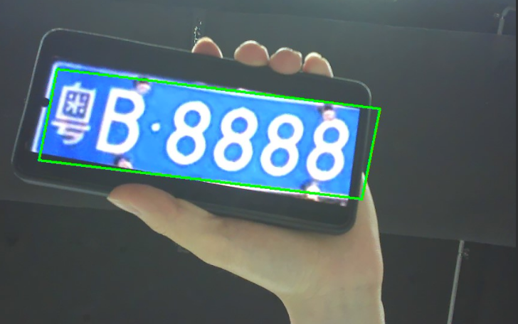

### 5.15.5 Program Analysis

* **Import Required Libraries**

```
from libs.PipeLine import PipeLine
from libs.AIBase import AIBase
from libs.AI2D import Ai2d
from libs.Utils import *
import os, sys, ujson, gc, math
from media.media import *
from media.display import Display
import nncase_runtime as nn
import ulab.numpy as np
import image
import aidemo
```

* **License Plate Detection**

```
class LicenceDetectionApp(AIBase):
    def __init__(self, kmodel_path, model_input_size, confidence_threshold=0.5, nms_threshold=0.2, rgb888p_size=[224,224], display_size=[1920,1080], debug_mode=0):
        super().__init__(kmodel_path, model_input_size, rgb888p_size, debug_mode)
        self.kmodel_path = kmodel_path
        self.model_input_size = model_input_size
        self.confidence_threshold = confidence_threshold
        self.nms_threshold = nms_threshold
        self.rgb888p_size = [ALIGN_UP(rgb888p_size[0], 16), rgb888p_size[1]]
        self.display_size = [ALIGN_UP(display_size[0], 16), display_size[1]]
        self.debug_mode = debug_mode
        self.ai2d = Ai2d(debug_mode)
        self.ai2d.set_ai2d_dtype(nn.ai2d_format.NCHW_FMT,
                                 nn.ai2d_format.NCHW_FMT,
                                 np.uint8, np.uint8)
```

1)  Load key parameters such as Kmodel model path, input resolution `(model_input_size)`, and thresholds for filtering invalid detection boxes `(mask_threshold, box_threshold)`.

2)  Call the highly encapsulated library function `aicube.ocr_post_process`.

3)  `aicube` automatically processes all the complex decoding steps, translating the raw feature map into a structured list where each entry includes a cropped text image and its coordinates in the original image.

* **Draw Results**

```
    def draw_result(self, pl, dets):
        with ScopedTiming("display_draw", self.debug_mode > 0):
            pl.osd_img.clear()
            if dets:
                point_8 = np.zeros((8), dtype=np.int16)
                for det in dets:
                    for i in range(4):
                        x = det[i*2+0] / self.rgb888p_size[0] * self.display_size[0]
                        y = det[i*2+1] / self.rgb888p_size[1] * self.display_size[1]
                        point_8[i*2+0] = int(x)
                        point_8[i*2+1] = int(y)
                    for i in range(4):
                        pl.osd_img.draw_line(
                            point_8[i*2+0], point_8[i*2+1],
                            point_8[((i+1)%4)*2+0], point_8[((i+1)%4)*2+1],
                            color=(255, 0, 255, 0), thickness=4)
```

1)  `pl.osd_img.clear()`: Clear the previous frame's OSD (On-Screen Display) layer before each drawing.

2)  Iterate through each license plate in the detection results `dets` list.

3)  Connect the four vertices sequentially through `pl.osd_img.draw_line` to form a closed green quadrilateral.

4)  Using `((i+1) % 4)` guarantees that the points are connected in order, forming the sequence: point 0 → point 1 → point 2 → point 3 → point 0.


## 5.16 License Plate Recognition

### 5.16.1 Experiment Overview

This section demonstrates license plate recognition functionality on the K230 development board through programming, using rectangular boxes to indicate detected plates and displaying license plate numbers.

### 5.16.2 Preparation

* **Module Connection** | **Module Connection**

1)  Connect the K230 development board to your PC using a Type-C data cable, as shown below:

    

2)  Double-click to open CanMV IDE K230.

    

3)  Click the connection button in the lower left corner.

    

4)  Upon successful connection, the icon in the lower left corner of CanMV IDE will change to the following:


5)  If the connection takes more than 10 seconds, it indicates a connection failure. Click the **Cancel** button, and a pop-up window will appear. Click **OK** and recheck the connection.


> [!NOTE]
>
> **Connection Failure Causes and Solutions:**
>
> * **Cable is not a data cable: Some Type-C cables are charging-only cables without data transfer capability. Please use a Type-C cable with data transfer functionality. The factory-supplied cable is a Type-C data cable.**
>
> * **Other K230 firmware was flashed: Re-flash the factory firmware, then reconnect.**

### 5.16.3 Program Execution and Download

**Display Mode Configuration:**

The program can use the `select_display=""` parameter to choose the display mode: HDMI, LCD, or IDE virtual.


The K230 program supports two operation modes: online execution and offline execution.


**Online Execution:**

After connecting, drag the program **licence_det_rec.py** into the CanMV IDE K230 code editor area, then click the run button  in the lower left corner to run the program online, as shown below:

> [!NOTE]
>
> **Programs run using this method will be lost upon disconnection or power-off and will not be saved on the development board.**


**Offline Execution:**

1)  After connecting, drag the program **licence_det_rec.py** from this section's directory into the CanMV IDE K230 code editor area, click **Tools** in the toolbar, and select **Save open script to CanMV Board (as main.py)**, as shown below:

    

2)  Click **Yes**.

    

3)  Once the file is written, click **OK** to confirm and complete saving the MicroPython file to the K230 development board.

    

    **With this method, the K230 development board will automatically run the MicroPython file upon power-up without connection, enabling offline execution.**

### 5.16.4 Program Outcome

Draw a precise green quadrilateral around the license plate, closely following its actual contour, and recognize the license plate content.

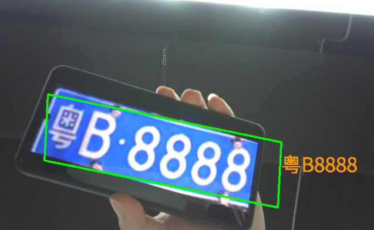

### 5.16.5 Program Analysis

* **Import Required Libraries**

```
from libs.PipeLine import PipeLine
from libs.AIBase import AIBase
from libs.AI2D import Ai2d
from libs.Utils import *
import os, sys, ujson, gc, math
from media.media import *
from media.display import Display
import nncase_runtime as nn
import ulab.numpy as np
import image
import aidemo
```

* **License Plate Detection**

```
# Custom license plate detection class
class LicenceDetectionApp(AIBase):
    def __init__(self, kmodel_path, model_input_size, confidence_threshold=0.5, nms_threshold=0.2, rgb888p_size=[224,224], display_size=[1920,1080], debug_mode=0):
        super().__init__(kmodel_path, model_input_size, rgb888p_size, debug_mode)
        self.kmodel_path = kmodel_path
        self.model_input_size = model_input_size
        self.confidence_threshold = confidence_threshold
        self.nms_threshold = nms_threshold
        self.rgb888p_size = [ALIGN_UP(rgb888p_size[0],16), rgb888p_size[1]]
        self.display_size = [ALIGN_UP(display_size[0],16), display_size[1]]
        self.debug_mode = debug_mode
        self.ai2d = Ai2d(debug_mode)
        self.ai2d.set_ai2d_dtype(nn.ai2d_format.NCHW_FMT,
                                 nn.ai2d_format.NCHW_FMT,
                                 np.uint8, np.uint8)
```

1)  `self.kmodel_path = kmodel_path`: Path to license plate detection model.

2)  `self.model_input_size = model_input_size`: Model input resolution.
3)  `self.confidence_threshold = confidence_threshold`: Detection confidence threshold.
4)  `return det_res`: Return detection boxes.

* **License Plate Recognition**

```
# Custom license plate recognition class
class LicenceRecognitionApp(AIBase):
    def __init__(self, kmodel_path, model_input_size, rgb888p_size=[1920,1080], display_size=[1920,1080], debug_mode=0):
        super().__init__(kmodel_path, model_input_size, rgb888p_size, debug_mode)
        self.kmodel_path = kmodel_path
        self.model_input_size = model_input_size
        self.rgb888p_size = [ALIGN_UP(rgb888p_size[0],16), rgb888p_size[1]]
        self.display_size = [ALIGN_UP(display_size[0],16), display_size[1]]
        self.debug_mode = debug_mode
        self.dict_rec = ["挂", "使", "领", "澳", "港", "皖", "沪", "津", "渝", "冀", "晋", "蒙", "辽", "吉", "黑", "苏", "浙",
                         "京", "闽", "赣", "鲁", "豫", "鄂", "湘", "粤", "桂", "琼", "川", "贵", "云", "藏", "陕", "甘", "青",
                         "宁", "新", "警", "学", "0", "1", "2", "3", "4", "5", "6", "7", "8", "9", "A", "B", "C", "D", "E",
                         "F", "G", "H", "J", "K", "L", "M", "N", "P", "Q", "R", "S", "T", "U", "V", "W", "X", "Y", "Z", "_", "-"]
        self.dict_size = len(self.dict_rec)
        self.ai2d = Ai2d(debug_mode)
        self.ai2d.set_ai2d_dtype(nn.ai2d_format.NCHW_FMT,
                                 nn.ai2d_format.NCHW_FMT,
                                 np.uint8, np.uint8)

    def config_preprocess(self, input_image_size=None):
        with ScopedTiming("set preprocess config", self.debug_mode > 0):
            ai2d_input_size = input_image_size if input_image_size else self.rgb888p_size
            self.ai2d.resize(nn.interp_method.tf_bilinear, nn.interp_mode.half_pixel)
            self.ai2d.build([1,3, ai2d_input_size[1], ai2d_input_size[0]],
                            [1,3, self.model_input_size[1], self.model_input_size[0]])

    def postprocess(self, results):
        with ScopedTiming("postprocess", self.debug_mode > 0):
            output_data = results[0].reshape((-1, self.dict_size))
            max_indices = np.argmax(output_data, axis=1)
            result_str = ""
            for i in range(max_indices.shape[0]):
                index = max_indices[i]
                if index > 0 and (i == 0 or index != max_indices[i - 1]):
                    result_str += self.dict_rec[index - 1]
            return result_str
```

1. `self.dict_rec = []`: Dictionary Table: License plate character categories, including digits, letters, and special symbols.

2)  `nself.dict_size = len(self.dict_rec)`: Get dictionary size.

3)  `def config_preprocess()`: Configure preprocessing for the recognition model.

4)  `def postprocess()`: Perform post-processing on the recognition model output to decode it into a license plate string.

* **License Plate Recognition Integration**

1. Initialize Parameters

```
# Custom license plate recognition class
class LicenceRecognitionApp(AIBase):
    def __init__(self, kmodel_path, model_input_size, rgb888p_size=[1920,1080], display_size=[1920,1080], debug_mode=0):
        super().__init__(kmodel_path, model_input_size, rgb888p_size, debug_mode)
        self.kmodel_path = kmodel_path
        self.model_input_size = model_input_size
        self.rgb888p_size = [ALIGN_UP(rgb888p_size[0],16), rgb888p_size[1]]
        self.display_size = [ALIGN_UP(display_size[0],16), display_size[1]]
        self.debug_mode = debug_mode
        self.dict_rec = ["挂", "使", "领", "澳", "港", "皖", "沪", "津", "渝", "冀", "晋", "蒙", "辽", "吉", "黑", "苏", "浙",
                         "京", "闽", "赣", "鲁", "豫", "鄂", "湘", "粤", "桂", "琼", "川", "贵", "云", "藏", "陕", "甘", "青",
                         "宁", "新", "警", "学", "0", "1", "2", "3", "4", "5", "6", "7", "8", "9", "A", "B", "C", "D", "E",
                         "F", "G", "H", "J", "K", "L", "M", "N", "P", "Q", "R", "S", "T", "U", "V", "W", "X", "Y", "Z", "_", "-"]
        self.dict_size = len(self.dict_rec)
        self.ai2d = Ai2d(debug_mode)
        self.ai2d.set_ai2d_dtype(nn.ai2d_format.NCHW_FMT,
                                 nn.ai2d_format.NCHW_FMT,
                                 np.uint8, np.uint8)
```

2. Initialize Detection Model

```
        self.licence_det = LicenceDetectionApp(self.licence_det_kmodel,
                                               model_input_size=self.det_input_size,
                                               confidence_threshold=self.confidence_threshold,
                                               nms_threshold=self.nms_threshold,
                                               rgb888p_size=self.rgb888p_size,
                                               display_size=self.display_size,
                                               debug_mode=0)
```

3. Initialize Recognition Model

```
        self.licence_rec = LicenceRecognitionApp(self.licence_rec_kmodel,
                                                 model_input_size=self.rec_input_size,
                                                 rgb888p_size=self.rgb888p_size,
                                                 display_size=self.display_size)
        self.licence_det.config_preprocess()
```

4. Detection and Recognition Pipeline

```
    def run(self, input_np):
        det_boxes = self.licence_det.run(input_np)
        imgs_array_boxes = aidemo.ocr_rec_preprocess(input_np,
                                                     [self.rgb888p_size[1], self.rgb888p_size[0]],
                                                     det_boxes)
        imgs_array = imgs_array_boxes[0]
        boxes = imgs_array_boxes[1]
        rec_res = []
        for img_array in imgs_array:
            self.licence_rec.config_preprocess(input_image_size=[img_array.shape[3], img_array.shape[2]])
            licence_str = self.licence_rec.run(img_array)
            rec_res.append(licence_str)
            gc.collect()
        return det_boxes, rec_res
```


5. Draw Detection and Recognition Results on Screen

```
    def draw_result(self, pl, det_res, rec_res):
        pl.osd_img.clear()
        if det_res:
            point_8 = np.zeros((8), dtype=np.int16)
            for det_index in range(len(det_res)):
                for i in range(4):
                    x = det_res[det_index][i * 2 + 0]/self.rgb888p_size[0]*self.display_size[0]
                    y = det_res[det_index][i * 2 + 1]/self.rgb888p_size[1]*self.display_size[1]
                    point_8[i * 2 + 0] = int(x)
                    point_8[i * 2 + 1] = int(y)
                for i in range(4):
                    pl.osd_img.draw_line(point_8[i * 2 + 0], point_8[i * 2 + 1],
                                         point_8[(i+1) % 4 * 2 + 0], point_8[(i+1) % 4 * 2 + 1],
                                         color=(255, 0, 255, 0), thickness=4)
                pl.osd_img.draw_string_advanced(point_8[6], point_8[7] + 20, 40,
                                               rec_res[det_index], color=(255, 255, 153, 18))

```

* **Main Program**

```
if __name__ == "__main__":
    # Select display mode
    display_mode_map = {1: "hdmi", 2:"lcd", 3:"ide"}
    select_display = 2  # 1=HDMI, 2=LCD, 3=IDE Virtual Display
    display_mode = display_mode_map.get(select_display, "hdmi")

    if display_mode == "hdmi":
        display_size = [1920, 1080]
    elif display_mode == "lcd":
        display_size = [800, 480]
    else:
        display_size = [1280, 720]

    rgb888p_size = [640, 360]
```

1) `select_display = 2`: Set to LCD output.

2) `display_mode`: Set resolutions for different display modes.

3) `rgb888p_size = [640, 360]`: Set input image resolution.

```
    licence_det_kmodel_path = "/sdcard/examples/kmodel/LPD_640.kmodel"
    licence_rec_kmodel_path = "/sdcard/examples/kmodel/licence_reco.kmodel"
    licence_det_input_size = [640, 640]
    licence_rec_input_size = [220, 32]
    confidence_threshold = 0.2
    nms_threshold = 0.2
```

1) `licence_det_kmodel_path`: Set model path.
2) `licence_det_input_size`: Set license plate detection model size.
3) `licence_rec_input_size`: Set license plate recognition model size.
4) `confidence_threshold = 0.2`: Set detection confidence threshold.
5) `nms_threshold = 0.2`: NMS threshold.

```
    # Initialize display
    def init_display(select_display, width, height):
        if select_display == 1:
            Display.init(Display.LT9611, width=width, height=height, to_ide=True)
            print(f"Initialize HDMI display, resolution: {width}x{height}")
        elif select_display == 2:
            Display.init(Display.ST7701, to_ide=True)
            print("Initialize LCD display, default resolution 800x480")
        elif select_display == 3:
            Display.init(Display.VIRT, width=width, height=height, fps=100, to_ide=True)
            print(f"Initialize IDE virtual display, resolution: {width}x{height}")
        else:
            raise ValueError("select_display parameter error, must be 1, 2, or 3")
```

1) Initialize display for different modes.

```
    init_display(select_display, display_size[0], display_size[1])

    pl = PipeLine(rgb888p_size=rgb888p_size, display_mode=display_mode)
    pl.create()
    display_size = pl.get_display_size()

    lr = LicenceRec(licence_det_kmodel_path, licence_rec_kmodel_path,
                    det_input_size=licence_det_input_size,
                    rec_input_size=licence_rec_input_size,
                    confidence_threshold=confidence_threshold,
                    nms_threshold=nms_threshold,
                    rgb888p_size=rgb888p_size,
                    display_size=display_size,
                    debug_mode=0)
```

2. `init_display()`: Initialize display device.

```
    lr = LicenceRec(licence_det_kmodel_path, licence_rec_kmodel_path,
                    det_input_size=licence_det_input_size,
                    rec_input_size=licence_rec_input_size,
                    confidence_threshold=confidence_threshold,
                    nms_threshold=nms_threshold,
                    rgb888p_size=rgb888p_size,
                    display_size=display_size,
                    debug_mode=0)
```

3. `init_display()`: Initialize overall license plate recognition pipeline.

```
    try:
        while True:
            with ScopedTiming("total", 1):
                img = pl.get_frame()
                det_res, rec_res = lr.run(img)
                lr.draw_result(pl, det_res, rec_res)
                pl.show_image()
                gc.collect()
    except KeyboardInterrupt:
        print("User interrupted program")  # Program stopped by user
    finally:
        lr.licence_det.deinit()
        lr.licence_rec.deinit()
        pl.destroy()
        deinit_display()
```

1) `with ScopedTiming("total", 1)`: Timer to track elapsed time.
2) `img = pl.get_frame()`: Capture one image frame from the camera.
3) `det_res, rec_res = lr.run(img)`: Execute detection and recognition.
4) `lr.draw_result(pl, det_res, rec_res)`: Draw results on the image.
5) `pl.show_image()`: Display the image.
6) `gc.collect()`: Memory garbage collection.


## 5.17 Character Detection

### 5.17.1 Experiment Overview

This section demonstrates character detection functionality on the K230 development board through programming, determining character shapes by detecting dark and light patterns. 

### 5.17.2 Preparation

* **Module Connection**

1)  Connect the K230 development board to your PC using a Type-C data cable, as shown below:

    

2)  Double-click to open CanMV IDE K230.

    

3)  Click the connection button in the lower left corner.

    

4)  Upon successful connection, the icon in the lower left corner of CanMV IDE will change to the following:


5)  If the connection takes more than 10 seconds, it indicates a connection failure. Click the **Cancel** button, and a pop-up window will appear. Click **OK** and recheck the connection.


> [!NOTE]
>
> **Connection Failure Causes and Solutions:**
>
> * **Cable is not a data cable: Some Type-C cables are charging-only cables without data transfer capability. Please use a Type-C cable with data transfer functionality. The factory-supplied cable is a Type-C data cable.**
>
> * **Other K230 firmware was flashed: Re-flash the factory firmware, then reconnect.**

### 5.17.3 Program Execution and Download

**Display Mode Configuration:**

The program can use the `select_display=""` parameter to choose the display mode: HDMI, LCD, or IDE virtual.


The K230 program supports two operation modes: online execution and offline execution.

**Online Execution:**

After connecting, drag the program **ocr_det.py** into the CanMV IDE K230 code editor area, then click the run button  in the lower left corner to run the program online, as shown below:

> [!NOTE]
>
> **Programs run using this method will be lost upon disconnection or power-off and will not be saved on the development board.**

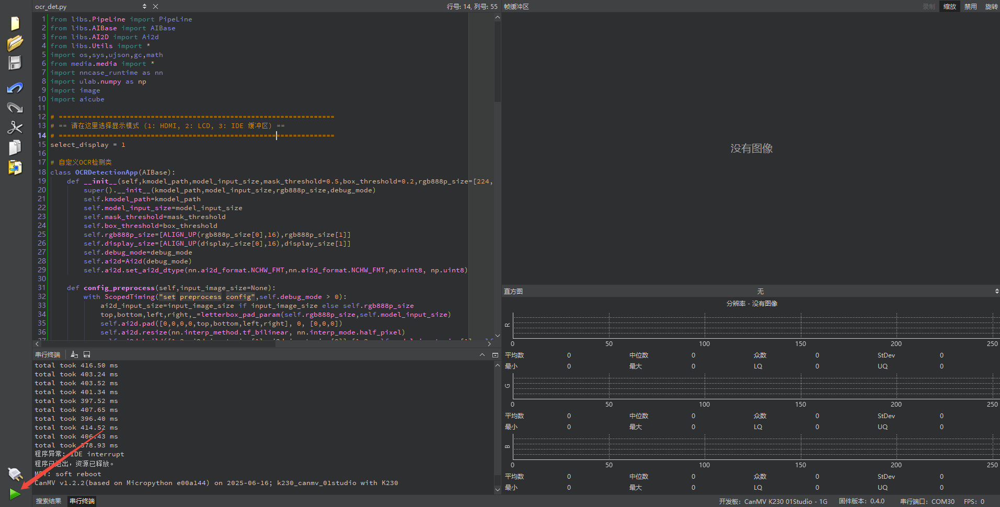

**Offline Execution:**

1)  After connecting, drag the program **ocr_det.py** from this section's directory into the CanMV IDE K230 code editor area, click **Tools** in the toolbar, and select **Save open script to CanMV Board (as main.py)**, as shown below:

    

2)  Click **Yes**.

    

3)  Once the file is written, click **OK** to confirm and complete saving the MicroPython file to the K230 development board.

    

    **With this download method, when you subsequently power on the K230 development board without connecting it, the board will run the MicroPython file, enabling offline operation.** | **With this method, the K230 development board will automatically run the MicroPython file upon power-up without connection, enabling offline execution.**

### 5.17.4 Program Outcome

The device acts as a real-time ‘text position scanner’, performing text recognition on the dynamic video captured by the camera.

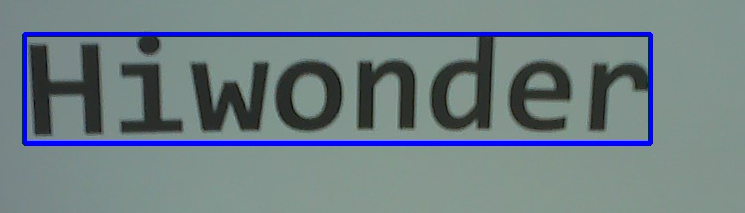

### 5.17.5 Program Analysis

* **Import Required Libraries**

```
from libs.PipeLine import PipeLine
from libs.AIBase import AIBase
from libs.AI2D import Ai2d
from libs.Utils import *
import os,sys,ujson,gc,math
from media.media import *
import nncase_runtime as nn
import ulab.numpy as np
import image
import `aicube`
```

* **Text Detection**

```
# Custom OCR detection class
class OCRDetectionApp(AIBase):
    def __init__(self,kmodel_path,model_input_size,mask_threshold=0.5,box_threshold=0.2,rgb888p_size=[224,224],display_size=[1920,1080],debug_mode=0):
        super().__init__(kmodel_path,model_input_size,rgb888p_size,debug_mode)
        self.kmodel_path=kmodel_path
        self.model_input_size=model_input_size
        self.mask_threshold=mask_threshold
        self.box_threshold=box_threshold
        self.rgb888p_size=[ALIGN_UP(rgb888p_size[0],16),rgb888p_size[1]]
        self.display_size=[ALIGN_UP(display_size[0],16),display_size[1]]
        self.debug_mode=debug_mode
        self.ai2d=Ai2d(debug_mode)
        self.ai2d.set_ai2d_dtype(nn.ai2d_format.NCHW_FMT,nn.ai2d_format.NCHW_FMT,np.uint8, np.uint8)
```

1)  Load key parameters, such as the Kmodel path, input resolution `model_input_size`, and thresholds `mask_threshold` and `box_threshold` for filtering invalid detection boxes.

2)  Call the highly encapsulated library function `aicube.ocr_post_process`.

3)  `aicube` automatically processes all the complex decoding steps, translating the raw feature map into a structured list where each entry includes a cropped text image and its coordinates in the original image.

* **Draw Results**

```
def draw_detection_result(pl, det_res, rgb888p_size, display_size):
    pl.osd_img.clear()
    if not det_res:
        return

    for det in det_res:
        # The det structure returned by `aicube`.ocr_post_process is [cropped image, coordinate list]
        # We only need the coordinate list det[1] to draw the bounding box
        box_coords = det[1]
        for i in range(4):
            x1 = box_coords[(i * 2)] / rgb888p_size[0] * display_size[0]
            y1 = box_coords[(i * 2 + 1)] / rgb888p_size[1] * display_size[1]
            x2 = box_coords[((i + 1) * 2) % 8] / rgb888p_size[0] * display_size[0]
            y2 = box_coords[((i + 1) * 2 + 1) % 8] / rgb888p_size[1] * display_size[1]
            # Draw red detection boxes
            pl.osd_img.draw_line((int(x1), int(y1), int(x2), int(y2)), color=(255, 0, 0, 255), thickness=5)
```

1)  Draw red detection boxes on the screen layer.

2)  `pl.osd_img.clear()`: Clear the previous frame's OSD content before each drawing.

3)  For each detected text item `det`, extract coordinate information `det[1]`.

4)  Then, convert these coordinates proportionally to match the `display_size` coordinates based on AI input image `rgb888p_size` coordinates.

5)  Finally, call `pl.osd_img.draw_line` to connect the four vertices, forming a red quadrilateral box.


## 5.18 Character Recognition

### 5.18.1 Experiment Overview

This section demonstrates character recognition functionality on the K230 development board through programming, determining character shapes by detecting dark and light patterns, and recognizing the text.

### 5.18.2 Preparation

* **Module Connection**

1)  Connect the K230 development board to your PC using a Type-C data cable, as shown below:

    

2)  Double-click to open CanMV IDE K230.

    

3)  Click the connection button in the lower left corner.

    

4)  Upon successful connection, the icon in the lower left corner of CanMV IDE will change to the following:


5)  If the connection takes more than 10 seconds, it indicates a connection failure. Click the **Cancel** button, and a pop-up window will appear. Click **OK** and recheck the connection.


> [!NOTE]
>
> **Connection Failure Causes and Solutions:**
>
> * **Cable is not a data cable: Some Type-C cables are charging-only cables without data transfer capability. Please use a Type-C cable with data transfer functionality. The factory-supplied cable is a Type-C data cable.**
>
> * **Other K230 firmware was flashed: Re-flash the factory firmware, then reconnect.**

### 5.18.3 Program Execution and Download

**Display Mode Configuration:**

The program can use the `select_display=""` parameter to choose the display mode: HDMI, LCD, or IDE virtual.


The K230 program supports two operation modes: online execution and offline execution.

**Online Execution:**

After connecting, drag the program **ocr_rec.py** into the CanMV IDE K230 code editor area, then click the run button  in the lower left corner to run the program online, as shown below:

> [!NOTE]
>
> **Programs run using this method will be lost upon disconnection or power-off and will not be saved on the development board.**

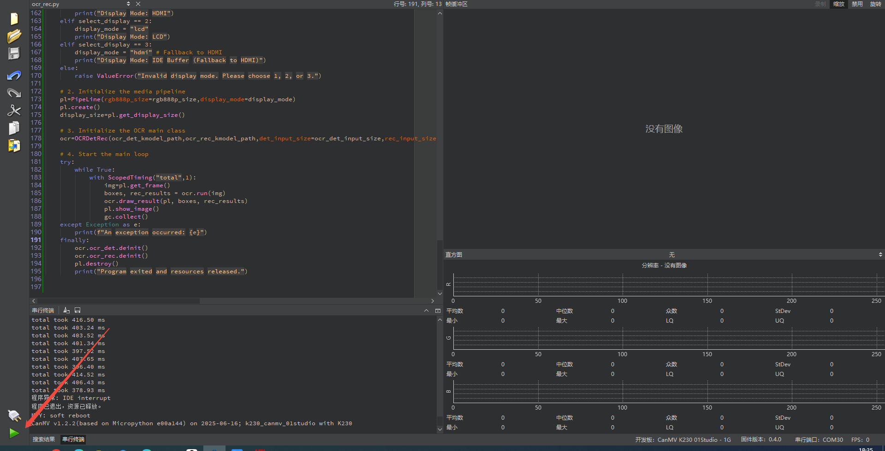

**Offline Execution:**

1)  After connecting, drag the program **ocr_rec.py** into the CanMV IDE K230 code editor area, click **Tools** in the toolbar, and select **Save open script to CanMV Board (as main.py)**, as shown below:

    

2)  Click **Yes**.

    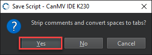

3)  Once the file is written, click **OK** to confirm and complete saving the MicroPython file to the K230 development board.

    

    **With this method, the K230 development board will automatically run the MicroPython file upon power-up without connection, enabling offline execution.**

### 5.18.4 Program Outcome

Draw a precise blue quadrilateral around the text, closely following its actual contour. Even if the text is tilted, the box tightly encloses it, while the recognized text is displayed in blue above or near the blue box.

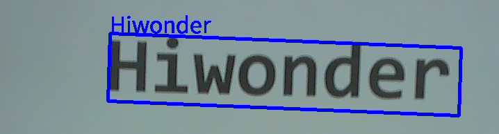

### 5.18.5 Program Analysis

* **Import Required Libraries**

```
from libs.PipeLine import PipeLine
from libs.AIBase import AIBase
from libs.AI2D import Ai2d
from libs.Utils import *
import os,sys,ujson,gc,math
from media.media import *
import nncase_runtime as nn
import ulab.numpy as np
import image
import `aicube`
```

* **Text Detection**

```
class OCRDetectionApp(AIBase):
    def __init__(self,kmodel_path,model_input_size,mask_threshold=0.5,box_threshold=0.2,rgb888p_size=[224,224],display_size=[1920,1080],debug_mode=0):
        super().__init__(kmodel_path,model_input_size,rgb888p_size,debug_mode)
        self.kmodel_path=kmodel_path
        self.model_input_size=model_input_size
        self.mask_threshold=mask_threshold
        self.box_threshold=box_threshold
        self.rgb888p_size=[ALIGN_UP(rgb888p_size[0],16),rgb888p_size[1]]
        self.display_size=[ALIGN_UP(display_size[0],16),display_size[1]]
        self.debug_mode=debug_mode
        self.ai2d=Ai2d(debug_mode)
        self.ai2d.set_ai2d_dtype(nn.ai2d_format.NCHW_FMT,nn.ai2d_format.NCHW_FMT,np.uint8, np.uint8)
```

1)  Load key parameters including the `Kmodel` model path, input resolution `model_input_size`, and thresholds for filtering invalid detection boxes `mask_threshold`, `box_threshold`.

2)  Call the highly encapsulated library function `aicube.ocr_post_process`.

3)  `aicube` automatically processes all the complex decoding steps, translating the raw feature map into a structured list where each entry includes a cropped text image and its coordinates in the original image.

* **Text Recognition**

```
class OCRRecognitionApp(AIBase):
    def __init__(self,kmodel_path,model_input_size,dict_path,rgb888p_size=[1920,1080],display_size=[1920,1080],debug_mode=0):
        super().__init__(kmodel_path,model_input_size,rgb888p_size,debug_mode)
        self.kmodel_path=kmodel_path
        self.model_input_size=model_input_size
        self.dict_path=dict_path
        self.rgb888p_size=[ALIGN_UP(rgb888p_size[0],16),rgb888p_size[1]]
        self.display_size=[ALIGN_UP(display_size[0],16),display_size[1]]
        self.debug_mode=debug_mode
        self.dict_word=None
        self.read_dict()
        self.ai2d=Ai2d(debug_mode)
        self.ai2d.set_ai2d_dtype(nn.ai2d_format.RGB_packed,nn.ai2d_format.NCHW_FMT,np.uint8, np.uint8)
```

1)  Cropped text images of varying sizes output by `OCRDetectionApp`.

2)  Preprocessing: The recognition model also requires fixed-size input. This function uses Ai2d to uniformly process these text images of different sizes into a standard size.

3)  The `read_dict()` function loads the `dict.txt` file. This dictionary defines the mapping between numerical labels output by the AI model and the corresponding characters, such as 'A', 'a', 'B', and 'b'. It ensures the correct reading of English characters, where English words are recognized as individual characters and then combined to form the word.

4)  `np.argmax`: Find the character label with the highest probability at each position in the sequence.

5)  Perform duplicate and blank removal by traversing the sequence. According to the CTC decoding rules, skip blank labels and consecutive repeated character labels.

6)  Dictionary lookup: Translate valid character labels into the final string through the `self.dict_word` dictionary.

* **Draw Results**

```
    def draw_result(self,pl,det_res,rec_res):
        pl.osd_img.clear()
        if det_res:
            for j in range(len(det_res)):
                # Draw bounding box
                for i in range(4):
                    x1 = det_res[j][(i * 2)] / self.rgb888p_size[0] * self.display_size[0]
                    y1 = det_res[j][(i * 2 + 1)] / self.rgb888p_size[1] * self.display_size[1]
                    x2 = det_res[j][((i + 1) * 2) % 8] / self.rgb888p_size[0] * self.display_size[0]
                    y2 = det_res[j][((i + 1) * 2 + 1) % 8] / self.rgb888p_size[1] * self.display_size[1]
                    pl.osd_img.draw_line((int(x1), int(y1), int(x2), int(y2)), color=(255, 0, 0, 255),thickness=5)

                # Prepare text coordinates, ensuring they are on-screen
                text_x = det_res[j][0] / self.rgb888p_size[0] * self.display_size[0]
                text_y = det_res[j][1] / self.rgb888p_size[1] * self.display_size[1] - 32
                if text_y < 0: text_y = 0

                # Draw recognized text
                pl.osd_img.draw_string_advanced(int(text_x),int(text_y),32,rec_res[j],color=(0,0,255))

```

1)  Draw red detection boxes on the screen layer.

2)  `pl.osd_img.clear()`: Clear the previous frame's OSD content before each drawing.

3)  For each detected text item `det`, extract coordinate information `det[1]`.

4)  Then, convert these coordinates proportionally to match the display size coordinates based on AI input image `rgb888p_size` coordinates.

5)  Finally, call `pl.osd_img.draw_line` to connect the four vertices, forming a red quadrilateral box.

6)  `pl.osd_img.draw_line` draws red bounding boxes.

7)  Call `pl.osd_img.draw_string_advanced` to draw the recognized text in blue near the box.


## 5.19 Self-Learning

### 5.19.1 Experiment Overview

This section demonstrates the self-learning functionality on the K230 development board through programming, performing feature extraction on specific images and then implementing object recognition.

### 5.19.2 Preparation

* **Module Connection**

1)  Connect the K230 development board to your PC using a Type-C data cable, as shown below:

    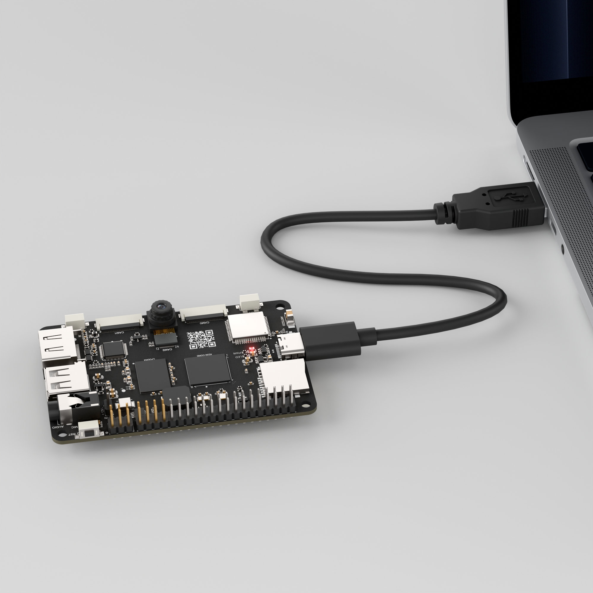

2)  Double-click to open CanMV IDE K230.

    

3)  Click the connection button in the lower left corner.

    

4)  Upon successful connection, the icon in the lower left corner of CanMV IDE will change to the following:


5)  If the connection takes more than 10 seconds, it indicates a connection failure. Click the **Cancel** button, and a pop-up window will appear. Click **OK** and recheck the connection.


> [!NOTE]
>
> **Connection Failure Causes and Solutions:**
>
> * **Cable is not a data cable: Some Type-C cables are charging-only cables without data transfer capability. Please use a Type-C cable with data transfer functionality. The factory-supplied cable is a Type-C data cable.**
>
> * **Other K230 firmware was flashed: Re-flash the factory firmware, then reconnect.**

### 5.19.3 Program Execution and Download

**Display Mode Configuration:**

The program can use the `select_display=""` parameter to choose the display mode: HDMI, LCD, or IDE virtual.


The K230 program supports two operation modes: online execution and offline execution.

**Online Execution:**

After connecting, drag the program **self_learning.py** into the CanMV IDE K230 code editor area, then click the run button  in the lower left corner to run the program online, as shown below:

> [!NOTE]
>
> **Programs run using this method will be lost upon disconnection or power-off and will not be saved on the development board.**


**Offline Execution:**

1)  After connecting, drag the program **self_learning.py** from this section's directory into the CanMV IDE K230 code editor area, click **Tools** in the toolbar, and select **Save open script to CanMV Board (as main.py)**, as shown below:

    

2)  Click **Yes**.

    

3)  Once the file is written, click **OK** to confirm and complete saving the MicroPython file to the K230 development board.

    

    **With this method, the K230 development board will automatically run the MicroPython file upon power-up without connection, enabling offline execution.**

### 5.19.4 Program Outcome

When the program runs, the returned video feed is shown. Press the designated key on the development board according to the on-screen instructions to perform learning. After learning, the box displays the name and features, calculates similarity, and outputs the recognition result.

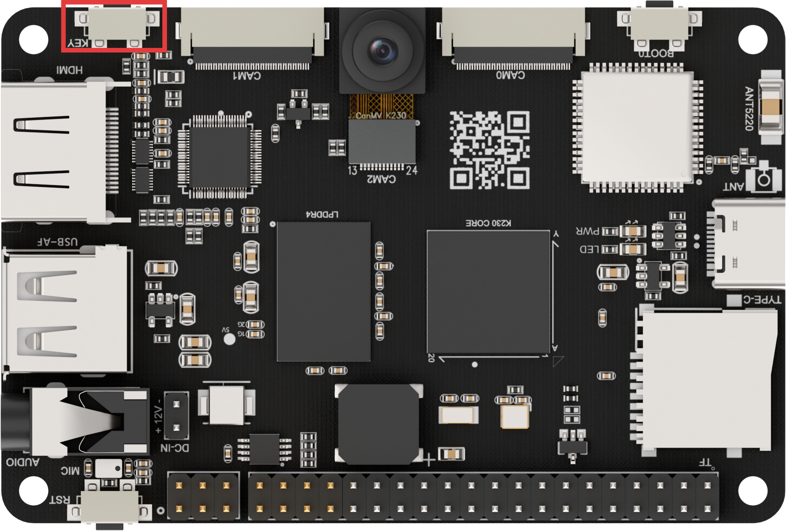

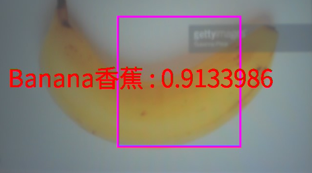

### 5.19.5 Program Analysis

* **Import Required Libraries**

```
from libs.PipeLine import PipeLine
from libs.AIBase import AIBase
from libs.AI2D import Ai2d
from libs.Utils import *
import os, sys, ujson, gc, math, uos
from media.media import *
from media.display import Display
import nncase_runtime as nn
import ulab.numpy as np
import image
import `aicube`
from machine import Pin
from machine import FPIOA
import time
```

* **SelfLearningApp**

```
class SelfLearningApp(AIBase):
    def __init__(self,kmodel_path,model_input_size,labels,top_k,threshold,features_save_path,rgb888p_size=[224,224],display_size=[1920,1080],debug_mode=0):
        super().__init__(kmodel_path,model_input_size,rgb888p_size,debug_mode)
        self.kmodel_path=kmodel_path
        self.model_input_size=model_input_size
        self.labels=labels
        self.features_save_path=features_save_path
        self.database_path=features_save_path+"features/"
        self.rgb888p_size=[ALIGN_UP(rgb888p_size[0],16),rgb888p_size[1]]
        self.display_size=[ALIGN_UP(display_size[0],16),display_size[1]]
        self.debug_mode=debug_mode
        self.threshold = threshold
        self.top_k = top_k
        self.features=[2,2]
        self.time_one=60
        self.time_all = 0
        self.time_now = 0
        self.category_index = 0
        self.crop_w = 400
        self.crop_h = 400
        self.crop_x = self.rgb888p_size[0] / 2.0 - self.crop_w / 2.0
        self.crop_y = self.rgb888p_size[1] / 2.0 - self.crop_h / 2.0
        self.crop_x_osd=0
        self.crop_y_osd=0
        self.crop_w_osd=0
        self.crop_h_osd=0
        self.ai2d=Ai2d(debug_mode)
        self.ai2d.set_ai2d_dtype(nn.ai2d_format.NCHW_FMT,nn.ai2d_format.NCHW_FMT,np.uint8, np.uint8)
        self.learning = False
        self.need_press_to_start = True
        self.data_init()
```

`SelfLearningApp` is the core class of the program, responsible for the self-learning process of object recognition. It handles image preprocessing, feature extraction, feature storage, and the learning logic controlled by key inputs.

1)  Initialize various variables including image cropping dimensions, learning state, feature collection time, etc.

2)  Set the input and output format for Ai2d.

3)  Create a database directory to store features for each category.

* **Image Preprocessing**

```
    def config_preprocess(self,input_image_size=None):
        with ScopedTiming("set preprocess config",self.debug_mode > 0):
            ai2d_input_size=input_image_size if input_image_size else self.rgb888p_size
            self.ai2d.crop(int(self.crop_x),int(self.crop_y),int(self.crop_w),int(self.crop_h))
            self.ai2d.resize(nn.interp_method.tf_bilinear, nn.interp_mode.half_pixel)
            self.ai2d.build([1,3,ai2d_input_size[1],ai2d_input_size[0]],[1,3,self.model_input_size[1],self.model_input_size[0]])
```

Set the image preprocessing steps, including cropping and resizing the image to match the model's input dimensions.

Crop the image based on `crop_x` and `crop_y`, then resize the image using bilinear interpolation to ensure the input image meets model requirements.

* **Image Display**

```
    def draw_result(self,pl,feature):
        pl.osd_img.clear()
        with ScopedTiming("display_draw",self.debug_mode >0):
            pl.osd_img.draw_rectangle(self.crop_x_osd,self.crop_y_osd, self.crop_w_osd, self.crop_h_osd, color=(255, 255, 0, 255), thickness = 4)
            if self.need_press_to_start:
                pl.osd_img.draw_string_advanced(50, 50, 40, "Press the button to start learning", color=(255,255,0,0))  # Press the button to start learning
            else:
                if self.learning:
                    if (self.category_index < len(self.labels)):
                        pl.osd_img.draw_string_advanced(50, self.crop_y_osd-50, 30,
                            "Place object to add within frame for feature collection: "+self.labels[self.category_index] + "_" + str(int(self.time_now-1) // self.time_one) + ".bin",  # Place the object inside the frame for feature collection
                            color=(255,255,0,0))
                        with open(self.database_path + self.labels[self.category_index] + "_" + str(int(self.time_now-1) // self.time_one) + ".bin", 'wb') as f:
                            f.write(feature.tobytes())
                        self.time_now += 1
                        if (self.time_now // self.time_one == self.features[self.category_index]):
                            self.category_index += 1
                            self.time_all -= self.time_now
                            self.time_now = 0
                            self.learning = False
                    else:
                        self.learning = False
                        pl.osd_img.draw_string_advanced(50, 50, 40, "All categories collected", color=(255,255,0,0))  # All categories collected
                else:
                    if self.category_index < len(self.labels):
                        pl.osd_img.draw_string_advanced(50, 50, 40, f"Press button to start learning category: {self.labels[self.category_index]}", color=(255,255,0,0))  # Press the button to start learning this category
                    else:
                        results_learn = []
                        list_features = os.listdir(self.database_path)
```

Draw information during the learning process on the display, including learning prompts, cropping box, and recognition results.

1)  If learning is required, display a prompt on the screen to guide placing the object within the box for learning.

2)  If learning has been completed and a class switch is in progress, display the current class and its learning progress.

3)  If learning is complete, display recognition results including category and similarity.

* **Determine Similarity Between Input Features and Saved Features**

```
    def getSimilarity(self,output_vec,save_vec):
        tmp = sum(output_vec * save_vec)
        mold_out = np.sqrt(sum(output_vec * output_vec))
        mold_save = np.sqrt(sum(save_vec * save_vec))
        return tmp / (mold_out * mold_save)
```

Compute the cosine similarity between two feature vectors to determine the similarity between the input feature and the saved feature. The similarity is calculated by taking the dot product of the vectors and normalizing by their magnitudes.


## 5.20 Object Detection

### 5.20.1 Experiment Overview

This section demonstrates object detection functionality on the K230 development board through programming, implementing object detection and recognition, and indicating the recognition results with drawings.

### 5.20.2 Preparation

* **Module Connection**

1)  Connect the K230 development board to your PC using a Type-C data cable, as shown below:

    

2)  Double-click to open CanMV IDE K230.

    

3)  Click the connection button in the lower left corner.

    

4)  Upon successful connection, the icon in the lower left corner of CanMV IDE will change to the following:


5)  If the connection takes more than 10 seconds, it indicates a connection failure. Click the **Cancel** button, and a pop-up window will appear. Click **OK** and recheck the connection.


> [!NOTE]
>
> **Connection Failure Causes and Solutions:**
>
> * **Cable is not a data cable: Some Type-C cables are charging-only cables without data transfer capability. Please use a Type-C cable with data transfer functionality. The factory-supplied cable is a Type-C data cable.**
>
> * **Other K230 firmware was flashed: Re-flash the factory firmware, then reconnect.**

### 5.20.3 Program Execution and Download

**Display Mode Configuration:**

The program can use the `select_display=""` parameter to choose the display mode: HDMI, LCD, or IDE virtual.


The K230 program supports two operation modes: online execution and offline execution.

**Online Execution:**

After connecting, drag the program **object_detect_yolov8n.py** into the CanMV IDE K230 code editor area, then click the run button  in the lower left corner to run the program online, as shown below:

> [!NOTE]
>
> **Programs run using this method will be lost upon disconnection or power-off and will not be saved on the development board.**


**Offline Execution:**

1)  After connecting, drag the program **object_detection.py** into the CanMV IDE K230 code editor area, click **Tools** in the toolbar, and select **Save open script to CanMV Board (as main.py)**, as shown below:

    

2)  Click **Yes**.

    

3)  Once the file is written, click **OK** to confirm and complete saving the MicroPython file to the K230 development board.

    

    **With this method, the K230 development board will automatically run the MicroPython file upon power-up without connection, enabling offline execution.**

### 5.20.4 Program Outcome

When the program runs, press the key to detect and recognize objects. The results are drawn on the display and compared with the stored model to determine the object identity.

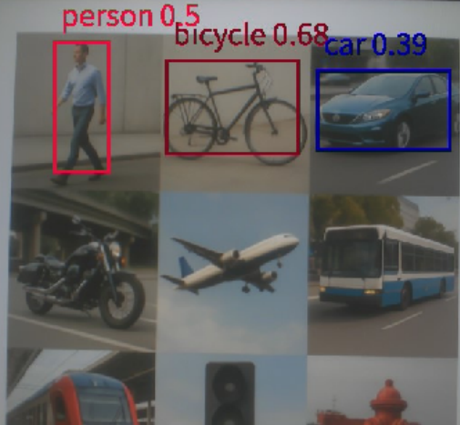

The example is based on YOLOv8n and supports the recognition of 80 object categories. For details, please refer to:

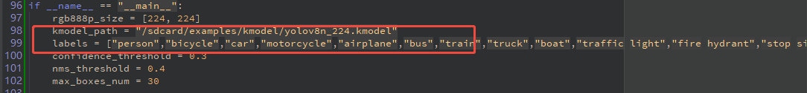

Original image:


### 5.20.5 Program Analysis

* **Import Required Libraries**

```
from libs.PipeLine import PipeLine, ScopedTiming
from libs.AIBase import AIBase
from libs.AI2D import Ai2d
import os
import ujson
from media.media import *  # Import Display from here
from media.sensor import *
from media.display import Display # Explicitly import Display class
import nncase_runtime as nn
from time import *
import nncase_runtime as nn
import ulab.numpy as np
import time
import utime
import image
import random
import gc
import sys
import aidemo
```

* **Object Detection**

```
# Custom YOLOv8 detection class
class ObjectDetectionApp(AIBase):
    def __init__(self, kmodel_path, labels, model_input_size, max_boxes_num, confidence_threshold=0.5, nms_threshold=0.2, rgb888p_size=[224, 224], display_size=[1920, 1080], debug_mode=0):
        super().__init__(kmodel_path, model_input_size, rgb888p_size, debug_mode)
        self.kmodel_path = kmodel_path
        self.labels = labels
        # Model input resolution
        self.model_input_size = model_input_size
        # Threshold settings
        self.confidence_threshold = confidence_threshold
        self.nms_threshold = nms_threshold
        self.max_boxes_num = max_boxes_num
        # Image resolution from sensor to AI
        self.rgb888p_size = [ALIGN_UP(rgb888p_size[0], 16), rgb888p_size[1]]
        # Display resolution
        self.display_size = [ALIGN_UP(display_size[0], 16), display_size[1]]
        self.debug_mode = debug_mode
        # Preset color values for detection boxes
        self.color_four = [(255, 220, 20, 60), (255, 119, 11, 32), (255, 0, 0, 142), (255, 0, 0, 230),
                         (255, 106, 0, 228), (255, 0, 60, 100), (255, 0, 80, 100), (255, 0, 0, 70),
                         (255, 0, 0, 192), (255, 250, 170, 30), (255, 100, 170, 30), (255, 220, 220, 0),
                         (255, 175, 116, 175), (255, 250, 0, 30), (255, 165, 42, 42), (255, 255, 77, 255),
                         (255, 0, 226, 252), (255, 182, 182, 255), (255, 0, 82, 0), (255, 120, 166, 157)]
        # Width and height scaling ratios
        self.x_factor = float(self.rgb888p_size[0]) / self.model_input_size[0]
        self.y_factor = float(self.rgb888p_size[1]) / self.model_input_size[1]
        # Ai2d instance for implementing model preprocessing
        self.ai2d = Ai2d(debug_mode)
        # Set Ai2d input/output format and type
        self.ai2d.set_ai2d_dtype(nn.ai2d_format.NCHW_FMT, nn.ai2d_format.NCHW_FMT, np.uint8, np.uint8)

```

Initialize the base class by calling `super()`, then configure parameters such as labels, input size, and thresholds. After that, create an `Ai2d` object to perform image preprocessing and set up the input and output formats.

Calculate the image scaling factors `x_factor` and `y_factor` to map the detection boxes from the model input size to the actual display size.

1)  `labels`: Labels used for object detection, representing different object categories.

2)  `model_input_size`: YOLOv8 model input size.

3)  `max_boxes_num`: Maximum number of detection boxes.

4)  `confidence_threshold`: Confidence threshold. Detection results below this value will be ignored.

5)  `nms_threshold`: Non-Maximum Suppression (NMS) threshold for removing redundant detection boxes.

6)  `rgb888p_size`: Input image size, specified for RGB images.

* **Image Preprocessing and Post-processing**

```
    # Configure preprocessing operations. Here resize is used. Ai2d supports crop/shift/pad/resize/affine. For details, see /sdcard/libs/AI2D.py
    def config_preprocess(self, input_image_size=None):
        with ScopedTiming("set preprocess config", self.debug_mode > 0):
            # Initialize ai2d preprocessing config. Default is sensor-to-AI size. You can modify input size by setting input_image_size
            ai2d_input_size = input_image_size if input_image_size else self.rgb888p_size
            self.ai2d.resize(nn.interp_method.tf_bilinear, nn.interp_mode.half_pixel)
            self.ai2d.build([1, 3, ai2d_input_size[1], ai2d_input_size[0]], [1, 3, self.model_input_size[1], self.model_input_size[0]])

    # Custom post-processing for current task
    def postprocess(self, results):
        with ScopedTiming("postprocess", self.debug_mode > 0):
            result = results[0]
            result = result.reshape((result.shape[0] * result.shape[1], result.shape[2]))
            output_data = result.transpose()
            boxes_ori = output_data[:, 0:4]
            scores_ori = output_data[:, 4:]
            confs_ori = np.max(scores_ori, axis=-1)
            inds_ori = np.argmax(scores_ori, axis=-1)
            boxes, scores, inds = [], [], []
            for i in range(len(boxes_ori)):
                if confs_ori[i] > self.confidence_threshold: # Use self.confidence_threshold
                    scores.append(confs_ori[i])
                    inds.append(inds_ori[i])
                    x = boxes_ori[i, 0]
                    y = boxes_ori[i, 1]
                    w = boxes_ori[i, 2]
                    h = boxes_ori[i, 3]
                    left = int((x - 0.5 * w) * self.x_factor)
                    top = int((y - 0.5 * h) * self.y_factor)
                    right = int((x + 0.5 * w) * self.x_factor)
                    bottom = int((y + 0.5 * h) * self.y_factor)
                    boxes.append([left, top, right, bottom])
            if len(boxes) == 0:
                return []
            boxes = np.array(boxes)
            scores = np.array(scores)
            inds = np.array(inds)
            # NMS process
            keep = self.nms(boxes, scores, self.nms_threshold) # Use self.nms_threshold
            dets = np.concatenate((boxes, scores.reshape((len(boxes), 1)), inds.reshape((len(boxes), 1))), axis=1)
            dets_out = []
            for keep_i in keep:
                dets_out.append(dets[keep_i])
            dets_out = np.array(dets_out)
            dets_out = dets_out[:self.max_boxes_num, :]
            return dets_out
```

1)  Image preprocessing, mainly performing padding and scaling to ensure the input image meets the model requirements. `input_image_size` specifies the size of the input image, defaulting to `rgb888p_size`.

2)  Calculate the padding and cropping parameters, using `letterbox_pad_param` for padding.

3)  Apply `Ai2d` for image padding and scaling, then post-process the model output to obtain the detection boxes and associated information.

4)  Then, transpose and process the output results, and apply Non-Maximum Suppression (NMS) to extract valid detection boxes, classes, and confidence scores.

* **Draw Results**

```
    def draw_result(self, pl, dets):
        with ScopedTiming("display_draw", self.debug_mode > 0):
            if dets:
                pl.osd_img.clear()
                for det in dets:
                    x1, y1, x2, y2 = map(lambda x: int(round(x, 0)), det[:4])
                    x = x1 * self.display_size[0] // self.rgb888p_size[0]
                    y = y1 * self.display_size[1] // self.rgb888p_size[1]
                    w = (x2 - x1) * self.display_size[0] // self.rgb888p_size[0]
                    h = (y2 - y1) * self.display_size[1] // self.rgb888p_size[1]
                    pl.osd_img.draw_rectangle(x, y, w, h, color=self.get_color(int(det[5])), thickness=4)
                    pl.osd_img.draw_string_advanced(x, y - 50, 32, " " + self.labels[int(det[5])] + " " + str(round(det[4], 2)), color=self.get_color(int(det[5])))
            else:
                pl.osd_img.clear()
```

Draw the detection results on the screen, showing the bounding boxes, classes, and confidence scores.

1)  `pl`: Display object responsible for rendering results on the screen.

2)  `dets`: Detection box information, including position, class, and confidence score.


## 5.21 Object Segmentation

### 5.21.1 Experiment Overview

This section demonstrates object segmentation functionality on the K230 development board through programming, implementing object detection and recognition, and segmenting different objects using different colors.

### 5.21.2 Preparation

* **Module Connection**

1)  Connect the K230 development board to your PC using a Type-C data cable, as shown below:

    

2)  Double-click to open CanMV IDE K230.

    

3)  Click the connection button in the lower left corner.

    

4)  Upon successful connection, the icon in the lower left corner of CanMV IDE will change to the following:


5)  If the connection takes more than 10 seconds, it indicates a connection failure. Click the **Cancel** button, and a pop-up window will appear. Click **OK** and recheck the connection.


> [!NOTE]
>
> **Connection Failure Causes and Solutions:**
>
> * **Cable is not a data cable: Some Type-C cables are charging-only cables without data transfer capability. Please use a Type-C cable with data transfer functionality. The factory-supplied cable is a Type-C data cable.**
>
> * **Other K230 firmware was flashed: Re-flash the factory firmware, then reconnect.**

### 5.21.3 Program Execution and Download

**Display Mode Configuration:**

The program can use the `select_display=""` parameter to choose the display mode: HDMI, LCD, or IDE virtual.


The K230 program supports two operation modes: online execution and offline execution.

**Online Execution:**

After connecting, drag the program **object_detection.py** into the CanMV IDE K230 code editor area, then click the run button  in the lower left corner to run the program online, as shown below:

> [!NOTE]
>
> **Programs run using this method will be lost upon disconnection or power-off and will not be saved on the development board.**

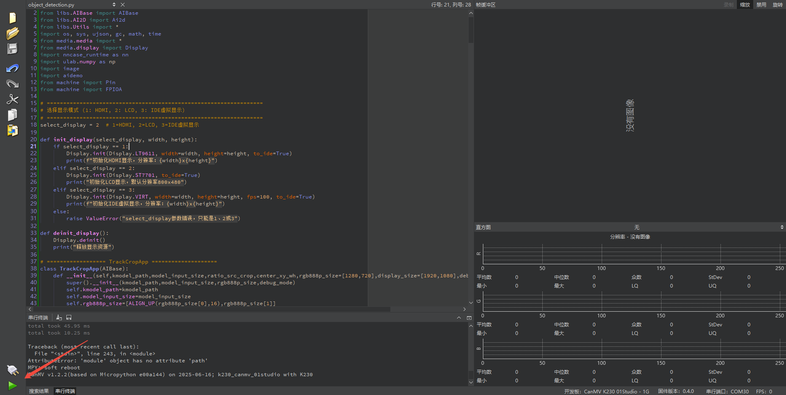

**Offline Execution:**

1)  After connecting, drag the program **object_detection.py** into the CanMV IDE K230 code editor area, click **Tools** in the toolbar, and select **Save open script to CanMV Board (as main.py)**, as shown below:

    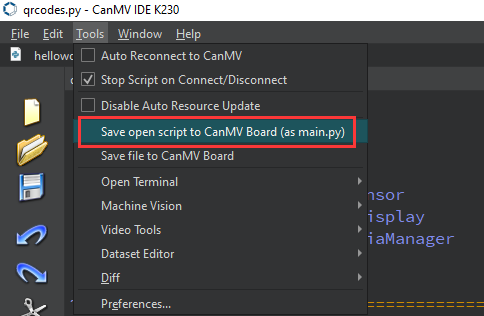

    2. Click **Yes**.

    

    3. Once the file is written, click **OK** to confirm and complete saving the MicroPython file to the K230 development board.

    

    **With this download method, when you subsequently power on the K230 development board without connecting it, the board will run the MicroPython file, enabling offline operation.** | **With this method, the K230 development board will automatically run the MicroPython file upon power-up without connection, enabling offline execution.**

### 5.21.4 Program Outcome

When the program runs, it detects and recognizes objects, and segments each object with a different color for clear distinction.

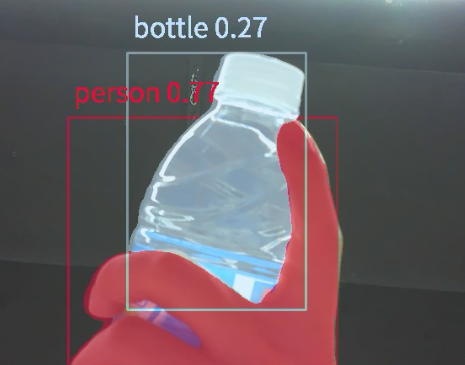

### 5.21.5 Program Analysis

* **Import Required Libraries**

```
from libs.PipeLine import PipeLine, ScopedTiming
from libs.AIBase import AIBase
from libs.AI2D import Ai2d
from libs.Utils import *
import os, sys, ujson, gc, math, random
from media.media import *  # This will import Display
from media.sensor import *
from media.display import Display  # Ensure SDK support
import nncase_runtime as nn
import ulab.numpy as np
import image
import aidemo
import time # Import time for clock
```

* **Object Segmentation**

```
# Custom YOLOv8 segmentation class
class SegmentationApp(AIBase):
    def __init__(self, kmodel_path, labels, model_input_size, confidence_threshold=0.2, nms_threshold=0.5, mask_threshold=0.5, rgb888p_size=[224, 224], display_size=[1920, 1080], debug_mode=0):
        super().__init__(kmodel_path, model_input_size, rgb888p_size, debug_mode)
        # Model path
        self.kmodel_path = kmodel_path
        # Segmentation category labels
        self.labels = labels
        # Model input resolution
        self.model_input_size = model_input_size
        # Confidence threshold
        self.confidence_threshold = confidence_threshold
        # NMS threshold
        self.nms_threshold = nms_threshold
        # Mask threshold
        self.mask_threshold = mask_threshold
        # Image resolution from sensor to AI
        self.rgb888p_size = [ALIGN_UP(rgb888p_size[0], 16), rgb888p_size[1]]
        # Display resolution
        self.display_size = [ALIGN_UP(display_size[0], 16), display_size[1]]
        self.debug_mode = debug_mode
        # Preset color values for detection boxes
        self.color_four = get_colors(len(self.labels))
        # Segmentation result numpy array for aidemo post-processing interface
        # Note: self.masks will be populated by aidemo.segment_postprocess
        self.masks = np.zeros((1, self.display_size[1], self.display_size[0], 4), dtype=np.uint8) # Specify dtype

        # Ai2d instance for implementing model preprocessing
        self.ai2d = Ai2d(debug_mode)
        # Set Ai2d input/output format and type
        self.ai2d.set_ai2d_dtype(nn.ai2d_format.NCHW_FMT, nn.ai2d_format.NCHW_FMT, np.uint8, np.uint8)

```

Initialize the model by setting the model path, segmentation classes, input resolution, confidence threshold, and other parameters.

* **Image Preprocessing and Post-processing**

```
    # Configure preprocessing operations. Here pad and resize are used. Ai2d supports crop/shift/pad/resize/affine. For details, see /sdcard/app/libs/AI2D.py
    def config_preprocess(self, input_image_size=None):
        with ScopedTiming("set preprocess config", self.debug_mode > 0):
            # Initialize ai2d preprocessing config. Default is sensor-to-AI size. You can modify input size by setting input_image_size
            ai2d_input_size = input_image_size if input_image_size else self.rgb888p_size
            top, bottom, left, right, _ = center_pad_param(self.rgb888p_size, self.model_input_size)
            self.ai2d.pad([0, 0, 0, 0, top, bottom, left, right], 0, [114, 114, 114])
            self.ai2d.resize(nn.interp_method.tf_bilinear, nn.interp_mode.half_pixel)
            self.ai2d.build([1, 3, ai2d_input_size[1], ai2d_input_size[0]], [1, 3, self.model_input_size[1], self.model_input_size[0]])

    # Custom post-processing for current task
    def postprocess(self, results):
        with ScopedTiming("postprocess", self.debug_mode > 0):
            # Using aidemo's segment_postprocess interface
            seg_res = aidemo.segment_postprocess(results, [self.rgb888p_size[1], self.rgb888p_size[0]], self.model_input_size, [self.display_size[1], self.display_size[0]], self.confidence_threshold, self.nms_threshold, self.mask_threshold, self.masks)
            return seg_res
```

1)  Perform image preprocessing, including padding and scaling, to ensure the input conforms to the model’s requirements. The `input_image_size` parameter defines the image dimensions, with the default set to `rgb888p_size`.

2)  Call `aidemo.segment_postprocess` to decode the segmentation results.

3)  Then, transpose and process the outputs, apply Non-Maximum Suppression (NMS), and obtain the valid detection boxes along with their class labels and confidence scores.

* **Draw Results**

```
    # Draw results
    def draw_result(self, pl, seg_res):
        with ScopedTiming("display_draw", self.debug_mode > 0):
            if seg_res[0]:
                pl.osd_img.clear()
                # Create image object referencing the numpy array populated by aidemo.segment_postprocess
                mask_img = image.Image(self.display_size[0], self.display_size[1], image.ARGB8888, alloc=image.ALLOC_REF, data=self.masks)
                pl.osd_img.copy_from(mask_img)
                dets, ids, scores = seg_res[0], seg_res[1], seg_res[2]
                for i, det in enumerate(dets):
                    x1, y1, w, h = map(lambda x: int(round(x, 0)), det)
                    pl.osd_img.draw_string_advanced(x1, y1 - 50, 32, " " + self.labels[int(ids[i])] + " " + str(round(scores[i], 2)), color=self.color_four[int(ids[i])])
            else:
                pl.osd_img.clear()
```

Draw the detection results on the screen, displaying detection boxes, class labels, and confidence scores.

1)  `pl`: Display object responsible for rendering results on the screen.

2)  `dets`: Detection box information including position, class label, and confidence score.


## 5.22 Target Tracking

### 5.22.1 Experiment Overview

This section demonstrates target tracking functionality on the K230 development board through programming. Target tracking is used to follow objects of interest in the image.

### 5.22.2 Preparation

* **Module Connection**

1)  Connect the K230 development board to your PC using a Type-C data cable, as shown below:

    

2)  Double-click to open CanMV IDE K230.

    

3)  Click the connection button in the lower left corner.

    

4)  Upon successful connection, the icon in the lower left corner of CanMV IDE will change to the following:


5)  If the connection takes more than 10 seconds, it indicates a connection failure. Click the **Cancel** button, and a pop-up window will appear. Click **OK** and recheck the connection.


> [!NOTE]
>
> **Connection Failure Causes and Solutions:**
>
> * **Cable is not a data cable: Some Type-C cables are charging-only cables without data transfer capability. Please use a Type-C cable with data transfer functionality. The factory-supplied cable is a Type-C data cable.**
>
> * **Other K230 firmware was flashed: Re-flash the factory firmware, then reconnect.**

### 5.22.3 Program Execution and Download

**Display Mode Configuration:**

The program can use the `select_display=""` parameter to choose the display mode: HDMI, LCD, or IDE virtual.


The K230 program supports two operation modes: online execution and offline execution.

**Online Execution:**

After connecting, drag the program **object_detection.py** into the CanMV IDE K230 code editor area, then click the run button  in the lower left corner to run the program online, as shown below:

> [!NOTE]
>
> **Programs run using this method will be lost upon disconnection or power-off and will not be saved on the development board.**


**Offline Execution:**

1)  After connecting, drag the program **object_detection.py** into the CanMV IDE K230 code editor area, click **Tools** in the toolbar, and select **Save open script to CanMV Board (as main.py)**, as shown below:

    

2)  Then click **Yes**.

    

3)  Once the file is written, click **OK** to confirm and complete saving the MicroPython file to the K230 development board.

    

    **With this method, the K230 development board will automatically run the MicroPython file upon power-up without connection, enabling offline execution.**

### 5.22.4 Program Outcome

When the program runs, the returned video feed appears. Press the key as instructed on the screen to learn the object. After learning, the object is enclosed in a box, and small movements will keep it centered in the video feed.

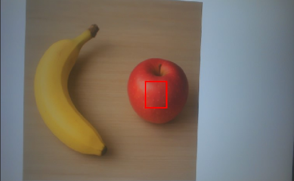

### 5.22.5 Program Analysis

* **Import Required Libraries**

```
from libs.PipeLine import PipeLine
from libs.AIBase import AIBase
from libs.AI2D import Ai2d
from libs.Utils import *
import os, sys, ujson, gc, math, time
from media.media import *
from media.display import Display
import nncase_runtime as nn
import ulab.numpy as np
import image
import aidemo
from machine import Pin
from machine import FPIOA
```

* **Object Cropping**

```
class TrackCropApp(AIBase):
    def __init__(self,kmodel_path,model_input_size,ratio_src_crop,center_xy_wh,rgb888p_size=[1280,720],display_size=[1920,1080],debug_mode=0):
        super().__init__(kmodel_path,model_input_size,rgb888p_size,debug_mode)
        self.kmodel_path=kmodel_path
        self.model_input_size=model_input_size
        self.rgb888p_size=[ALIGN_UP(rgb888p_size[0],16),rgb888p_size[1]]
        self.display_size=[ALIGN_UP(display_size[0],16),display_size[1]]
        self.debug_mode=debug_mode
        self.CONTEXT_AMOUNT = 0.5
        self.ratio_src_crop = ratio_src_crop
        self.center_xy_wh=center_xy_wh
        self.pad_crop_params=[]
        self.ai2d_pad=Ai2d(debug_mode)
        self.ai2d_pad.set_ai2d_dtype(nn.ai2d_format.NCHW_FMT,nn.ai2d_format.NCHW_FMT,np.uint8, np.uint8)
        self.ai2d_crop=Ai2d(debug_mode)
        self.ai2d_crop.set_ai2d_dtype(nn.ai2d_format.NCHW_FMT,nn.ai2d_format.NCHW_FMT,np.uint8, np.uint8)
        self.need_pad=False
```

Initialize the model path and input size, then set the image cropping parameters, including crop ratio and center coordinates.

Initialize two `Ai2d` modules: one for image padding and the other for cropping.

`kmodel_path`: Path to the cropping model file.

`model_input_size`: Model input size, representing the required input image dimensions.

`ratio_src_crop`: Source crop ratio used to adjust the cropping region size.

`center_xy_wh`: List containing the object's center coordinates and dimensions in the format `[xcenter, ycenter, width, height]`.

* **Image Preprocessing and Post-processing**

```
    def config_preprocess(self,input_image_size=None):
        with ScopedTiming("set preprocess config",self.debug_mode > 0):
            ai2d_input_size = input_image_size if input_image_size else self.rgb888p_size
            self.pad_crop_params= self.get_padding_crop_param()
            if (self.pad_crop_params[0]!=0 or self.pad_crop_params[1]!=0 or self.pad_crop_params[2]!=0 or self.pad_crop_params[3]!=0):
                self.need_pad=True
                self.ai2d_pad.resize(nn.interp_method.tf_bilinear, nn.interp_mode.half_pixel)
                self.ai2d_pad.pad([0,0,0,0,self.pad_crop_params[0],self.pad_crop_params[1],self.pad_crop_params[2],self.pad_crop_params[3]],0,[114,114,114])
                output_size=[self.rgb888p_size[0]+self.pad_crop_params[2]+self.pad_crop_params[3],
                             self.rgb888p_size[1]+self.pad_crop_params[0]+self.pad_crop_params[1]]
                self.ai2d_pad.build([1,3,ai2d_input_size[1],ai2d_input_size[0]],
                                   [1,3,output_size[1],output_size[0]])

                self.ai2d_crop.resize(nn.interp_method.tf_bilinear, nn.interp_mode.half_pixel)
                self.ai2d_crop.crop(int(self.pad_crop_params[4]),int(self.pad_crop_params[6]),
                                    int(self.pad_crop_params[5]-self.pad_crop_params[4]+1),
                                    int(self.pad_crop_params[7]-self.pad_crop_params[6]+1))
                self.ai2d_crop.build([1,3,output_size[1],output_size[0]],
                                    [1,3,self.model_input_size[1],self.model_input_size[0]])
            else:
                self.need_pad=False
                self.ai2d_crop.resize(nn.interp_method.tf_bilinear, nn.interp_mode.half_pixel)
                self.ai2d_crop.crop(int(self.center_xy_wh[0]-self.pad_crop_params[8]/2.0),
                                    int(self.center_xy_wh[1]-self.pad_crop_params[8]/2.0),
                                    int(self.pad_crop_params[8]),
                                    int(self.pad_crop_params[8]))
                self.ai2d_crop.build([1,3,ai2d_input_size[1],ai2d_input_size[0]],
                                    [1,3,self.model_input_size[1],self.model_input_size[0]])

    def preprocess(self,input_np):
        if self.need_pad:
            pad_output=self.ai2d_pad.run(input_np).to_numpy()
            return [self.ai2d_crop.run(pad_output)]
        else:
            return [self.ai2d_crop.run(input_np)]

```

Calculate the padding parameters for the cropping area to ensure it fits the model input. If padding is required, apply it using the `Ai2d` module before cropping. If no padding is needed, crop directly based on the specified center and size.

* **Calculate Cropping Region**

```
    def get_padding_crop_param(self):
        s_z = round(np.sqrt((self.center_xy_wh[2] + self.CONTEXT_AMOUNT * (self.center_xy_wh[2] + self.center_xy_wh[3])) *
                           (self.center_xy_wh[3] + self.CONTEXT_AMOUNT * (self.center_xy_wh[2] + self.center_xy_wh[3]))))
        c = (s_z + 1) / 2
        context_xmin = np.floor(self.center_xy_wh[0] - c + 0.5)
        context_xmax = int(context_xmin + s_z - 1)
        context_ymin = np.floor(self.center_xy_wh[1] - c + 0.5)
        context_ymax = int(context_ymin + s_z - 1)
        left_pad = int(max(0, -context_xmin))
        top_pad = int(max(0, -context_ymin))
        right_pad = int(max(0, int(context_xmax - self.rgb888p_size[0] + 1)))
        bottom_pad = int(max(0, int(context_ymax - self.rgb888p_size[1] + 1)))
        context_xmin += left_pad
        context_xmax += left_pad
        context_ymin += top_pad
        context_ymax += top_pad
        return [top_pad,bottom_pad,left_pad,right_pad,
                context_xmin,context_xmax,context_ymin,context_ymax,s_z]
```

Calculate the padding parameters for the cropping region to ensure the center of the crop region is positioned over the target object.

* **Source Feature Extraction**

```
class TrackSrcApp(AIBase):
    def __init__(self,kmodel_path,model_input_size,ratio_src_crop,rgb888p_size=[1280,720],display_size=[1920,1080],debug_mode=0):
        super().__init__(kmodel_path,model_input_size,rgb888p_size,debug_mode)
        self.kmodel_path=kmodel_path
        self.model_input_size=model_input_size
        self.rgb888p_size=[ALIGN_UP(rgb888p_size[0],16),rgb888p_size[1]]
        self.display_size=[ALIGN_UP(display_size[0],16),display_size[1]]
        self.pad_crop_params=[]
        self.CONTEXT_AMOUNT = 0.5
        self.ratio_src_crop = ratio_src_crop
        self.debug_mode=debug_mode
        self.ai2d_pad=Ai2d(debug_mode)
        self.ai2d_pad.set_ai2d_dtype(nn.ai2d_format.NCHW_FMT,nn.ai2d_format.NCHW_FMT,np.uint8,np.uint8)
        self.ai2d_crop=Ai2d(debug_mode)
        self.ai2d_crop.set_ai2d_dtype(nn.ai2d_format.NCHW_FMT,nn.ai2d_format.NCHW_FMT,np.uint8,np.uint8)
        self.need_pad=False
```

Initialize parameters for the source image feature extraction model.

1)  `kmodel_path`: Path to the source feature extraction model.

2)  `model_input_size`: Model input size.

3)  `ratio_src_crop`: Source crop ratio.

4)  `rgb888p_size`: Input image size.

5)  `display_size`: Display resolution.

6)  `debug_mode`: Debug mode flag.

* **Tracking Box Generation and Update**

```
class NanoTracker:
    def __init__(self,track_crop_kmodel,track_src_kmodel,tracker_kmodel,
                 crop_input_size,src_input_size,threshold=0.25,
                 rgb888p_size=[1280,720],display_size=[1920,1080],debug_mode=0):
        self.track_crop_kmodel=track_crop_kmodel
        self.track_src_kmodel=track_src_kmodel
        self.tracker_kmodel=tracker_kmodel
        self.crop_input_size=crop_input_size
        self.src_input_size=src_input_size
        self.threshold=threshold

        self.CONTEXT_AMOUNT=0.5
        self.ratio_src_crop = 0.0
        self.track_x1 = float(600)
        self.track_y1 = float(300)
        self.track_w = float(100)
        self.track_h = float(100)
        self.draw_mean=[]
        self.center_xy_wh = []
        self.track_boxes = []
        self.center_xy_wh_tmp = []
        self.track_boxes_tmp=[]
        self.crop_output=None
        self.src_output=None

        self.seconds = 8
        self.endtime = None  # Initialize as None, countdown starts after external button press
        self.countdown_active = False # New flag: whether countdown is in progress
        self.initial_setup_done = False # New flag: whether initial countdown setup is complete

        self.rgb888p_size=[ALIGN_UP(rgb888p_size[0],16),rgb888p_size[1]]
        self.display_size=[ALIGN_UP(display_size[0],16),display_size[1]]
```

`NanoTracker` is responsible for tracking box generation and update, cropping, source feature extraction, etc.

1)  `track_crop_kmodel`: Path to the cropping model.

2)  `track_src_kmodel`: Path to the source feature extraction model.

3)  `tracker_kmodel`: Path to the tracking model.

4)  `crop_input_size`: Cropping model input size.

5)  `src_input_size`: Source feature extraction model input size.

6)  `threshold`: Tracking threshold.

7)  `rgb888p_size`: Image size.

8)  `display_size`: Display device resolution.

* **run Function**

```
    def run(self,input_np, external_tracking_enabled):
        nowtime = time.time()

        if external_tracking_enabled and not self.initial_setup_done:
            # User wants to start tracking, and initial setup (countdown) is not yet complete 
            if not self.countdown_active: # If countdown is not yet active, start it
                self.endtime = nowtime + self.seconds
                self.countdown_active = True
                print(f"Countdown started (first tracking). Current time: {nowtime}, End time: {self.endtime}") 

            if self.countdown_active and nowtime <= self.endtime:
                # Countdown in progress
                countdown = int(self.endtime - nowtime)
                # During countdown phase, continuously update initial cropped image (template)
                self.crop_output=self.track_crop.run(input_np)
                return self.draw_mean, countdown # Return initial box and countdown
            elif self.countdown_active and nowtime > self.endtime:
                # Countdown just ended
                print("Countdown ended, starting tracking.") 
                self.countdown_active = False
                self.initial_setup_done = True # Mark initial setup as complete
                # After countdown ends, immediately perform one tracking to update state
                self.track_src.config_preprocess(self.center_xy_wh)
                self.src_output=self.track_src.run(input_np)
                det=self.tracker.run(self.crop_output,self.src_output,self.center_xy_wh)
                return det, None
        elif self.initial_setup_done and external_tracking_enabled:
            # Initial setup complete and external tracking switch is True (normal tracking mode)
            self.track_src.config_preprocess(self.center_xy_wh)
            self.src_output=self.track_src.run(input_np)
            det=self.tracker.run(self.crop_output,self.src_output,self.center_xy_wh)
            return det, None
        else:
            # External tracking switch not enabled, or initial setup not complete and external tracking not enabled (waiting for button press state)
            # In these cases, only show initial box, don't show countdown
            return self.draw_mean, None
```

Run the entire tracking process including cropping, feature extraction, tracking steps, and return the tracking box or countdown.

* **Draw Results**

```
    def draw_result(self,pl,box,countdown=None):
        pl.osd_img.clear()
        if not self.initial_setup_done: # If initial setup (countdown) is not yet complete
            pl.osd_img.draw_rectangle(box[0],box[1],box[2],box[3],color=(255,0,255,0),thickness=4)
            if countdown is not None: # Only show countdown text when countdown is active
                pl.osd_img.draw_string_advanced(50, 50, 50, f"Countdown: {countdown} seconds", color=(255, 255, 0, 0))
        else: # Initial setup complete, entering tracking mode
            self.track_boxes = box[0]
            self.center_xy_wh = box[1]
            track_bool = True
            if (len(self.track_boxes) != 0):
                track_bool = (self.track_boxes[0] > 10 and self.track_boxes[1] >10 and
                              self.track_boxes[0]+self.track_boxes[2]<self.rgb888p_size[0]-10 and
                              self.track_boxes[1]+self.track_boxes[3]<self.rgb888p_size[1]-10)
            else:
                track_bool = False

            if (len(self.center_xy_wh) != 0):
                track_bool = track_bool and self.center_xy_wh[2]*self.center_xy_wh[3]<40000
            else:
                track_bool = False

            if (track_bool):
                self.center_xy_wh_tmp = self.center_xy_wh
                self.track_boxes_tmp = self.track_boxes
                x1 = int(self.track_boxes[0]*self.display_size[0]/self.rgb888p_size[0])
                y1 = int(self.track_boxes[1]*self.display_size[1]/self.rgb888p_size[1])
                w = int(self.track_boxes[2]*self.display_size[0]/self.rgb888p_size[0])
                h = int(self.track_boxes[3]*self.display_size[1]/self.rgb888p_size[1])
                pl.osd_img.draw_rectangle(x1,y1,w,h,color=(255,255,0,0),thickness=4)
            else:
                self.center_xy_wh = self.center_xy_wh_tmp
                self.track_boxes = self.track_boxes_tmp
                x1 = int(self.track_boxes[0]*self.display_size[0]/self.rgb888p_size[0])
                y1 = int(self.track_boxes[1]*self.display_size[1]/self.rgb888p_size[1])
                w = int(self.track_boxes[2]*self.display_size[0]/self.rgb888p_size[0])
                h = int(self.track_boxes[3]*self.display_size[1]/self.rgb888p_size[1])
                pl.osd_img.draw_rectangle(x1,y1,w,h,color=(255,255,0,0),thickness=4)
                pl.osd_img.draw_string_advanced(x1,y1-50,32,"Please move away from camera, keep tracked object size consistent!", color=(255,255,0,0))
                pl.osd_img.draw_string_advanced(x1,y1-100,32,"Please move closer to center!", color=(255,255,0,0))
```

Draw tracking results including the tracking box, countdown, and prompt messages.
