# 6. Network Basics Course
## 6.1 Wired Connection

### 6.1.1 Experiment Overview

This section explores the wired connection functionalities of the K230 board through programming.

> [!NOTE]
> **The CanMV K230 board features an onboard Wi-Fi module and ceramic antenna, allowing direct connection to a 2.4GHz wireless network.**

### 6.1.2 Preparation

* **Hardware Preparation**

> [!NOTE]
> **The USB to RJ45 (Ethernet) adapter shown below is not included with the product and must be prepared separately.**

1) A wired Ethernet connection requires a USB to Ethernet adapter. Model: USB2.0 RTL8152B plug-and-play 100Mbps network card.
   
2) Insert the USB end of the USB to Ethernet adapter into the 01Studio CanMV K230 board, and connect the other end to the router using an Ethernet cable.

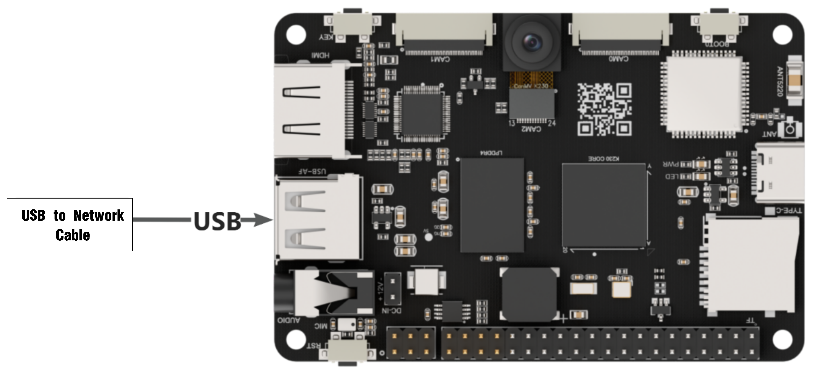

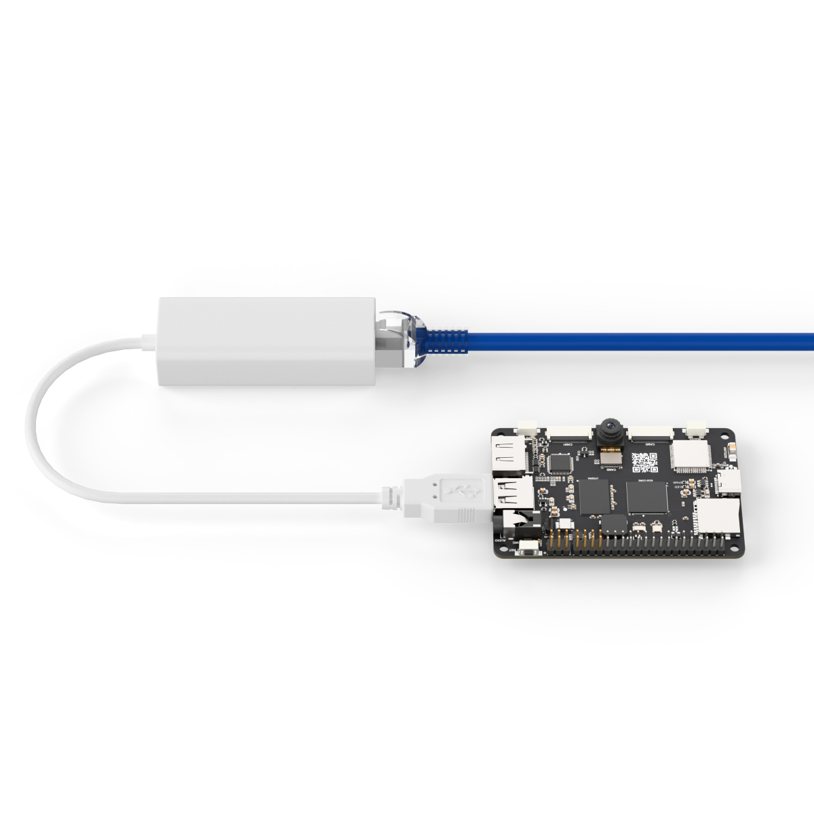

* **Module Connection**

1. Use a Type-C data cable to connect the K230 board to a PC, as shown below:
   


2. Double-click to open CanMV IDE K230.
   


3. Click the connection button in the bottom-left corner.
   


4. Upon successful connection, the icon in the bottom-left corner of the CanMV IDE software will change as shown below.
   


5. If the connection takes longer than 10 seconds, it indicates a connection failure. Click the **Cancel** button, and a pop-up will appear as shown below. Click **OK** and recheck the connection.
   


> [!NOTE]
> **Connection Failure Causes and Solutions:**
> 
> - **Cable is not a data cable: Some Type-C cables are charging-only cables without data transfer capability. Please use a Type-C cable with data transfer functionality. The factory-supplied cable is a Type-C data cable.**
> - **Other K230 firmware was flashed: Re-flash the factory firmware, then reconnect.**
> 

### 6.1.3 Program Execution and Download

The K230 program supports two operation modes: online execution and offline execution.

**Online Execution:**

In this mode, after connecting, drag the program **LAN.py** into CanMV IDE K230.

1) In the code editing area, click the run button in the bottom-left corner  to execute the program online, as shown below:
   
   > [!NOTE]
   > **Programs run using this method will be lost upon disconnection or power-off and will not be saved on the development board.**
   
   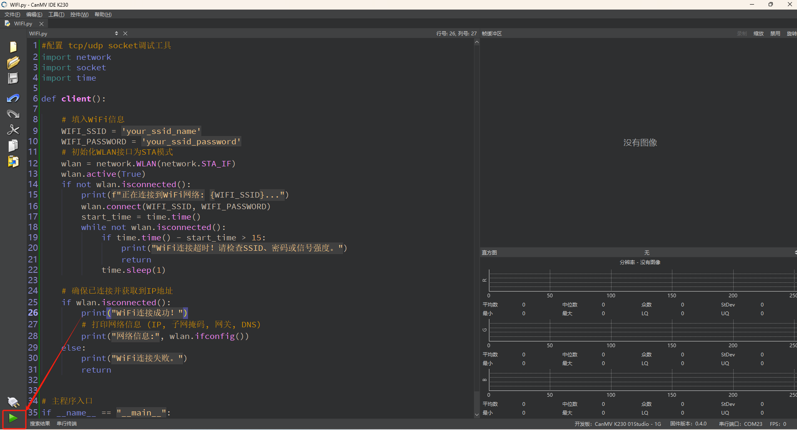

**Offline Execution:**

1. After connecting, drag the program **LAN.py** into the CanMV IDE K230 code editing area. Click on **Tools** in the toolbar and select **Save open script to CanMV Board (as main.py)** as shown below:
   
   

2. Then click **Yes**.
   
   

3. Once the file is written, click **OK** to confirm and complete saving the MicroPython file to the K230 development board.
   
   

   **With this method, the K230 board will automatically run the MicroPython file upon power-up without connection, enabling offline execution.**

### 6.1.4 Program Outcome

The K230 board uses the USB to Ethernet adapter for a wired connection to the router, and prints the IP address and other related information via the serial terminal.

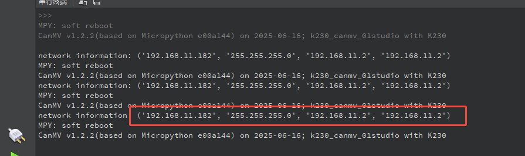

### 6.1.5 Program Analysis

* **Importing Required Libraries**

```
import network
```

`network` is used for WiFi connection management.

* **Main Program**

```
def main():
    # Get LAN interface
    a=network.LAN()
    # Check if the network interface is in use
    print(a.active())
    # View network interface IP, mask, gateway, DNS configuration
    print(a.ifconfig())
    # Set network interface IP, mask, gateway, DNS configuration
    print(a.ifconfig(('192.168.0.4', '255.255.255.0', '192.168.0.1', '8.8.8.8')))
    # View network interface IP, mask, gateway, DNS configuration again
    print(a.ifconfig())
    # Set network interface to DHCP mode
    print(a.ifconfig("dhcp"))
    # View network interface IP, mask, gateway, DNS configuration
    print(a.ifconfig())
    # View network interface MAC address
    print(a.config("mac"))
    # Set network interface to DHCP mode again
    print(a.ifconfig("dhcp"))
    # View network interface IP, mask, gateway, DNS configuration
    print(a.ifconfig())

main()
```

`a = network.LAN()` initializes the LAN interface object.
 `a.active()` checks whether the interface is enabled. 
 `a.ifconfig()` shows the current network configuration.
 `a.ifconfig((ip, mask, gateway, dns))` sets the static IP configuration. Call `a.ifconfig()` again to verify the settings.
 `a.ifconfig("dhcp")` switches the interface to DHCP mode to automatically obtain an IP address. Query again to confirm that DHCP is working.
 `a.config("mac")` retrieves the MAC address.


## 6.2 Wireless Connection

### 6.2.1 Experiment Overview

This section covers the wireless connection functionalities of the K230 board through programming.

> [!NOTE]
> **The CanMV K230 board features an onboard Wi-Fi module and ceramic antenna, allowing direct connection to a 2.4GHz wireless network.**

### 6.2.2 Preparation

To ensure a smooth demonstration of wireless connection, confirm that the following environment is properly set up.

* **Environment Setup**

1) Ensure the K230 board is connected to a router with internet access, forming a local area network (LAN).
   
2) Verify that the router is functioning properly to ensure stable network connectivity.
   

* **Module Connection**

1) Use a Type-C data cable to connect the K230 board to a PC, as shown below:
   
   

2) Double-click to open CanMV IDE K230.
   
   

3) Click the connection button in the bottom-left corner.
   
   

4) Upon successful connection, the icon in the bottom-left corner of the CanMV IDE software will change as shown below.
   


5) If the connection takes longer than 10 seconds, it indicates a connection failure. Click the **Cancel** button, and a pop-up will appear as shown below. Click **OK** and recheck the connection.
   


> [!NOTE]
> **Connection Failure Causes and Solutions:**
> 
> - **Cable is not a data cable: Some Type-C cables are charging-only cables without data transfer capability. Please use a Type-C cable with data transfer functionality. The factory-supplied cable is a Type-C data cable.**
> - **Other K230 firmware was flashed: Re-flash the factory firmware, then reconnect.**
> 

### 6.2.4 Program Execution and Download

The K230 program supports two operation modes: online execution and offline execution.

**Online Execution:**

In this mode, after connecting, drag the program **WIFI.py** from this section's directory into CanMV IDE K230.

1) Locate the codes highlighted in the red box.
   
   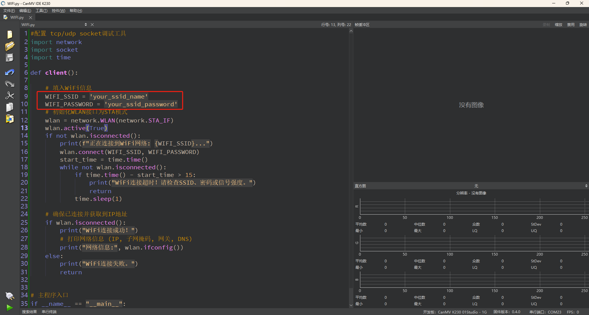

2) Replace `your_ssid_name` and `your_ssid_password` with the actual hotspot name and password.
   
3) In the code editing area, click the run button in the bottom-left corner  to execute the program online, as shown below:
   
   > [!NOTE]
   > **Programs run using this method will be lost upon disconnection or power-off and will not be saved on the development board.**
   
   

**Offline Execution:**

1. After connecting, drag the program **WIFI.py** from this section's directory into the CanMV IDE K230 code editing area. Click on **Tools** in the toolbar and select **Save open script to CanMV Board (as main.py)** as shown below:
   
   

2. Then click **Yes**.
   
   

3. Once the file is written, click **OK** to confirm and complete saving the MicroPython file to the K230 development board.4
   
   

   **With this method, the K230 board will automatically run the MicroPython file upon power-up without connection, enabling offline execution.**

### 6.2.5 Program Outcome

The K230 board successfully connects to the network by setting the hotspot name and password.

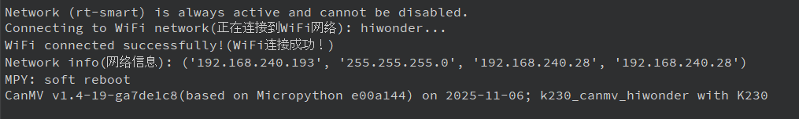

### 6.2.6 Program Analysis

* **Importing Required Libraries**

```
import network
import socket
import time
```

`socket` is used for TCP network communication, `network` for WiFi connection management, and `time` for delay operations.

**Main Program**

```
    # Fill in WiFi information
    WIFI_SSID = 'your_ssid_name'
    WIFI_PASSWORD = 'your_ssid_password'
    # Initialize WLAN interface as STA mode
    wlan = network.WLAN(network.STA_IF)
    wlan.active(True)
    if not wlan.isconnected():
        print(f"Connecting to WiFi network: {WIFI_SSID}...")
        wlan.connect(WIFI_SSID, WIFI_PASSWORD)
        start_time = time.time()
        while not wlan.isconnected():
            if time.time() - start_time > 15:
                print("WiFi connection timed out! Please check SSID, password, or signal strength.")
                return
            time.sleep(1)
```

Replace `your_ssid_name` and `your_ssid_password` with the actual hotspot name and password. Set the device to Station (STA) mode as a WiFi client to connect to the network. If the device is not connected to WiFi, call the `connect` method, waiting up to 15 seconds. If it times out, print a timeout message and exit. During this period, use a loop and sleep to prevent excessive CPU usage.

```
    # Ensure connection and IP address acquisition
    if wlan.isconnected():
        print("WiFi connected successfully!")
        # Print network information (IP, subnet mask, gateway, DNS)
        print("Network information:", wlan.ifconfig())
    else:
        print("WiFi connection failed.")
        return
```

Verify that the device is connected and has acquired an IP address. If connected, print a success message along with network information including IP, subnet mask, gateway, and DNS. If the connection fails, print a failure message and exit the program.


## 6.3 TCP_Client Communication

### 6.3.1 Experiment Overview

This section focuses on learning the TCP_Client functionalities of the K230 board through programming.

> [!NOTE]
> **The CanMV K230 board features an onboard Wi-Fi module and ceramic antenna, allowing direct connection to a 2.4GHz wireless network.**

### 6.3.2 Preparation

To ensure a smooth demonstration of TCP communication, confirm that the following environment is properly set up.

* **Environment Setup**

1) Ensure the K230 board and the computer are connected through the same router, forming a local area network (LAN).
   
2) Verify that the router is functioning properly to ensure stable network connectivity.
   

* **Disable Firewall**

To prevent the firewall from blocking TCP communication, it is recommended to temporarily disable the computer's firewall.


<p id ="tool_preparation"></p>
* **Tool Preparation**

1. In the folder [2. Software\2.6 Network Debugging Assistant](https://drive.google.com/drive/folders/1aNhRc-IejVRGrtzHUAkZy_rZWKhTOjYe?usp=sharing), double-click to open the **NetAssist.exe** network debugging assistant tool.

   

2. In **Protocol** section, select **TCP Server**.

   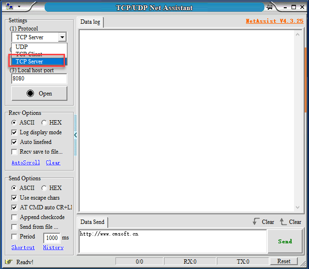

3. In the **Local host addr** field, select an IP address in the same subnet as the K230 board's connected network. The **Local host addr** value of **8080** does not need to be modified.

   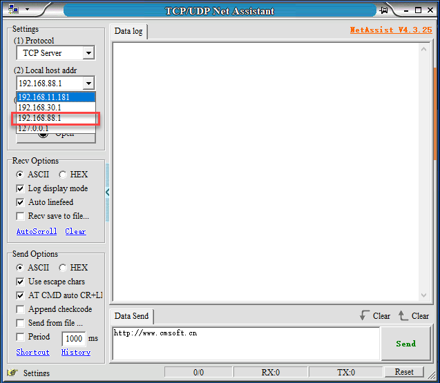

4. Then click **Connect**.

   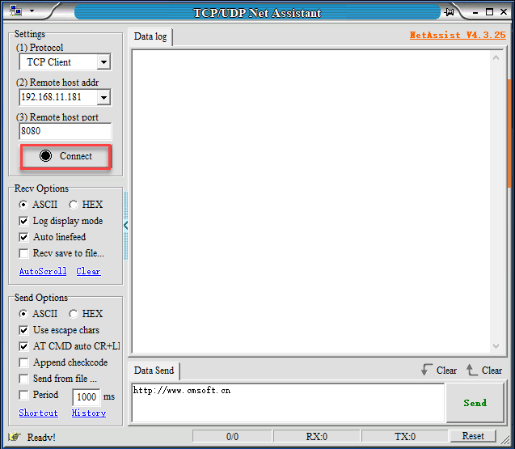

5. In the new dialog box that appears, click **OK**.

   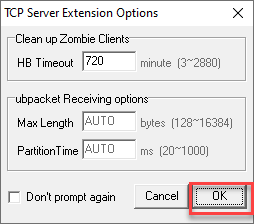

* **Module Connection**

1) Use a Type-C data cable to connect the K230 board to a PC, as shown below:
   
   

2) Double-click to open CanMV IDE K230.
   
   

3) Click the connection button in the bottom-left corner.
   
   

4) Upon successful connection, the icon in the bottom-left corner of the CanMV IDE software will change as shown below.
   


5) If the connection takes longer than 10 seconds, it indicates a connection failure. Click the **Cancel** button, and a pop-up will appear as shown below. Click **OK** and recheck the connection.
   


> [!NOTE]
> **Connection Failure Causes and Solutions:**
> 
> - **Cable is not a data cable: Some Type-C cables are charging-only cables without data transfer capability. Please use a Type-C cable with data transfer functionality. The factory-supplied cable is a Type-C data cable.**
> - **Other K230 firmware was flashed: Re-flash the factory firmware, then reconnect.**
> 

### 6.3.3 Program Execution and Download

The K230 program supports two operation modes: online execution and offline execution.

**Online Execution:**

In this mode, after connecting, drag the program **TCP_Client.py** into CanMV IDE K230.

1) Locate the codes highlighted in the red box.
   
   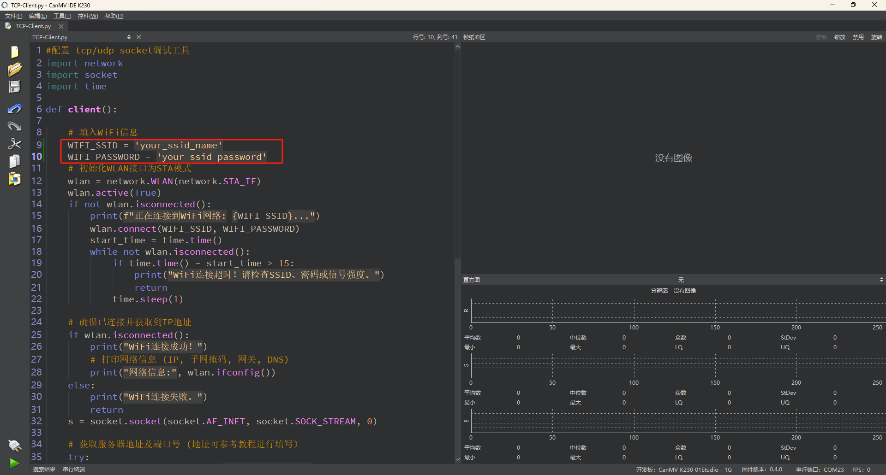

2) Enter the name and password of the same hotspot connected to the computer.
   
3) Locate the codes highlighted in the red box.
   
   

4) Enter the IP address set in [Tool Preparation](#tool_preparation).
   
5) In the code editing area, click the run button in the bottom-left corner  to execute the program online, as shown below:
   
   > [!NOTE]
   > **Programs run using this method will be lost upon disconnection or power-off and will not be saved on the development board.**
   
   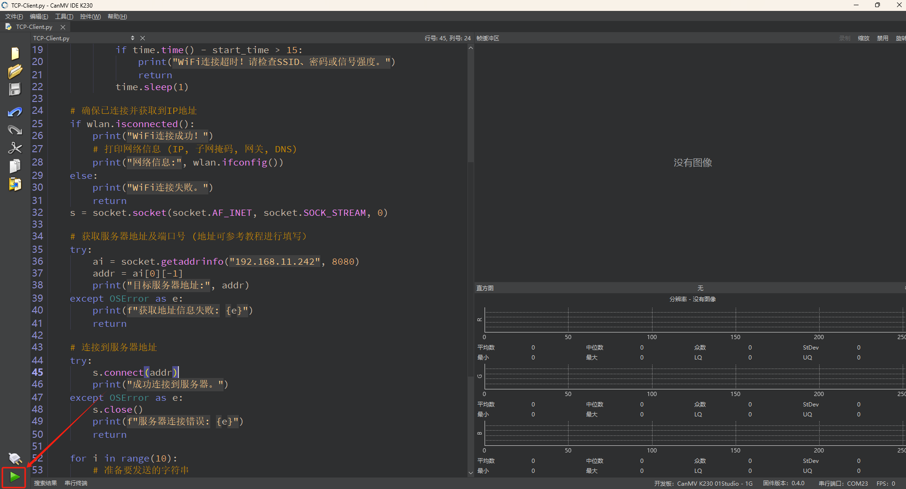

**Offline Execution:**

1. After connecting, drag the program **TCP_Client.py** from this section's directory into the CanMV IDE K230 code editing area. Click on **Tools** in the toolbar and select **Save open script to CanMV Board (as main.py)** as shown below:
   
   

2. Then click **Yes**.
   
   

3. Once the file is written, click **OK** to confirm and complete saving the MicroPython file to the K230 development board.
   
   

   **With this method, the K230 board will automatically run the MicroPython file upon power-up without connection, enabling offline execution.**


### 6.3.4 Program Outcome

The K230 board sends messages to the network debugging assistant via the TCP protocol.

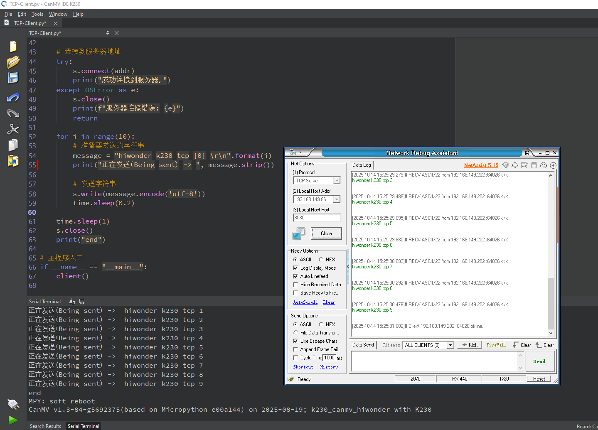

### 6.3.5 Program Analysis

* **Importing Required Libraries**

```
# Configure TCP/UDP socket debugging tool
import network
import socket
import time
```

* **Main Program**

```
    # Fill in WiFi information
    WIFI_SSID = 'your_ssid_name'
    WIFI_PASSWORD = 'your_ssid_password'
```

Replace `your_ssid_name` and `your_ssid_password` with the actual hotspot name and password.

```
    # Initialize WLAN interface as STA mode
    wlan = network.WLAN(network.STA_IF)
    wlan.active(True)
```

Enable and configure the WLAN interface to STA (Station) mode.

```
    if not wlan.isconnected():
        print(f"Connecting to WiFi network: {WIFI_SSID}...")
        wlan.connect(WIFI_SSID, WIFI_PASSWORD)
        start_time = time.time()
        while not wlan.isconnected():
            if time.time() - start_time > 15:
                print("WiFi connection timed out! Please check SSID, password, or signal strength.")
                return
            time.sleep(1)
```

Connect to WiFi and wait for the result. If WiFi is not connected, call `connect()` to initiate the connection. Enter a loop to wait for the connection to succeed, and automatically exit after a 15-second timeout to prevent waiting indefinitely. Use `wlan.isconnected()` to poll the connection status in real-time.

```
    s = socket.socket(socket.AF_INET, socket.SOCK_STREAM, 0)
```

Create a `TCP (SOCK_STREAM) IPv4 (AF_INET) socket`.

```
    try:
        s.connect(addr)
        print("Successfully connected to the server.")
    except OSError as e:
        s.close()
        print(f"Server connection error: {e}")
        return
```

Use `getaddrinfo` to resolve the server IP and port, such as 192.168.11.242:8080. It supports both DNS domain names and IP addresses, returning the complete address information. The `addr` variable is then used as the target for subsequent connections. 

        # Connect to the server address
        try:
            s.connect(addr)
            print("Successfully connected to the server.")
        except OSError as e:
            s.close()
            print(f"Server connection error: {e}")
            return

Initiate the TCP connection, and if it fails, close the resources and terminate the program.

```
    for i in range(10):
        # Prepare the string to send
        message = "hiwonder k230 tcp {0} \r\n".format(i)
        print("Sending -> ", message.strip())

        # Send the string
        s.write(message.encode('utf-8'))
        time.sleep(0.2)

    time.sleep(1)
    s.close()
    print("end")
```

Loop 10 times, sending the string **hiwonder k230 tcp X** each time, where X ranges from 0 to 9. Use `\r\n` to maintain the message ending format, which is commonly used in standard network protocols. Print the data content being sent each time. Use `write()` to send the data in binary format, encoded as UTF-8. After each send, sleep for 0.2 seconds to prevent screen flickering or network congestion.


## 6.4 TCP_Server Communication

### 6.4.1 Experiment Overview

This section focuses on learning the TCP_Server functionalities of the K230 board through programming.

> [!NOTE]
> **The CanMV K230 board features an onboard Wi-Fi module and ceramic antenna, allowing direct connection to a 2.4GHz wireless network.**

### 6.4.2 Preparation

To ensure a smooth demonstration of TCP communication, confirm that the following environment is properly set up.

* **Environment Setup**

1) Ensure the K230 board and the computer are connected through the same router, forming a local area network (LAN).
   
2) Verify that the router is functioning properly to ensure stable network connectivity.


* **Disable Firewall**

To prevent the firewall from blocking TCP communication, it is recommended to temporarily disable the computer's firewall.


* **Module Connection**

1) Use a Type-C data cable to connect the K230 board to a PC, as shown below:
   
   

2) Double-click to open CanMV IDE K230.
   
   

3) Click the connection button in the bottom-left corner.
   
   

4) Upon successful connection, the icon in the bottom-left corner of the CanMV IDE software will change as shown below.
   


5) If the connection takes longer than 10 seconds, it indicates a connection failure. Click the **Cancel** button, and a pop-up will appear as shown below. Click **OK** and recheck the connection.
   


> [!NOTE]
> **Connection Failure Causes and Solutions:**
> 
> - **Cable is not a data cable: Some Type-C cables are charging-only cables without data transfer capability. Please use a Type-C cable with data transfer functionality. The factory-supplied cable is a Type-C data cable.**
> - **Other K230 firmware was flashed: Re-flash the factory firmware, then reconnect.**
> 

### 6.4.3 Program Execution and Download

The K230 program supports two operation modes: online execution and offline execution.

**Online Execution:**

In this mode, after connecting, drag the program **TCP_Server.py** from this section's directory into CanMV IDE K230.

1) Locate the codes highlighted in the red box.
   
   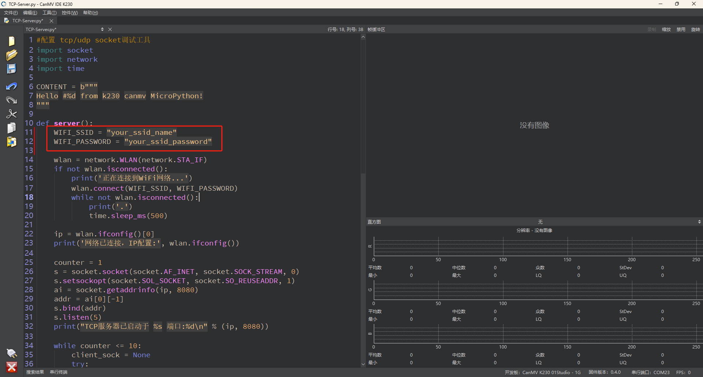

2) Enter the name and password of the same hotspot connected to the computer.
   
3) In the code editing area, click the run button in the bottom-left corner  to execute the program online, as shown below:
   
   > [!NOTE]
   > **Programs run using this method will be lost upon disconnection or power-off and will not be saved on the development board.**
   
   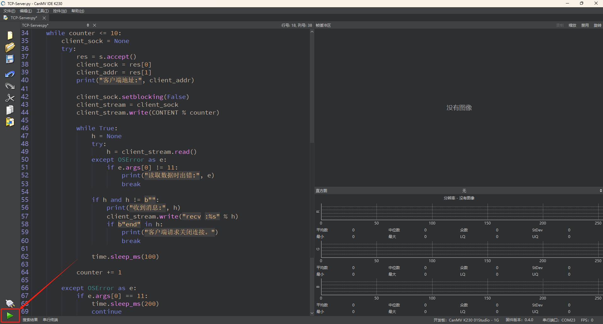

**Offline Execution:**

1. After connecting, drag the program **TCP_Server.py** from this section's directory into the CanMV IDE K230 code editing area. Click on **Tools** in the toolbar and select **Save open script to CanMV Board (as main.py)** as shown below:
   
   

2. Then click **Yes**.
   
   

3. Once the file is written, click **OK** to confirm and complete saving the MicroPython file to the K230 development board.
   
   

   **With this method, the K230 board will automatically run the MicroPython file upon power-up without connection, enabling offline execution.**

* **Tool Preparation**

1) In the folder [2. Software Tools\2.6 Network Debugging Assistant](https://drive.google.com/drive/folders/1aNhRc-IejVRGrtzHUAkZy_rZWKhTOjYe?usp=sharing), double-click to open the **NetAssist.exe** network debugging assistant tool.
   
   

2) In **Protocol** section, select **TCP Server**.
   
   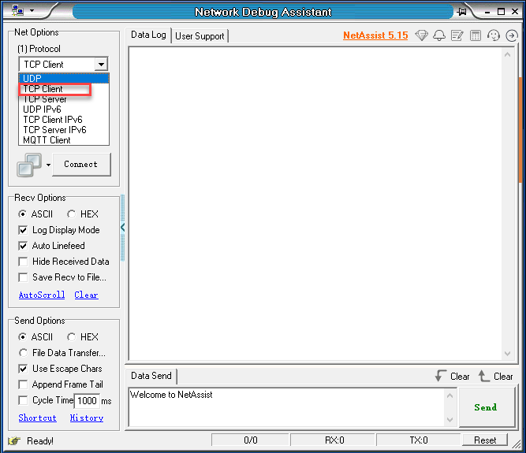

3) In the **Local host addr** field, select an IP address in the same subnet as the K230 board's connected network. The **Local host addr** value of **8080** does not need to be modified.
   
   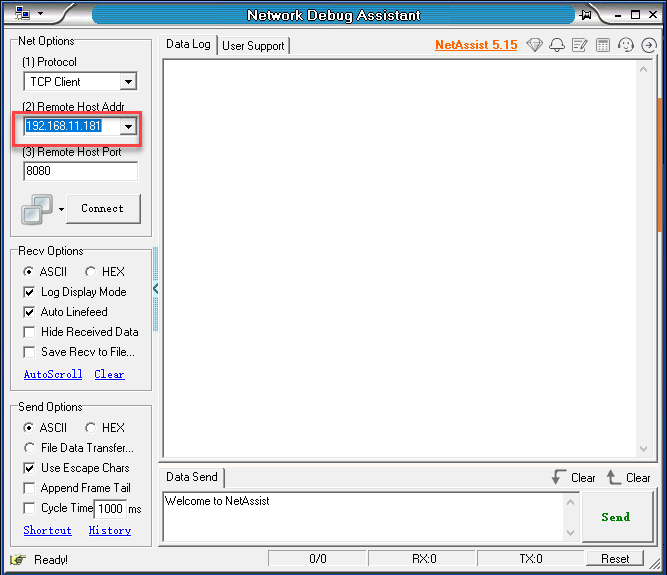

4) Then click **Connect**.
   
   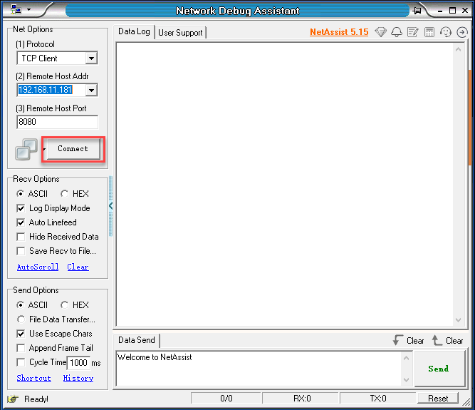

5) Then click **OK**.
   
   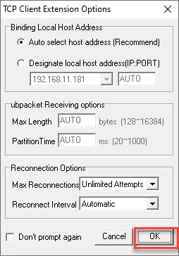

6) Upon successful connection, you will receive the message **Hello #1 from k230 canmv MicroPython!** sent by the K230 board.
   
   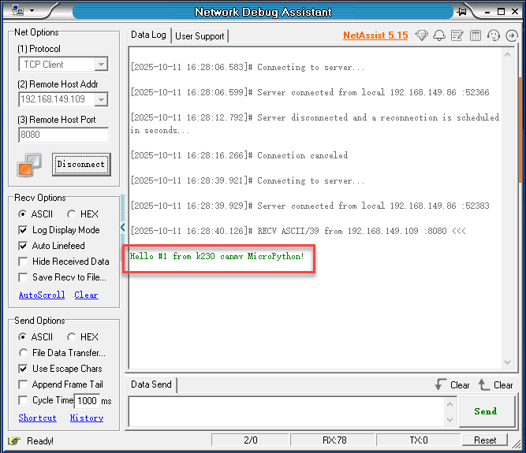

7) In the dialog box, type **Hello, Hiwonder**, then click **Send**.
   
   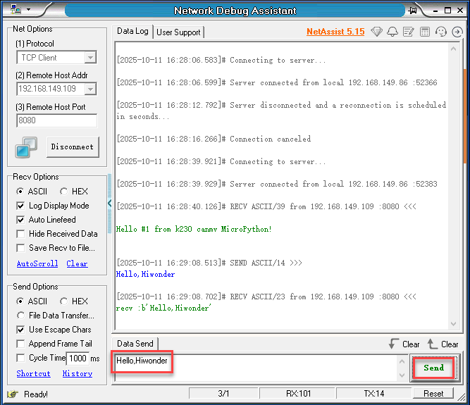

### 6.4.5 Program Outcome

The network debugging assistant sends messages to the K230 board via the TCP protocol.

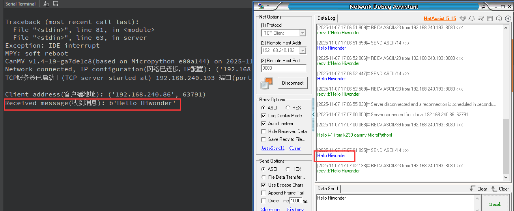

### 6.4.6 Program Analysis

* **Importing Required Libraries**

```
# Configure TCP/UDP socket debugging tool
import socket
import network
import time

CONTENT = b"""
Hello #%d from k230 canmv MicroPython!
"""
```

`socket` is used for TCP network communication, `network` for WiFi connection management, and `time` for delay operations.

* **Main Program**

```
    WIFI_SSID = "your_ssid_name"
    WIFI_PASSWORD = "your_ssid_password"
```

Replace `your_ssid_name` and `your_ssid_password` with the actual hotspot name and password.

```
    wlan = network.WLAN(network.STA_IF)
    wlan.active(True)
```

Enable and configure the WLAN interface to STA (Station) mode.

```
    wlan = network.WLAN(network.STA_IF)
    if not wlan.isconnected():
        print('Connecting to WiFi network...')
        wlan.connect(WIFI_SSID, WIFI_PASSWORD)
        while not wlan.isconnected():
            print('.')
            time.sleep_ms(500)

    ip = wlan.ifconfig()[0]
    print('Network connected, IP configuration:', wlan.ifconfig())
```

Initialize STA interface mode, which is the station mode connecting to router. If not connected, attempt to connect to specified `WIFI_SSID` and `WIFI_PASSWORD`, printing "." every 500 milliseconds as progress indicator until connection succeeds. After successful connection, print obtained IP and other network configuration information.

```
    counter = 1
    s = socket.socket(socket.AF_INET, socket.SOCK_STREAM, 0)
    s.setsockopt(socket.SOL_SOCKET, socket.SO_REUSEADDR, 1)
    ai = socket.getaddrinfo(ip, 8080)
    addr = ai[0][-1]
    s.bind(addr)
    s.listen(5)
    print("TCP server started at %s on port %d\n" % (ip, 8080))
```

`socket.socket` creates an IPv4 TCP socket. `setsockopt` enables port reuse to prevent “address already in use” errors. `getaddrinfo` is used to obtain the socket address structure for the local IP. The socket is then bound to port 8080 on the local machine, listening is started with up to five pending connection requests allowed, and a message is printed to indicate that the server has started successfully.

```
    while counter <= 10:
        client_sock = None
        try:
            res = s.accept()
            client_sock = res[0]
            client_addr = res[1]
            print("Client address:", client_addr)

            client_sock.setblocking(False)
            client_stream = client_sock
            client_stream.write(CONTENT % counter)
```

`counter` starts at 1 and limits the server to handling only 10 client connections. `accept()` blocks until a client connects, returning the client’s `socket` object and its IP/port information. The client’s address is printed, then a Wi-Fi connection is initiated and the result is awaited. If Wi-Fi is not yet connected, `connect()` is called to start the connection. The code then enters a loop that waits for the connection to succeed, with a 15-second timeout to prevent hanging. `wlan.isconnected()` is polled in real time to check the connection status.

```
            while True:
                h = None
                try:
                    h = client_stream.read()
                except OSError as e:
                    if e.args[0] != 11:
                        print("Error while reading data:", e)
                        break

                if h and h != b"":
                    print("Message received:", h)
                    client_stream.write("recv :%s" % h)
                    if b"end" in h:
                        print("Client requested to close the connection.")
                        break

                time.sleep_ms(100)
```

The server enters an internal infinite loop to continuously read data from the client.
 The `read()` operation is non-blocking. If an exception with code `11` occurs, which is equivalent to `EAGAIN`, meaning no data is currently available, it is ignored and the loop continues. If valid non-empty data is successfully read, the message is printed and the server replies to the client with the string `"recv :<data>"`.  If the received data contains the byte sequence `"end"`, it is treated as a request from the client to close the connection, and the loop is exited. A 100 ms delay is applied in each iteration to reduce CPU usage.


## 6.5 UDP_Client Communication

### 6.5.1 Experiment Overview

This section uses a program example to explore the UDP client functionality of the K230 development board.


> [!NOTE]
>
> **The CanMV K230 board features an onboard Wi-Fi module and ceramic antenna, allowing direct connection to a 2.4GHz wireless network.**

### 6.5.2 Preparation

To ensure a smooth demonstration of UDP communication, confirm that the following environment is properly set up.

* **Environment Setup**

1)  Ensure the K230 board and the computer are connected through the same router, forming a local area network (LAN).

2)  Verify that the router is functioning properly to ensure stable network connectivity.

* **Disable Firewall**

To prevent the firewall from blocking UDP communication, it is recommended to temporarily disable the computer's firewall.


* **Tool Preparation**

1. In the folder [2. Software\2.6 Network Debugging Assistant](https://drive.google.com/drive/folders/1aNhRc-IejVRGrtzHUAkZy_rZWKhTOjYe?usp=sharing), double-click to open the **NetAssist.exe** network debugging assistant tool.

   

2. In **Protocol** section, select **UDP**.

   

3. In the **Local host addr** field, select an IP address in the same subnet as the K230 board's connected network. The **Local host addr** value of **8080** does not need to be modified.

   

4. Then click **Open**.

   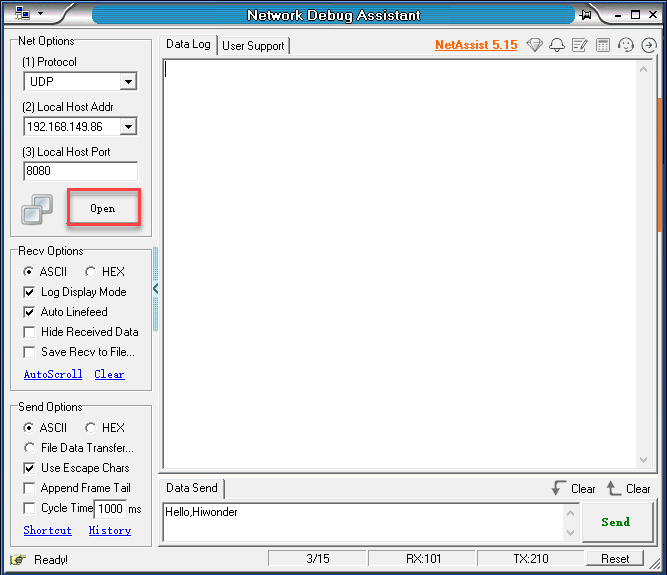

### 6.5.3 Module Connection

1. Connect the K230 development board to your PC using a Type-C data cable, as shown below:

   

2. Double-click to open CanMV IDE K230.

   

3. Click the connect button in the bottom left corner.

   

4. Upon successful connection, the icon in the bottom left of CanMV IDE will change as shown below.


5)  If the connection takes longer than 10 seconds, it indicates a connection failure. Click the **Cancel** button, and a pop-up will appear as shown below. Click **OK** and recheck the connection.


> [!NOTE]
>
> **Connection Failure Causes and Solutions:**
>
> * **Cable is not a data cable: Some Type-C cables are charging-only cables without data transfer capability. Please use a Type-C cable with data transfer functionality. The factory-supplied cable is a Type-C data cable.**
>
> * **Other K230 firmware was flashed: Re-flash the factory firmware, then reconnect.**

### 6.5.4 Program Execution and Download

The K230 program supports two operation modes: online execution and offline execution.

**Online Execution:**

After connection, drag the program **UDP_Client.py** from the same directory to CanMV IDE K230.

1. Locate the codes highlighted in the red box.

   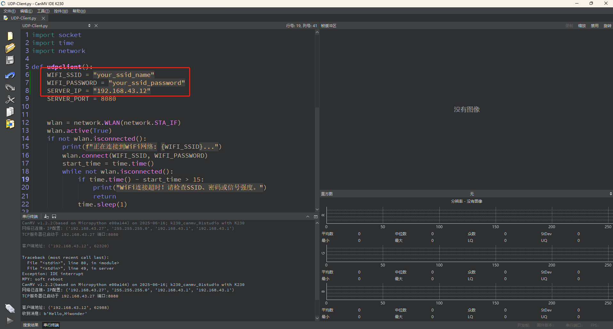

2. Enter the name and password of the same hotspot connected to the computer.

3. In the code editing area, click the run button  in the bottom left corner to execute the program online, as shown below:

   > [!NOTE]
   >
   > **Programs run using this method will be lost upon disconnection or power-off and will not be saved on the development board.**

   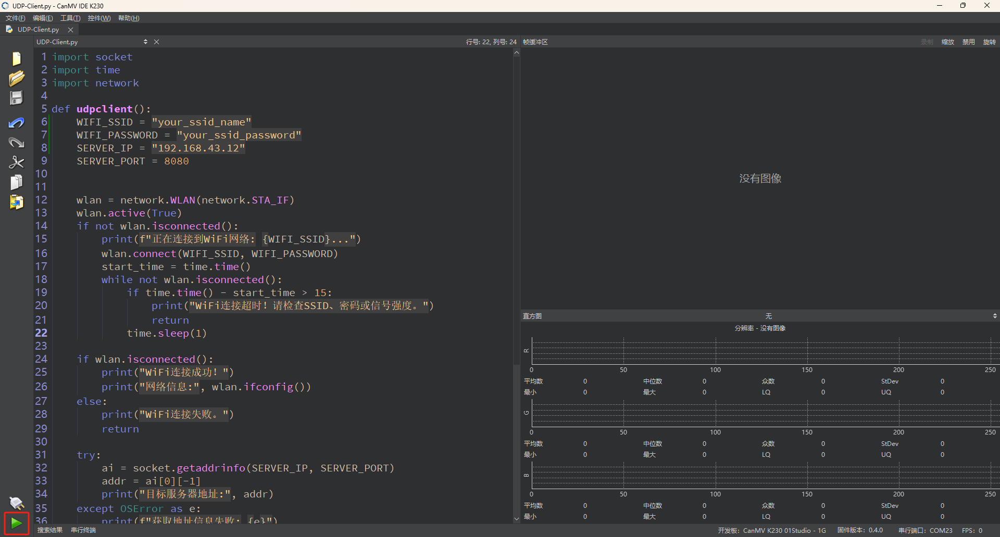

   **Offline Execution:**

   1. After connection, drag the program **TCP_Client.py** from the same directory to the CanMV IDE K230 code editing area. Click **Tools** in the toolbar and select **Save open script to CanMV Board (as main.py)** as shown below:

   

   2. Then click **Yes**.

   

   3. Once the file is written, click **OK** to confirm and complete saving the MicroPython file to the K230 development board.

   

   **With this method, the K230 board will automatically run the MicroPython file upon power-up without connection, enabling offline execution.**

### 6.5.5 Program Outcome

The K230 development board sends messages to the network debugging assistant via UDP protocol.


### 6.5.6 Program Analysis

* **Importing Required Libraries**

```
import socket
import time
import network
```

* **Main Program**

```
    WIFI_SSID = "your_ssid_name"
    WIFI_PASSWORD = "your_ssid_password"
    SERVER_IP = "192.168.174.78"
    SERVER_PORT = 8080
```

Replace `your_ssid_name` and `your_ssid_password` with the actual hotspot name and password. And set `SERVER_IP` to your computer's IP.

```
    wlan = network.WLAN(network.STA_IF)
    wlan.active(True)
```

Enable and configure the WLAN interface to STA mode.

```
    if not wlan.isconnected():
        print(f"Connecting to WiFi network: {WIFI_SSID}...")
        wlan.connect(WIFI_SSID, WIFI_PASSWORD)
        start_time = time.time()
        while not wlan.isconnected():
            if time.time() - start_time > 15:
                print("WiFi connection timed out! Please check the SSID, password, or signal strength.")
                return
            time.sleep(1)
```

Initiate WiFi connection and wait for result. If not connected to WiFi, call `connect()` to start connection. Enter loop waiting for successful connection with 15-second timeout to prevent indefinite waiting. `wlan.isconnected()` polls connection status in real-time.

```
    s = socket.socket(socket.AF_INET, socket.SOCK_DGRAM)
```

Create a `UDP (SOCK_DGRAM)` socket with IPv4 protocol family `(AF_INET)`.

```
    for i in range(10):
        message = "hiwonder K230 UDP {0} \r\n".format(i)
        print(f"Sending -> {message.strip()}")
        s.sendto(message.encode('utf-8'), addr)
        time.sleep(0.2)
```

Loop to send 10 messages. Each message is generated in the format `hiwonder K230 UDP {i} \r\n` and sent to the specified UDP server address and port using `sendto`. After sending each message, wait for 0.2 seconds to prevent network congestion or sending too quickly.

```
    time.sleep(1)
    s.close()
    print("Client has stopped running")

udpclient()
```

Wait for 1 second to ensure all messages are sent, then close the UDP socket and print a message indicating the program has finished.


## 6.6 UDP_Server Communication

### 6.6.1 Experiment Overview

This section uses a program example to explore the UDP server functionality of the K230 development board.

> [!NOTE]
>
> **The CanMV K230 board features an onboard Wi-Fi module and ceramic antenna, allowing direct connection to a 2.4GHz wireless network.**

### 6.6.2 Preparation

To ensure a smooth demonstration of UDP communication, confirm that the following environment is properly set up.

* **Environment Setup**

1)  Ensure the K230 board and the computer are connected through the same router, forming a local area network (LAN).

2)  Verify that the router is functioning properly to ensure stable network connectivity.

* **Disable Firewall**

To prevent the firewall from blocking UDP communication, it is recommended to temporarily disable the computer's firewall.


* **Module Connection**

1. Connect the K230 development board to your PC using a Type-C data cable, as shown below:

   

2. Double-click to open CanMV IDE K230.

   

3. Click the connect button in the bottom left corner.

   

4. Upon successful connection, the icon in the bottom left of CanMV IDE will change as shown below.


5)  If the connection takes longer than 10 seconds, it indicates a connection failure. Click the **Cancel** button, and a pop-up will appear as shown below. Click **OK** and recheck the connection.


> [!NOTE]
>
> **Connection Failure Causes and Solutions:**
>
> * **Cable is not a data cable: Some Type-C cables are charging-only cables without data transfer capability. Please use a Type-C cable with data transfer functionality. The factory-supplied cable is a Type-C data cable.**
>
> * **Other K230 firmware was flashed: Re-flash the factory firmware, then reconnect.**

### 6.6.3 Program Execution and Download

The K230 program supports two operation modes: online execution and offline execution.

**Online Execution:**

After connection, drag the program **UDP_Server.py** from the same directory to CanMV IDE K230.

1. Locate the codes highlighted in the red box.

   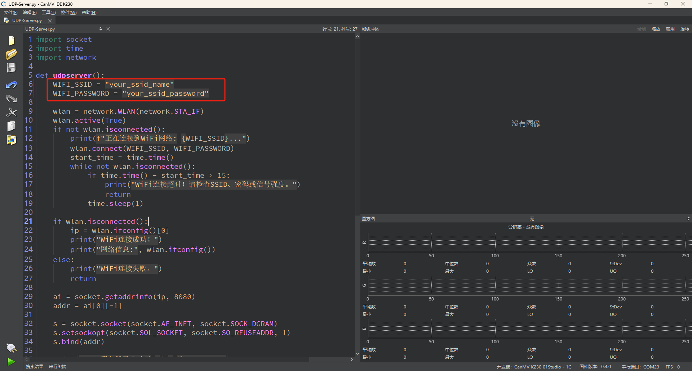

2. Enter the name and password of the same hotspot connected to the computer.

3. In the code editing area, click the run button  in the bottom left corner to execute the program online, as shown below:

   > [!NOTE]
   >
   > **Programs run using this method will be lost upon disconnection or power-off and will not be saved on the development board.**

   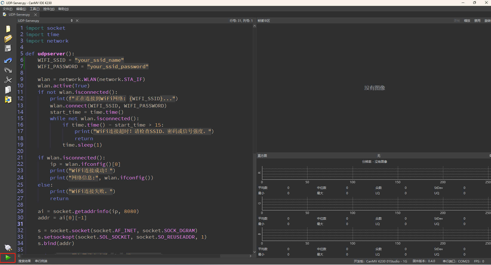

   **Offline Execution:**

   1. After connection, drag the program **UDP_Server.py** from the same directory to the CanMV IDE K230 code editing area. Click **Tools** in the toolbar and select **Save open script to CanMV Board (as main.py)** as shown below:

   

   2. Then click **Yes**.

   

   3. Once the file is written, click **OK** to confirm and complete saving the MicroPython file to the K230 development board.

   

   **With this method, the K230 board will automatically run the MicroPython file upon power-up without connection, enabling offline execution.**

* **Tool Preparation**

1. In the folder [2. Software\2.6 Network Debugging Assistant](), double-click to open the **NetAssist.exe** network debugging assistant tool.

   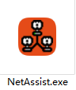

2. In **Protocol** section, select **UDP**.

   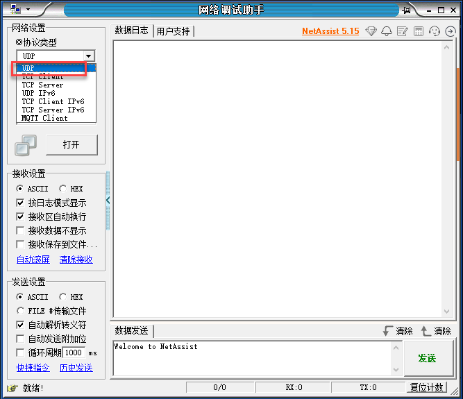

3. In the **Local host addr** field, select an IP address in the same subnet as the K230 board's connected network. The **Local host addr** value of **8080** does not need to be modified.

   

4. Then click **Open**.

   

5. Enter **Hello, Hiwonder** in the session box, then click **Send**.

   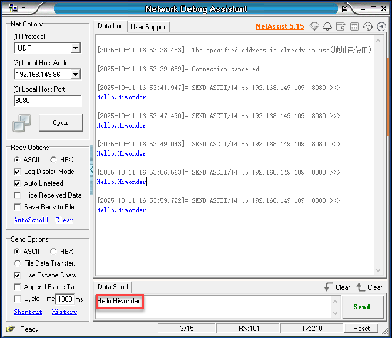

### 6.6.4 Program Outcome

The network debugging assistant sends messages to the K230 development board via UDP protocol.

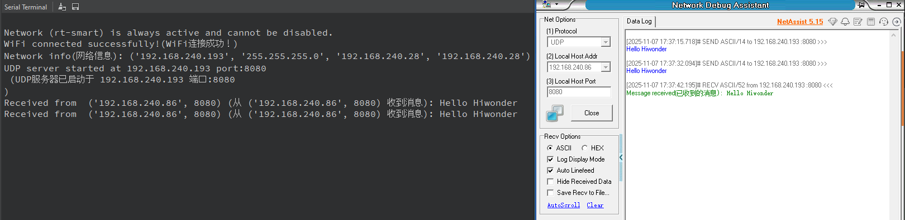

### 6.6.5 Program Analysis

* **Importing Required Libraries**

```
import socket
import time
import network
```

`socket` is used for UDP network communication, `network` for WiFi connection management, and `time` for delay operations.

* **Main Program**

```
    WIFI_SSID = "your_ssid_name"
    WIFI_PASSWORD = "your_ssid_password"
```

Replace `your_ssid_name` and `your_ssid_password` with the actual hotspot name and password.

```
    wlan = network.WLAN(network.STA_IF)
    wlan.active(True)
    if not wlan.isconnected():
        print(f"Connecting to WiFi network: {WIFI_SSID}...")
        wlan.connect(WIFI_SSID, WIFI_PASSWORD)
        start_time = time.time()
        while not wlan.isconnected():
            if time.time() - start_time > 15:
                print("WiFi connection timed out! Please check the SSID, password, or signal strength.")
                return
            time.sleep(1)
```

Switch to STA (station) mode to connect to router as client. If not connected, call `connect()` to log into network. Loop to check connection status with maximum 15-second wait to prevent hanging.

```
    if wlan.isconnected():
        ip = wlan.ifconfig()[0]
        print("WiFi connected successfully.")
        print("Network info:", wlan.ifconfig())
    else:
        print("WiFi connection failed.")
        return
```

If connection successful, record local IP address and print network configuration information. If failed, terminate program.

```
    ai = socket.getaddrinfo(ip, 8080)
    addr = ai[0][-1]

    s = socket.socket(socket.AF_INET, socket.SOCK_DGRAM)
    s.setsockopt(socket.SOL_SOCKET, socket.SO_REUSEADDR, 1)
    s.bind(addr)

    print(f"UDP server started at {ip} on port 8080\n")
```

Use `getaddrinfo` to convert IP and port, compatible with IPv4/IPv6. Create IPv4/UDP `socket`, set port reusable to prevent binding failure on restart. Bind to local IP address and port 8080, print server startup information.

```
    s.settimeout(10.0)
```

Set `recvfrom` blocking timeout to prevent hanging with no client messages for extended periods. Exception thrown after 10 seconds without messages.

```
    count = 0
    while count < 10:
        try:
            data, client_addr = s.recvfrom(1024)
            print(f"Received message from {client_addr}: {data.decode('utf-8').strip()}")

            response = f"Message received: {data.decode('utf-8').strip()}".encode('utf-8')
            s.sendto(response, client_addr)
            count += 1
        except OSError:
            print("Client message timeout... Keep waiting...")
            continue
        except Exception as e:
            print(f"Error occurred: {e}")
            break
```

`count` keeps track of the number of processed messages, up to 10. Use `recvfrom` to receive UDP packets along with the client address, with a maximum buffer size of 1024 bytes. Print the received message, assemble a response, and send it back to the client’s address. If an `OSError` occurs, usually due to a timeout, print a timeout message and continue waiting. For other exceptions, print the error details and exit the loop.

```
    s.close()
    print("UDP server has been closed.")
```

Close UDP socket, release all network resources, and print shutdown information.


## 6.7 HTTP_Client Communication

### 6.7.1 Experiment Overview

This section teaches how to use **HTTP_Client** functions on the K230 development board through programming.

> [!NOTE]
>
> **The CanMV K230 board features an onboard Wi-Fi module and ceramic antenna, allowing direct connection to a 2.4GHz wireless network.**

### 6.7.2 Preparation

To ensure a smooth demonstration of HTTP communication, please confirm the following environment is properly configured.

* **Environment Setup**

1)  Ensure the K230 board and the computer are connected through the same router, forming a local area network (LAN).

2)  Verify that the router is functioning properly to ensure stable network connectivity.

* **Disable Firewall**

To prevent the firewall from blocking HTTP communication, it is recommended to temporarily disable the computer's firewall.

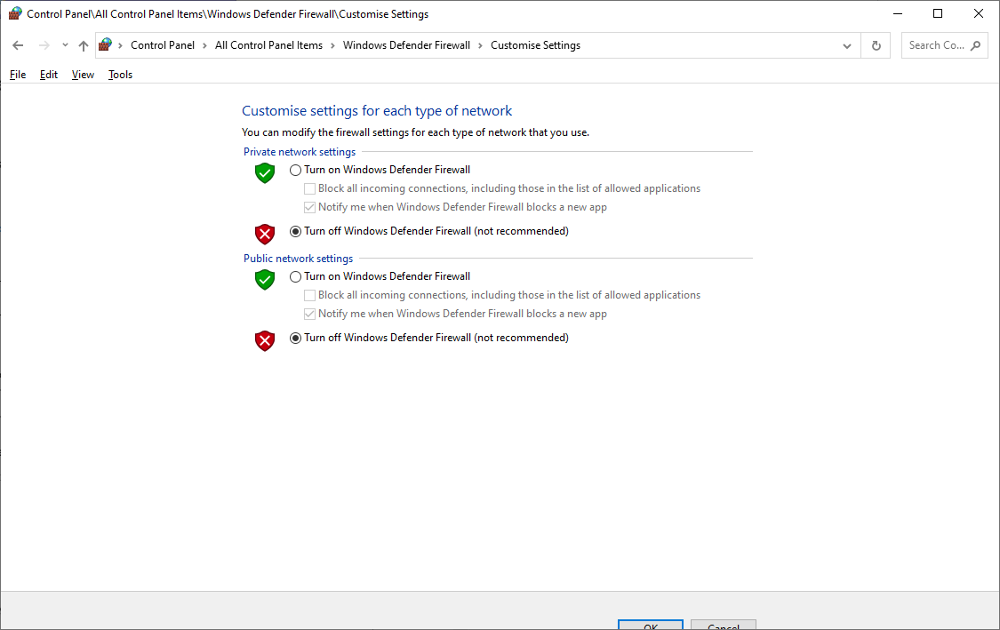

* **Module Connection**

1. Connect the K230 development board to your PC using a Type-C data cable, as shown below:

   

2. Double-click to open CanMV IDE K230.

   

3. Click the connect button in the bottom left corner.

   

4. Upon successful connection, the icon in the bottom left of CanMV IDE will change as shown below.


5)  If the connection takes longer than 10 seconds, it indicates a connection failure. Click the **Cancel** button, and a pop-up will appear as shown below. Click **OK** and recheck the connection.


> [!NOTE]
>
> **Connection Failure Causes and Solutions:**
>
> * **Cable is not a data cable: Some Type-C cables are charging-only cables without data transfer capability. Please use a Type-C cable with data transfer functionality. The factory-supplied cable is a Type-C data cable.**
>
> * **Other K230 firmware was flashed: Re-flash the factory firmware, then reconnect.**

### 6.7.3 Program Execution and Download

The K230 program supports two operation modes: online execution and offline execution.

**Online Execution:**

After connection, drag the program **HTTP_Client.py** from the same directory to CanMV IDE K230.

1. Locate the codes highlighted in the red box.

   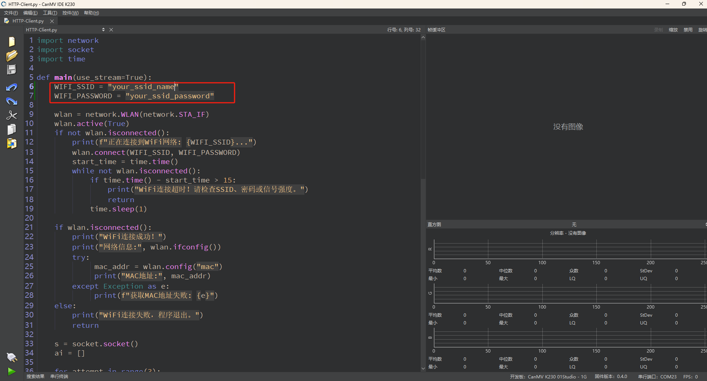

2. Replace `your_ssid_name` and `your_ssid_password` with the actual hotspot name and password.

3. In the code editing area, click the run button  in the bottom left corner to execute the program online, as shown below:

   > [!NOTE]
   >
   > **Programs run using this method will be lost upon disconnection or power-off and will not be saved on the development board.**

   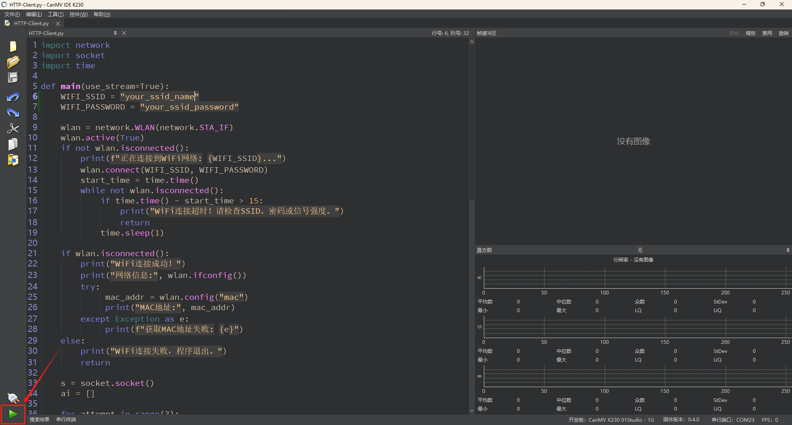

   **Offline Execution:**

   1. After connection, drag the program **HTTP_Client.py** from the same directory to the CanMV IDE K230 code editing area. Click **Tools** in the toolbar and select **Save open script to CanMV Board (as main.py)** as shown below:

   

   2. Then click **Yes**.

   

   3. Once the file is written, click **OK** to confirm and complete saving the MicroPython file to the K230 development board.

   

   **With this method, the K230 board will automatically run the MicroPython file upon power-up without connection, enabling offline execution.**

### 6.7.4 Program Outcome

The K230 development board sends requests to the network via HTTP protocol.

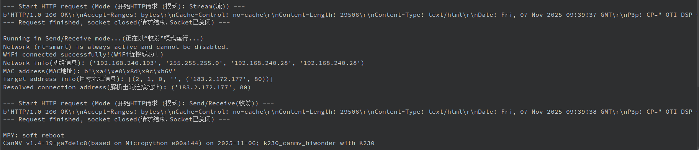

### 6.7.5 Program Analysis

* **Importing Required Libraries**

```
import network
import socket
import time
```

* **Main Program**

```
def main(use_stream=True):
    WIFI_SSID = "TP-LINK_031F"
    WIFI_PASSWORD = "12345678"

    wlan = network.WLAN(network.STA_IF)
    wlan.active(True)
    if not wlan.isconnected():
        print(f"Connecting to WiFi network: {WIFI_SSID}...")
        wlan.connect(WIFI_SSID, WIFI_PASSWORD)
        start_time = time.time()
        while not wlan.isconnected():
            if time.time() - start_time > 15:
                print("WiFi connection timeout! Please check SSID, password, or signal strength.")
                return
            time.sleep(1)
```

Replace `your_ssid_name` and `your_ssid_password` with the actual hotspot name and password. Initiate connection to specified hotspot, loop waiting for connection with maximum 15-second timeout, print timeout message and exit if exceeded.

```
    if wlan.isconnected():
        print("WiFi connected successfully!")
        print("Network info:", wlan.ifconfig())
        try:
             mac_addr = wlan.config("mac")
             print("MAC address:", mac_addr)
        except Exception as e:
             print(f"Failed to get MAC address: {e}")
    else:
        print("WiFi connection failed, exiting program.")
        return
```

If successful, display the IP address, gateway, and DNS information. Also try to obtain the device’s MAC address, and print an error message if this operation fails.

```
    s = socket.socket()
    ai = []

    for attempt in range(3):
        try:
            ai = socket.getaddrinfo("www.google.com", 80)
            break
        except OSError as e:
            print(f"Attempt {attempt + 1} to get address info failed: {e}, retrying...")
            time.sleep(1)

    if not ai:
        print("Failed to obtain target address, cannot proceed.")
        s.close()
        return

    addr = ai[0][-1]
    print("Target address info:", ai)
    print("Resolved connection address:", addr)
```

Create a default `TCP socket (AF_INET, SOCK_STREAM)`, retry up to 3 times to resolve "**[www.baidu.com](http://www.baidu.com)**", handle network errors, and exit if it fails multiple times. Upon successful resolution, obtain the IP address and port tuple, then enable and configure the WLAN interface to STA mode.

```
    try:
        s.connect(addr)
    except OSError as e:
        print(f"Failed to connect to the target address: {e}")
        s.close()
        return

    print("\n--- Starting HTTP request (mode: {}) ---".format("stream" if use_stream else "send/receive"))
```

Attempt to establish TCP connection, throw exception and close socket if failed.

```
    if use_stream:
        # Use stream mode, like file read/write
        s_file = s.makefile("rwb", 0)
        s_file.write(b"GET /index.html HTTP/1.0\r\n\r\n")
        print(s_file.read())
        s_file.close()
    else:
        # Use standard send/receive mode
        s.send(b"GET /index.html HTTP/1.0\r\n\r\n")
        print(s.recv(4096))
```

Using stream mode `(makefile)`, the `socket` is wrapped as a file-like object, allowing read and write operations similar to a regular file. Send an **HTTP GET** request and read the complete response from the server.

Send/receive mode `(send/recv)` directly uses `send` to transmit request data, calls `recv` to receive up to 4096 bytes response. The received data is then printed.

```
    s.close()
    print("--- Request finished, socket closed ---\n")
```

Actively close connection and release resources.


## 6.8 HTTP_Server Communication

### 6.8.1 Experiment Overview

This section teaches how to use **HTTP_Server** functions on the K230 development board through programming.

> [!NOTE]
>
> **The CanMV K230 board features an onboard Wi-Fi module and ceramic antenna, allowing direct connection to a 2.4GHz wireless network.**

### 6.8.2 Preparation

To ensure a smooth demonstration of HTTP communication, please confirm the following environment is properly configured.

* **Environment Setup**

1)  Ensure the K230 board and the computer are connected through the same router, forming a local area network (LAN).

2)  Verify that the router is functioning properly to ensure stable network connectivity.

* **Disable Firewall**

To prevent the firewall from blocking HTTP communication, it is recommended to temporarily disable the computer's firewall.


* **Module Connection**

1. Connect the K230 development board to your PC using a Type-C data cable, as shown below:

   

2. Double-click to open CanMV IDE K230.

   

3. Click the connect button in the bottom left corner.

   

4. Upon successful connection, the icon in the bottom left of CanMV IDE will change as shown below.


5)  If the connection takes longer than 10 seconds, it indicates a connection failure. Click the **Cancel** button, and a pop-up will appear as shown below. Click **OK** and recheck the connection.


> [!NOTE]
>
> **Connection Failure Causes and Solutions:**
>
> **Cable is not a data cable: Some Type-C cables are charging-only cables without data transfer capability. Please use a Type-C cable with data transfer functionality. The factory-supplied cable is a Type-C data cable.**
>
> **Other K230 firmware was flashed: Re-flash the factory firmware, then reconnect.**

### 6.8.3 Program Execution and Download

The K230 program supports two operation modes: online execution and offline execution.

**Online Execution:**

After connection, drag the program **HTTP_Server.py** from the same directory to CanMV IDE K230.

1. Locate the codes highlighted in the red box.

   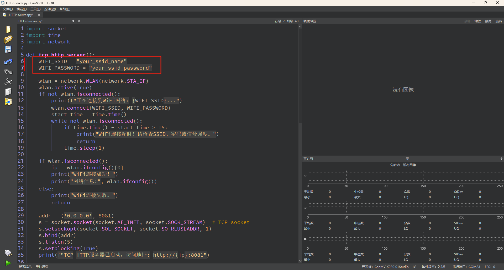

2. Replace `your_ssid_name` and `your_ssid_password` with the actual hotspot name and password.

3. In the code editing area, click the run button  in the bottom left corner to execute the program online, as shown below:

   > [!NOTE]
   >
   > **Programs run using this method will be lost upon disconnection or power-off and will not be saved on the development board.**

   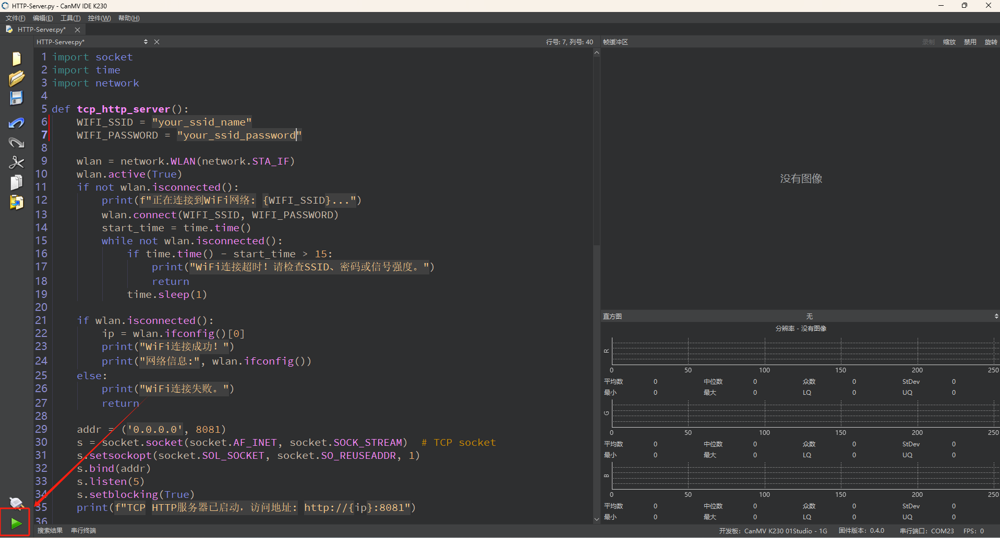

4. Copy the information output in the red box in the terminal.

   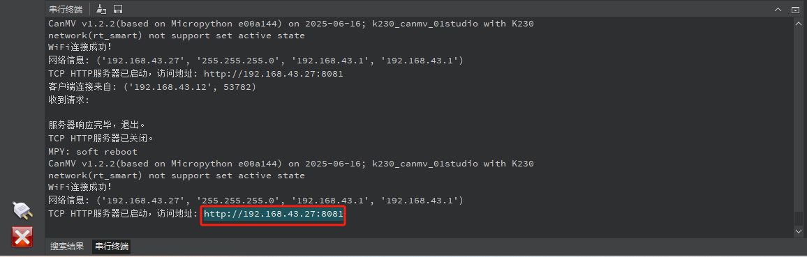

5. Then open a browser, paste the copied URL, and press **Enter**.

   

   **Offline Execution:**

1. After connection, drag the program **HTTP_Server.py** from the same directory to the CanMV IDE K230 code editing area. Click **Tools** in the toolbar and select **Save open script to CanMV Board (as main.py)** as shown below:


2. Then click **Yes**.


3. Once the file is written, click **OK** to confirm and complete saving the MicroPython file to the K230 development board.


**With this method, the K230 board will automatically run the MicroPython file upon power-up without connection, enabling offline execution.**

### 6.8.4 Program Outcome

The K230 development board sends messages to the network via HTTP protocol.

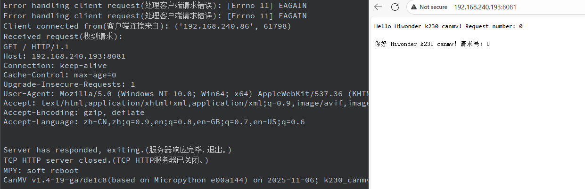

### 6.8.5 Program Analysis

* **Importing Required Libraries**

```
import socket
import time
import network
```

`socket` is used for TCP network communication, `network` for WiFi connection management, and `time` for delay operations.

* **Main Program**

```
def tcp_http_server():
    WIFI_SSID = "your_ssid_name"
    WIFI_PASSWORD = "your_ssid_password"

    wlan = network.WLAN(network.STA_IF)
    wlan.active(True)
    if not wlan.isconnected():
        print(f"Connecting to WiFi network: {WIFI_SSID}...")
        wlan.connect(WIFI_SSID, WIFI_PASSWORD)
        start_time = time.time()
        while not wlan.isconnected():
            if time.time() - start_time > 15:
                print("WiFi connection timed out! Please check SSID, password, or signal strength.")
                return
            time.sleep(1)
```

Replace `your_ssid_name` and `your_ssid_password` with the actual hotspot name and password. Set the device to station mode to act as a Wi-Fi client. If the device is not connected, call the `connect` method and wait up to 15 seconds. If the timeout is exceeded, print a timeout message and exit. During this period, a loop with sleep is used to prevent excessive CPU usage.

```
    if wlan.isconnected():
        ip = wlan.ifconfig()[0]
        print("WiFi connected successfully!")
        print("Network info:", wlan.ifconfig())
    else:
        print("WiFi connection failed.")
        return
```

Check the Wi-Fi connection status. If the connection is successful, print the IP address and other network information. If it fails, exit the program.

```
    addr = ('0.0.0.0', 8081)
    s = socket.socket(socket.AF_INET, socket.SOCK_STREAM)  # TCP socket
    s.setsockopt(socket.SOL_SOCKET, socket.SO_REUSEADDR, 1)
    s.bind(addr)
    s.listen(5)
    s.setblocking(True)
    print(f"TCP HTTP server started, access at: http://{ip}:8081")
```

Create an IPv4 **TCP socket** and set the `SO_REUSEADDR` option to allow quick port rebinding during runtime. Bind the socket to all network interfaces (0.0.0.0) on port 8081, set the maximum number of pending connections to 5, and enable blocking mode for synchronous operations. Print the server startup information along with the access URL.

```
    CONTENT_TEMPLATE = b"""HTTP/1.0 200 OK

Hello Hiwonder k230 canmv! Request number: %d
"""
    counter = 0
```

A simple **HTTP** response template using the `HTTP/1.0 200 OK` response header. The `counter` keeps track of the number of requests the server has responded to.

```
        while True:
            try:
                client_sock, client_addr = s.accept()
                print(f"Client connected from: {client_addr}")
                client_sock.settimeout(5)
```

The server enters an infinite loop, blocking while waiting for client connections. When a client connects, print the client’s IP and port information. Set a 5-second timeout on the client `socket` to prevent indefinite blocking or long waits.

```
                request = b""
                while True:
                    try:
                        chunk = client_sock.recv(1024)
                        if not chunk:
                            break
                        request += chunk
                        if b"\r\n\r\n" in request:
                            break
                    except OSError as e:
                        # Handle EAGAIN error
                        if e.args[0] == 11:
                            time.sleep(0.1)
                            continue
                        else:
                            raise
```

Initialize a `request` byte variable to buffer incoming request data. In a loop, call `recv(1024)` to read data fragments sent by the client. Check for connection closure when empty bytes are returned or when the end of the HTTP request headers is reached indicated by two consecutive carriage return and line feed sequences. Handle potential non-blocking I/O exceptions with error code 11 corresponding to EAGAIN while waiting for data to arrive.

```
                print("Request received:")
                print(request.decode('utf-8', 'replace'))

                response = CONTENT_TEMPLATE % counter
                client_sock.send(response)
                counter += 1
```

Decode the request data into a string, handling non-UTF-8 characters with replacement to avoid errors. Use the counter to generate the response message, send the HTTP response to the client, and increment the request counter.

```
            except Exception as e:
                print(f"Error processing client request: {e}")
            finally:
                client_sock.close()
```

Catch all exceptions during the request handling process and print the error messages. Regardless of whether an exception occurs, ensure the client `socket` is closed to release resources.

```
            time.sleep(1)
            if counter > 0:
                print("Server has responded, exiting.")
                break
    finally:
        s.close()
        print("TCP HTTP server has been shut down.")
```

After processing at least one request, the server sleeps for 1 second, displays a completion message, and exits the main loop. Use `finally` to ensure the server `socket` is closed and resources are released.
