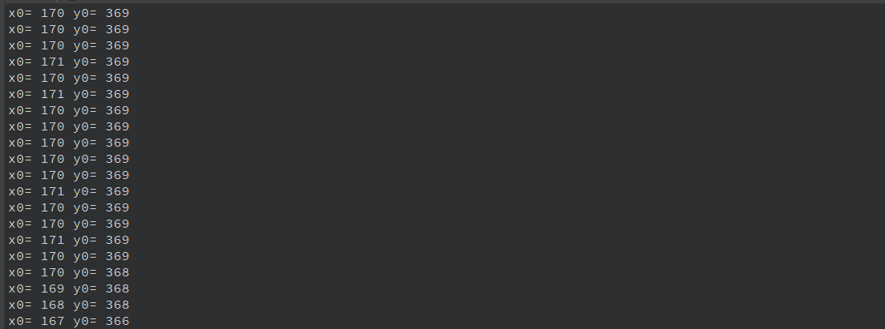
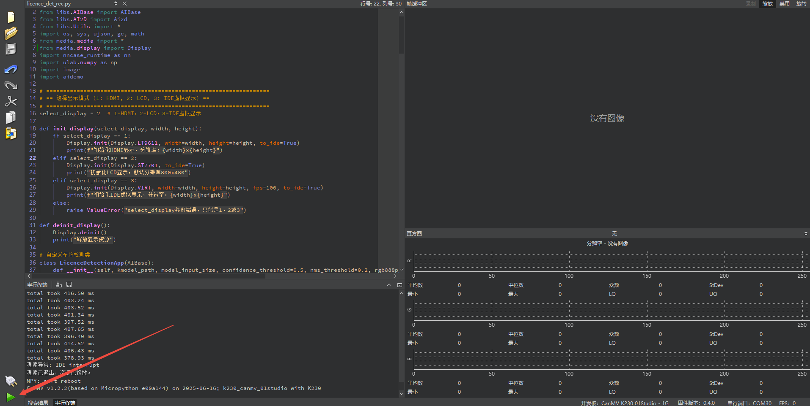
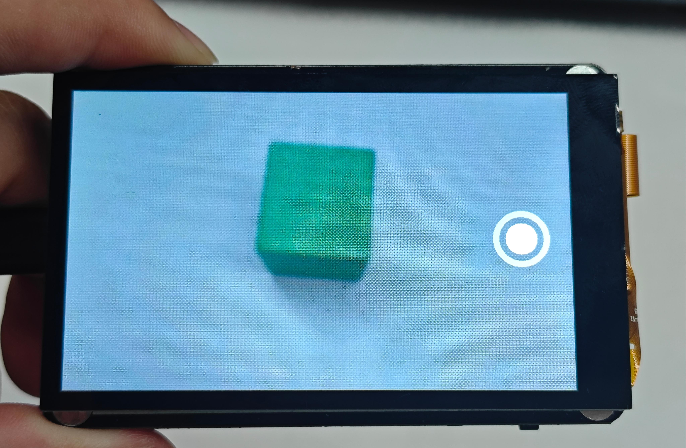
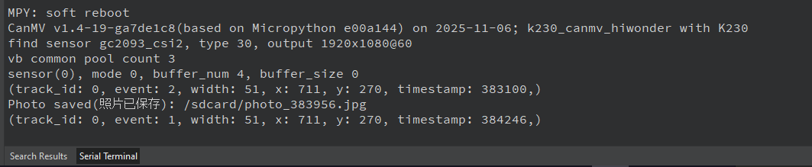

# 7. Touch Control Course

## 7.1 Touch Detection

### 7.1.1 Experiment Overview

This section explores the touch functionality of the LCD screen on the K230 development board through programming.

### 7.1.2 Preparation

* **Module Connection**

1)  Connect the K230 development board to your PC using a Type-C data cable, as shown below:

    

2)  Double-click to open CanMV IDE K230.

    

3)  Click the connection button in the lower left corner.

    

4)  Upon successful connection, the icon in the lower left corner of CanMV IDE will change to the following:


5)  If the connection takes more than 10 seconds, it indicates a connection failure. Click the **Cancel** button, and a pop-up window will appear. Click **OK** and recheck the connection.


> [!NOTE]
>
> **Connection Failure Causes and Solutions:**
>
> * **Cable is not a data cable: Some Type-C cables are charging-only cables without data transfer capability. Please use a Type-C cable with data transfer functionality. The factory-supplied cable is a Type-C data cable.**
>
> * **Other K230 firmware was flashed: Re-flash the factory firmware, then reconnect.**

### 7.1.3 Program Execution and Download

The K230 program supports two operation modes: online execution and offline execution.

**Online Execution:**

After connecting, drag the program **touch.py** into the CanMV IDE K230 code editor area, then click the run button  in the lower left corner to run the program online, as shown below:

> [!NOTE]
>
> **Programs run using this method will be lost after disconnecting or powering off, and will not be saved on the development board.**


**Offline Execution:**

1. After connecting, drag the program **touch.py** into the CanMV IDE K230 code editor area, click **Tools** in the toolbar, and select **Save open script to CanMV Board (as main.py)**, as shown below:


2. Click **Yes**.


3. Once the file is written, click **OK** to confirm and complete saving the MicroPython file to the K230 development board.


**With this method, the K230 development board will automatically run the MicroPython file upon power-up without connection, enabling offline execution.**

### 7.1.4 Program Outcome

When you touch the LCD screen on the K230 development board with your finger, the corresponding touch coordinates appear on the LCD screen, and the IDE simultaneously prints the coordinates.




### 7.1.5 Program Analysis

* **Import Required Libraries**

```
from machine import TOUCH
import time
from media.display import Display
from media.media import MediaManager
import image
```

* **Initialization**

```
# Initialize display (example in LCD mode)
DISPLAY_WIDTH = 800
DISPLAY_HEIGHT = 480

Display.init(Display.ST7701, width=DISPLAY_WIDTH, height=DISPLAY_HEIGHT, to_ide=False)
MediaManager.init()

# Canvas
img = image.Image(DISPLAY_WIDTH, DISPLAY_HEIGHT, image.RGB565)
red = (255, 0, 0)

# Instantiate TOUCH device 0
tp = TOUCH(0)
```

1)  `DISPLAY_WIDTH`, `DISPLAY_HEIGHT` initialize the display resolution.

2)  `Display.init()` initializes the display mode, defining the display screen as LCD.

* **Create Canvas**

```
# Canvas
img = image.Image(DISPLAY_WIDTH, DISPLAY_HEIGHT, image.RGB565)
red = (255, 0, 0)
```

Create a canvas to display touch coordinates on the LCD screen, and define the displayed text color as red.

* **Main Loop**

```
try:
    while True:
        p = tp.read()  # Read all touch points

        img.clear()  # Clear canvas background, default black, can be modified as needed

        if p != ():
            for i, point in enumerate(p):
                text = f'x{i}={point.x} y{i}={point.y}'
                print('x'+str(i)+'=',p[i].x, 'y'+str(i)+'=',p[i].y)

                # Display sequentially downward from the top left of the screen
                img.draw_string_advanced(10, 30 + i*40, 30, text, color=red, scale=3)

        Display.show_image(img)
        time.sleep_ms(50)
```

1)  `for i`, `point in enumerate(p)`: Iterate through each touch point and pass the touch point coordinates to `text`.

2)  `print()` defines the display of touch point coordinates printed in the IDE terminal.

3)  `img.draw_string_advanced()` displays the coordinates on the LCD screen.

4)  `Display.show_image(img)` refreshes the canvas content to the screen.

## 7.2 Touch Drawing Board

### 7.2.1 Experiment Overview

This section explores the touch drawing board functionality of the LCD screen on the K230 development board through programming.

### 7.2.2 Preparation

* **Module Connection**

1)  Connect the K230 development board to your PC using a Type-C data cable, as shown below:

    

2)  Double-click to open CanMV IDE K230.

    

3)  Click the connection button in the lower left corner.

    

4)  Upon successful connection, the icon in the lower left corner of CanMV IDE will change to the following:


5)  If the connection takes more than 10 seconds, it indicates a connection failure. Click the **Cancel** button, and a pop-up window will appear. Click **OK** and recheck the connection.


> [!NOTE]
>
> **Connection Failure Causes and Solutions:**
>
> * **Cable is not a data cable: Some Type-C cables are charging-only cables without data transfer capability. Please use a Type-C cable with data transfer functionality. The factory-supplied cable is a Type-C data cable.**
>
> * **Other K230 firmware was flashed: Re-flash the factory firmware, then reconnect.**

### 7.2.3 Program Execution and Download

The K230 program supports two operation modes: online execution and offline execution.

**Online Execution:**

After connecting, drag the program **touch_draw.py** into the CanMV IDE K230 code editor area, then click the run button  in the lower left corner to run the program online, as shown below:

> [!NOTE]
>
> **Programs run using this method will be lost after disconnecting or powering off, and will not be saved on the development board.**


**Offline Execution:**

1. After connecting, drag the program **touch_draw.py** from this section's directory into the CanMV IDE K230 code editor area, click **Tools** in the toolbar, and select **Save open script to CanMV Board (as main.py)**, as shown below:


2. Click **Yes**.


3. Once the file is written, click **OK** to confirm and complete saving the MicroPython file to the K230 development board.


**With this method, the K230 development board will automatically run the MicroPython file upon power-up without connection, enabling offline execution.**

### 7.2.4 Program Outcome

You can use your finger to draw on the canvas. Functional buttons at the top allow switching between different brush modes. For example, the **Random** button in the top-right corner randomly changes the brush color. The **Save** button saves the current drawing to the root directory of the SD card. The **Eraser** button turns the brush into an eraser, allowing erased areas wherever the finger is dragged. The slider at the bottom can be used to adjust the brush color. The **Clear** button in the top-right corner clears the entire canvas.


### 7.2.5 Program Analysis

* **Import Required Libraries**

```
import time, os, sys, urandom
from media.display import *
from media.media import *
from machine import TOUCH
from collections import namedtuple
```

* **Define Screen and Canvas Size**

```
# Screen size
DISPLAY_WIDTH = 800
DISPLAY_HEIGHT = 480

# Drawing area size (canvas)
CANVAS_W = 800
CANVAS_H = 400
CANVAS_X = 0
CANVAS_Y = 120   # Start from screen y=80
```

* **Initialization**

```
try:
    # Initialize display
    Display.init(Display.ST7701, width=DISPLAY_WIDTH, height=DISPLAY_HEIGHT, to_ide=False)

    # Initialize media manager
    MediaManager.init()

    # --- Two images --- 
    ui_img = image.Image(DISPLAY_WIDTH, DISPLAY_HEIGHT, image.RGB565)   # Full screen UI layer 
    canvas_img = image.Image(CANVAS_W, CANVAS_H, image.RGB565)          # Drawing layer 
    background_color = (255, 255, 255)
    canvas_img.clear()
    canvas_img.draw_rectangle(0, 0, CANVAS_W, CANVAS_H, color=background_color, fill=True)
```

1)  `background_color = (255, 255, 255)` initializes the background color to white.

2)  `canvas_img.clear()` clears the canvas.

3)  `canvas_img.draw_rectangle()` fills with white background.

* **UI Area Definition**

```
    # UI button and slider areas
    clear_button_area = (DISPLAY_WIDTH - 130, 0, 130, 50)
    color_button_area = (0, 0, 130, 50)
    save_button_area = (0, 60, 130, 50)
    eraser_button_area = (DISPLAY_WIDTH // 2 - 80, 0, 220, 50)
    slider_area = (DISPLAY_WIDTH // 2 - 150, 70, 300, 40)

    forbidden_draw_areas = [
        clear_button_area,
        color_button_area,
        save_button_area,
        eraser_button_area,
        slider_area
    ]

    tp = TOUCH(0)
    last_point = None
    eraser_mode = False
    threshold_value = 128
```

1)  Initialize `current_color` to define the current brush color.

2)  Initialize `brush_size` to define the brush size in radius.

3)  `tp = TOUCH(0)` initializes the touchscreen object.

4)  `last_point = None` for the previous touch point, used to draw continuous lines.

5)  `eraser_mode = False` eraser mode switch.

6)  `threshold_value = 128` threshold slider default value, with a range of 0-255.

* **UI Drawing Functions**

```
    # --- UI drawing functions ---
    def draw_button(x, y, w, h, text, bg_color, text_color):
        ui_img.draw_rectangle(x, y, w, h, color=bg_color, fill=True)
        ui_img.draw_string_advanced(x + (w - len(text) * 15) // 2, y + 12, 30,
                                    text, color=text_color, scale=2)

    def draw_clear_button():
        draw_button(*clear_button_area, "Clear", (255, 0, 0), (255, 255, 255))

    def draw_color_buttons():
        draw_button(*color_button_area, "Random", (255, 255, 0), (0, 0, 0))
        ui_img.draw_circle(color_button_area[0] + 170, 25, 20,
                           color=current_color, thickness=3, fill=True)

    def draw_save_button():
        draw_button(*save_button_area, "Save", (0, 128, 255), (255, 255, 255))

    def draw_eraser_button():
        bg = (128, 128, 128) if eraser_mode else (0, 200, 200)
        text = "Eraser ON" if eraser_mode else "Eraser OFF"
        draw_button(*eraser_button_area, text, bg, (255, 255, 255))
```

Use `draw_button()` to draw corresponding buttons.

* **Threshold Slider Functions**

```
    def apply_threshold_color(base1, base2, threshold):
        r = base1[0] + (base2[0] - base1[0]) * threshold / 255
        g = base1[1] + (base2[1] - base1[1]) * threshold / 255
        b = base1[2] + (base2[2] - base1[2]) * threshold / 255
        return (int(r), int(g), int(b))

    def draw_slider():
        x, y, w, h = slider_area
        ui_img.draw_rectangle(x, y + h // 3, w, h // 3,
                              color=(200, 200, 200), fill=True)
        knob_x = x + int((threshold_value / 255) * w)
        knob_y = y + h // 2
        knob_color = apply_threshold_color(base_color_1, base_color_2, threshold_value)
        ui_img.draw_circle(knob_x, knob_y, 12, color=knob_color, fill=True)

        txt = f'Threshold: {threshold_value}'
        ui_img.draw_string_advanced(x + w + 10, y + 8, 30,
                                    txt, color=(0, 0, 0), scale=2)
```

1)  `apply_threshold_color` calculates RGB values based on threshold.

2)  `draw_rectangle` draws the threshold slider. 

3)  `txt = f'Threshold: {threshold_value}'` displays the corresponding threshold value.

* **Main Loop**

```
    # --- Main loop ---
    while True:
        os.exitpoint()
        p = tp.read(1)

        if p != ():
            for point in p:
                x, y = point.x, point.y

                # UI interaction
                select_color(x, y)
                check_clear_button(x, y)
                check_save_button(x, y)
                check_eraser_button(x, y)
                check_slider_touch(x, y)

                # Canvas area, touch point minus offset CANVAS_Y
                if y >= CANVAS_Y:
                    cp = Point(x, y - CANVAS_Y)
                    draw_line_between_points(last_point, cp)
                    last_point = cp
                else:
                    last_point = None
        else:
            last_point = None
```

1)  `os.exitpoint()` system exit point, which prevents freezing.

2)  `p = tp.read(1)` reads touch points, with maximum one at a time.

3)  `if p != ()` checks if touch points exist.


## 7.3 Touch Photography

### 7.3.1 Experiment Overview

This section explores the touch photography functionality of the LCD screen on the K230 development board through programming.

### 7.3.2 Preparation

* **Module Connection**

1)  Connect the K230 development board to your PC using a Type-C data cable, as shown below:

    

2)  Double-click to open CanMV IDE K230.

    

3)  Click the connection button in the lower left corner.

    

4)  Upon successful connection, the icon in the lower left corner of CanMV IDE will change to the following:


5)  If the connection takes more than 10 seconds, it indicates a connection failure. Click the **Cancel** button, and a pop-up window will appear. Click **OK** and recheck the connection.


> [!NOTE]
>
> **Connection Failure Causes and Solutions:**
>
> * **Cable is not a data cable: Some Type-C cables are charging-only cables without data transfer capability. Please use a Type-C cable with data transfer functionality. The factory-supplied cable is a Type-C data cable.**
>
> * **Other K230 firmware was flashed: Re-flash the factory firmware, then reconnect.**

### 7.3.3 Program Execution and Download

The K230 program supports two operation modes: online execution and offline execution.


**Online Execution:**

After connecting, drag the program **touch_photo.py** into the CanMV IDE K230 code editor area, then click the run button  in the lower left corner to run the program online, as shown below:

> [!NOTE]
>
> **Programs run using this method will be lost after disconnecting or powering off, and will not be saved on the development board.**



**Offline Execution:**

1. After connecting, drag the program **touch_photo.py** from this section's directory into the CanMV IDE K230 code editor area, click **Tools** in the toolbar, and select **Save open script to CanMV Board (as main.py)**, as shown below:


2. Click **Yes**.


3. Once the file is written, click **OK** to confirm and complete saving the MicroPython file to the K230 development board.


**With this method, the K230 development board will automatically run the MicroPython file upon power-up without connection, enabling offline execution.**

### 7.3.4 Program Outcome

After clicking the capture button on the screen, the K230 calls the camera to capture the current scene. The captured image is then converted and saved as a picture.





### 7.3.5 Program Analysis

* **Import Required Libraries**

```
import uos
import sys
import time
from media.sensor import Sensor
from media.display import Display
from media.media import MediaManager
from machine import TOUCH
```

* **Initialization**

```
sensor = Sensor()
sensor.reset()
sensor.set_framesize(width=800, height=480)
sensor.set_pixformat(Sensor.RGB565)

Display.init(Display.ST7701, to_ide=False)
MediaManager.init()
sensor.run()
```

1)  `sensor = Sensor()` creates a camera object.

2)  `sensor.reset()` resets the camera.

3)  `sensor.set_framesize(width=800, height=480)` sets resolution to 800x480.

4)  `sensor.set_pixformat(Sensor.RGB565)` sets the image format.

5)  `Display.init()` initializes the LCD screen.

6)  `MediaManager.init()` initializes the media manager.

7)  `sensor.run()` starts camera capture.

* **Define Save Directory**

```
# Directory for saving photos
save_dir = "/sdcard"

def ensure_dir_exists(path):
    try:
        uos.listdir(path)
    except OSError:
        print("Directory {} does not exist, creating...".format(path))
        uos.mkdir(path)
        print("Directory {} created".format(path))
```

Define the directory where images are saved when the button is pressed.

* **Main Loop**

```
while True:
    img = sensor.snapshot()
    img.draw_circle(720, 240, 25, color=(255, 255, 255), thickness=1, fill=True)
    img.draw_circle(720, 240, 40, color=(200, 200, 200), thickness=10)

    p = tp.read(1)
    if p != ():
        print(p)
        x, y, event = p[0].x, p[0].y, p[0].event

        if event == 2 or event == 3:
            img.draw_cross(x, y, color=(255, 0, 0), size=10, thickness=6)

        if 720 - 40 < x < 720 + 40 and 240 - 40 < y < 240 + 40 and event == 2:
            timestamp = time.ticks_ms()
            filename = "{}/photo_{}.jpg".format(save_dir, timestamp)


            img = sensor.snapshot()
            img.save(filename)
            print("Photo saved:", filename)
            time.sleep(1)

    # Display live image
    Display.show_image(img)
```

1)  `img = sensor.snapshot()` captures a frame of live camera feed.

2)  `img.draw_circle()` draws the capture button on screen.

3)  `p = tp.read(1)` reads touch points.

4)  `print(p)` prints touch point coordinates in IDE terminal.

5)  `x, y, event = p[0].x, p[0].y, p[0].event` assigns the obtained touch coordinates.

6)  Determines if the capture button on screen was touched based on touch point, and saves the photo to SD card.

7)  `Display.show_image(img)` refreshes the canvas content to the screen.