# 9. Local Model Training (YOLOv8)

## 9.1 Experiment Introduction

This section introduces local YOLOv8 environment deployment and training of the `Cat_and_dog_detection` model, followed by conversion to a `KModel` via `nncase` for deployment on the K230 device.


## 9.2 Environment Deployment

The demonstrated operating environment is as follows:

> * OS: Windows 10 Professional
> * GPU: NVIDIA 1650 
> * Environment Management: Miniconda3
> * conda：25.11.1


### 9.2.1 Environment Verification

This tutorial uses a Windows system equipped with an NVIDIA 1650 GPU.

> Verify the environment setup.
>
> * With NVIDIA GPU
>
> For setups with NVIDIA GPUs, check the driver installation and keep the drivers updated.
>
> * Without NVIDIA GPU
>
> Operating without an NVIDIA GPU is also supported. Simply use the CPU version of PyTorch instead.

1. Press the **Win + R** keys, input `cmd`, and press **Enter**.

2.  In the command prompt window, input `NVIDIA-smi` and press **Enter**.

#### 9.2.1.1 Two Possible Scenarios:

- **Scenario A: The system displays a table containing the GPU model and driver version details**.
  - **Conclusion:** The system has successfully installed the drivers. Enables direct status monitoring without any additional installation, while ensuring GPU drivers remain up to date. 
  
    > [!NOTE]
    >
    > **If the driver is outdated, refer to the driver update section below**.

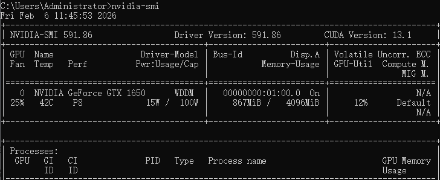

- **Scenario B: A prompt indicates the command is not recognized as an internal or external command.**
  - **Reason 1:** NVIDIA GPU drivers are not installed. This is the most common cause.
  - **Reason 2:** Drivers are installed, but the corresponding path is not added to the system's **Environment Variables**. In this case, the command exists on the computer, but the system fails to locate it. Reinstalling the driver usually resolves this issue.
  - **Reason 3:** An NVIDIA GPU is not currently in use.

#### 9.2.1.2 GPU Driver Installation and Update:

Proceed to the NVIDIA website to install the [NVIDIA App](https://www.NVIDIA.cn/software/NVIDIA-app/).

The primary function of the **NVIDIA App** is to **automatically detect, install, and update GPU drivers**.

- **Operation Method:** After installing the NVIDIA App, click **Driver** in the left panel. Then click the check for updates icon labeled 2 in the figure. Finally, click **DOWNLOAD** to proceed.

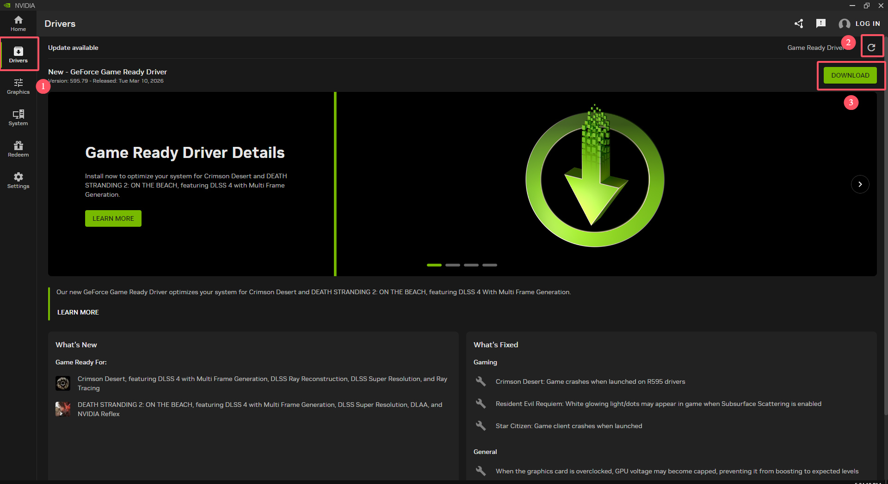

* **Driver Verification:** After installing the GPU driver:
  * Press the **Win + R**, input `cmd`, and press **Enter**.

  * In the command prompt window, input `NVIDIA-smi` and press **Enter**.

  * A table similar to the image below should appear to confirm successful command recognition.


### 9.2.2 conda Environment Deployment

#### 9.2.2.1 Install miniconda

* Download the installation package: Click [miniconda](https://repo.anaconda.com/miniconda/Miniconda3-latest-Windows-x86_64.exe) to download the miniconda installation package, or obtain it from the software installation package folder in the current directory.

* Start Installation:
  1. Double-click the Miniconda3 installation package.  

  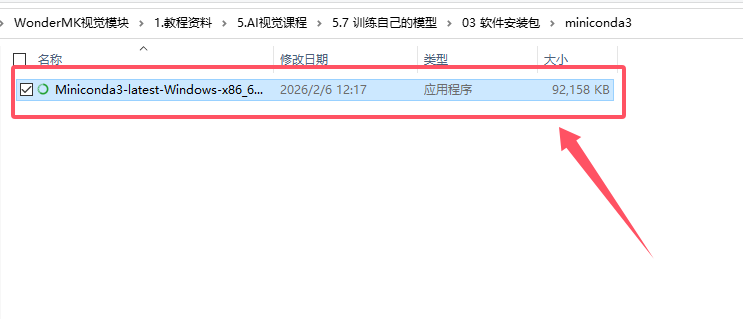

  2. Click **Next**.

  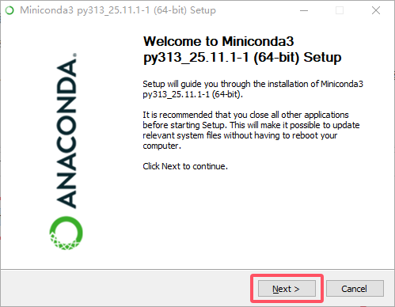

  3. Click **I Agree** to accept the terms.
  
      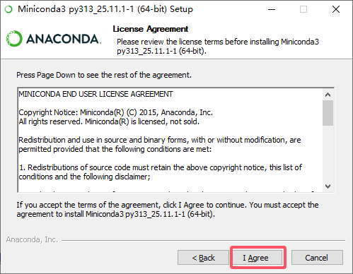
  
  4. Select **All Users**, then click **Next**.
  
      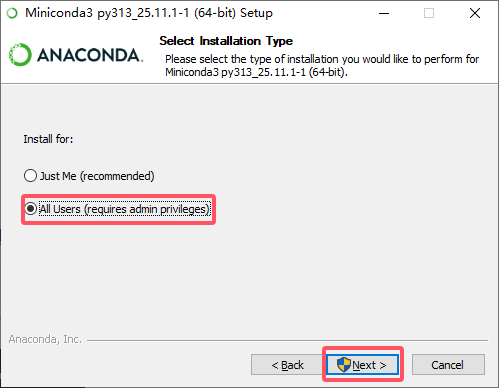
  
  5. Select the corresponding installation path, then click **Next**.
  
      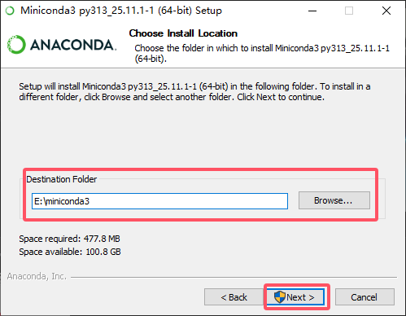
  
  6. Check the desired options based on specific requirements, then click **Install**.
  
      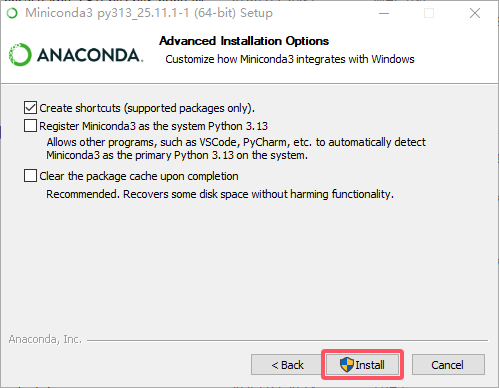
  
  7. Click **Next**.
  
      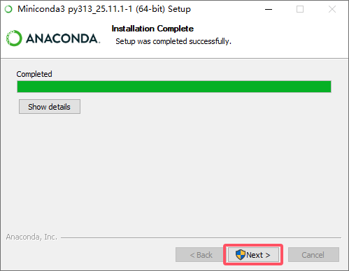
  
  8. Finally, click **Finish**.
  
      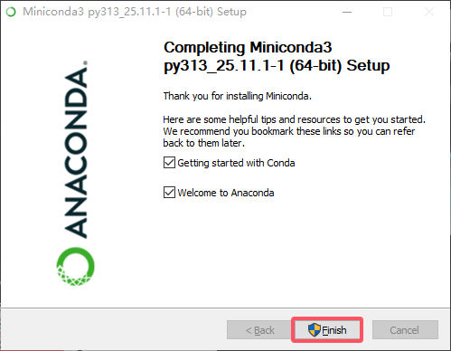

#### 9.2.2.2 Installation Verification

  1. After completing the installation, press the **Win** key and search for **Anaconda Prompt**.

  2. Double-click to run **Anaconda Prompt**.

      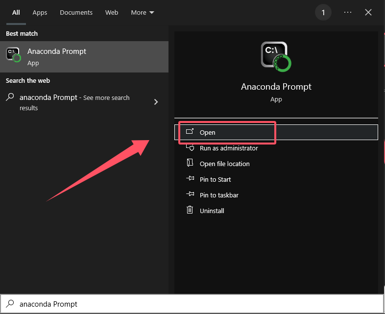

  3. Input the following command. The output `conda 25.11.1` indicates that the conda environment manager was installed successfully.

```bash
conda -V
```
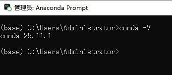

#### 9.2.2.3 Add Tsinghua Mirror Source

Run the following commands individually to configure the Tsinghua University mirror source:

```bash
conda config --add channels https://mirrors.tuna.tsinghua.edu.cn/anaconda/pkgs/free/
```

```bash
conda config --add channels https://mirrors.tuna.tsinghua.edu.cn/anaconda/pkgs/main/
```

```bash
conda config --add channels https://mirrors.tuna.tsinghua.edu.cn/anaconda/cloud/conda-forge/
```

```bash
conda config --add channels https://mirrors.tuna.tsinghua.edu.cn/anaconda/cloud/msys2/
```

```bash
conda config --add channels https://mirrors.tuna.tsinghua.edu.cn/anaconda/cloud/pytorch/
```

```bash
conda config --set show_channel_urls yes
```

After executing the above commands, run the following command to verify whether the configuration is successful:

```bash
conda config --show channels
```

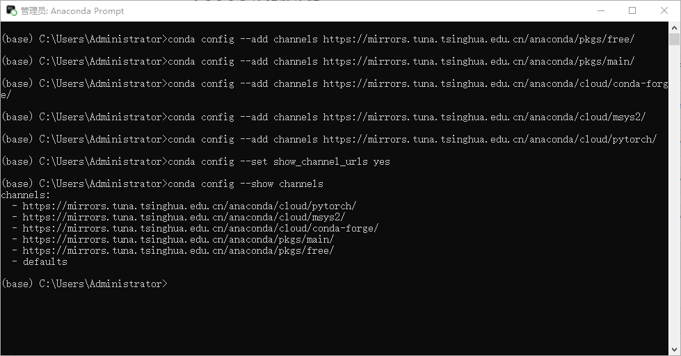

#### 9.2.2.4 Creating a Miniconda Environment

1. Recent Anaconda versions require explicit consent to the **Terms of Service (ToS) confirmation step** before using official mirror sources or channels. Copy and run the following three commands sequentially in the **Anaconda Prompt**:

```bash
conda tos accept --override-channels --channel https://repo.anaconda.com/pkgs/main
```

```bash
conda tos accept --override-channels --channel https://repo.anaconda.com/pkgs/r
```

```bash
conda tos accept --override-channels --channel https://repo.anaconda.com/pkgs/msys2
```

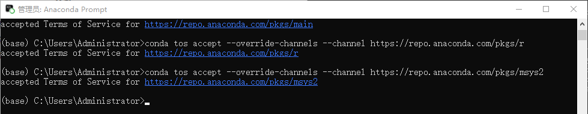

2. First, create a clean Python environment for YOLOv8 to prevent dependency conflicts. Open the **Anaconda Prompt** terminal and execute the following command:

Create an environment named YOLOv8, utilizing Python 3.9:

```bash
conda create -n yolov8 python=3.9 -y
```

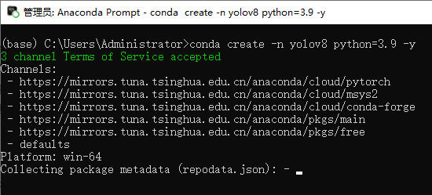

Activate the environment using this command:

```bash
conda activate yolov8
```

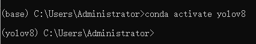

#### 9.2.2.5 Creating and Switching Directories

> [!NOTE]
>
> **Reasons for creating and switching to a new folder on the disk**.
>
> *  **Maintain clear path structures.**
> *  **Prevent permission and storage space issues.**
> *  **Facilitate code execution.**
>
> **This tutorial uses E:\dog_and_cat_detection as an example.**

1. **Create a Directory:** Create a new folder on any local disk. For example, use **E:\dog_and_cat_detection**.

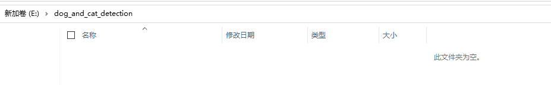

2. **Switch Directory:** Return to the **Anaconda Prompt** terminal and input the following command:

```bash
cd /d E:\dog_and_cat_detection
```

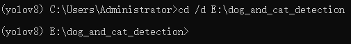

#### 9.2.2.6 Install git

1. Run the following command to download the git tool:

```bash
conda install -c anaconda git -y
```

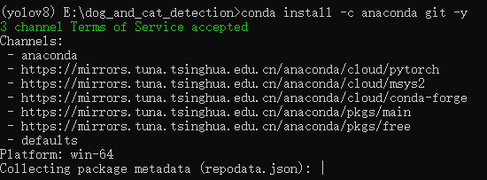

2. Run the following command to verify whether the installation was successful:

```bash
git --version
```

An output similar to `git version 2.x.x` confirms a successful installation on the computer.

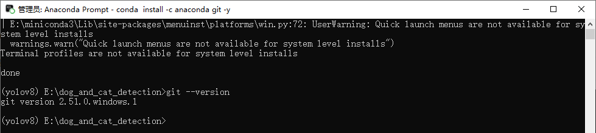

#### 9.2.2.7 Install YOLOv8 and its Dependencies

> [!NOTE]
>
> **Execute the specific installation steps based on the current hardware configuration outlined in the documentation.**

* #### Setup without an NVIDIA GPU

  * Clone the YOLOv8 repository via git:

    ```bash
    git clone https://github.com/ultralytics/ultralytics.git
    ```

    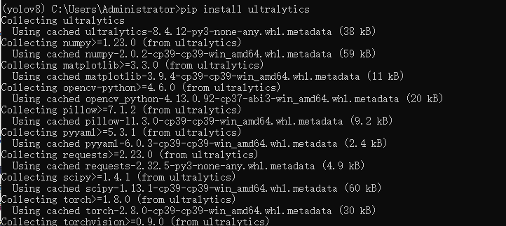

  * Navigate to the YOLOv8 directory:
  
    ````bash
    cd ultralytics
    ````

    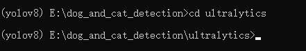
  
  * Install PyTorch and other dependencies:
  
    ````bash
    pip install -e .
    ````

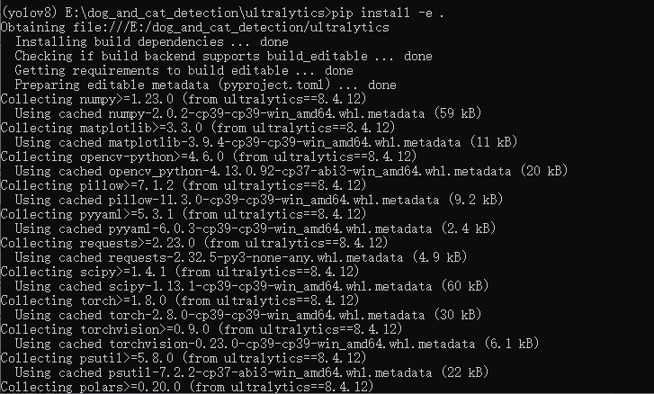

------


* #### Setup with an NVIDIA GPU

  > First, complete the YOLOv8 and dependencies installation steps outlined in the version without an NVIDIA GPU section.

  * Uninstall the CPU version of PyTorch:
    ```bash
    pip uninstall torch torchvision torchaudio -y
    ```

    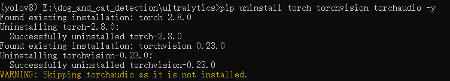

  * Install the GPU version of PyTorch:

    ```bash
    pip install torch torchvision torchaudio --index-url https://download.pytorch.org/whl/cu121
    ```

    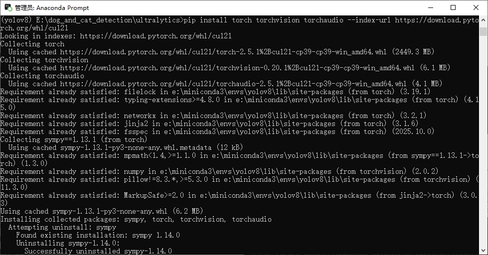
  
  * Verify the GPU version of PyTorch:
    ```bash
    python
    ```
  
    ```bash
    import torch
    print(torch.cuda.is_available())
    ```
  
    > Ensure the output is `True`.
    >
    > * An error `ModuleNotFoundError: No module named 'torch'` indicates:
    >   1. PyTorch is not installed in the **currently active environment**.
    >   2. PyTorch was installed in Environment A, but the code is being executed in Environment B.
    > * An output of `True`: The **GPU version** of PyTorch installed successfully, the GPU driver matches the CUDA version, and PyTorch recognized the NVIDIA GPU.
    > * An output of `False`:
    >   1. **Incorrect version installed:** The **CPU-only version** acting as the default download might have been installed via a standard `pip install torch` command, lacking CUDA libraries.
    >   2. **Driver mismatch:** The NVIDIA GPU driver is too old and does not support the installed CUDA version. For example, the driver only supports up to CUDA 11.0, while CUDA 12.1 was installed.
    >   3. **Hardware issues:** There is no NVIDIA GPU present, or the GPU driver is missing or corrupted.
  
    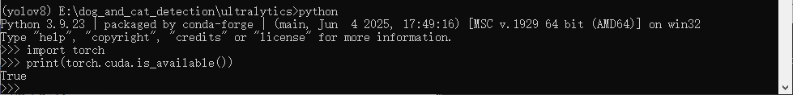
  
  * Return to the YOLOv8 environment: 
  
    ```bash
    exit()
    ```
  
  
  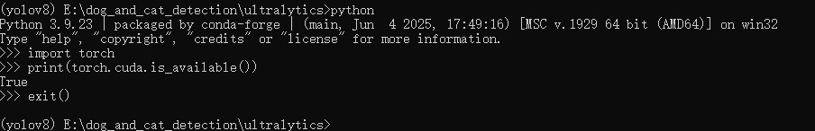


## 9.3 Dataset Download and Processing

* ### Data Source

This project utilizes the **[Oxford-IIIT Pet Dataset](https://www.robots.ox.ac.uk/~vgg/data/pets/)** published by the University of Oxford.

> **Citation:**
> Parkhi, O. M., Vedaldi, A., Zisserman, A., & Jawahar, C. V. (2012). *Cats and dogs*. In the 2012 IEEE Conference on Computer Vision and Pattern Recognition.

### 9.3.1 Dataset Download

> [!NOTE]
>
> **Download the dataset directly from the webpage or via command-line instructions**.
>
> **Alternatively, locate the provided dataset in the local dataset folder.**
>
> 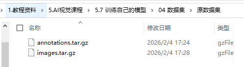

* #### Creating and Switching Directories

> [!NOTE]
>
> **Create and switch to the corresponding directory path prior to downloading the dataset.**

> **Reasons for creating and switching to a new folder on the disk.**
>
> * Maintain clear path structures.
> * Prevent permission and storage space issues.
> * Facilitate code execution.
>
> This tutorial uses **E:\dog_and_cat_detection** as an example.

1. **Switch Directory:** Return to the **Anaconda Prompt** terminal and input the following command:

```bash
cd /d E:\dog_and_cat_detection
```

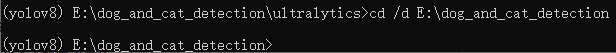

2. **Create a directory to store the dataset:**

```bash
mkdir pet_data
```

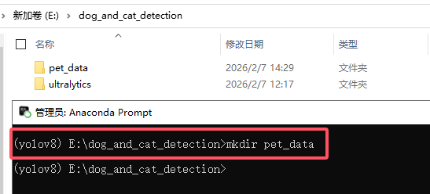

* #### Official Website Link Download

    Use the following resources:

    * **Official Link:**  [Oxford-IIIT Pet Dataset](https://www.robots.ox.ac.uk/~vgg/data/pets/)
    * **Image Dataset:**  [images.tar.gz (dataset)](https://www.robots.ox.ac.uk/~vgg/data/pets/data/images.tar.gz)
    * **Annotation Dataset:**  [annotations.tar.gz (groundtruth data)](https://www.robots.ox.ac.uk/~vgg/data/pets/data/annotations.tar.gz)

1. Click the download links on the webpage.

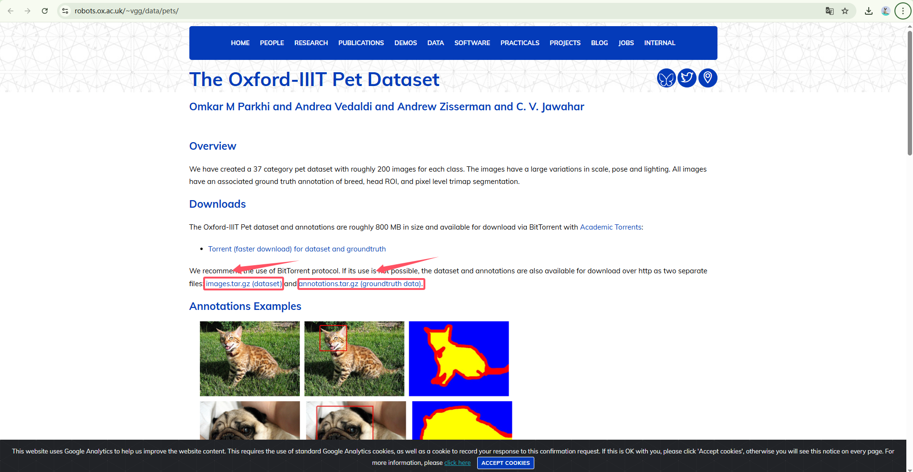

2. Wait for the download to complete.

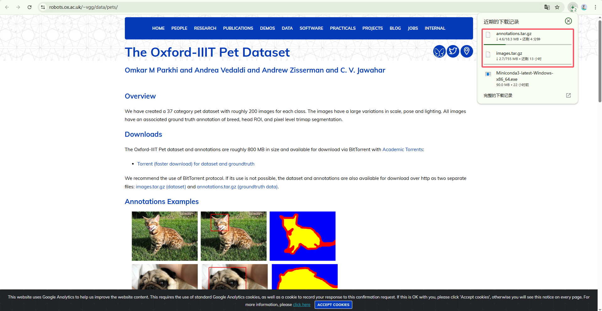

3. Move the downloaded dataset archive files into the previously created dataset storage directory.

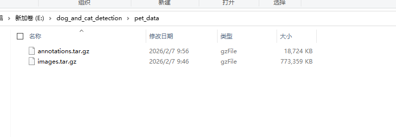

* #### conda Environment Command Download

1. Navigate to the previously created dataset storage directory:

```bash
cd pet_data
```

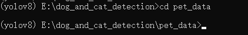

2. Input the following download commands sequentially:

```bash
curl -L -O https://www.robots.ox.ac.uk/~vgg/data/pets/data/images.tar.gz
```

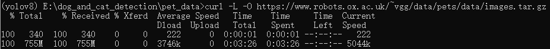

```bash
curl -L -O https://www.robots.ox.ac.uk/~vgg/data/pets/data/annotations.tar.gz
```

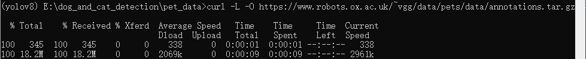

### 9.3.2 Extract the Dataset

> [!NOTE]
>
> **Extraction requires time, please wait patiently.**

Extract the downloaded archive files.

```bash
tar -xf images.tar.gz
```

```bash
tar -xf annotations.tar.gz
```

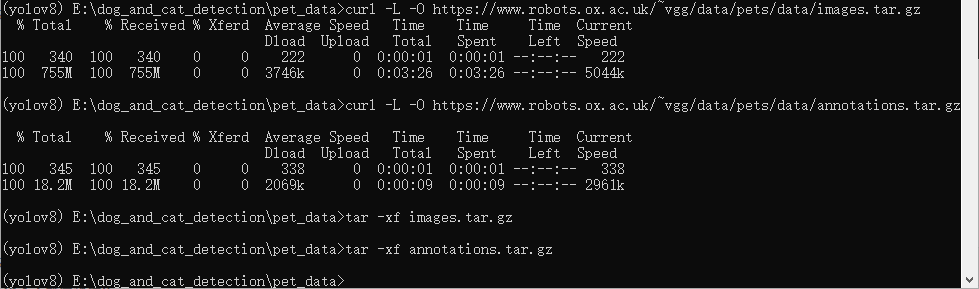

### 9.3.3 Dataset Processing Script Execution

1. **Script Acquisition:** Navigate to the source code folder under **CanMV K230 - 1. Tutorial - 9. Local Model Training (YOLOv8)** to obtain the provided dataset processing script **dataset.py**, and place it in the dataset directory.

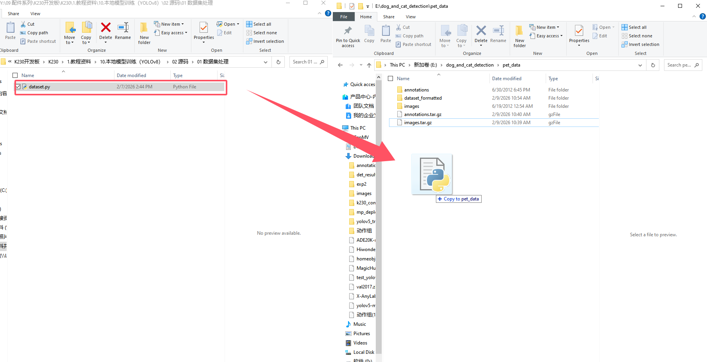

2. **Verify generated `data.yaml`:** Press the **Win + E** to open the File Explorer, open **dataset.py** with Notepad, and verify whether the dataset path in **data.yaml** is correct.

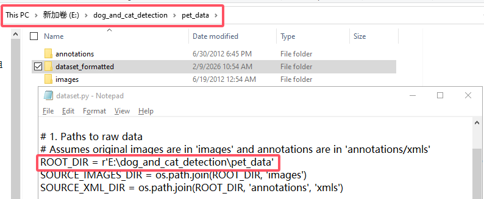

3. **Add Library Files:** Return to **Anaconda Prompt** and add the `tqdm` library.

```bash
pip install tqdm
```

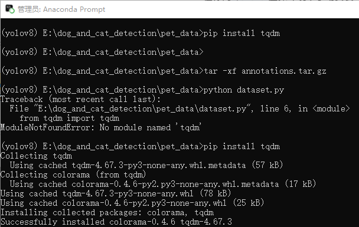

4. **Run Script:** Execute the dataset processing script `dataset.py`.

```bash
python dataset.py
```

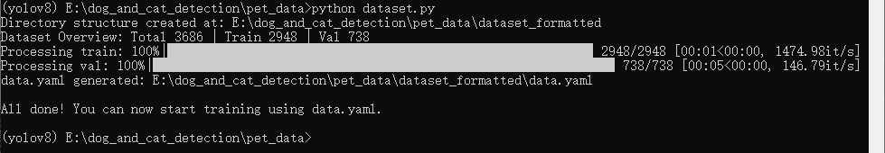

5. **Verify generated `data.yaml`:** Press **Win + E** to open the File Explorer, open **data.yaml** with Notepad, and verify whether the dataset path in **data.yaml** is correct.

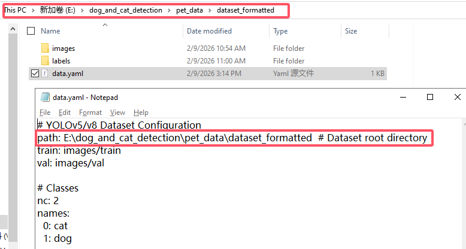


## 9.4 Training Cat and Dog Classification Using YOLOv8

### 9.4.1 Starting Training

1. **Enter the working directory:** Input the following command to return to the YOLOv8 directory:

```bash
cd E:\dog_and_cat_detection\ultralytics
```

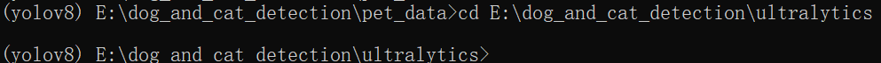

2. **Input the following command to start training:**

```bash
yolo detect train data=E:\dog_and_cat_detection\pet_data\dataset_formatted\data.yaml model=yolov8n.pt epochs=50 imgsz=320 batch=16 device=0 project=runs/train name=pet_k230_v8
```

**Parameter Details:**

- `yolo detect train`: Initiates the YOLOv8 training mode.
- `data=...`: Specifies the location of the dataset configuration file.
- `model=yolov8n.pt`: Utilizes the **Nano** version of the pre-trained model.
- `epochs=50`: Iterates the model over the entire dataset 50 times.
- `imgsz=320`: Resizes images to $320 \times 320$ pixels for training.
- `batch=16`: Feeds 16 images to the GPU for processing per batch.
- `device=0`: Utilizes the first GPU for training.
- `project/name`: Saves the output results to the **runs/train/pet_k230_v8** directory.

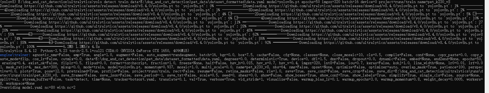

### 9.4.2 Model Validation

1. **Input the following command to test the trained model**:

```bash
yolo predict model="E:\dog_and_cat_detection\ultralytics\runs\detect\runs\train\pet_k230_v8\weights\best.pt" source="E:\dog_cat_yolov5\images\Abyssinian_1.jpg" imgsz=320
```
**Parameter Details:**

* `yolo predict`: Initiates the YOLOv8 **inference mode**.

* `model=best.pt`: Loads the **best performing** model weights from the training process.

* `source=.../Abyssinian_1.jpg`: Specifies the path for the **test image**.

* `imgsz=320`: Resizes the image to $320 \times 320$ pixels before inference ensuring consistency with the exported K230 input requirements.

* `conf=0.25`: Confidence threshold. Only displays objects with a probability greater than **25%,** which is the default value.

* `save=True`: Instructs the program to **save** the predicted result image with drawn bounding boxes as the default setting.

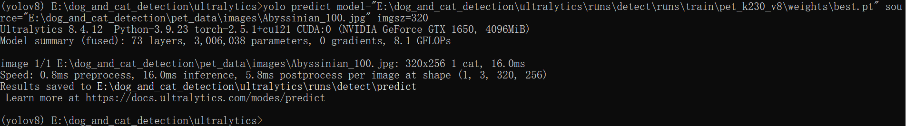

2. **Check the validation image:** Navigate to **E:\dog_and_cat_detection\ultralytics\runs\detect\predict** to view the validation image.

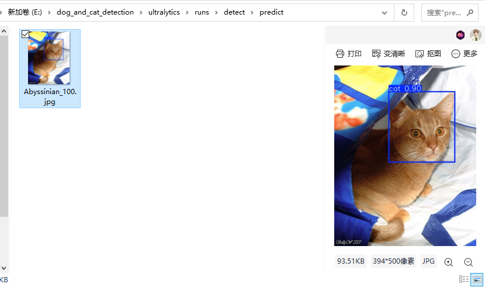


## 9.5 Converting the Trained Model to a K230-Recognizable kmodel

> [!NOTE]
>
> **Convert the `pt` model into an `onnx` model before converting it into a `kmodel`**.

### 9.5.1 Converting pt to onnx

* Run the following command. 

  > [!NOTE]
  >
  > **`Ultralytics` will automatically install missing dependencies in the environment. If the process appears stalled, wait patiently.**

```bash
yolo export model="E:\dog_and_cat_detection\ultralytics\runs\detect\runs\train\pet_k230_v8\weights\best.pt" format=onnx imgsz=320 opset=11 simplify=True
```

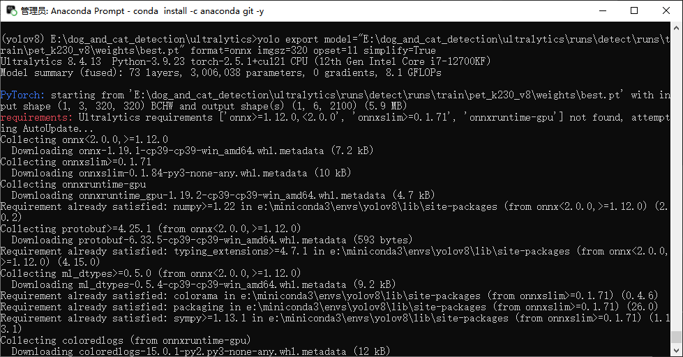

### 9.5.2 Conversion Script Preparation

1. Move **convert_to_kmodel.py** to **E:\dog_and_cat_detection**.

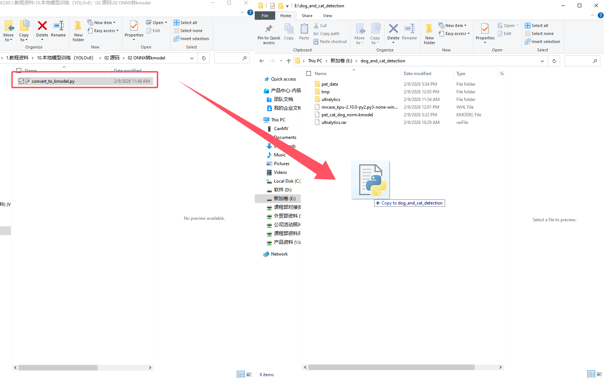

2. Download and install the core `nncase` package from the Python Package Index PyPI.

```bash
pip install nncase
```

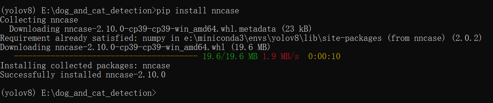

3. Display the installed `nncase` package version to **verify consistency**.

```bash
pip show nncase
```

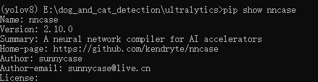

4. Download the K230 **driver** file.

```bash
curl -L -O https://github.com/kendryte/nncase/releases/download/v2.10.0/nncase_kpu-2.10.0-py2.py3-none-win_amd64.whl
```

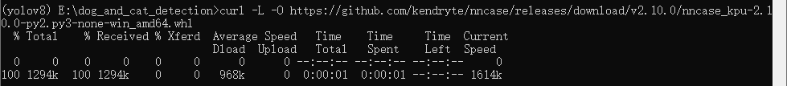

5. Install the locally downloaded **.whl** file.

```bash
pip install nncase_kpu-2.10.0-py2.py3-none-win_amd64.whl
```

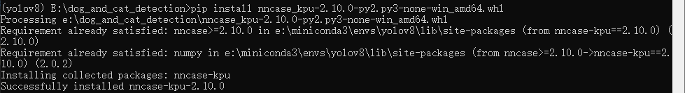

### 9.5.3 Initiating Conversion

1. Run the conversion script:

```bash
python convert_to_kmodel.py
```

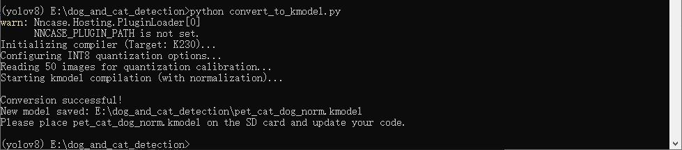

2. Access the converted file directly from the corresponding output folder.

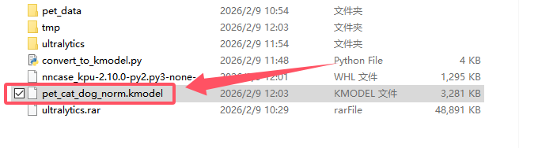


## 9.6 Model Deployment

### 9.6.1 Model File Deployment

* Move the model file to **This PC\CanMV\sdcard**.

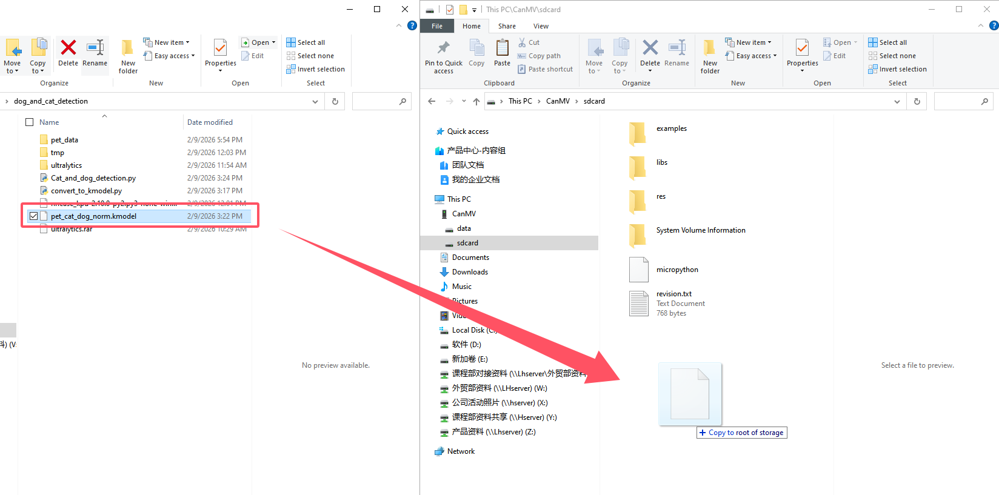

### 9.6.2 Model Program Deployment and Execution

1. Drag **Cat_and_dog_detection.py** into the **CanMV IDE K230**.

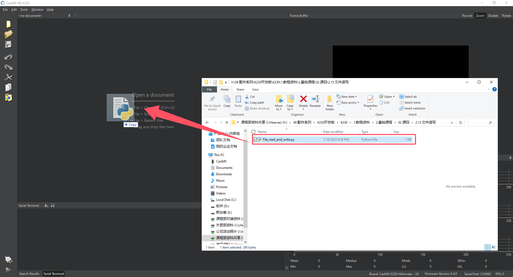

2. Click the button labeled 1 in the image to connect the K230 development board, then click 2 in the image to run **Cat_and_dog_detection.py**.

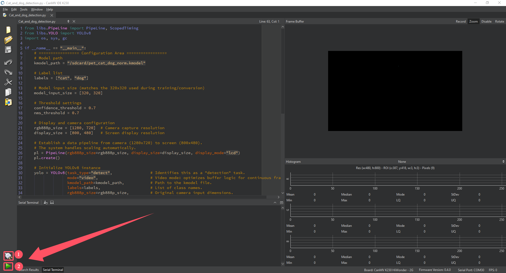

**Result:**

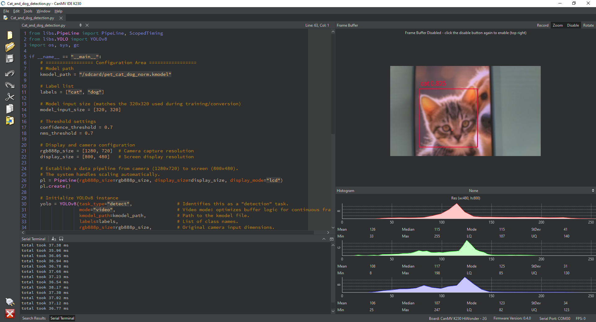

### 9.6.3 Program Analysis

1. Import necessary library files

```py
from libs.PipeLine import PipeLine, ScopedTiming
from libs.YOLO import YOLOv8
import os, sys, gc
```

2. Define recognition configurations

```py
if __name__ == "__main__":
    #Model path 
    kmodel_path = "/sdcard/pet_cat_dog_norm.kmodel"

    #Label list 
    labels = ["cat", "dog"]

    #Model input dimensions must match the input dimensions used during model training.
    model_input_size = [320, 320]

    #Threshold settings 
    confidence_threshold = 0.7
    nms_threshold = 0.7
```

3. Hardware Initialization

```py
    #Screen and camera configuration 
    rgb888p_size = [1280, 720]  # Camera capture resolution
    display_size = [800, 480]   # Screen display resolution

    #Establishes a data pipeline from the camera 1280x720 to the screen 800x480. The system handles scaling automatically.
    pl = PipeLine(rgb888p_size=rgb888p_size, display_size=display_size, display_mode="lcd")
    pl.create()
```

4. Model Loading and Preprocessing

```py
	# Initialize YOLOv8 instance
    yolo = YOLOv8(task_type="detect",				# Specifies a detection task to the library.
                  mode="video",						# Video mode indicates the model continuously processes sequential frames. Internal buffer caching logic may be optimized.
                  kmodel_path=kmodel_path,			# Model path
                  labels=labels,					# Label list
                  rgb888p_size=rgb888p_size,		# Original input dimensions
                  model_input_size=model_input_size,	# Model input dimensions
                  display_size=display_size,			# Display dimensions
                  conf_thresh=confidence_threshold,		# Confidence threshold
                  nms_thresh=nms_threshold,				# Non-maximum suppression NMS
                  debug_mode=0)							# Debugging mode outputs detailed recognition information where 0 is disabled and 1 is enabled
    yolo.config_preprocess()
```

5. Main Loop

```py
    try:
            print("YOLOv8 model loaded successfully, starting detection...")
            while True:
                os.exitpoint()

                with ScopedTiming("total", 1):
                    img = pl.get_frame()      # Acquire image
                    res = yolo.run(img)       # Perform inference
                    yolo.draw_result(res, pl.osd_img) # Draw results
                    pl.show_image()           # Display
                    gc.collect()              # Reclaim memory

        except Exception as e:
            sys.print_exception(e)

        finally:
            yolo.deinit()
            pl.destroy()
            print("Program stopped")
```

