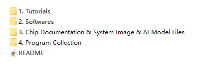
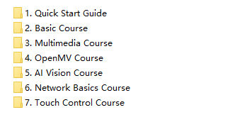
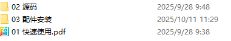
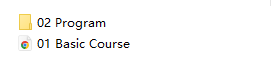
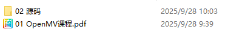
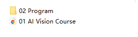
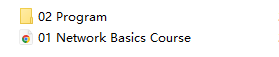
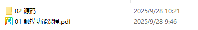

# README

## 1. K230 Tutorials Directory

1. **Tutorials:** This folder includes both basic robot peripherals and advanced visual graphics functionalities, designed to help individuals at different stages quickly get started. It provides detailed tutorials and complete example projects, guiding learners from beginners to independent developers.  
2. **Softwares:** The full software toolset for the K230 development board is provided, including the CanMV IDE integrated development environment, image flashing tool, serial terminal, SD card formatting tool, network debugging assistant, and communication tool MQTT Assistant. This toolset meets all the requirements from development and flashing to debugging.
3. **Chip Documentation & System Image & AI Model Files:** Includes system image, AI model files, pin definitions, and chip documentation, such as data sheets, reference manuals, etc.
4. **Program Source Code:** Includes source code for K230 visual graphics algorithms, open for modification.

## 2. Introduction to Tutorials (Key Focus)

This section introduces the course content directory within **1. Tutorials**.

1. **Quick Start Guide:** Provides an introduction to the basic functions of K230, example programs, usage tutorials, and important notes.

2. **Basic Course:** Provides K230 basic peripheral applications, covering control of basic peripherals such as GPIO, PWM, ADC, RTC, WDT, and TIMER, as well as examples for communication protocols like UART, I2C, and SPI. It also includes advanced experiments on FFT, SHA256/AES encryption, multithreading, and file reading and writing.

3. **Multimedia Course:** Provides multimedia and interactive application examples, covering experiments on screen display, audio playback and recording, video processing, and graphical user interface (LVGI).

4. **OpenMV Course (Key Focus):** Provides a rich set of machine vision algorithm examples, covering **color recognition**, such as single/multi-color recognition, object counting, and visual line following, **code recognition**, such as QR code, barcode, DM code, and AprilTags, and **image detection**, such as detection for lines, rectangles, circles, feature points, edge, etc. 

5. **AI Vision Course:** Provides a variety of AI application examples, including face recognition and analysis, such as detection, keypoint identification, 3D modeling, pose estimation, and identity recognition. It also covers human detection and analysis, including detection, keypoint identification, and fall detection. Additionally, the course includes hand recognition and gesture interaction, featuring hand palm recognition, keypoint detection and classification, dynamic gesture recognition, and the 'Rock Paper Scissors' game. It also covers license plate and character recognition, as well as advanced vision tasks like self-learning, object detection, object segmentation, and target tracking using YOLOv8.

6. **Network Basics Course:** Provides comprehensive network communication examples, covering both wired and wireless network connections, TCP/UDP communication with support for Client/Server modes, and HTTP applications with both Client and Server experiments.

7. **Touch Control Course:** Provides touch interaction application examples, including touch detection, touch drawing board, and touch photography functionality.

## 3. Learning Roadmap

To help you learn and master the K230 development board efficiently, we recommend following this step-by-step path:

**First Stage: Quick Start and Basic Preparation**

**Chapter 1: Quick Start Guide**

- Understand the basic functions of the K230 development board, hardware interface specifications, user manual, and important precautions.
  
- Learn how to install and use tools like CanMV IDE, serial tools, network assistants, and more, along with flashing images and configuring the basic environment. 

**Second Stage: Basic Peripherals and Communication Control**

1. **Chapter 2: Basic Course**

- Learn how to control basic peripherals such as GPIO, PWM, ADC, RTC, WDT, and TIMER.
  
- Master the examples of communication protocols such as UART, I2C, and SPI.
  
- Advance to learning FFT spectrum analysis, SHA256/AES encryption, multithreading programming, file reading, and more.

2. **Chapter 6: Network Basics Course**

- Learn wired/wireless network connection configurations.
  
- Master TCP/UDP/HTTP communication, including Client/Server modes.

**Third Stage: Multimedia and Interactive Applications**

1. **Chapter 3: Multimedia Course**

- Real-time screen display, audio recording and playback, video processing, and graphical user interface (LVGI) applications.

**Fourth Stage: Machine Vision and AI Applications (Core Advanced)**

1. **Chapter 4: OpenMV Course**

- Learn and master color recognition, including single/multi-color recognition, object counting, and visual line following. The course also covers code recognition, such as QR codes, DM codes, and AprilTags, along with image detection, including lines, rectangles, circles, and edge detection.

2. **Chapter 5: AI Vision Course**

- Learn and understand face recognition, including face detection, keypoints, 3D modeling, and pose estimation. The course also covers human detection, including keypoints and fall detection, hand recognition and gesture interaction, as well as license plate and character recognition (OCR).
  
- Advance to learning YOLO series for self-learning, object detection, target tracking, and object segmentation.

3. **Chapter 7: Touch Control Course**

- Learn the touch functionality of the LCD screen on the development board, implementing features such as touch drawing and touch photo capture.

**Fifth Stage: Extended Learning and In-Depth Development**

- **Program Source Code:** After completing the core K230 courses, proceed with secondary development and modification using the provided K230 vision graphics algorithm source code. 
- **Chip Documentation:** Refer to datasheets and reference manuals to deeply understand the K230 hardware architecture and low-level drivers.